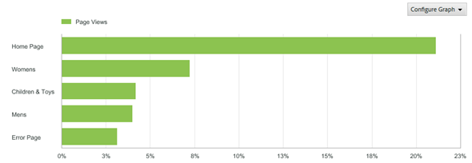

# Funzioni rapporto

Introduzione alle funzioni di un rapporto, inclusi la barra degli strumenti, il calendario e la tabella dei dettagli.

Questo esempio mostra un [!UICONTROL Pages Report]. Le opzioni di configurazione possono variare a seconda del rapporto eseguito. Ad esempio, anziché selezionare Con tendenze o con classifica in un rapporto [!UICONTROL Site Content], è possibile specificare la granularità e il nome della pagina per un rapporto [!UICONTROL Site Metrics].

## Report delle pagine di esempio {#section_288CC85536684C2DB184141358481EF0}

Esempio di rapporto sulle pagine ( **[!UICONTROL Reports]** > **[!UICONTROL Site Content]** > **[!UICONTROL Pages Reports]** > **[!UICONTROL Pages]**).

{width=&quot;672px&quot;}

## Barra degli strumenti del rapporto {#section_0D674177AE6C4A71B07234DB25910ECD}

Condividi i dati dei tuoi rapporti con i responsabili decisionali che possono modificare il tuo sito o le tue strategie di marketing in base ai dati.

{width=&quot;672px&quot;}

Consulta anche [Personalizzazione di un report](/help/analyze/reports-analytics/reports-customize/customizing-reports-overview.md).

## Intestazione e impostazioni del rapporto {#section_12A90FAE02EC43FB9F11F0E2CE8FAE8F}

Visualizza le impostazioni del rapporto e ti consente di configurare il tipo di rapporto, selezionare metriche e altro ancora. Le opzioni disponibili in questo gruppo variano a seconda del rapporto eseguito.

{width=&quot;672px&quot;}

Per ulteriori informazioni, consulta [Personalizzazione di un report](/help/analyze/reports-analytics/reports-customize/customizing-reports-overview.md) .

## Calendario {#section_8C6C4AD84D9043E8ABD53FF8F645AAB1}

Specifica la data facendo clic sul pulsante del calendario e selezionando un intervallo di date. Puoi anche selezionare due intervalli di tempo per confrontare le prestazioni.

{width=&quot;672px&quot;}

Vedere [Selezione di un intervallo di date o date](/help/analyze/reports-analytics/reports-customize/customizing-reports-overview.md) e [Confronto di date](/help/analyze/reports-analytics/reports-customize/customizing-reports-overview.md).

## Tipo di grafico {#section_8B9CBA4096E64FC3B744E2E06EB83C19}

Selezionare il tipo di grafico o grafico da visualizzare:

Vedere [Modifica dei grafici dei rapporti.](/help/analyze/reports-analytics/reports-customize/t-reports-graphs.md)

## Visualizzazione grafico {#section_4C78ADC82C234CC6841AC92C803636F4}

A seconda del tipo di grafico selezionato, in genere vengono visualizzati i primi diversi elementi dall’elenco dei dettagli. Se il grafico è un grafico con tendenze che mostra diversi periodi di tempo, vengono visualizzati tutti i periodi di tempo:

Consulta [Personalizzazione dei report.](/help/analyze/reports-analytics/reports-customize/customizing-reports-overview.md)

## Metriche {#section_8B8F9EC72B864E29B91039E7B7381EAD}

Aggiungi metriche al rapporto. Gli amministratori possono specificare le metriche predefinite.

Vedere [Metriche.](/help/analyze/reports-analytics/metrics.md)

## Tabella dei dettagli {#section_449A5DC848744F65A10DA12E189B835D}

I dettagli sono la maggior parte dei dati del rapporto. In questo caso, le pagine elencate vengono misurate dalle visualizzazioni di pagina, ossia quante volte sono state caricate durante il periodo:

Nella tabella di dettaglio, puoi filtrare i dati, creare suddivisioni, aggiungere metriche e altro ancora.

Consulta [Personalizzazione dei report.](/help/analyze/reports-analytics/reports-customize/customizing-reports-overview.md)
