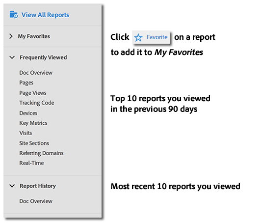
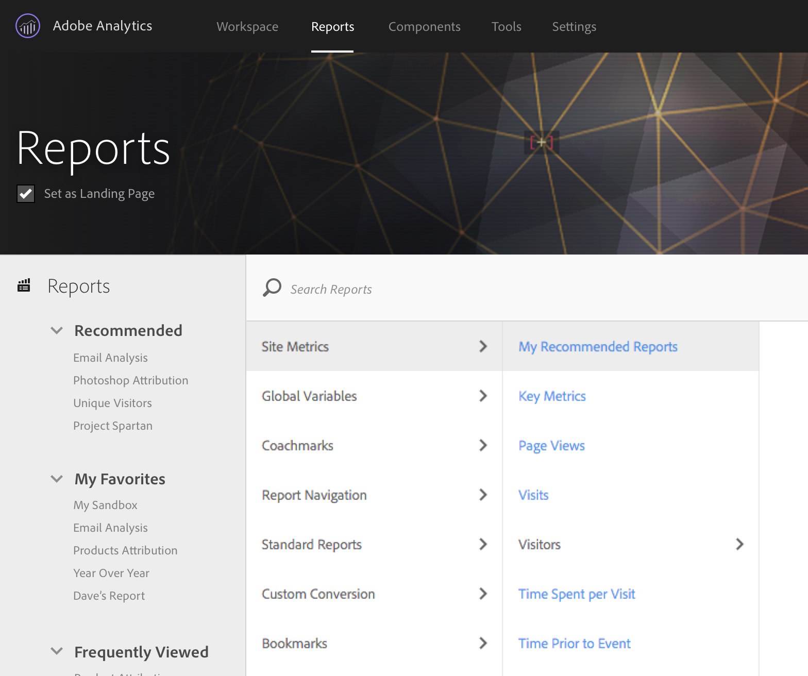

# Menu Rapporti{#reports-menu}

Panoramica del menu Rapporti in Reporting e analisi.

Il menu Rapporti fornisce:

* Accesso all&#39;insieme completo dei rapporti
* Possibilità di impostare i report preferiti per un accesso rapido
* Rapporti visualizzati di frequente
* Ricerca avanzata

I preferiti, le visualizzazioni frequenti e la cronologia dei rapporti sono tutti specifici della suite di rapporti. Se modifichi una suite di rapporti, verranno modificati tutti e tre gli elenchi.

I rapporti vengono spostati utilizzando una vista a colonne gerarchica. Fare clic su **[!UICONTROL View All Reports]** oppure premere il tasto Barra (/), quindi premere il tasto Freccia giù (?) per visualizzare e navigare rapidamente nel menu utilizzando i tasti freccia. Premere il tasto Esc per chiudere il menu senza modificare il report corrente oppure premere Invio per caricare il report selezionato.

{width=&quot;672px&quot;}

Per informazioni dettagliate sui singoli rapporti, vedere [Descrizioni dei rapporti](https://experienceleague.adobe.com/docs/analytics/components/variables/c-variables.html).

## Ricerca di rapporti {#section_E5EF11E36CB9451AA7B079E585CA7DB6}

Il menu Rapporti offre un’esperienza di ricerca migliorata. Fai clic su **[!UICONTROL View All Reports]** oppure premi il tasto Barra (/) , quindi inizia a digitare per trovare rapidamente un rapporto. La ricerca del report è stata estesa per includere qualsiasi cosa presente nella barra di navigazione a sinistra di Analytics (Amministratore, Componenti, ecc.).

Premere il tasto Tab o il tasto freccia Giù (?) per spostarsi nell’elenco dei rapporti. Premere il tasto Esc per chiudere la ricerca senza modificare il rapporto corrente oppure premere Invio per caricare il rapporto selezionato.

>[!NOTE]
>
>È inoltre possibile eseguire ricerche nell’elenco dei rapporti per proprietà, eVar e numero evento. Nella barra di ricerca, immetti il prop, l’eVar o il numero dell’evento.

## Panoramica sulla navigazione {#section_A6A0A369207149BABE504753B48A42D7}

<table id="table_3BA295966BBC4C94ABDC3718D1894698"> 
 <thead> 
  <tr> 
   <th colname="col1" class="entry"> Opzione di menu </th> 
   <th colname="col2" class="entry"> Descrizione </th> 
  </tr>
 </thead>
 <tbody> 
  <tr> 
   <td colname="col1">Menu Soluzioni Experience Cloud  </td> 
   <td colname="col2"> Facendo clic su questa icona, si espande il menu Experience Cloud per consentire l'accesso ad altre soluzioni Marketing Cloud. </td> 
  </tr> 
  <tr> 
   <td colname="col1">Attiva/Disattiva menu rapporti  </td> 
   <td colname="col2"> Facendo clic su questo pulsante si espande o comprime il menu Rapporti per visualizzare un rapporto utilizzando l’intera larghezza della finestra del browser. </td> 
  </tr> 
  <tr> 
   <td colname="col1">Segmenti  </td> 
   <td colname="col2">Apre la barra dei segmenti che consente di aggiungere o gestire i segmenti. Puoi anche accedere alle interfacce <a href="/help/components/segmentation/segmentation-workflow/seg-build.md"  > Generatore di segmenti</a> e <a href="https://experienceleague.adobe.com/docs/analytics/components/segmentation/segmentation-workflow/seg-manage.html"  > Gestore segmenti</a> dalla barra dei segmenti. </td> 
  </tr> 
  <tr> 
   <td colname="col1">Metriche  </td> 
   <td colname="col2"> Visualizza la barra delle metriche che consente di aggiungere o gestire metriche e metriche calcolate. </td> 
  </tr> 
  <tr> 
   <td colname="col1"> Visualizza tutti i report </td> 
   <td colname="col2">Tutti i rapporti, le dashboard, i segnalibri, le metriche calcolate e le destinazioni specifiche della suite di rapporti sono contenuti nelle sezioni  Visualizza tutti i rapporti . Fai clic qui in qualsiasi momento per navigare tra tutte le opzioni disponibili. </td> 
  </tr> 
  <tr> 
   <td colname="col1">Barra di ricerca in  Visualizza tutti i rapporti </td> 
   <td colname="col2"> 
 Consente di cercare la risorsa necessaria. Usa la ricerca "sfocata", quindi non è necessario inserire la formulazione esatta che stai cercando. I risultati della ricerca vengono visualizzati in una lista retta che consente di spostarsi utilizzando frecce verso l’alto, il basso e laterali. Premendo  Invio su un risultato di ricerca puoi passare direttamente a tale rapporto. 
 </td> 
  </tr> 
  <tr> 
   <td colname="col1"> Preferiti   </td> 
   <td colname="col2">È possibile recuperare facilmente i rapporti contrassegnati come  Preferiti da quest'area. Per ciascun utente e per suite di rapporti, vengono visualizzati dieci Preferiti e un  Altro...Collegamento  se hai più di dieci preferiti. 
È possibile rinominare i rapporti ma non le dashboard nei Preferiti. 
 
I preferiti sono simili ai segnalibri, ma non vengono memorizzati in una cartella o gestiti tramite <a href="/help/analyze/reports-analytics/bookmarks.md"  > Gestione segnalibri</a> come i segnalibri. 
 </td> 
  </tr> 
  <tr> 
   <td colname="col1"> Visualizzato frequentemente </td> 
   <td colname="col2"> Adobe Analytics tiene traccia dei dieci rapporti che hai eseguito più spesso negli ultimi 90 giorni e li mostra qui, ordinati in base alla frequenza con cui li esegui. Se non sei stato in questa suite di rapporti per più di 90 giorni, la lista viene compilata con un elenco generale di dieci rapporti popolari. </td> 
  </tr> 
  <tr> 
   <td colname="col1"> Cronologia rapporti </td> 
   <td colname="col2"> Qui trovi i dieci rapporti o dashboard più recenti a cui hai effettuato l’accesso negli ultimi 90 giorni. Puoi trovare facilmente la strada per tornare a un passaggio precedente nell’analisi o nel reporting. </td> 
  </tr> 
  <tr> 
   <td colname="col1"> Scarica </td> 
   <td colname="col2">Consente di scaricare il rapporto nei formati PDF, CSV, Excel e Word. </td> 
  </tr> 
  <tr> 
   <td colname="col1"> Invia </td> 
   <td colname="col2">Consente di inviare il rapporto immediatamente tramite e-mail o pianificare l’e-mail una tantum o ricorrente. Le opzioni di formato includono PDF, CSV, Excel, HTML, Word o Mobile (solo testo).</td> 
  </tr> 
  <tr> 
   <td colname="col1"> Segnalibro.. </td> 
   <td colname="col2">Consente di <a href="/help/analyze/reports-analytics/bookmarks.md"  > aggiungere un segnalibro</a> al rapporto. </td> 
  </tr> 
  <tr> 
   <td colname="col1"> Dashboard... </td> 
   <td colname="col2">Consente di aggiungere il rapporto a un dashboard . </td> 
  </tr> 
  <tr> 
   <td colname="col1"> Altro... </td> 
   <td colname="col2"> Consente di eseguire tutte o alcune delle seguenti azioni: stamparla, estrae i dati, aggiungi un avviso, crea un rapporto personalizzato, copia un grafico, collega a questo rapporto e apri una nuova finestra. </td> 
  </tr> 
  <tr> 
   <td colname="col1">Selettore suite di rapporti  </td> 
   <td colname="col2">Consente di selezionare <a href="https://experienceleague.adobe.com/docs/analytics/admin/manage-report-suites/report-suites-admin.html"  > suite di rapporti di base</a> o <a href="https://experienceleague.adobe.com/docs/analytics/components/virtual-report-suites/vrs-about.html"  > suite di rapporti virtuali</a>. </td> 
  </tr> 
  <tr> 
   <td colname="col1">Calendario  </td> 
   <td colname="col2">Visualizza il <a href="/help/analyze/reports-analytics/overview/report-overview.md#section_8C6C4AD84D9043E8ABD53FF8F645AAB1"  > calendario</a> in modo da poter determinare il periodo di reporting. </td> 
  </tr> 
 </tbody> 
</table>

## Personalizzazione del menu Tutti i report {#section_7E47312747564FBE8A55EE5726B7DFF4}

Gli amministratori possono modificare i rapporti contenuti nel menu Rapporti . Consulta [Personalizzazione del menu](https://experienceleague.adobe.com/docs/analytics/admin/admin-tools/customize-menus.html) nella Guida dell&#39;amministratore.
