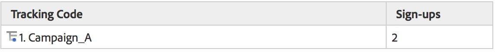

# Sottorelazioni

Le sottorelazioni complete sono abilitate in tutti i rapporti di conversione, in modo da poter suddividere qualsiasi eVar per un altro eVar. Il menu Raggruppamento per nella tabella dei rapporti corrisponde al menu di reporting standard di Analytics, mantenendo le selezioni coerenti

## Funzionamento delle sottorelazioni {#section_5BD862BB74FE411B96B59204520E4631}

Per illustrare il funzionamento delle sottorelazioni, considera l’esempio seguente:

1. Un utente accede al sito tramite Campaign_A e arriva sulla home page.
1. L&#39;utente cerca &#39;gatti&#39; e viene mostrato i risultati della ricerca. eVar1 tiene traccia dei termini di ricerca interni.
1. L’utente si abbona a una mailing list che viene tracciata utilizzando event1.
1. Un altro utente accede al sito anche tramite Campaign_A e arriva sulla tua home page.
1. Questo utente cerca &#39;gattini&#39;, e viene mostrato i risultati di ricerca (eVar1), e anche si iscrive alla mailing list (event1).

Se hai estratto un rapporto sul codice di tracciamento, vedrai quanto segue:

Se hai estratto un rapporto eVar1, vedrai quanto segue:

Se hai correlato il rapporto Campaign in base a eVar1, ottieni quanto segue:

Se hai correlato il rapporto eVar1 in base a Campagne, ottieni quanto segue:

A causa della natura persistente delle variabili di conversione, esistono due colonne di dati utilizzate per memorizzare i valori eVar; il valore che viene attivato e il valore che persiste. Se per questo esempio esaminassimo un’esportazione di dati non elaborati, potrebbe essere simile a questa (semplificato per questo esempio):

Il nostro backend funziona consentendo a post_campaign e post_evar1 di mantenere i valori definiti in campaign e evar1. I rapporti delle sottorelazioni esaminano specificamente solo gli hit contenenti eventi di successo (righe evidenziate in giallo chiaro). Quindi compilano i rapporti di sub-relazione in base ai valori persistenti (in questo caso post_campaign e post_evar1, celle evidenziate in giallo chiaro).

In sostanza, le sub-relazioni seguono questi passaggi per compilare il rapporto:

* Isola le richieste di immagini contenenti gli eventi di successo che stai visualizzando nel rapporto.
* Restituisce i valori persistenti da ogni variabile di conversione utilizzata nella sottorelazione.
* Organizza i valori in base all’ordine della sottorelazione. Se una variabile non ha un valore persistente (ad esempio se un eVar non è mai stato definito o è scaduto), verrà inserita in bucket in &quot;None&quot;.
