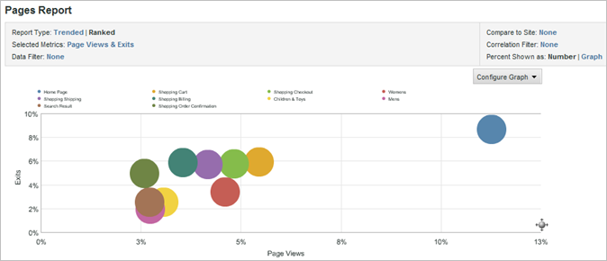

# Modificare i grafici dei rapporti

Procedura che descrive come personalizzare il grafico in modo che sia più utile per i destinatari desiderati.

Il tipo di grafico disponibile dipende dal tipo di rapporto eseguito. Ad esempio, i grafici a linee tendenze sono utili per i report con tendenze, ma potete anche usare un grafico a barre verticali con linee di tendenza che illustrano chiaramente le tendenze durante giorni, settimane, mesi e così via. In alternativa, potete scegliere un grafico a torta per illustrare le percentuali delle pagine visualizzate.

**Per modificare un grafico di report**

1. Esegui un report.
1. Fai clic su **[!UICONTROL Configure Graph]**.
1. Selezionate un tipo di grafico.

   **[!UICONTROL Trend Line]**: Le linee delle tendenze mostrano le tendenze quotidiane per le metriche del report e sono utili per tendenze di una metrica nel tempo per linea.

   

   **[!UICONTROL Smooth Line]**: Utilizzate questo tipo di grafico con il [!UICONTROL Video Detail Report]tipo. Mostra i numeri o le percentuali di visualizzazioni per segmenti specifici di un video. Un'analisi delle visualizzazioni per un segmento specifico del video indica che i visualizzatori hanno eseguito una nuova chiamata e hanno visualizzato la sezione del video più volte. Se utilizzate le percentuali, la percentuale mostrata nel grafico è una percentuale di tutti i segmenti visualizzati, non una percentuale di visualizzatori che hanno visualizzato il segmento. Ad esempio, nel grafico la somma di tutti i segmenti di report è 39. Il numero di visualizzazioni per il segmento da 0 a 10 secondi è 10. Pertanto, la percentuale di visualizzazioni per questo segmento è circa il 26 percento.

   

   **[!UICONTROL Area]**: Il grafico Area è simile al grafico Linea tendenza, ma riempie l'area sotto le linee. Devi visualizzare un rapporto con tendenze per visualizzare il grafico Area.

   

   **[!UICONTROL Stacked Area]**: I grafici ad area sovrapposti sono utili per il tracciamento di un numero di prodotti o campagne nel tempo. Ad esempio, se trend i cinque prodotti principali che mostrano ricavi, puoi vedere rapidamente il volume totale di entrate che quei prodotti producono nel tempo. Potete perfezionare la visualizzazione utilizzando un filtro di ricerca per includere o escludere prodotti specifici.

   

   **[!UICONTROL Vertical Bar]**: Il grafico a barre verticale mostra percentuali relative per le metriche di report.

   

   **[!UICONTROL Stacked Vertical Bar]**: Sovrapponendo elementi simili potete ottenere una visualizzazione rapida dell'influenza totale di un elemento. For example, in a [!UICONTROL Campaign Report], you can stack similar success metrics and see which campaign is generating the most total success. La sovrapposizione consente di trovare più facilmente le campagne che non sono gli esecutori principali in una metrica, ma sono più importanti in una combinazione di metriche.

   

   **[!UICONTROL Horizontal Bar]**: Il grafico a barre orizzontale è simile al grafico a barre verticali, ma le colonne sono orizzontali.

   

   **[!UICONTROL Stacked Horizontal Bar]**: Il grafico a barre orizzontali sovrapposte è simile al grafico a barre verticali, ma le colonne sono orizzontali.

   

   **[!UICONTROL Pie]**: Il grafico a torta mostra le percentuali dei valori delle metriche principali, e mostra la percentuale delle metriche selezionate in relazione all'intero. Puoi visualizzare il grafico a torta per i rapporti classifica.

   

   **[!UICONTROL Scatter]**: Il grafico Dispersione mostra una visualizzazione dispersione delle metriche selezionate in relazione tra loro. I grafici Diffusione consentono di visualizzare i dati in due dimensioni, per identificare quali elementi sono aberranti.

   

   **[!UICONTROL Bubble]**: Il grafico delle bolle mostra una visualizzazione delle metriche selezionate in relazione tra loro. La posizione delle bolle mostra i rapporti tra le metriche sull'asse orizzontale e verticale, mentre la dimensione della bolla indica la metrica di report principale. I grafici delle bolle consentono di visualizzare i dati in due dimensioni, per identificare quali elementi sono aberranti.

   

