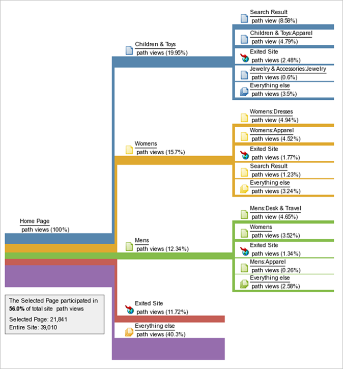
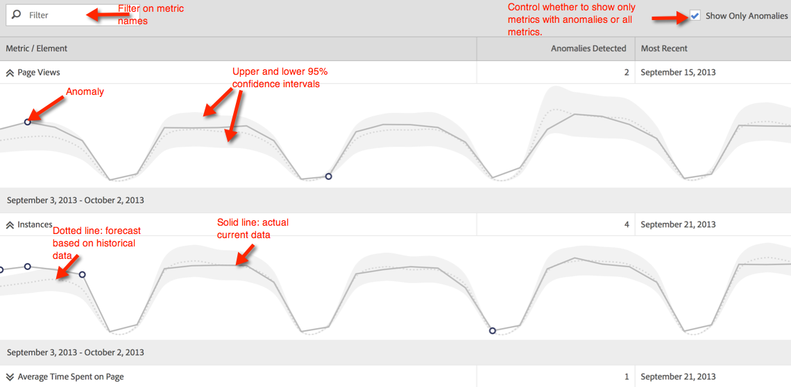
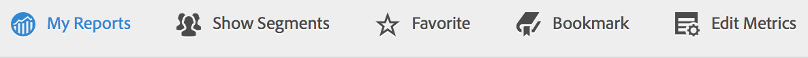

# Eseguire diversi tipi di rapporto

Passaggi sull’esecuzione dei diversi tipi di rapporti.

## Eseguire un report classifica {#task_C570BA4A213F4F2EB7B30E012934BE7D}

In un rapporto con classifica, la tabella mostra le classificazioni delle pagine del rapporto in relazione alla metrica, in base al numero o alla percentuale. I report Ranked possono mostrare più metriche in uno stesso report.

<!-- 

t_reports_ranked.xml

 -->

1. Genera un rapporto, ad esempio un [!UICONTROL Pages Report] ( **[!UICONTROL Reports]** > **[!UICONTROL Site Content]** > **[!UICONTROL Pages]**).
1. Nell’intestazione del rapporto, fai clic su **[!UICONTROL Ranked.]**
1. Per classificare il rapporto, fare clic su un’intestazione di colonna nella tabella.

   I rapporti con classifica possono contenere fino a 200 elementi elencati nella tabella (ad esempio prodotti, categorie, pagine web e così via) e dieci metriche (ricavi, ordini, visualizzazioni e così via).

## Eseguire un rapporto con tendenze {#task_F03B4E760B9E4EA29FC3F654E6316887}

I rapporti con tendenze visualizzano le metriche nel tempo. Puoi utilizzare questo tipo di report quando desideri sapere quali sono le prestazioni di un segmento da un periodo di tempo al successivo.

<!-- 

t_reports_trended.xml

 -->

La maggior parte dei rapporti Conversione e Traffico dispone di una vista con tendenze disponibile. Utilizzando [!UICONTROL Calendar], puoi mostrare miglioramenti per tutte le suddivisioni dei periodi di tempo, inclusi giorni di un mese, settimane di un anno, settimane di un trimestre, mesi di un anno e così via. I rapporti con tendenze mostrano le tendenze per una singola metrica (ricavi, ordini, visualizzazioni e così via) fino a cinque elementi (come prodotti, categorie, pagine web e così via).

**Per eseguire un rapporto con tendenze**

1. Esegui una conversione o un rapporto sul traffico, ad esempio **[!UICONTROL Reports]** > **[!UICONTROL Site Content]** > **[!UICONTROL Pages]**.
1. Alla voce **[!UICONTROL Report Type]**, fai clic su **[!UICONTROL Trended.]**

## Eseguire un rapporto Funnel di conversione {#task_B926A74AA6A641138C2986C1635120CB}

I rapporti Funnel di conversione mostrano la percentuale di visitatori che hanno fatto progressi in un insieme di eventi per eseguire l’azione desiderata. Ad esempio, puoi vedere quanti visitatori hanno compiuto progressi dalla visita alla pagina web, dall’aggiunta di elementi al carrello e dall’acquisto di un articolo. Questo rapporto mostra anche il numero di caduti lungo la strada.

<!-- 

t_reports_conversion_funnel.xml

 -->

Per eseguire questo rapporto, selezionare un rapporto, ad esempio un rapporto Pagine ( **[!UICONTROL Reports]** > **[!UICONTROL Campaigns]** > **[!UICONTROL Tracking Code]** > **[!UICONTROL Campaign Conversion Funnel]**).

Per una descrizione, consulta [Rapporti di conversione](https://docs.adobe.com/content/help/en/analytics/components/variables/dimensions-reports/reports-conversion.html) .

## Eseguire un rapporto di fallout {#task_8FD97C8260464F9DA731A93DB8F80184}

Il [!UICONTROL Fallout Report] mostra il numero di visitatori che hanno visitato una sequenza di pagine predeterminata. Mostra anche i tassi di conversione e di abbandono tra ciascun passaggio.

<!-- 

t_reports_fallout.xml

 -->

Consulta il nuovo pannello [Analisi abbandono](https://docs.adobe.com/content/help/it-IT/analytics/analyze/analysis-workspace/visualizations/fallout/fallout-flow.html) in Analysis Workspace!

1. In [!UICONTROL Adobe Analytics], fai clic su **[!UICONTROL Reports]** > **[!UICONTROL Paths]** > **[!UICONTROL Pages]** > **[!UICONTROL Fallout]**.
1. Nella pagina [!UICONTROL Fallout Report], fai clic su **[!UICONTROL Launch the Fallout Report Builder]**.

   

1. Nella pagina [!UICONTROL Define Checkpoints] , specifica i punti di controllo da utilizzare per il rapporto.
1. Fai clic su **[!UICONTROL Run Report]**.

   

>[!MORELIKETHIS]
>
>* [Descrizione del rapporto di fallout](https://docs.adobe.com/content/help/en/analytics/components/variables/dimensions-reports/reports-fallout.html)

## Eseguire un rapporto di flusso di pagina {#task_133E8B87C3F04DA0A42D10CBA499305B}

I rapporti Flusso di pagina mostrano l’ordine in cui i visitatori accedono alle pagine e navigano nel sito. Questo rapporto aiuta a rispondere

Consulta la nuova [Visualizzazione flusso](https://docs.adobe.com/content/help/en/analytics/analyze/analysis-workspace/visualizations/fallout/fallout-flow.html) in Analysis Workspace!

Esegui un rapporto [Percorsi](https://docs.adobe.com/content/help/it-IT/analytics/analyze/analysis-workspace/visualizations/flow/flow.html).

Ad esempio, fai clic su **[!UICONTROL Reports]** > **[!UICONTROL Paths]** > **[!UICONTROL Pages]** > **[!UICONTROL Next Page Flow]**.

Il rapporto viene letto da sinistra a destra, a partire dalla pagina selezionata. Le pagine visualizzate dopo la pagina selezionata sono illustrate come un ramo che si estende a destra.

Accanto al nome della pagina viene visualizzata la percentuale di visualizzazione di ogni pagina successiva. La larghezza della riga connessa a ogni pagina successiva rappresenta questa percentuale relativa.

**[!UICONTROL Path Views]**: Indica il numero di volte in cui è stata visualizzata una pagina, se vincolata ai percorsi visualizzati.

Ad esempio, la pagina Privacy Policy potrebbe avere 10.000 visualizzazioni di pagina totali, ma solo 500 di queste visualizzazioni si sono verificate immediatamente dopo la home page. Pertanto, viene utilizzato il termine visualizzazione percorso.

La percentuale relativa è rappresentata dalla larghezza relativa della linea. Per impostazione predefinita, questo rapporto visualizza cinque rami di secondo livello e cinque rami di terzo livello. È possibile espandere il numero di rami per visualizzare fino a dieci rami di secondo livello e cinque rami di terzo livello. In questo modo si aumenta l’altezza del rapporto e molto probabilmente è necessario scorrere per visualizzare l’intero grafico.

## Eseguire un rapporto Funnel {#task_2BBF6FACD48F479E8B2EE458919941CB}

È possibile selezionare eventi di successo e aggiungerli a un rapporto [!UICONTROL Purchase Conversion Funnel] o a un rapporto [!UICONTROL Product Conversion Funnel].

<!-- 

t_reports_funnel.xml

 -->

1. Fai clic su **[!UICONTROL Reports]** > **[!UICONTROL Products]** > [Funnel di conversione prodotti](https://docs.adobe.com/content/help/en/analytics/components/variables/dimensions-reports/reports-conversion-funnel.html).

## Eseguire un rapporto sul canale di marketing {#task_64ADED5CC75248319E06E3E029B47F78}

Il reporting per canale di marketing fornisce un rapporto di panoramica sull’allocazione dei canali di primo e ultimo contatto, con metriche di reporting standard come ricavi, ordini e costi. Questi rapporti ti consentono di analizzare quanti ricavi genera ogni canale.

<!-- 

t_reports_marketing_channel.xml

 -->

Per ulteriori informazioni, consulta la guida [Marketing Channel](/help/components/c-marketing-channels/analyze-mc.md) .

## Eseguire un rapporto Rilevamento anomalie {#task_4808C96327354D789C075823F5C3A049}

Descrive come interpretare i grafici di riepilogo e di singole metriche in Rilevamento delle anomalie.

<!-- 

t_anomaly_view.xml

 -->

Scopri le nuove funzioni [Rilevamento delle anomalie e Analisi contributi](https://docs.adobe.com/content/help/it-IT/analytics/analyze/analysis-workspace/virtual-analyst/anomaly-detection/anomaly-detection.html) di Analysis Workspace!

**[!UICONTROL Reports]** > **[!UICONTROL Site Metrics]** > **[!UICONTROL Anomaly Detection]** .

>[!NOTE]
>
>Puoi anche eseguire il rilevamento delle anomalie dai progetti Analysis Workspace. [Altro...](https://docs.adobe.com/content/help/en/analytics/analyze/analysis-workspace/virtual-analyst/anomaly-detection/anomaly-detection.html)

Per informazioni sulla configurazione del rilevamento delle anomalie, fare riferimento alla [Guida di riferimento](https://docs.adobe.com/content/help/en/analytics/analyze/reports-analytics/getting-started.html#Setting_up_Anomaly_Detection).

Il rilevamento delle anomalie mostra due tipi di grafici: Grafico di riepilogo e grafici di singole metriche. I singoli grafici delle metriche vengono visualizzati solo se è stata rilevata almeno un’anomalia per tale metrica.

<table id="table_88163CD8FC164342855D90D01F9C581A"> 
 <thead> 
  <tr> 
   <th colname="col1" class="entry"> 
Tipo di grafico 
 </th> 
   <th colname="col2" class="entry"> 
Operazioni 
 </th> 
  </tr> 
 </thead>
 <tbody> 
  <tr> 
   <td colname="col1"> 
Grafico di riepilogo 
 
 
 </td> 
   <td colname="col2"> 
 
     <ul id="ul_D26DA3024CD7468291369F549557B28A"> 
      <li id="li_1C22B6E02FFB479FB71EFAD89EB37A4E">Ogni casella rappresenta un’anomalia, tracciata ogni giorno, che corrisponde a una metrica di seguito. </li> 
      <li id="li_8FC587D3FF4E452D83263CC7A10B6675">Il verde indica le anomalie sopra la linea di tendenza, il blu sotto la linea di tendenza. </li> 
      <li id="li_25135AB691BF443599AF2A3A60E2E71A">Indica l’intensità dell’anomalia: Maggiore è l’anomalia, più scuro è il colore del punto dati e più lontano dalla linea di tendenza. </li> 
      <li id="li_0C42AFA8897D420D8AB1A5D0F65B3B3A">Facendo clic sulle singole anomalie viene visualizzato il grafico delle singole metriche (sotto il grafico di riepilogo) in alto. </li> 
      <li id="li_85C0F426952547B5A75D6BD31DE19CA5">I valori percentuali di deviazione (a sinistra del grafico) sono calcolati come segue: 
       <ul id="ul_BEC0A88BFFAC4CF78BC9885FEB749694"> 
        <li id="li_1BAB2F50482745B69937DFAF1E09982E">Se i limiti superiori e il valore previsto sono uguali, la deviazione % è 100% </li> 
        <li id="li_CA48064F5788448C8646CCE196161237">In caso contrario, la deviazione % è ((valore effettivo - valore limite superiore) / (valore limite superiore - valore previsto)) * 100 </li> 
        <li id="li_4090357A0D214BC7B1C3DE0615875554">Se i limiti inferiori e il valore previsto sono uguali, la deviazione % è -100% </li> 
        <li id="li_EF694E1A4E874ECD94E1E8F7302E494F">In caso contrario, la deviazione % è ((valore associato inferiore - valore effettivo) / (valore previsto - valore associato inferiore)) * -100 </li> 
       </ul> </li> 
      <li id="li_5C05EF7023484CC993E96D63E842B65C">Facendo clic su  Mostra segmenti  viene visualizzata la barra dei segmenti che consente di applicare segmenti a un rapporto di rilevamento delle anomalie. <a href="https://docs.adobe.com/content/help/en/analytics/components/segmentation/seg-home.html"  > Ulteriori informazioni  </a> sulla segmentazione. </li> 
      <li id="li_1B41CABF13D1407886C68EE3BC201E60">Facendo clic su  Modifica metriche puoi selezionare e deselezionare le metriche per le quali desideri rilevare le anomalie. </li> 
     </ul> 
 </td> 
  </tr> 
  <tr> 
   <td colname="col1"> 
Grafico a metrica singola 
 
 
 </td> 
   <td colname="col2"> 
 
     <ul id="ul_739C5687013743A29B63089FDA763F45"> 
      <li id="li_456A0BDA4D4E46CE9CC1C3DBAA1E2220">Visualizza punti di dati anomali per le singole metriche con tendenze (comprese le metriche calcolate) sotto forma di punti. </li> 
      <li id="li_89FD847C65F04F48BCA7CD38D0EC51CD">Mostra l’anomalia più recente in alto e, in secondo luogo, classifica per numero di anomalie. </li> 
      <li id="li_98B97A9706DE4455B8D8850904CBDE03">Visualizza una linea continua per indicare i dati effettivi attualmente raccolti. Questo viene confrontato con la previsione e il margine di errore per determinare se i punti dati sono anomali. </li> 
      <li id="li_0EEA38DDDC344BF3879430E67D74EB72">Visualizza una linea tratteggiata che rappresenta una previsione basata sui dati storici (ovvero il periodo di formazione). </li> 
      <li id="li_035BD2725D004AEDB630BF8DFF4DA4F3">Visualizza intervalli/limiti di affidabilità superiori e inferiori al 95% in un'ombreggiatura grigia. </li> 
      <li id="li_021A3D1F2EDB4319B9B39620EF1C038A">Consente di comprimere ed espandere singoli rapporti facendo clic sulle frecce verso l’alto o il basso accanto al nome della metrica. </li> 
      <li id="li_722E4B9FC21047AC96D7B143197E293D">Modifica l’ordine di visualizzazione dei grafici delle metriche reagendo alle analisi approfondite nel rapporto di panoramica (vedi sopra) </li> 
      <li id="li_A2441169B185475AA68A64F81E6E40B8">Consente di filtrare i grafici utilizzando termini di ricerca, ad esempio "pagina" per tutte le metriche relative alla pagina. </li> 
      <li id="li_F1BBBFCA8E2A43C29658E4FCAA36C904">Consente di visualizzare tutte le metriche definite o solo quelle con anomalie. </li> 
     </ul> 
 </td> 
  </tr> 
 </tbody> 
</table>

## Impostazione del rilevamento delle anomalie {#task_AF347B34F56E44A6AE70E019B6EB2F08}

Passaggi per selezionare suite di rapporti, metriche e periodi di formazione/visualizzazione per il rilevamento delle anomalie.

<!-- 

t_anomaly_config.xml

 -->

Puoi impostare il rilevamento delle anomalie in modo indipendente per ogni suite di rapporti.

1. Passa a  **[!UICONTROL Analytics > Reports > Site Metrics > Anomaly Detection]** .
1. Seleziona la suite di rapporti per la quale desideri tenere traccia del rilevamento giornaliero delle anomalie. Per visualizzare un elenco di suite di rapporti, fai clic sul menu a discesa del selettore Suite di rapporti .
1. Per selezionare le metriche e/o definire le metriche filtrate, fai clic su **[!UICONTROL Edit Metrics]** in alto a destra nella schermata:  .

   Puoi scegliere le metriche dall’elenco (comprese le metriche calcolate) di tutte le metriche o da un elenco di metriche tracciate. Puoi anche filtrare in base a termini specifici per limitare l’elenco. 1. Una volta generato il rapporto, definisci i valori **[!UICONTROL Training Period]** e **[!UICONTROL View Period]** per il rilevamento delle anomalie. (Considera il periodo di formazione come il &quot;periodo di apprendimento&quot; per l&#39;algoritmo.)

   

   Nota bene:

* Il periodo di formazione termina immediatamente prima dell&#39;inizio del periodo di visualizzazione.
* Il valore predefinito per entrambi è 30 giorni e puoi estenderlo a 60 o 90 giorni.
* L’estensione del periodo di formazione inserisce i dati in un contesto più ampio e potrebbe ridurre le dimensioni di un’anomalia.

   Il rapporto sulle metriche di Rilevamento anomalie viene aggiornato ogni volta che modifichi un parametro.
1. (Facoltativo) Per applicare segmenti al rapporto, fai clic su **[!UICONTROL Show Segments]** e seleziona uno o più segmenti esistenti o crea un nuovo segmento e applicalo.

   

   Per ulteriori informazioni sulla creazione e la gestione dei segmenti, consulta la [Guida alla segmentazione di Analytics](https://docs.adobe.com/content/help/it-IT/analytics/components/segmentation/seg-home.html) . 1. (Facoltativo) Preferito o segnalibro del rapporto.
1. (Facoltativo) Modificare la data di fine del periodo di visualizzazione. Il valore predefinito è ieri.
1. Ora puoi iniziare a interpretare il rapporto. [Visualizzazione dei grafici](/help/analyze/reports-analytics/t-running-report-types.md#task_4808C96327354D789C075823F5C3A049) di Rilevamento delle anomalie.

## Eseguire un rapporto in tempo reale {#task_5D25929C918E40B18965222FA94176B0}

Descrive come visualizzare e interpretare i rapporti in tempo reale.

<!-- 

reports_realtime.xml

 -->

**[!UICONTROL Reports > Site Metrics > Real-Time]** .

Il reporting in tempo reale offre due rapporti principali: un rapporto di panoramica e un rapporto di dettaglio. Ciascuna di esse è costituita da una serie di rapporti.

Per informazioni sulla configurazione dei rapporti in tempo reale, consulta la [Guida di riferimento di Analytics](https://docs.adobe.com/content/help/en/analytics/landing/home.html#RealTime_Reports_Configuration).

1. Osserva il rapporto **[!UICONTROL Overview]** e i relativi componenti:  

   <table id="choicetable_8586BECF55E843B2B5CD41205567EA32"> 
   <thead class="chhead sthead"> 
   <th class="choptionhd"> Componente interfaccia </th> 
   <th class="chdeschd"> Descrizione </th> 
   </thead> 
   <tr class="chrow strow"> 
   <td class="choption"><strong>Seleziona suite di rapporti</strong></td> 
   <td class="chdesc stentry"> Mostra la suite di rapporti coperta da questo rapporto in tempo reale. Per modificare la suite di rapporti, consulta <a href="https://docs.adobe.com/content/help/en/analytics/admin/admin-tools/real-time-reports/t-realtime-admin.html"  > Configurazione rapporti in tempo reale </a>. </td> 
   </tr> 
   <tr class="chrow strow"> 
   <td class="choption"><strong>Passa ai rapporti</strong></td> 
   <td class="chdesc stentry"> Consente di passare ai rapporti impostati (massimo 3). </td> 
   </tr> 
   <tr class="chrow strow"> 
   <td class="choption"><strong>Seleziona intervallo di tempo</strong></td> 
   <td class="chdesc stentry"> Consente di scegliere l’intervallo di tempo complessivo da utilizzare per tutti i minirapporti del rapporto. </td> 
   </tr> 
   <tr class="chrow strow"> 
   <td class="choption"><strong>Configurare i rapporti</strong></td> 
   <td class="chdesc stentry"> Questo collegamento con l’icona a forma di ingranaggio è visibile solo se disponi dei diritti di amministratore. Facendo clic su di essa si accede al Gestore suite di rapporti in   Strumenti di amministrazione  &gt;  Suite di rapporti  &gt;  Modifica impostazioni  &gt;  In tempo reale  . </td> 
   </tr> 
   <tr class="chrow strow"> 
   <td class="choption"><strong>Vista a schermo intero</strong></td> 
   <td class="chdesc stentry"> L’icona di visualizzazione a schermo intero è visibile solo se il monitor ha un rapporto di formato specifico (16:9 o 16:10) E se il browser lo supporta. Non è possibile interagire con lo schermo in modalità a schermo intero (premere  Esc  per uscire). La modalità a schermo intero non scade. </td> 
   </tr> 
   <tr class="chrow strow"> 
   <td class="choption"><strong>Report sul traffico del sito</strong></td> 
   <td class="chdesc stentry"> I dati della linea di tendenza blu mostrano il totale di traffico per il sito complessivo. L’asse X utilizza etichette letterali (15 minuti fa, 10 minuti fa) ad eccezione del valore corrente, che viene mostrato come espressione in tempo reale. </td> 
   </tr> 
   <tr class="chrow strow"> 
   <td class="choption"><strong>Rapporto totale sito</strong></td> 
   <td class="chdesc stentry"> Presenta un conteggio del totale del sito per la metrica selezionata del rapporto in tempo reale per gli ultimi N minuti. "N" è configurabile tramite il selettore Intervallo di tempo. 
Il colore e la direzione della freccia si basano sul seguente algoritmo: 
      <ul id="ul_9F40CEA33798467393CB1266BB36D500"> 
      <li id="li_CCD01A44F912487DA5681EA50113643C">Guadagno significativo (freccia su): &gt; 100% </li> 
      <li id="li_7402491A9A614851B7F2AE0C77BD9A97">Guadagno (freccia su destra): tra il 5 % e il 100% </li> 
      <li id="li_BCA79C08B5714D4B9315068112C66107"> Piatta (freccia destra): tra 5% e -5% </li> 
      <li id="li_234ECBD7D83A4AE680E4A70BF288681F"> Perdita (freccia giù destra): tra -5% e -100% </li> 
      <li id="li_10C5EA8803604C1CA714D3DB27478B31"> Perdita significativa (freccia giù): &lt; -100% </li> 
      </ul> 
 
Se il totale del sito è riportato in "istanze", queste istanze riflettono la dimensione nel reportlet principale. Se esiste un nome specifico per l’istanza (ad esempio "Visualizzazioni pagina"), il totale del sito riporta tale nome. 
 </td> 
   </tr> 
   <tr class="chrow strow"> 
   <td class="choption"><strong>Report principale</strong></td> 
   <td class="chdesc stentry"> Report per la dimensione principale del report in tempo reale e per la relativa metrica. Presenta una linea di tendenza per quell’elemento per l’intervallo di tempo selezionato. Il totale della metrica rappresenta la somma per l’intera linea di tendenza. La freccia indica se l'elemento sta guadagnando, guadagnando, piatta, perdendo o fortemente perdendo. </td> 
   </tr> 
   <tr class="chrow strow"> 
   <td class="choption"><strong>Finestra di dialogo Ricerca</strong></td> 
   <td class="chdesc stentry"> La ricerca ha effetto su tutti i minirapporti. La ricerca persiste quando si visualizza il rapporto. </td> 
   </tr> 
   <tr class="chrow strow"> 
   <td class="choption"><strong>Ordina per... Più popolari/Guadagnatori/Perduttori</strong></td> 
   <td class="chdesc stentry"> Puoi scegliere di ordinare per  Più popolari (impostazione predefinita),  Guadagni  (dimensioni che mostrano la maggiore crescita) e  Perdite  (dimensioni che si trovano su una traiettoria verso il basso). 
Di seguito è riportata la formula utilizzata per determinare i profitti o i perdenti: In tempo reale esamina il primo campione e il successivo al più recente ed esegue un semplice calcolo del "% change". Quindi, se è selezionato "Ultimi 15 minuti" e n rappresenta il minuto corrente, n-1 viene confrontato con n-15. Al momento, la funzione in tempo reale non effettua alcuna ponderazione. Il minuto corrente viene ignorato perché non è completo e probabilmente genererà una modifica percentuale errata. 
 
Questa formula è coerente per tutte le metriche utilizzate nel rapporto in tempo reale. 
 </td> 
   </tr> 
   <tr class="chrow strow"> 
   <td class="choption"><strong>Report secondario 1</strong></td> 
   <td class="chdesc stentry"> Presenta report in tempo reale per la dimensione del secondo report predisposto e per la metrica. 
Il rapporto secondario 1 indica le prime 4 categorie; il quinto è un'aggregazione di tutti i valori rimanenti. Per ogni categoria viene fornita la visualizzazione non elaborata totale della categoria. Inoltre, il totale per tutte le categorie è indicato al centro. 
 
 Passando il puntatore del mouse su una sezione viene evidenziata la categoria associata e la linea di tendenza della categoria viene visualizzata sotto la ciambella. 
 
 Passando il puntatore del mouse su un elemento di riga viene evidenziato l’elemento di riga più la sezione associata e viene visualizzata la linea di tendenza della categoria sotto l’anello. 
 </td> 
   </tr> 
   <tr class="chrow strow"> 
   <td class="choption"><strong>Report secondario 2</strong></td> 
   <td class="chdesc stentry"> Presenta report in tempo reale per la dimensione del terzo report predisposto e per la metrica. Passando il puntatore del mouse sopra l’etichetta dell’elemento, l’etichetta viene spostata a destra e viene visualizzata una linea di tendenza per l’elemento in cui è stato effettuato il passaggio del mouse. </td> 
   </tr> 
   </table>

1. Fai clic su una voce di elenco nel Reportlet principale per avviare la visualizzazione **[!UICONTROL Details]** della voce di elenco:  

   | **Rapporto sulle tendenze degli articoli** | Presenta la linea di tendenza dell’elemento selezionato nel rapporto Panoramica per gli ultimi N minuti. N è configurabile tramite il selettore Intervallo temporale. |
   |---|---|
   | **Rapporto totale articolo** | Presenta un conteggio della metrica totale per l’elemento selezionato nel rapporto Panoramica per gli ultimi N minuti. N è configurabile tramite il selettore Intervallo temporale. |
   | **Report secondario correlato 1** | Questo minirapporti è molto simile al Reportlet secondario 1. L’unica differenza è l’origine dati utilizzata per compilare il report: in questo esempio, mostra la correlazione (o suddivisione) tra una pagina specifica (quella selezionata nel minirapporti principale del rapporto Panoramica) e le istanze visualizzate. |
   | **Report secondario 2 correlato** | Questo minirapporti è molto simile al Reportlet secondario 2. L’unica differenza è l’origine dati utilizzata per compilare il report: in questo esempio, mostra la correlazione (o suddivisione) tra una pagina specifica (quella selezionata nel minirapporti principale del rapporto Panoramica) e la dimensione della lingua. |
