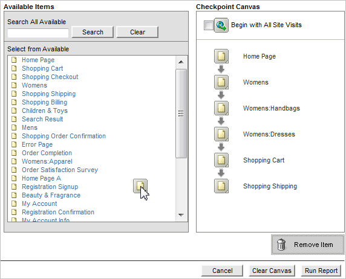
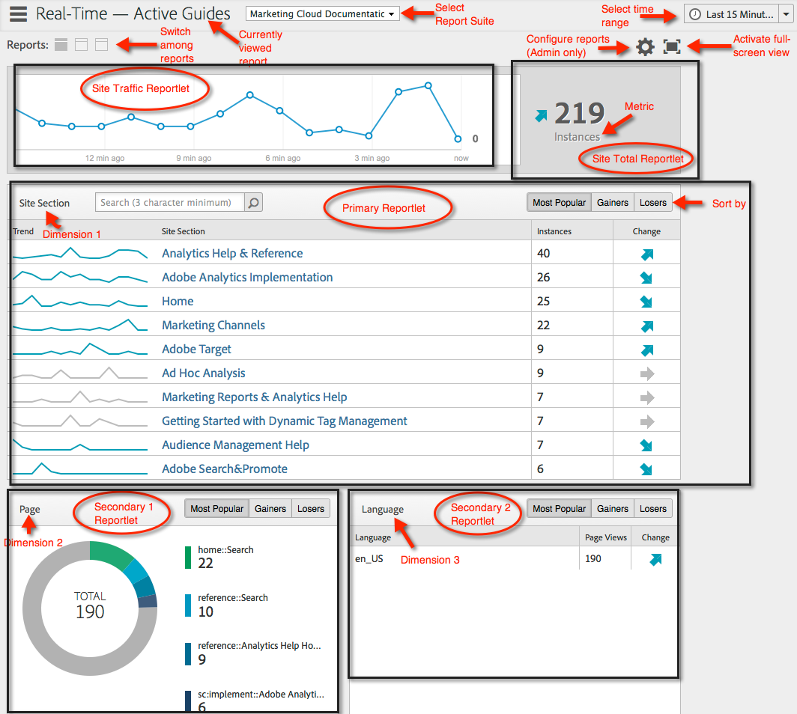
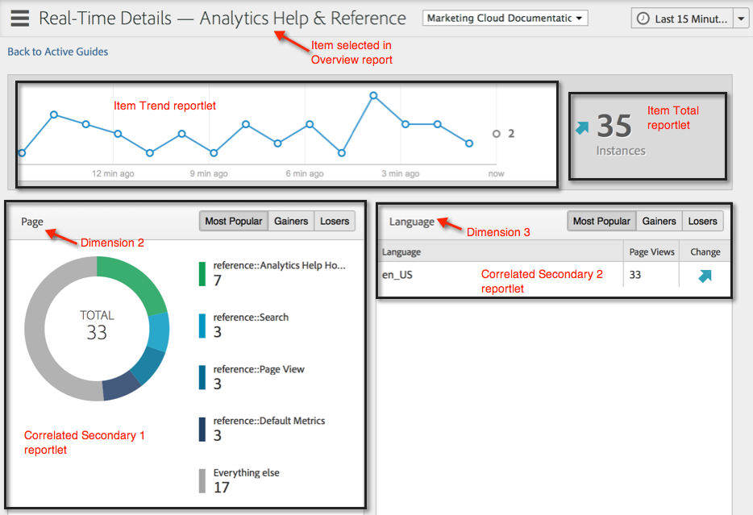

# Eseguire diversi tipi di rapporto

Passaggi sull’esecuzione dei diversi tipi di rapporti.

## Eseguire un report classifica {#task_C570BA4A213F4F2EB7B30E012934BE7D}

In un rapporto con classifica, la tabella mostra le classificazioni delle pagine del rapporto in relazione alla metrica, in base al numero o alla percentuale. I report Ranked possono mostrare più metriche in uno stesso report.

1. Genera un rapporto, ad esempio un [!UICONTROL Pages Report] ( **[!UICONTROL Reports]** > **[!UICONTROL Site Content]** > **[!UICONTROL Pages]**).
1. Nell’intestazione del rapporto, fai clic su **[!UICONTROL Ranked.]**
1. Per classificare il rapporto, fare clic su un’intestazione di colonna nella tabella.

   I rapporti con classifica possono contenere fino a 200 elementi elencati nella tabella (ad esempio prodotti, categorie, pagine web e così via) e dieci metriche (ricavi, ordini, visualizzazioni e così via).

## Eseguire un rapporto con tendenze {#task_F03B4E760B9E4EA29FC3F654E6316887}

I rapporti con tendenze visualizzano le metriche nel tempo. Puoi utilizzare questo tipo di report quando desideri sapere quali sono le prestazioni di un segmento da un periodo di tempo al successivo.

La maggior parte dei rapporti Conversione e Traffico dispone di una vista con tendenze disponibile. Utilizzando [!UICONTROL Calendar], puoi mostrare miglioramenti per tutte le suddivisioni dei periodi di tempo, inclusi giorni di un mese, settimane di un anno, settimane di un trimestre, mesi di un anno e così via. I rapporti con tendenze mostrano le tendenze per una singola metrica (ricavi, ordini, visualizzazioni e così via) fino a cinque elementi (come prodotti, categorie, pagine web e così via).

**Per eseguire un rapporto con tendenze**

1. Esegui una conversione o un rapporto sul traffico, ad esempio **[!UICONTROL Reports]** > **[!UICONTROL Site Content]** > **[!UICONTROL Pages]**.
1. Alla voce **[!UICONTROL Report Type]**, fai clic su **[!UICONTROL Trended.]**

## Eseguire un rapporto di fallout {#task_8FD97C8260464F9DA731A93DB8F80184}

Il [!UICONTROL Fallout Report] mostra il numero di visitatori che hanno visitato una sequenza di pagine predeterminata. Mostra anche i tassi di conversione e di abbandono tra ciascun passaggio.

Consulta il nuovo pannello [Analisi abbandono](https://experienceleague.adobe.com/docs/analytics/analyze/analysis-workspace/visualizations/fallout/fallout-flow.html) in Analysis Workspace!

1. In [!UICONTROL Adobe Analytics], fai clic su **[!UICONTROL Reports]** > **[!UICONTROL Paths]** > **[!UICONTROL Pages]** > **[!UICONTROL Fallout]**.
1. Nella pagina [!UICONTROL Fallout Report], fai clic su **[!UICONTROL Launch the Fallout Report Builder]**.

   

1. Nella pagina [!UICONTROL Define Checkpoints] , specifica i punti di controllo da utilizzare per il rapporto.
1. Fai clic su **[!UICONTROL Run Report]**.

   

## Eseguire un rapporto di flusso di pagina {#task_133E8B87C3F04DA0A42D10CBA499305B}

I rapporti Flusso di pagina mostrano l’ordine in cui i visitatori accedono alle pagine e navigano nel sito. Questo rapporto aiuta a rispondere

Consulta la [Visualizzazione Flusso](https://experienceleague.adobe.com/docs/analytics/analyze/analysis-workspace/visualizations/fallout/fallout-flow.html) in Analysis Workspace!

Ad esempio, fai clic su **[!UICONTROL Reports]** > **[!UICONTROL Paths]** > **[!UICONTROL Pages]** > **[!UICONTROL Next Page Flow]**.

## Eseguire un rapporto sul canale di marketing {#task_64ADED5CC75248319E06E3E029B47F78}

Il reporting per canale di marketing fornisce un rapporto di panoramica sull’allocazione dei canali di primo e ultimo contatto, con metriche di reporting standard come ricavi, ordini e costi. Questi rapporti ti consentono di analizzare quanti ricavi genera ogni canale.

Per ulteriori informazioni, consulta la guida [Marketing Channel](/help/components/c-marketing-channels/analyze-mc.md) .

## Eseguire un rapporto di rilevamento delle anomalie {#task_4808C96327354D789C075823F5C3A049}

Puoi eseguire [Rilevamento anomalie e Analisi contributi](https://experienceleague.adobe.com/docs/analytics/analyze/analysis-workspace/virtual-analyst/anomaly-detection/anomaly-detection.html?lang=it) solo in Analysis Workspace.

## Eseguire un rapporto in tempo reale {#task_5D25929C918E40B18965222FA94176B0}

Descrive come visualizzare e interpretare i rapporti in tempo reale.

**[!UICONTROL Reports > Site Metrics > Real-Time]** .

Il reporting in tempo reale offre due rapporti principali: un rapporto di panoramica e un rapporto di dettaglio. Ciascuna di esse è costituita da una serie di rapporti.

Per informazioni sulla configurazione dei rapporti in tempo reale, consulta la [Guida di riferimento di Analytics](https://experienceleague.adobe.com/docs/analytics/landing/home.html#RealTime_Reports_Configuration).

1. Osserva il rapporto **[!UICONTROL Overview]** e i relativi componenti:  

   <table id="choicetable_8586BECF55E843B2B5CD41205567EA32"> 
   <thead class="chhead sthead"> 
   <th class="choptionhd"> Componente interfaccia </th> 
   <th class="chdeschd"> Descrizione </th> 
   </thead> 
   <tr class="chrow strow"> 
   <td class="choption"><strong>Seleziona suite di rapporti</strong></td> 
   <td class="chdesc stentry"> Mostra la suite di rapporti coperta da questo rapporto in tempo reale. Per modificare la suite di rapporti, consulta <a href="https://experienceleague.adobe.com/docs/analytics/admin/admin-tools/real-time-reports/t-realtime-admin.html"  > Configurazione rapporti in tempo reale </a>. </td> 
   </tr> 
   <tr class="chrow strow"> 
   <td class="choption"><strong>Passa ai rapporti</strong></td> 
   <td class="chdesc stentry"> Consente di passare ai rapporti impostati (massimo 3). </td> 
   </tr> 
   <tr class="chrow strow"> 
   <td class="choption"><strong>Seleziona intervallo di tempo</strong></td> 
   <td class="chdesc stentry"> Consente di scegliere l’intervallo di tempo complessivo da utilizzare per tutti i minirapporti del rapporto. </td> 
   </tr> 
   <tr class="chrow strow"> 
   <td class="choption"><strong>Configurare i rapporti</strong></td> 
   <td class="chdesc stentry"> Questo collegamento con l’icona a forma di ingranaggio è visibile solo se disponi dei diritti di amministratore. Facendo clic su di essa si accede al Gestore suite di rapporti in   Strumenti di amministrazione  &gt;  Suite di rapporti  &gt;  Modifica impostazioni  &gt;  In tempo reale  . </td> 
   </tr> 
   <tr class="chrow strow"> 
   <td class="choption"><strong>Vista a schermo intero</strong></td> 
   <td class="chdesc stentry"> L’icona di visualizzazione a schermo intero è visibile solo se il monitor ha un rapporto di formato specifico (16:9 o 16:10) E se il browser lo supporta. Non è possibile interagire con lo schermo in modalità a schermo intero (premere  Esc  per uscire). La modalità a schermo intero non scade. </td> 
   </tr> 
   <tr class="chrow strow"> 
   <td class="choption"><strong>Report sul traffico del sito</strong></td> 
   <td class="chdesc stentry"> I dati della linea di tendenza blu mostrano il totale di traffico per il sito complessivo. L’asse X utilizza etichette letterali (15 minuti fa, 10 minuti fa) ad eccezione del valore corrente, che viene mostrato come espressione in tempo reale. </td> 
   </tr> 
   <tr class="chrow strow"> 
   <td class="choption"><strong>Rapporto totale sito</strong></td> 
   <td class="chdesc stentry"> Presenta un conteggio del totale del sito per la metrica selezionata del rapporto in tempo reale per gli ultimi N minuti. "N" è configurabile tramite il selettore Intervallo di tempo. 
Il colore e la direzione della freccia si basano sul seguente algoritmo: 
      <ul id="ul_9F40CEA33798467393CB1266BB36D500"> 
      <li id="li_CCD01A44F912487DA5681EA50113643C">Guadagno significativo (freccia su): &gt; 100% </li> 
      <li id="li_7402491A9A614851B7F2AE0C77BD9A97">Guadagno (freccia su destra): tra il 5 % e il 100% </li> 
      <li id="li_BCA79C08B5714D4B9315068112C66107"> Piatta (freccia destra): tra 5% e -5% </li> 
      <li id="li_234ECBD7D83A4AE680E4A70BF288681F"> Perdita (freccia giù destra): tra -5% e -100% </li> 
      <li id="li_10C5EA8803604C1CA714D3DB27478B31"> Perdita significativa (freccia giù): &lt; -100% </li> 
      </ul> 
 
Se il totale del sito è riportato in "istanze", queste istanze riflettono la dimensione nel reportlet principale. Se esiste un nome specifico per l’istanza (ad esempio "Visualizzazioni pagina"), il totale del sito riporta tale nome. 
 </td> 
   </tr> 
   <tr class="chrow strow"> 
   <td class="choption"><strong>Report principale</strong></td> 
   <td class="chdesc stentry"> Report per la dimensione principale del report in tempo reale e per la relativa metrica. Presenta una linea di tendenza per quell’elemento per l’intervallo di tempo selezionato. Il totale della metrica rappresenta la somma per l’intera linea di tendenza. La freccia indica se l'elemento sta guadagnando, guadagnando, piatta, perdendo o fortemente perdendo. </td> 
   </tr> 
   <tr class="chrow strow"> 
   <td class="choption"><strong>Finestra di dialogo Ricerca</strong></td> 
   <td class="chdesc stentry"> La ricerca ha effetto su tutti i minirapporti. La ricerca persiste quando si visualizza il rapporto. </td> 
   </tr> 
   <tr class="chrow strow"> 
   <td class="choption"><strong>Ordina per... Più popolari/Guadagnatori/Perduttori</strong></td> 
   <td class="chdesc stentry"> Puoi scegliere di ordinare per  Più popolari (impostazione predefinita),  Guadagni  (dimensioni che mostrano la maggiore crescita) e  Perdite  (dimensioni che si trovano su una traiettoria verso il basso). 
Di seguito è riportata la formula utilizzata per determinare i profitti o i perdenti: In tempo reale esamina il primo campione e il successivo al più recente ed esegue un semplice calcolo del "% change". Quindi, se è selezionato "Ultimi 15 minuti" e n rappresenta il minuto corrente, n-1 viene confrontato con n-15. Al momento, la funzione in tempo reale non effettua alcuna ponderazione. Il minuto corrente viene ignorato perché non è completo e probabilmente genererà una modifica percentuale errata. 
 
Questa formula è coerente per tutte le metriche utilizzate nel rapporto in tempo reale. 
 </td> 
   </tr> 
   <tr class="chrow strow"> 
   <td class="choption"><strong>Report secondario 1</strong></td> 
   <td class="chdesc stentry"> Presenta report in tempo reale per la dimensione del secondo report predisposto e per la metrica. 
Il rapporto secondario 1 indica le prime 4 categorie; il quinto è un'aggregazione di tutti i valori rimanenti. Per ogni categoria viene fornita la visualizzazione non elaborata totale della categoria. Inoltre, il totale per tutte le categorie è indicato al centro. 
 
 Passando il puntatore del mouse su una sezione viene evidenziata la categoria associata e la linea di tendenza della categoria viene visualizzata sotto la ciambella. 
 
 Passando il puntatore del mouse su un elemento di riga viene evidenziato l’elemento di riga più la sezione associata e viene visualizzata la linea di tendenza della categoria sotto l’anello. 
 </td> 
   </tr> 
   <tr class="chrow strow"> 
   <td class="choption"><strong>Report secondario 2</strong></td> 
   <td class="chdesc stentry"> Presenta report in tempo reale per la dimensione del terzo report predisposto e per la metrica. Passando il puntatore del mouse sopra l’etichetta dell’elemento, l’etichetta viene spostata a destra e viene visualizzata una linea di tendenza per l’elemento in cui è stato effettuato il passaggio del mouse. </td> 
   </tr> 
   </table>

1. Fai clic su una voce di elenco nel Reportlet principale per avviare la visualizzazione **[!UICONTROL Details]** della voce di elenco:  

   | **Rapporto sulle tendenze degli articoli** | Presenta la linea di tendenza dell’elemento selezionato nel rapporto Panoramica per gli ultimi N minuti. N è configurabile tramite il selettore Intervallo temporale. |
   |---|---|
   | **Rapporto totale articolo** | Presenta un conteggio della metrica totale per l’elemento selezionato nel rapporto Panoramica per gli ultimi N minuti. N è configurabile tramite il selettore Intervallo temporale. |
   | **Report secondario correlato 1** | Questo minirapporti è molto simile al Reportlet secondario 1. L’unica differenza è l’origine dati utilizzata per compilare il report: in questo esempio, mostra la correlazione (o suddivisione) tra una pagina specifica (quella selezionata nel minirapporti principale del rapporto Panoramica) e le istanze visualizzate. |
   | **Report secondario 2 correlato** | Questo minirapporti è molto simile al Reportlet secondario 2. L’unica differenza è l’origine dati utilizzata per compilare il report: in questo esempio, mostra la correlazione (o suddivisione) tra una pagina specifica (quella selezionata nel minirapporti principale del rapporto Panoramica) e la dimensione della lingua. |
