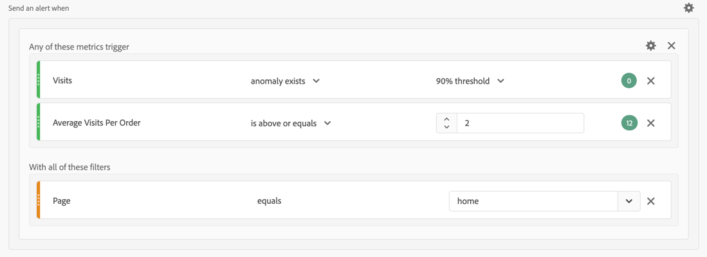

# Casi di utilizzo degli avvisi

È possibile creare avvisi come descritto in [Creare avvisi](alert-builder.md).

Nelle sezioni seguenti sono illustrati alcuni esempi di casi d’uso da considerare durante la creazione di avvisi.

## Filtra avvisi

Puoi creare semplici avvisi utilizzando i segmenti. Ad esempio, definisci un avviso relativo al numero di sessioni per le persone che visitano la home page tramite una sessione dell’app mobile.

## Stack di avvisi

È possibile consolidare (raggruppare) gli avvisi invece di creare più avvisi. Gli avvisi possono essere combinati in modo da evitare di ricevere diversi avvisi. Nell’esempio seguente viene inviato un avviso quando viene attivata una delle soglie delle metriche.

