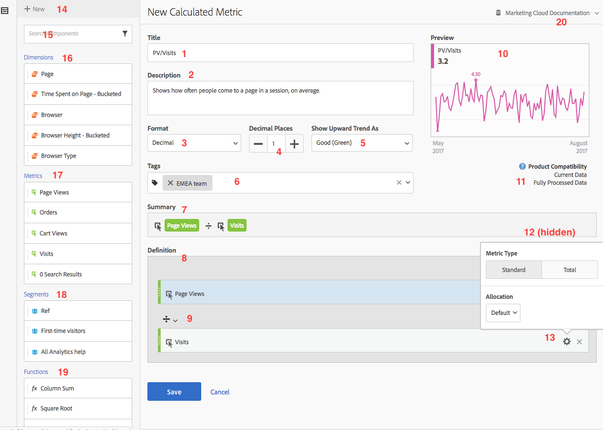
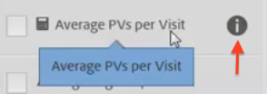
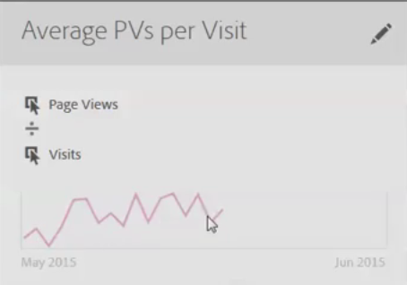

# Creare metriche

Il Generatore di metriche calcolate fornisce un quadro che consente di trascinare dimensioni, metriche, segmenti e funzioni per creare metriche personalizzate basate sulla logica, sulle regole e sugli operatori dei contenitori. Questo strumento di sviluppo integrato consente di creare e salvare semplici metriche calcolate o metriche calcolate avanzate.

Esistono diversi modi per accedere al Generatore metriche calcolate:

* In Analysis Workspace, open a project and click  **[!UICONTROL + New]** &gt; **[!UICONTROL Create Metric]** .
* In [!DNL Analytics], go to **[!UICONTROL Components]** &gt; **[!UICONTROL Calculated Metrics]**.

* Click **[!UICONTROL + Add]** at the top of the [Calculated Metric Manager](../../../../../components/c-calcmetrics/c-workflow/cm-workflow/cm-manager.md#concept_BA6815CB06D842D5825766396B691653), or

* Go to **[!UICONTROL Analytics]** &gt; **[!UICONTROL Reports]**, open any report and click the Metrics icon   to bring up the Metrics rail, then click **[!UICONTROL Add]**.

## UI Components {#section_9382AEEBA4244DD6A9F6C1DD3F6D076B}

<table id="table_60A82936321047D1A335331BF83B0972"> 
 <thead> 
  <tr> 
   <th colname="col2" class="entry"> Campo </th> 
   <th colname="col3" class="entry"> Descrizione </th> 
  </tr> 
 </thead>
 <tbody> 
  <tr> 
   <td colname="col2">  Titolo  </td> 
   <td colname="col3"> 
La denominazione della metrica è obbligatoria. Non puoi salvare la metrica a meno che non sia denominata. 
 </td> 
  </tr> 
  <tr> 
   <td colname="col2">  Descrizione  </td> 
   <td colname="col3"> 
Fornisci una descrizione intuitiva per mostrare a cosa è utilizzata e per distinguerla da simili. 
 
La descrizione viene visualizzata anche all'interno di un rapporto. NON è consigliabile inserire la formula nella descrizione, ma descrivere il tipo di dati che questa metrica deve e non deve essere utilizzata. (La formula viene generata durante la creazione della metrica, sotto l'intestazione Riepilogo. Di conseguenza, non è necessario aggiungere la formula alla descrizione. 
 </td> 
  </tr> 
  <tr> 
   <td colname="col2">  Formato  </td> 
   <td colname="col3"> 
Le opzioni includono Decimale, Ora, Percentuale e Valuta. 
 </td> 
  </tr> 
  <tr> 
   <td colname="col2">  Posizioni decimali  </td> 
   <td colname="col3"> 
Mostra il numero di posizioni decimali mostrate nel rapporto. Il numero massimo di posizioni decimali è 10. 
 </td> 
  </tr> 
  <tr> 
   <td colname="col2">  Mostra tendenza verso l'alto come…  </td> 
   <td colname="col3"> 
Questa impostazione di polarità di metrica mostra se [! DNL Analytics] deve considerare una tendenza verso l'alto nella metrica come buono (verde) o negativo (rosso). Come risultato, il grafico del report verrà visualizzato come verde o rosso quando viene rilasciato. 
 </td> 
  </tr> 
  <tr> 
   <td colname="col2">  Tag  </td> 
   <td colname="col3"> 
L'assegnazione di tag è un metodo utile per organizzare le metriche. Tutti gli utenti possono creare tag e applicare uno o più tag a una metrica. Tuttavia, potete visualizzare i tag solo per i segmenti che possedete o che sono stati condivisi con voi. Che tipi di tag creare? Di seguito sono riportati alcuni suggerimenti per i tag utili: 
     <ul id="ul_9A6CE5F179424687A39F2D5C1A953258"> 
      <li id="li_A8815F2D8D284874AD701A7B103D82A3">Tags based on <b>team names</b>, such as Social Marketing, Mobile Marketing. </li> 
      <li id="li_A51A4515A541488E9D90296A955E9F4F"><b>Tag di progetto</b> (tag di analisi), ad esempio Analisi delle pagine. </li> 
      <li id="li_B4605470A7094026AC168420B64BBCC3"><b>Tag categoria</b> : Uomo; geografia. </li> 
      <li id="li_B6EAB0F2A96C41209C4EC97B9E64390B"><b>Tag Workflow</b> : Per essere approvato; Cura per (una specifica unità aziendale) </li> 
     </ul> 
 </td> 
  </tr> 
  <tr> 
   <td colname="col2">  Riepilogo  </td> 
   <td colname="col3"> 
The  Summary  formula updates anytime you make a change to the metric definition. This formula also shows up in the metrics rail on the left when you hover over a metric and click the  icon. 
 </td> 
  </tr> 
  <tr> 
   <td colname="col2">  Definizione  </td> 
   <td colname="col3"> 
Questo è il luogo in cui trascinate metriche/metriche calcolate, segmenti e/o funzioni per creare la metrica calcolata. 
 
 
     <ul id="ul_B13401A266354DC594C6176025DB61CB"> 
      <li id="li_01776C32C7C5440AA1F847096CBED92B">Se trascinate in una metrica calcolata, la definizione della metrica aumenterà automaticamente. </li> 
      <li id="li_A483D352522E4572AB43042473053359">Potete nidificare le definizioni con i contenitori. Tuttavia, a differenza dei contenitori dei segmenti, questi contenitori funzionano come un'espressione matematica e determinano l'ordine delle operazioni. </li> 
     </ul> 
 </td> 
  </tr> 
  <tr> 
   <td colname="col2">  Operatore  </td> 
   <td colname="col3"> 
Divided by (  ) is the default operator, plus there are the +, -, and x operators. 
 </td> 
  </tr> 
  <tr> 
   <td colname="col2">  Anteprima  </td> 
   <td colname="col3"> 
Fornisce una lettura rapida su qualsiasi possibile errore. L'anteprima copre gli ultimi 90 giorni. Si tratta di un modo per determinare se hai selezionato i componenti corretti per la metrica. Un risultato imprevisto comporterebbe la necessità di considerare la definizione della metrica. 
 </td> 
  </tr> 
  <tr> 
   <td colname="col2">  Compatibilità dei prodotti  </td> 
   <td colname="col3"> 
Product compatibility shows you whether the metric is compatible with <a href="https://marketing.adobe.com/resources/help/en_US/reference/data_latency.html" format="https" scope="external"> Current Data </a>, with Fully Processed Data, or only with Marketing Channel reports (first-touch allocation). 
Nota: I dati correnti non supportano tutte le metriche. Le metriche contenenti segmenti o funzioni non sono compatibili con i dati correnti. <a href="../../../../../components/c-calcmetrics/cm-compatibility.md#concept_906480DEBEEC4D279BBBBD4CE7DFE70C" format="dita" scope="local"> Altro... </a> 
 
 </td> 
  </tr> 
  <tr> 
   <td colname="col2">  Aggiungi  </td> 
   <td colname="col3"> 
Per tutti i tipi di metriche calcolate, potete aggiungere contenitori e numeri statici alla definizione. Per le metriche calcolate avanzate, puoi anche aggiungere segmenti e funzioni. 
 
 
     <ul id="ul_607C1B303F334062BC620317667DE490"> 
      <li id="li_53462789B8AF4F1AA9B45565D37CF22B">I contenitori funzionano come un'espressione matematica e determinano l'ordine delle operazioni. Quindi, qualsiasi cosa in un contenitore verrà elaborata prima dell'operazione successiva. </li> 
      <li id="li_401A9E0D8B3B468990289DBF66A06F63">Trascinate un segmento su un contenitore per posizionare tutti gli elementi del contenitore. (Solo metriche calcolate avanzate) </li> 
      <li id="li_F191B200D7A944F9ADC0573A9A82A6DA">Potete sovrapporre più segmenti in un contenitore. </li> 
     </ul> 
 </td> 
  </tr> 
  <tr> 
   <td colname="col2"> Gear icon (  Metric Type ,  Attribution ) </td> 
   <td colname="col3"> 
Selecting the gear icon next to a metric lets you specify the <a href="../../../../../components/c-calcmetrics/c-workflow/cm-workflow/c-build-metrics/m-metric-type-alloc.md#concept_B7A1FCFEFA9D4C4883208ACE8C9C8E5E" format="dita" scope="local"> metric type and attribution models </a>. 
 </td> 
  </tr> 
  <tr> 
   <td colname="col2">  + Nuova funzione  </td> 
   <td colname="col3"> 
Lets you create a new component, such as a new segment (which takes you to the <a href="https://marketing.adobe.com/resources/help/en_US/analytics/segment/seg_build_ui.html" format="https" scope="external"> Segment Builder </a>.) 
 </td> 
  </tr> 
  <tr> 
   <td colname="col2"> 
Componenti ricerca 
 </td> 
   <td colname="col3"> 
Questa barra di ricerca permette di cercare dimensioni, metriche, segmenti (solo metriche calcolate avanzate) e funzioni (solo metriche calcolate avanzate). 
 </td> 
  </tr> 
  <tr> 
   <td colname="col2"> 
Elenco delle dimensioni 
 </td> 
   <td colname="col3"> 
Invece di uscire da Calculated Metric Builder (Generatore metriche calcolate) per creare un segmento semplice (nel Generatore di segmenti), ad esempio «Page = Homepage», puoi trascinare nella pagina e selezionare Homepage direttamente dal Generatore di metriche calcolate. 
 
Questo semplifica il flusso di lavoro per la creazione di metriche calcolate segmentate. 
 </td> 
  </tr> 
  <tr> 
   <td colname="col2"> 
Elenco delle metriche 
 </td> 
   <td colname="col3"> 
Le metriche sono suddivise in 3 categorie: 
 
    <ul id="ul_7BF50F4964EF45858FBA1634FBFA45CF"> 
     <li id="li_90F2312927A6499CA1CE04F8FFC912CF">Standard metrics ( ) </li> 
     <li id="li_A3F59083E79B4AC780D6F8CEDFFD20C9">Metriche calcolate ( ) </li> 
     <li id="li_8735E76637ED4C3F983731A66E04C93E">Metrics templates ( ) - at the bottom of the list. </li> 
    </ul> 
When you hover over a metric, you can see the Info icon to the right of it: . Facendo clic su questa icona sono disponibili le seguenti informazioni: 
 
    <ul id="ul_DF35DDB9FBFA40C8A93FA0F2286A0BBE"> 
     <li id="li_4215AA9BF93F4C8B941002A7A4D2F50B">Formula di calcolo. </li> 
     <li id="li_6A8E39EB6DCE4377B0B594B6D4FC0294">Una tendenza di anteprima della metrica. </li> 
     <li id="li_44C1595E4BE64ED69D1DB3BB6655ED55">Icona di modifica (matita) in alto a destra che ti permette di passare al Generatore metriche calcolate dove puoi modificare questa metrica calcolata. </li> 
    </ul> 
 
 </td> 
  </tr> 
  <tr> 
   <td colname="col2"> 
Elenco di segmenti 
 </td> 
   <td colname="col3"> 
(Solo metriche calcolate avanzate) In qualità di amministratore, questo elenco mostra tutti i segmenti creati nella società di accesso. Se sei un utente non amministratore, questo elenco mostra i segmenti di tua proprietà e quelli condivisi con te. <a href="https://marketing.adobe.com/resources/help/en_US/analytics/segment/seg_rights.html" format="https" scope="external"> Altro... </a> 
 </td> 
  </tr> 
  <tr> 
   <td colname="col2"> 
Elenco di funzioni 
 </td> 
   <td colname="col3"> 
(Advanced calculated metrics only) Functions are divided into two lists: <a href="../../../../../components/c-calcmetrics/cm-reference/cm-functions.md#concept_E3022D5EEEE145B69A23438BAF7016B2" format="dita" scope="local"> Basic </a> (used most often) and <a href="../../../../../components/c-calcmetrics/cm-reference/cm-adv-functions.md#concept_A5FB9127D70F4E1AA02D1ACBF4F54174" format="dita" scope="local"> Advanced </a>. 
 </td> 
  </tr> 
  <tr> 
   <td colname="col2"> 
Selettore suite di rapporti 
 </td> 
   <td colname="col3"> 
Consente di passare a una suite di rapporti diversa. 
 </td> 
  </tr> 
 </tbody> 
</table>

