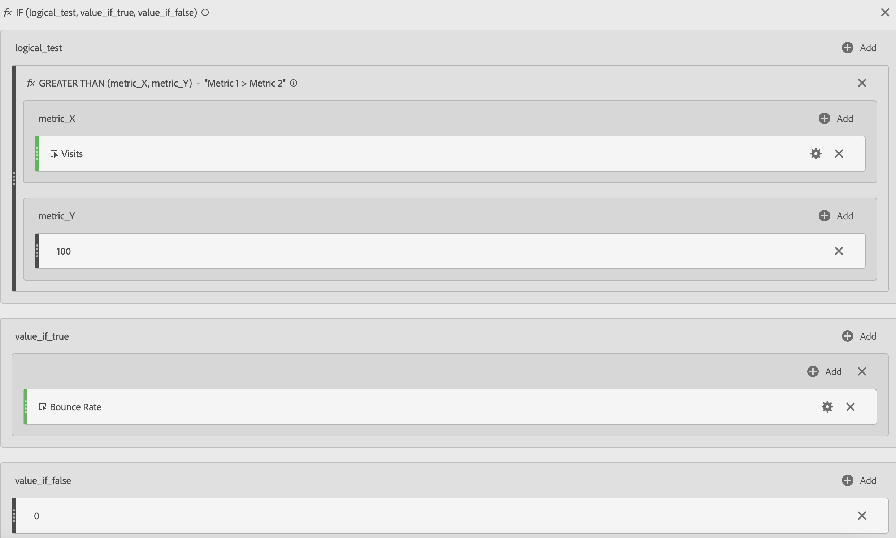

# Metriche filtrate e ponderate

Mostra esempi di metriche filtrate e ponderate.

## Filtered Bounce Rate {#section_D42F2452E4464948934063EB6F2DAAB4}

Questa semplice metrica filtrata mostra il tasso di rimbalzo per solo quelle pagine con oltre 100 visite:

Tenere presente che questa formula dipende da un intervallo di tempo coerente. Se esegui un report per un giorno singolo, vale la pena esaminare tutte le pagine con più di 20 visite. Se lo esegui per un mese, potresti voler includere più visite nel filtro.

## Filtered Bounce Rate with Percentile {#section_4F3E6D33A1FD438A932FA662B3510552}

Questo filtro mostra il tasso di rimbalzo per l '30 delle pagine, se ordinato per visita.

## Weighted Metric {#section_F2D16B14569948289CF1310F9E6E3FC2}

Supponiamo di voler ordinare in base a tassi rimbalzati in generale, ma le pagine con visite più elevate dovrebbero essere più alte nell'elenco. Puoi creare un tasso di rimbalzo ponderato che si presenta così:

