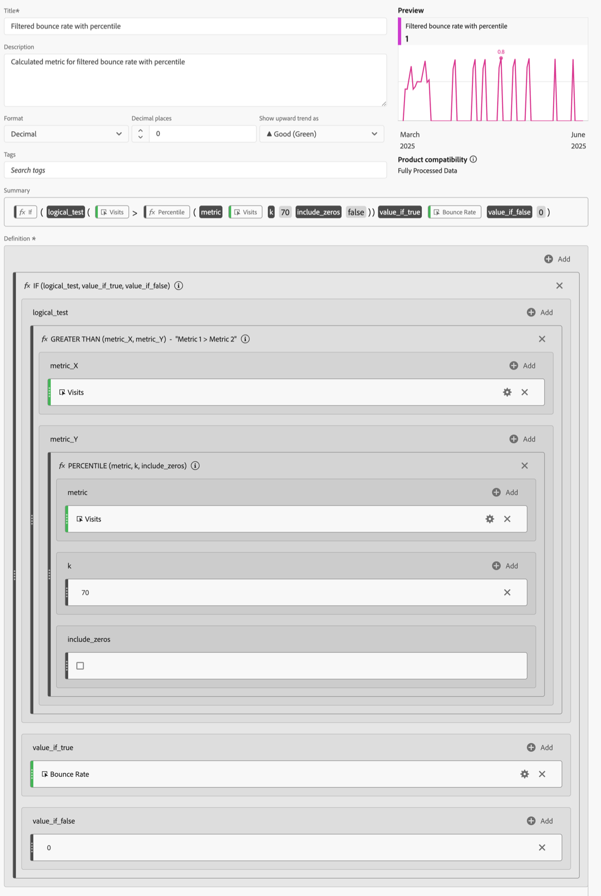

# Metriche filtrate e ponderate

Questo articolo mostra esempi di metriche filtrate e ponderate.

## Percentuale non recapitate filtrate

Questa semplice metrica filtrata mostra il tasso di mancato recapito solo per le pagine con più di 100 visite:

{zoomable="yes"}

Tieni presente che questa formula dipende da un intervallo di tempo coerente. Se esegui un rapporto per un singolo giorno, vale la pena esaminare qualsiasi pagina con più di 20 visite. Se lo esegui per un mese, potrebbe essere utile che il filtro includa più visite.

## Percentile percentuale di mancato recapito filtrata

Questo filtro mostra la Percentuale non recapitate per il primo 30% delle pagine, quando ordinato per visite.

{zoomable="yes"}

## Metrica ponderata

Supponiamo di voler ordinare in generale per frequenza di rimbalzo, ma le pagine con visite più alte dovrebbero essere più in alto nell’elenco. Puoi creare una percentuale di mancato recapito ponderata simile alla seguente:

