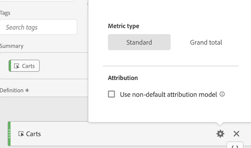

# Tipo di metrica e attribuzione

Selezionando l&#39;icona a forma di ingranaggio accanto a una metrica è possibile specificare il tipo di metrica e il modello di attribuzione.

## Tipi di metriche

| Tipi di metriche | Definizione |
|---|---|
| Standard | Queste metriche sono le stesse utilizzate per il [!DNL Analytics] reporting standard. Se una formula è costituita da una singola metrica standard, vengono visualizzati dati identici a quelli della corrispondente metrica non calcolata. Le metriche standard sono utili per creare metriche calcolate specifiche per ogni singolo elemento riga. Ad esempio, [Ordini] / [Visite] riceve gli ordini per quell&#39;articolo specifico e lo divide per il numero di visite per quell&#39;articolo specifico. |
| Totale | Utilizzare il totale per il periodo di reporting in ogni voce di riga. Se una formula è costituita da una singola metrica totale, visualizza lo stesso numero totale su ogni elemento riga. Le metriche totali sono utili per creare metriche calcolate confrontate con i dati totali del sito. Ad esempio, [Ordini] / Visite [] totali mostra la proporzione di ordini rispetto a TUTTE le visite al sito, non solo le visite all&#39;elemento riga specifico. |

## Modello di attribuzione colonna

>[!IMPORTANT]
>
>Nel luglio 2018, [!DNL Analytics] è stato introdotto [Attribution IQ](https://docs.adobe.com/content/help/en/analytics/analyze/analysis-workspace/panels/attribution/attribution.html), che ha modificato il modo in cui vengono valutati i modelli di allocazione nelle metriche calcolate. Come parte di questa modifica, le metriche calcolate che utilizzano un modello di allocazione non predefinito sono state migrate in nuovi modelli di attribuzione migliorati:
>
>* Per un elenco completo dei modelli di attribuzione e delle finestre di lookback non predefiniti supportati, consultate la documentazione di [Attribution IQ](https://docs.adobe.com/content/help/en/analytics/analyze/analysis-workspace/panels/attribution/attribution.html) .
>* I modelli di allocazione &quot;Marketing Channel Last Touch&quot; e &quot;Marketing Channel First Touch&quot; verranno migrati rispettivamente ai nuovi modelli di attribuzione &quot;Last Touch&quot; e &quot;First Touch&quot; (Nota: &quot;Marketing Channels&quot; (Canali di marketing) non verrà dichiarato obsoleto; verranno visualizzati solo i due modelli di allocazione nelle metriche calcolate.
>* Inoltre, correggeremo il modo in cui viene calcolata l&#39;allocazione lineare. Per i clienti che utilizzano metriche calcolate con modelli di allocazione &quot;Lineare&quot;, i report potrebbero subire lievi modifiche per riflettere il nuovo modello di attribuzione corretto. La modifica alle metriche calcolate si rifletterà in Analysis Workspace, Reports &amp; Analytics, Reporting API, Report Builder e Ad Hoc Analysis. Per ulteriori informazioni, vedere **Funzionamento dell&#39;allocazione lineare (dal 19 luglio 2018**, di seguito).
>

## Come funziona l&#39;allocazione lineare (dal 19 luglio 2018)

Nel luglio 2018, Adobe ha modificato il modo in cui viene riportata l&#39;allocazione lineare per le metriche calcolate. Questa modifica interessa Analysis Workspace, Analisi ad hoc, Reporting e analisi, Generatore di report, Activity Map e le API di reporting. La modifica interessa principalmente le eVar e altre dimensioni persistenti. Tenete presente che queste modifiche si applicano solo alle metriche calcolate e non hanno alcun impatto sugli altri report che utilizzano l&#39;allocazione lineare (come il report Pagine in Reporting e analisi). Altri rapporti che utilizzano l&#39;allocazione lineare continueranno a utilizzare il metodo esistente di allocazione lineare.

L&#39;esempio seguente illustra come le metriche calcolate con allocazione lineare cambieranno nei report:

|  | Hit 1 | Hit 2 | Hit 3 | Hit 4 | Hit 5 | Hit 6 | Hit 7 |
|--- |--- |--- |--- |--- |--- |--- |--- |
| Dati inviati in | PROMO A | - | PROMO A | PROMO B | - | PROMO C | $10 |
| Ultima eVar tocco | PROMO A | PROMO A | PROMO A | PROMO B | PROMO B | PROMO C | $10 |
| First Touch eVar | PROMO A | PROMO A | PROMO A | PROMO A | PROMO A | PROMO A | $10 |
| Esempio di proprietà | PROMO A | - | PROMO A | PROMO B | - | PROMO C | $10 |

In questo esempio, i valori A, B e C sono stati inviati in una variabile sugli hit 1, 3, 4 e 6 prima che un acquisto di $10 fosse effettuato sull&#39;hit 7. Nella seconda riga, questi valori persistono tra gli hit in base all’ultima visita di tocco. La terza riga illustra una persistenza della visita di primo tocco. Infine, l&#39;ultima riga illustra come i dati verrebbero registrati per una prop che non ha persistenza.

## Differenze nel funzionamento dell&#39;allocazione lineare in Reporting e analisi rispetto a Workspace

Esistono alcune differenze nel funzionamento dell&#39;attribuzione lineare tra questi due strumenti:

* In Reporting e analisi, l&#39;attribuzione lineare (elaborata) è sempre basata sulle visite, mentre in Workspace può essere basata sulle visite o sui visitatori.
* In Reporting e analisi, se nessun valore veniva passato al primo hit di una visita, il valore (iniziale) persisteva dalla visita precedente. NON è questo il caso in Workspace (Attribution IQ). Se non viene passato alcun valore al primo hit di una visita, &#39;None&#39; è il valore iniziale.

## Funzionamento dell&#39;allocazione lineare prima di luglio 2018

Prima del 19 luglio 2018, l&#39;attribuzione lineare è stata calcolata dopo che si è già verificata la persistenza del primo tocco o dell&#39;ultimo tocco. Ciò significa che per l&#39;ultima eVar touch sopra, i $10 sarebbero distribuiti come segue: A = 10 * (3/6) = $5, B = 10 * (2/6) = $3,33, C = 10 * (1/6) = $1,67.

Per la prima eVar touch sopra, tutti $10 sarebbe dato a A. Per il prop: A = 10 * (2/4) = $5, B = 10 * (1/4) = $2,50, e C = 10 * (1/4) = $2,50. Per riepilogare l&#39;allocazione lineare come funzionava in precedenza:

| Valori | Ultima eVar di tocco corrente | Prima eVar touch corrente | Prop corrente |
|---|---|---|---|
| PROMO A | $ 5,00 | $10.00 | $ 5,00 |
| PROMO B | $3.33 | $0 | $ 2,50 |
| PROMO C | $1.67 | $0 | $ 2,50 |
| Totale | $10.00 | $10.00 | $10.00 |

**Riepilogo del funzionamento dell’allocazione lineare a partire dal 19 luglio 2018**

Dopo il 19 luglio, abbiamo corretto questo comportamento nelle metriche calcolate. Invece di utilizzare i valori persistenti basati sull&#39;ultimo tocco o sul primo tocco, [!DNL Analytics] ora utilizza solo i valori passati (la prima riga della tabella superiore). Di conseguenza, le impostazioni di allocazione delle dimensioni non influiscono più sul modo in cui viene calcolata l&#39;allocazione lineare (vale a dire proprietà e eVar saranno trattate allo stesso modo), e i risultati riflettono ciò che è stato originariamente passato al posto dei valori del primo o dell&#39;ultimo tocco che potrebbero essere persistenti. Quindi, in tutti e tre i casi, A = 10 * (2/4) = $5, B = 10 * (1/4) = $2,50, e C = 10 * (1/4) = $2,50.

| Valori | Nuova eVar ultimo tocco | Nuova prima eVar touch | Nuovo prop |
|---|---|---|---|
| PROMO A | $ 5,00 | $ 5,00 | $ 5,00 |
| PROMO B | $ 2,50 | $ 2,50 | $ 2,50 |
| PROMO C | $ 2,50 | $ 2,50 | $ 2,50 |
| Totale | $10.00 | $10.00 | $10.00 |

