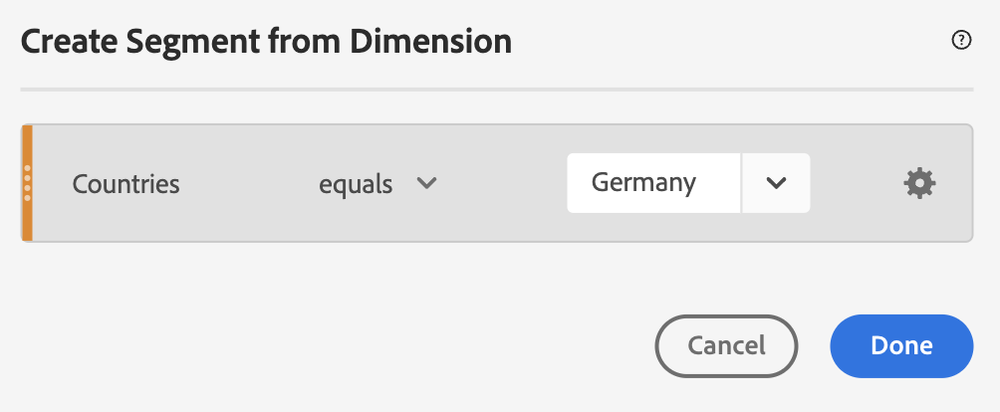

# Metriche segmentate

Nel generatore di metriche calcolate, puoi applicare segmenti all’interno della definizione della metrica. Questa funzione è utile per derivare nuove metriche da utilizzare nell&#39;analisi. Tieni presente che le definizioni dei segmenti possono essere aggiornate tramite il generatore di segmenti. Se vengono apportate modifiche, il segmento si aggiorna automaticamente ovunque venga applicato, anche se fa parte di una definizione di metrica calcolata.

## Creare una metrica segmentata {#create}

Supponiamo che tu voglia confrontare diversi aspetti di un segmento &quot;Visitatori tedeschi&quot; con quelli di un segmento &quot;Visitatori internazionali&quot;. Puoi creare metriche che ti forniranno informazioni approfondite, come:

* Qual è il comportamento di esplorazione dei contenuti rispetto ai due gruppi? (Un altro esempio potrebbe essere: Come si confronta il tasso di conversione tra i due segmenti?)
* In percentuale del totale dei visitatori, quanti visitatori tedeschi sfogliano determinate pagine rispetto ai visitatori internazionali?
* Quali sono le maggiori differenze in termini di accesso al contenuto da parte di questi diversi segmenti?

1. Se non hai un segmento paragonabile, crea un segmento ad hoc proprio nel Generatore di metrica calcolata denominato &quot;Visitatori tedeschi&quot;, dove &quot;Paesi&quot; è uguale a &quot;Germania&quot;. Trascina la dimensione Paesi nel quadro Definizione e seleziona la Germania come valore:

   

   >[!NOTE]
   >
   >Potete eseguire questa operazione anche nel Generatore [di](/help/components/segmentation/segmentation-workflow/seg-build.md)segmenti, ma abbiamo semplificato il flusso di lavoro rendendo disponibili le dimensioni nel Generatore di metrica calcolata. &quot;Adhoc&quot; indica che il segmento non è visibile nell&#39; **[!UICONTROL Segments]** elenco nella barra a sinistra. Tuttavia, potete renderlo pubblico passando il puntatore del mouse sull&#39;icona &quot;i&quot; accanto ad essa e facendo clic **[!UICONTROL Make public]**.

1. Se non hai un segmento paragonabile, crea un segmento denominato &quot;Visitatori internazionali&quot; in cui &quot;Paesi&quot; non equivale a &quot;Germania&quot;.
1. Crea e salva una metrica denominata &quot;Visitatori tedeschi&quot; trascinando il segmento Germania nell’area di lavoro Definizione e trascinando la metrica Visitatori unici al suo interno:

   

1. Ripetete il Passaggio 3 con il segmento Visitatori internazionali e la metrica Visitatori unici per creare una metrica Visitatori internazionali.
1. In  Analysis Workspace, trascina l’ **[!UICONTROL Page]** Dimension in una tabella a forma libera e trascina le due nuove metriche calcolate l’una accanto all’altra verso l’alto:

   

## Percentuale delle metriche totali {#percent-total}

Per approfondire ulteriormente l&#39;esempio sopra, confronta il segmento con una popolazione totale. A tal fine, crea due nuove metriche: &quot;% del totale dei visitatori tedeschi&quot; e &quot;% del totale dei visitatori internazionali&quot;:

1. Trascina il segmento Visitatori tedeschi (o internazionali) nel quadro.
1. Rilascia di seguito un altro segmento Visitatori tedeschi (o internazionali). Tuttavia, stavolta fai clic sull’icona di configurazione (ingranaggio) per selezionare il tipo di metrica &quot;Totale&quot;. Il formato deve essere &quot;Percent&quot;. L&#39;operatore deve essere &quot;diviso per&quot;. Si conclude con questa definizione di metrica:

   

1. Applica questa metrica al progetto:

   

