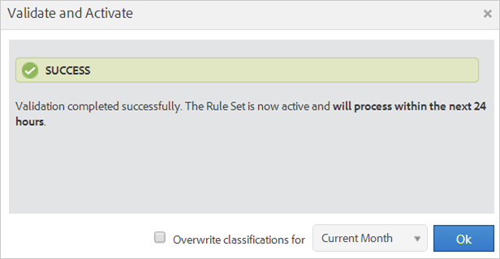

# Regole di classificazione

Le regole di classificazione ricercano regolarmente termini non classificati. Se viene trovata una corrispondenza di regola, le regole aggiungono automaticamente i termini alle tabelle di dati di classificazione. Potete inoltre utilizzare le regole di classificazione per sovrascrivere le chiavi esistenti.

## Regole di classificazione {#concept_CF2F64BD96454FBFAA84638FC7DEA263}

Le regole di classificazione ricercano regolarmente termini non classificati. Se viene trovata una corrispondenza di regola, le regole aggiungono automaticamente i termini alle tabelle di dati di classificazione. Potete inoltre utilizzare le regole di classificazione per sovrascrivere le chiavi esistenti.

**[!UICONTROL Analytics]** &gt; **[!UICONTROL Admin]** &gt; **[!UICONTROL Classification Rule Builder]**

Il Generatore di regole consente di creare un *`classification rule set`*, che è un elenco di *`classification rules`*. Una regola corrisponde ai criteri specificati, quindi esegue un'azione.

Le regole di classificazione sono utili per:

* **Annunci** e-mail e **display**: Crea regole di classificazione per raggruppare le singole campagne pubblicitarie in modo da ottenere le prestazioni delle campagne Display rispetto alle campagne e-mail.

* **Codici** di tracciamento: Creare regole di classificazione per classificare i valori chiave derivati dalle stringhe nei codici di tracciamento e farli corrispondere a criteri specifici definiti dall'utente.
* **Termini** di ricerca: Utilizzate espressioni [e caratteri jolly](../../../components/c-classifications2/crb/classification-quickstart-rules.md#concept_8A63F9BCF9484963962E14E6286D312D) regolari per semplificare la classificazione dei termini di ricerca. Ad esempio, se un termine di ricerca contiene *`baseball`*, puoi impostare una *`Sports League`* classificazione su *`MLB`*.

Ad esempio, supponiamo che un codice di tracciamento per un ID campagna e-mail sia:

`em:Summer:2013:Sale`.

È possibile impostare tre regole in un set di regole che identificano le parti della stringa, quindi classificano i valori:

| Seleziona tipo di regola | Inserisci criteri di corrispondenza | Imposta classificazione | A |
|---|---|---|---|
| Inizia con | em: | Canale | E-mail |
| Termina con | Vendita | Type (Tipo) | Vendita |
| Contiene | 2013 | Anno | 2013 |

## Elaborazione delle regole {#concept_A67A23F523844D37898583C632DB9D25}

Informazioni importanti sull'elaborazione delle regole di classificazione.

<!-- 

about_classification_rules.xml

 -->

* [Informazioni importanti sulle regole](/help/components/c-classifications2/crb/classification-rule-builder.md)
* [Quando Le Regole Non Classificano Le Chiavi?](/help/components/c-classifications2/crb/classification-rule-builder.md)
* [Priorità regola](../../../components/c-classifications2/crb/classification-quickstart-rules.md#concept_93527FEB3C9B48FB96FB7DF857E5F980)

>[!NOTE]
>
>L'oggetto [!UICONTROL Rule Builder] non supporta le classificazioni Numeriche 2.

## Informazioni importanti sulle regole {#section_0BD46702FBEC4D98A4DD2EA0BD428046}

* Specificate le autorizzazioni [del](https://marketing.adobe.com/resources/help/en_US/reference/?f=groups) gruppo per le classificazioni in [!UICONTROL Admin Tools].

* **Espressioni** regolari: La Guida è disponibile in Espressioni [regolari nelle regole](../../../components/c-classifications2/crb/classification-quickstart-rules.md#concept_8A63F9BCF9484963962E14E6286D312D)di classificazione.

* **Suite** di rapporti: Non puoi scegliere una classificazione finché non viene selezionata almeno una suite di rapporti. Non puoi applicare la suite di rapporti finché non hai creato il set di regole e assegnato una variabile.

   Quando si verifica il set di regole, utilizzare le chiavi (la variabile da classificare) del rapporto per vedere in che modo verranno influenzate dal set di regole. (La [chiave](../../../components/c-classifications2/c-classifications-importer/c-saint-data-files.md#concept_0B77B3079B5C414F9956058688990443) è la variabile da classificare, o la prima colonna nella tabella di caricamento della classificazione.)

* **Priorità** regola: Se una chiave corrisponde a più regole che impostano la stessa classificazione (nella [!UICONTROL Set Classification] colonna), viene utilizzata l'ultima regola che corrisponde alla classificazione. Vedere [Informazioni sulla priorità](../../../components/c-classifications2/crb/classification-quickstart-rules.md#concept_93527FEB3C9B48FB96FB7DF857E5F980)delle regole.

* **Limiti relativi al numero di regole**: Non esiste alcun limite impostato per il numero di regole che è possibile creare. Tuttavia, un numero elevato di regole può influire sulle prestazioni del browser.
* **Elaborazione**: Le regole vengono elaborate a intervalli frequenti, a seconda del volume di traffico correlato alla classificazione.

   Le regole attive vengono elaborate ogni quattro ore, esaminando i dati di classificazione che risalgono in genere a un mese. Le regole verificano automaticamente la presenza di nuovi valori e caricano le classificazioni utilizzando l'importatore.

* **Sovrascrivi classificazioni** esistenti: Vedere [Quando Le Regole Non Classificano Le Chiavi?](../../../components/c-classifications2/crb/classification-quickstart-rules.md#section_4481E88CA28246B6B19EA16E2D83A3A8) Se necessario, è possibile eliminare o rimuovere le classificazioni esistenti utilizzando Importazione.

## Quando Le Regole Non Classificano Le Chiavi? {#section_4481E88CA28246B6B19EA16E2D83A3A8}

Quando attivate le regole, potete sovrascrivere le classificazioni esistenti. Nelle situazioni seguenti, una regola di classificazione non classifica una [chiave](../../../components/c-classifications2/c-classifications-importer/c-saint-data-files.md#concept_0B77B3079B5C414F9956058688990443)(variabile) se:

* La chiave è già classificata e non si seleziona [Sovrascrivi classificazioni](../../../components/c-classifications2/crb/classification-rule-definitions.md#overwrite_classifications).

   Potete sovrascrivere le classificazioni quando [aggiungete e attivate](../../../components/c-classifications2/crb/classification-quickstart-rules.md#task_86F216DFD2534FA181E64ABDF306782B) una regola, e quando attivate l'integrazione di connettori dati. Per i connettori dati, le regole vengono create dai partner in Dev Center e visualizzate in [!UICONTROL Classification Rule Builder].

* Una chiave classificata non è stata visualizzata nei dati dopo un intervallo di tempo specificato durante la sovrascrittura di una chiave, anche dopo l'attivazione di [Sovrascrivi classificazioni](../../../components/c-classifications2/crb/classification-rule-definitions.md#overwrite_classifications).
* La chiave non è classificata e la chiave non viene mai passata [!DNL Adobe Analytics] dopo l'intervallo di tempo che inizia circa un mese fa.

   >[!NOTE]
   >
   >Nei rapporti, le classificazioni si applicano a qualsiasi intervallo di tempo specificato, ogni volta che esiste una chiave. L'intervallo di date di un rapporto non influisce sulla generazione dei rapporti.



## Espressioni regolari nelle regole di classificazione {#concept_8A63F9BCF9484963962E14E6286D312D}

Utilizzare espressioni regolari per far corrispondere valori stringa formattati in modo coerente con una classificazione. Ad esempio, puoi creare una classificazione da caratteri specifici in un codice di tracciamento. È possibile associare caratteri, parole o pattern particolari di caratteri.

<!-- 

regex_classification_rules.xml

 -->

* [Espressione regolare - Esempio di codice di tracciamento](../../../components/c-classifications2/crb/classification-quickstart-rules.md#section_2EF7951398EB4C2F8E52CEFAB4032669)
* [Espressione regolare - Classificazione di un carattere specifico](../../../components/c-classifications2/crb/classification-quickstart-rules.md#section_5D300C03FA484BADACBFCA983E738ACF)
* [Espressioni regolari - Codici di tracciamento corrispondenti di lunghezza variabile](../../../components/c-classifications2/crb/classification-quickstart-rules.md#section_E86F5BF5C2F44ABC8FFCE3EA67EE3BB2)
* [Espressioni regolari - "Non contiene"](../../../components/c-classifications2/crb/classification-quickstart-rules.md#section_FCA88A612A4E4B099458E3EF7B60B59C)
* [Espressioni regolari - Tabella di riferimento](../../../components/c-classifications2/crb/classification-quickstart-rules.md#section_0211DCB1760042099CCD3ED7A665D716)

>[!NOTE]
>
>Come procedura ottimale, le espressioni regolari sono particolarmente indicate per i codici di monitoraggio che utilizzano i delimitatori.

## Espressione regolare - Esempio di codice di tracciamento {#section_2EF7951398EB4C2F8E52CEFAB4032669}

>[!NOTE]
>
>Se il codice di tracciamento è codificato da un URL, **non** verrà classificato dal Generatore di regole.

In questo esempio, supponete di voler classificare il seguente ID campagna:

[!UICONTROL Sample Key]: `em:JuneSale:20130601`

Le parti del codice di tracciamento da classificare sono:

* `em` = e-mail
* `JuneSale` = nome campagna
* `20130601` = date

[!UICONTROL Regular Expression]: `^(.+)\:(.+)\:(.+)$`

Modo in cui l'espressione regolare è correlata all'ID campagna:


[!UICONTROL Match Groups]: Mostra come l'espressione regolare corrisponde ai caratteri ID campagna, in modo da poter classificare una posizione nell'ID campagna.


Questo esempio indica la regola secondo cui la data della campagna `20140601` si trova nel terzo gruppo `(.+)`, identificato da `$3`.

**[!UICONTROL Rule Builder]**

In [!UICONTROL Rule Builder], configurate la regola come segue:

| Seleziona tipo di regola | Inserisci criteri di corrispondenza | Imposta classificazione | A |
|---|---|---|---|
| Espressione regolare | &amp;Hat;(.+)\:(.+)\:(.+)$ | Data campagna | $3 |

**Sintassi**

| Espressione regolare | Stringa o risultato corrispondenza | Gruppi di corrispondenza corrispondenti |
|--- |--- |--- |
| `^(.+)\:(.+)\:(.+)$` | em:JuneSale:20130601 | `$0`: em:JuneSale:20130601 `$1`: em `$2`: GiugnoVendita `$3`: 20130601 |
| Creazione della sintassi | `^` = avvia la riga () = gruppi di caratteri e consente di estrarre i caratteri corrispondenti tra parentesi.  `(.+)` = cattura uno ( . ) e ( + ) qualsiasi altro carattere \ = inizio di una stringa.  `$` = indica che il carattere precedente (o il gruppo di caratteri) è l'ultimo della riga. |

Per informazioni sul significato dei caratteri in un'espressione regolare, vedere [Espressioni regolari - Tabella](../../../components/c-classifications2/crb/classification-quickstart-rules.md#section_0211DCB1760042099CCD3ED7A665D716) di riferimento.

## Espressione regolare - Classificazione di un carattere specifico {#section_5D300C03FA484BADACBFCA983E738ACF}

Un modo per utilizzare un'espressione regolare è classificare un carattere specifico in una stringa di caratteri. Ad esempio, si supponga che il seguente codice di tracciamento contenga due caratteri importanti:

[!UICONTROL Sample Key]: `4s3234`

* `4` = brand name
* `s` = identifica un motore di ricerca, ad esempio Google


**[!UICONTROL Rule Builder]**

In [!UICONTROL Rule Builder], configurate la regola come segue:

| Seleziona tipo di regola | Inserisci criteri di corrispondenza | Imposta classificazione | A |
|--- |--- |--- |--- |
| Espressione regolare | `^.(s).*$` | Marchio e motore | `$0` Acquisisce i primi due caratteri per il marchio e il motore di ricerca. |
| Espressione regolare | `^.(s).*$` | Motore di ricerca | `$1` Acquisisce il secondo carattere per Google. |

## Espressioni regolari - Codici di tracciamento corrispondenti di lunghezza variabile {#section_E86F5BF5C2F44ABC8FFCE3EA67EE3BB2}

Questo esempio mostra come identificare caratteri specifici tra i delimitatori di due punti quando sono presenti codici di monitoraggio di lunghezze diverse. Adobe consiglia di utilizzare un'espressione regolare per ciascun codice di tracciamento.

Tasti di esempio:

* `a:b`
* `a:b:c`
* `a:b:c:d`

**Sintassi**


**[!UICONTROL Rule Builder]**

In [!UICONTROL Rule Builder], configurate la regola come segue:

| Seleziona tipo di regola | Inserisci criteri di corrispondenza | Imposta classificazione | A |
|--- |--- |--- |--- |
| Espressione regolare Per la stringa di corrispondenza a:b | `^([^\:]+)\:([^\:]+)$` | a | `$1` |
| Espressione regolare Per la stringa di corrispondenza a:b | `^([^\:]+)\:([^\:]+)$` | b | `$2` |
| Espressione regolare Per la stringa di corrispondenza a:b:c | `^([^\:]+)\:([^\:]+)\:([^\:]+)$` | a | `$1` |
| Espressione regolare Per la stringa di corrispondenza a:b:c | `^([^\:]+)\:([^\:]+)\:([^\:]+)$` | b | `$2` |
| Espressione regolare Per la stringa di corrispondenza a:b:c | `^([^\:]+)\:([^\:]+)\:([^\:]+)$` | c | `$3` |
| Espressione regolare Per la stringa di corrispondenza a:b:c:d | `^([^\:]+)\:([^\:]+)\:([^\:]+)\:([^\:])$` | d | `$4` |

## Espressioni regolari - "Non contiene" {#section_FCA88A612A4E4B099458E3EF7B60B59C}

Questo esempio fornisce un'espressione regolare che corrisponde a qualsiasi stringa che non contiene caratteri specifici, in questo caso `13`.

Espressione regolare:

`^(?!.*13.*).*$`

Stringhe di prova:

```
a:b:
a:b:1313
c:d:xoxo
c:d:yoyo
```

Risultati corrispondenza:

```
a:b:
c:d:xoxo
c:d:yoyo
```

In questo risultato, `a:b:1313` non indica una corrispondenza.

## Espressioni regolari - Tabella di riferimento {#section_0211DCB1760042099CCD3ED7A665D716}

| Espressione | Descrizione |
|---|---|
| `(?ms)` | Fa corrispondere l'intera espressione regolare a un input multi-riga, consentendo l'utilizzo di . carattere jolly per far corrispondere qualsiasi carattere di riga |
| (`?i`) | Rende l'intera espressione regolare senza distinzione tra maiuscole e minuscole |
| [`abc`] | Un singolo carattere di: a, b o c |
| [`^abc`] | Qualsiasi carattere singolo tranne: a, b o c |
| [`a-z`] | Qualsiasi carattere singolo nell'intervallo a-z |
| [`a-zA-Z`] | Qualsiasi carattere singolo nell'intervallo a-z o A-Z |
| `^` | Inizio riga (corrisponde all'inizio della riga) |
| `$` | Corrispondenza con la fine della riga (o prima della riga finale) |
| `\A` | Inizio della stringa |
| `\z` | Fine della stringa |
| `.` | Corrispondenza con qualsiasi carattere (tranne una nuova riga) |
| `\s` | Qualsiasi carattere di spazi bianchi |
| `\S` | Qualsiasi carattere non vuoto |
| `\d` | Qualsiasi cifra |
| `\D` | Qualsiasi non cifra |
| `\w` | Qualsiasi carattere di parola (lettera, numero, carattere di sottolineatura) |
| `\W` | Qualsiasi carattere non di parola |
| `\b` | Qualsiasi limite di parola |
| `(...)` | Acquisisci tutto |
| `(a|b)` | a o b |
| `a?` | Zero o uno di |
| `a*` | Zero o più di un |
| `a+` | Uno o più |
| `a{3}` | Esattamente 3 di un |
| `a{3,}` | 3 o più |
| `a{3,6}` | Tra 3 e 6 di un |

Una buona risorsa per testare la validità delle espressioni regolari è https://rubular.com/.

## Priorità regola {#concept_93527FEB3C9B48FB96FB7DF857E5F980}

Se a una chiave corrispondono più regole e imposta la stessa colonna di classificazione visualizzata nella [!UICONTROL Set Classification] colonna, viene utilizzata l'ultima regola. Di conseguenza, potrebbe essere utile classificare l'ultimo livello più importante nel set di regole.

<!-- 

rule_priority.xml

 -->

Se si creano più regole che non condividono la stessa classificazione, l'ordine di elaborazione non ha importanza.

Esempio di regola a termine per la ricerca che classifica i tipi di ricerca per un atleta:

| Numero regola | Tipo di regola | Corrispondenza | Imposta classificazione | A |
|---|---|---|---|---|
| 1 | Contiene | Cowboy | Tipo di ricerca | Team |
| 2 | Contiene | Fantasia | Tipo di ricerca | Fantasia |
| 3 | Contiene | Romo | Tipo di ricerca | Lettore |

Se un utente cerca *`Cowboys fantasy Tony Romo`*, il termine *`Player`* viene classificato, perché corrisponde all'ultima classificazione indicata nella colonna Imposta classificazione.

Allo stesso modo, supponete di impostare due regole in un set per i seguenti termini di ricerca:

| Numero regola | Tipo di regola | Corrispondenza | Imposta classificazione | A |
|---|---|---|---|---|
| 1 | Contiene | Cowboy | Città | Dallas |
| 2 | Contiene | Broncos | Città | Denver |

Un utente cerca *`Cowboys vs. Broncos`*. Se il generatore di regole trova un conflitto nella corrispondenza delle regole, la classificazione per la seconda regola (Denver) si applica a questa ricerca.

## Aggiunta di una regola di classificazione a un set di regole {#task_86F216DFD2534FA181E64ABDF306782B}

<!-- 

t_classification_rule.xml

 -->

Procedura che descrive come aggiungere o modificare una regola di classificazione.

Aggiungere regole facendo corrispondere una condizione a una classificazione e specificando l'azione.

>[!NOTE]
>
>In questa procedura è necessario applicare le regole a una o più suite di rapporti. Il numero consigliato di regole per set di regole è compreso tra 500 e 1000, anche se non esistono limiti. Se disponete di oltre 100 regole, provate a semplificare il set di regole utilizzando [sottoclassificazioni](../../../components/c-classifications2/c-sub-classifications.md#concept_19EE5513A7DC43C38CC396E96F306CFE).

1. [Creare un set](../../../components/c-classifications2/crb/classification-rule-set.md#task_86F216DFD2534FA181E64ABDF306782B) di regole di classificazione.
1. Nella pagina del set di regole, fate clic su **[!UICONTROL Add Rule]**.

   

1. Accanto a **[!UICONTROL Report Suites]**, fate clic **[!UICONTROL Add Suites]** per specificare una o più suite di rapporti da assegnare a questo set di regole.

   Viene **[!UICONTROL Select Report Suites]** visualizzata la pagina.

   >[!NOTE]
   Le suite di rapporti vengono visualizzate in questa pagina *`only`* quando sono soddisfatte le seguenti condizioni:        &gt;

   * Le suite di rapporti hanno almeno una classificazione definita per quella variabile in [!UICONTROL Admin Tools].
   Per una spiegazione di questo prerequisito, vedere *`Variable`* in Set [regole di](../../../components/c-classifications2/crb/classification-rule-set.md#concept_CD3D510F5070486584F3BB535AE41524) classificazione.

   * Avete selezionato la suite di rapporti sulla **[!UICONTROL Available Report Suites]** pagina, che viene visualizzata dopo aver fatto clic su [Aggiungi set](/help/components/c-classifications2/crb/classification-rule-set.md) di regole per creare il set di regole.


1. Specificate se sovrascrivere i valori esistenti:

   | **Le regole sovrascrivono eventuali valori esistenti** | (Impostazione predefinita) Sovrascrivi sempre le chiavi di classificazione esistenti, comprese le classificazioni caricate tramite l'importatore (SAINT). |
   |---|---|
   | **Le regole sovrascrivono solo i valori non impostati** | Compilare solo celle vuote (non impostate). Le classificazioni esistenti non saranno modificate. |

1. [Definire la regola o le regole](../../../components/c-classifications2/crb/classification-rule-definitions.md#section_4A5BF384EEEE4994B6DC888339833529).

   

   Per esempi di regole di creazione, vedere Generatore [di regole di](/help/components/c-classifications2/crb/classification-rule-builder.md) classificazione ed Espressioni [regolari nelle regole](../../../components/c-classifications2/crb/classification-quickstart-rules.md#concept_8A63F9BCF9484963962E14E6286D312D)di classificazione.

   >[!NOTE]
   >
   >Se una chiave corrisponde a più regole che impostano la stessa classificazione (nella colonna Imposta classificazione), viene utilizzata l'ultima regola che corrisponde alla classificazione. Per ulteriori informazioni sull'ordinamento delle regole, vedere **Priorità** regola precedente.

1. [Verificare il set](../../../components/c-classifications2/crb/classification-quickstart-rules.md#task_618A1E7CC8664E728F312250E8367158)di regole.
1. Dopo il test, fate clic **[!UICONTROL Active]** per convalidare e attivare la regola.

   L'attivazione di una regola crea automaticamente il file e lo carica automaticamente.

   Definizioni dei campi: Consulta Generatore [regole di](../../../components/c-classifications2/crb/classification-rule-definitions.md#concept_6CAEFB1CA4564E2CA5808097C11EF468) classificazione per le definizioni complete delle opzioni di interfaccia in questa pagina.

## Test di un set di regole di classificazione {#task_618A1E7CC8664E728F312250E8367158}

<!-- 

t_classifications_test_rule.xml

 -->

Passaggi che descrivono come verificare una regola di classificazione o un set di regole. L'esecuzione di un test verifica tutte le regole in un set.

1. [Creare un set](../../../components/c-classifications2/crb/classification-rule-set.md#task_86F216DFD2534FA181E64ABDF306782B) di regole di classificazione.
1. Fate clic sul nome del set di regole [!UICONTROL Classification Rule Builder]nel pannello.
1. Verifica che il set di regole sia associato a una suite di rapporti.
1. Nell'editor delle regole, fate clic su **[!UICONTROL Test Rule Set]**.

   

1. Digitare o incollare i tasti di prova nel [!UICONTROL Sample Keys] campo.

   Le chiavi di esempio includono:

   * Codici di tracciamento
   * Cerca parole chiave o frasi
   Per informazioni sul test delle espressioni regolari, consultate Espressioni [regolari nelle regole](../../../components/c-classifications2/crb/classification-quickstart-rules.md#concept_8A63F9BCF9484963962E14E6286D312D) di classificazione.
1. Fai clic su **[!UICONTROL Run Test]**.

   Le regole corrispondenti vengono visualizzate nella [!UICONTROL Results] tabella.
1. (Facoltativo) Fate clic **[!UICONTROL Activate]** per attivare la regola e per sovrascrivere le classificazioni esistenti.

   Per ulteriori informazioni sull'uso delle regole per sovrascrivere le classificazioni esistenti, vedere.

## Convalida e attivazione delle regole di classificazione {#task_2B4FA41F1EE64F4AAC6170C5EFC066AC}

<!-- 

t_validate_rules.xml

 -->

Procedura che descrive come convalidare e attivare le regole di classificazione.

1. [Create un set](../../../components/c-classifications2/crb/classification-rule-set.md#task_86F216DFD2534FA181E64ABDF306782B) di regole di classificazione, quindi [aggiungete le regole](../../../components/c-classifications2/crb/classification-quickstart-rules.md#task_86F216DFD2534FA181E64ABDF306782B) di classificazione al set.
1. Nell'editor delle regole, fate clic su **[!UICONTROL Activate]**.

   

1. (Facoltativo) Per sovrascrivere le classificazioni, abilita **[!UICONTROL Overwrite classifications for]***`<selection>`*.

   Questa opzione consente di sovrascrivere le classificazioni esistenti per le chiavi interessate.

   Vedere Pagina [](../../../components/c-classifications2/crb/classification-rule-definitions.md#section_4A5BF384EEEE4994B6DC888339833529) Regole per una definizione di questa opzione.
