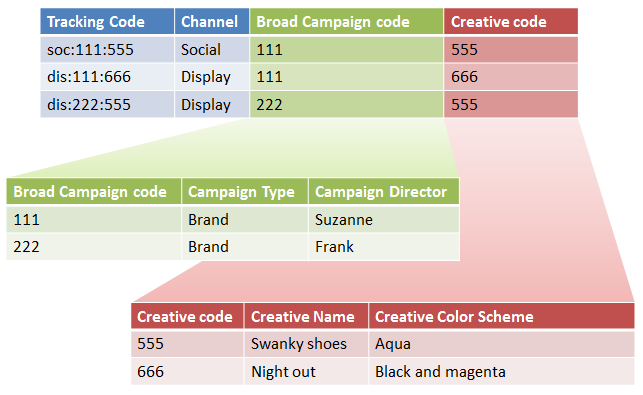

# Classificazioni e Generatore regole - Casi d'uso

Potete combinare il Generatore regole di classificazione con le sottoclassi per semplificare la gestione della classificazione e ridurre il numero di regole richieste. Potrebbe essere utile se il codice di tracciamento è costituito da codici che desiderate classificare separatamente.

## Sub-classifications and the Rule Builder - use case {#concept_6C8672C242544D7487E82886BBFABE6E}

Potete combinare il Generatore regole di classificazione con le sottoclassi per semplificare la gestione della classificazione e ridurre il numero di regole richieste. Potrebbe essere utile se il codice di tracciamento è costituito da codici che desiderate classificare separatamente.

See [Sub-Classifications](../../../components/c-classifications2/c-sub-classifications.md#concept_19EE5513A7DC43C38CC396E96F306CFE) for conceptual information about sub-classifications.

**Esempio**

Presupponi il seguente codice di tracciamento:

`channel:broad_campaign:creative`

A classification hierarchy allows you to apply a classification to a classification (called *`sub-classification`*). Ciò significa che potete usare l'importazione come un database relazionale, con più tabelle. Una tabella mappa i codici di tracciamento completi sulle chiavi e ne mappa un altro in altre tabelle.

After you have this structure in place, you can use the [Classifications Rule Builder](../../../components/c-classifications2/crb/classification-rule-builder.md) to upload small files that only update the lookup tables (the green and red tables in the preceding image). Quindi, potete utilizzare il generatore di regole per mantenere aggiornata la tabella di classificazione principale.

L'attività seguente descrive come eseguire questa operazione.

## Set up Sub-Classifications using the Rule Builder{#task_2D9016D8B4E84DBDAF88555E5369546F}

<!-- 

t_rule_builder_subclass.xml

 -->

Procedura di esempio che descrive come caricare le sottoclassi mediante il Generatore di regole.

>[!NOTE]
>
>These steps describe how to accomplish the use case described in [Sub-Classifications and the Rule Builder](../../../components/c-classifications2/crb/sub-classification-rule-builder.md).

1. Create classifications and sub-classifications in the [Classification Manager](https://marketing.adobe.com/resources/help/en_US/reference/index.html?f=classifications).

   Esempio:

   

1. In the [Classifications Rule Builder](../../../components/c-classifications2/crb/classification-rule-builder.md#concept_C1F219E622044D43852EF5168FF7192A), classify the sub-classification key from the original tracking code.

   Con un'espressione regolare. In this example, the rule to populate *`Broad Campaign code`* would use this regular expression:

   | `#` | Tipo di regola | Corrispondenza | Imposta classificazione | A |
   |---|---|---|---|---|
   |  | Espressione regolare | `[^\:]:([^\:]):([^\:]`) | Codice Campaign Broad | `$1` |
   |  | Espressione regolare | `[^\:]:([^\:]):([^\:]`) | Codice creativo | `$2` |

   >[!NOTE]
   >
   >At this point, you do not populate the sub-classifications *`Campaign Type`* and *`Campaign Director`*.

1. Carica un file di classificazione che includa solo le sottoclassi specificate.

   See [Multiple-Level Classifications](../../../components/c-classifications2/c-sub-classifications.md#concept_35AD906CDDC4441DAAF70664CF76AA0A).

   Esempio:

   | Chiave | Canale | Codice Campaign Broad | Esempio di codice e amp di Campaign; Cappello; Tipo di campagna | Esempio di codice e amp di Campaign; Cappello; Direttore campagna | ... |
   |---|---|---|---|---|---|
   | * |  | 111 | Brand (Marchio) | Suzanne |  |
   | * |  | 222 | Brand (Marchio) | Frank |  |

1. Per mantenere le tabelle di ricerca, caricate un file piccolo (come mostrato sopra).

   You would upload this file, for example, when a new *`Broad Campaign code`* is introduced. Questo file si applica a valori precedentemente classificati. Likewise, if you create a new sub-classification (such as *`Creative Theme`* as a sub-classification of *`Creative code`*), you upload only the sub-classification file, rather than the entire classification file.

   Per generare rapporti tali classificazioni funzionano esattamente come classificazioni di livello principale. Questo riduce il carico di gestione richiesto per utilizzarli.
