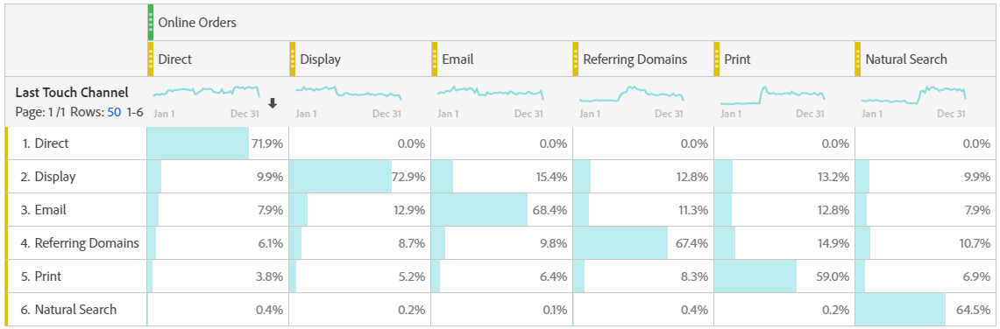

# Analisi dei canali di marketing

>[!NOTE]
>
>Per massimizzare l’efficacia dei canali di marketing per Attribution e Customer Journey Analytics, abbiamo pubblicato alcune [best practice](/help/components/c-marketing-channels/mchannel-best-practices.md).
>
>Gli amministratori di Analytics possono gestire i canali di marketing per le loro organizzazioni come descritto in [Gestire i canali di marketing](/help/admin/admin/c-manage-report-suites/c-edit-report-suites/marketing-channels/c-channels.md).

Probabilmente vorrai sapere quale dei tuoi canali di marketing è più efficace e con chi, in modo da indirizzare meglio i tuoi sforzi e ricevere un miglior ritorno sui tuoi dollari di marketing. In Adobe Analytics, le dimensioni e le metriche dei canali di marketing in Workspace sono uno degli strumenti che possono aiutarti a tenere traccia dell’influenza di diversi canali sui tuoi ordini, ricavi, ecc. e fornirti utili informazioni sul canale. Di seguito sono elencate le dimensioni e le metriche utilizzabili in relazione ai canali di marketing:

| Dimension/Metrica | Definizione |
| --- | --- |
| Canale di marketing | Si tratta della dimensione Canali di marketing consigliata da utilizzare. I modelli di attribuzione possono essere applicati al modello in fase di esecuzione. Questa dimensione si comporta in modo identico alla dimensione Canale ultimo contatto, ma è etichettata in modo diverso per evitare confusione quando viene utilizzata con un modello di attribuzione diverso. |
| Canale ultimo contatto | Dimensione legacy, con modello di attribuzione ultimo contatto pre-applicato e immutabile. |
| Canale di primo contatto | Dimensione legacy, con modello di attribuzione primo contatto pre-applicato e immutabile. |
| Istanze del canale di marketing | Questa metrica misura quante volte un canale di marketing è stato definito in una richiesta di immagine, incluse le visualizzazioni di pagina standard e le chiamate di collegamento personalizzate. Non include valori persistenti. |
| Nuovi engagement | Questa metrica è simile a Istanze, ma viene incrementata solo quando il canale di marketing di primo contatto è definito in una richiesta di immagine. |

## Analisi di base

Questa tabella a forma libera mostra le metriche Ordini in linea, Entrate in linea e Tasso di conversione per ciascuno dei canali di marketing:

Qui puoi vedere gli ordini online e i ricavi online di ciascun canale di marketing in un grafico ad Anello:

Questo grafico a linee mostra le tendenze negli ordini online per vari canali nel tempo:

## Analisi avanzata

Dettagli dei canali di marketing approfondisce ogni canale per mostrarti campagne specifiche, posizionamenti, ecc. Puoi suddividere ogni canale di marketing in dettagli:

## Applicare modelli di attribuzione

È possibile utilizzare [Attribuzione](/help/analyze/analysis-workspace/attribution/overview.md) per applicare istantaneamente diversi modelli di attribuzione:

Nota come la stessa metrica (Ordini in linea) genera risultati diversi quando applichi modelli di attribuzione diversi.

## Analisi di marketing tra schede

Utilizzando il canale di primo contatto e il canale di ultimo contatto legacy, puoi ottenere una visualizzazione utile delle interazioni dei canali:

Scopri di più sull’analisi di marketing cross-tab in questo video: [Utilizzo di analisi tra schede diverse per esplorare le attribuzioni marketing di base in Analysis Workspace](https://experienceleague.adobe.com/docs/analytics-learn/tutorials/analysis-workspace/attribution-iq/using-cross-tab-analysis-to-explore-basic-marketing-attribution-in-analysis-workspace.html?lang=it).
