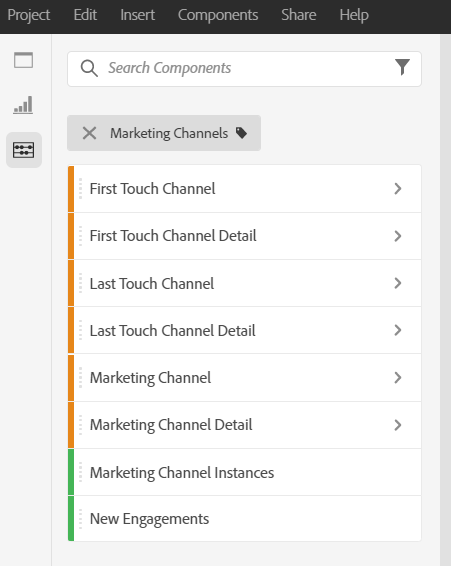

# Analisi dei canali di marketing

>[!NOTE]
>
>Per massimizzare l&#39;efficacia dei canali di marketing per Attribution IQ e Customer Journey Analytics, abbiamo pubblicato alcune [best practice riviste](/help/components/c-marketing-channels/mchannel-best-practices.md).

Probabilmente desideri sapere quale dei tuoi canali di marketing è il più efficace e con chi, in modo da poter indirizzare meglio i tuoi sforzi e ricevere un ritorno migliore sui tuoi dollari di marketing. In Adobe Analytics, le dimensioni e le metriche dei canali di marketing in Workspace sono uno degli strumenti che possono aiutarti a monitorare l’influenza di diversi canali sui tuoi ordini, ricavi, ecc. e ti forniscono informazioni utili sui canali. Di seguito sono elencate le dimensioni e le metriche che puoi utilizzare per i canali di marketing:

| Dimension/metrica | Definizione |
| --- | --- |
| Canale di marketing | Questa è la dimensione di Marketing Channels consigliata da utilizzare. I modelli di Attribution IQ possono essere applicati a esso in fase di esecuzione. Questa dimensione si comporta in modo identico alla dimensione Last Touch Channel, ma viene etichettata in modo diverso per evitare confusione quando viene utilizzata con un modello di attribuzione diverso. |
| Canale ultimo contatto | Dimensione legacy, con modello di attribuzione ultimo contatto preapplicato e immutabile. |
| Canale primo contatto | Dimensione legacy, con modello di attribuzione primo contatto preapplicato e immutabile. |
| Istanze del canale di marketing | Questa metrica misura il numero di volte in cui un canale di marketing è stato definito in una richiesta di immagine, incluse le visualizzazioni di pagina standard e le chiamate di collegamento personalizzate. Non include i valori persistenti. |
| Nuovi engagement | Questa metrica è simile alle istanze, ma viene incrementata solo quando il canale di marketing di primo contatto è definito in una richiesta di immagine. |

## Analisi di base

Questa tabella a forma libera mostra le metriche Ordini online, Entrate online e Tasso di conversione per ciascuno dei canali di marketing:

Qui puoi vedere gli ordini online e i ricavi online di ciascun canale di marketing in un grafico ad anello:

Questo grafico a linee mostra le tendenze in Ordini online per diversi canali nel tempo:

## Analisi avanzata

Dettagli dei canali di marketing Diventa più profondo in ogni canale per mostrarti campagne, posizionamenti, ecc. specifici. Puoi suddividere ciascun canale di marketing in più dettagli:

## Applicare modelli di attribuzione

Puoi utilizzare [Attribution IQ](https://experienceleague.adobe.com/docs/analytics/analyze/analysis-workspace/panels/attribution/use-attribution.html) per applicare istantaneamente diversi modelli di attribuzione:

La stessa metrica (Ordini online) genera risultati diversi quando si applicano modelli di attribuzione diversi.

## Analisi di marketing multi-tab

Utilizzando i canali di primo contatto e ultimo contatto legacy, puoi ottenere una vista utile sulle interazioni dei canali:

Ulteriori informazioni sull’analisi di marketing incrociata in questo video: [Utilizzo di analisi incrociate per esplorare le attribuzioni marketing di base in Analysis Workspace](https://experienceleague.adobe.com/docs/analytics-learn/tutorials/analysis-workspace/attribution-iq/using-cross-tab-analysis-to-explore-basic-marketing-attribution-in-analysis-workspace.html).
