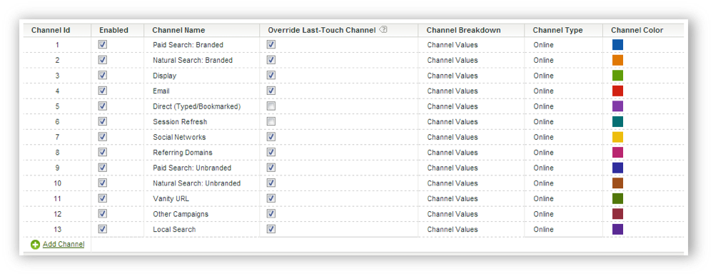

# Gestire i canali di marketing

Aggiungi o abilita canali di marketing in Marketing Channel Manager. Per le suite di rapporti prive di canali di marketing, una configurazione automatica consente di creare diversi canali per voi, insieme alle relative regole. Potete modificare i canali predefiniti in base alle vostre esigenze o crearne di nuovi (fino a un totale di 25).

L&#39;aggiunta di canali alla [!UICONTROL Marketing Channels] pagina viene effettuata indipendentemente dalla creazione di regole nella pagina Regole [di elaborazione dei canali](/help/components/c-marketing-channels/c-rules.md) di marketing. Le regole vengono associate ai canali al momento della creazione della regola.

Di seguito sono riportate alcune linee guida per la creazione di canali:

* Pianificate in anticipo creando un elenco di tutti i canali, in modo che tutti gli hit visitatore siano organizzati per categorie sul canale giusto.
* Includete canali per le categorie di hit [interni](/help/components/c-marketing-channels/c-rules.md) e [diretti](/help/components/c-marketing-channels/c-rules.md) .
* Includete un canale catch-all &quot;Other Campaigns&quot; da inserire dopo i canali pagati e prima dei canali biologici.

## Prerequisiti {#prereqs}

Se necessario, contattate l&#39;Assistenza clienti per assistenza su questi prerequisiti:

* Nella console di amministrazione (Impostazioni account generali), abilita l’opzione **[!UICONTROL Conversion Level]** (e-commerce) per la suite di rapporti.

   Consulta Impostazioni [account](https://docs.adobe.com/content/help/it-IT/analytics/admin/admin-tools/general-acct-settings-admin.html) generali nell&#39;Aiuto di Analytics per ulteriori informazioni.

* Configurate l&#39;accesso alle dimensioni del canale di marketing.

   Consultate Autorizzazioni per i canali [di marketing](/help/components/c-marketing-channels/c-channel-report-access.md).

* Verifica che il tuo account manager sia abilitato **[!UICONTROL Channel Reports]** per la suite di rapporti.

## Aggiunta di canali di marketing {#add-mktg-channels}

Aggiungi canali di marketing in Marketing Channel Manager.

>[!NOTE] Non è possibile eliminare un canale. Se non si desidera utilizzare un canale, è possibile disattivarlo o rinominarlo e mantenerlo per un uso successivo.

1. Fai clic su **[!UICONTROL Analytics]** > **[!UICONTROL Admin]** > **[!UICONTROL Report Suites]**.
1. Sulla [!UICONTROL Report Suite Manager] pagina, seleziona una suite di rapporti.

   Se selezionate più suite di rapporti, selezionate un modello che copia le impostazioni dal modello alle suite di rapporti selezionate.

   See [Apply template report suite settings to multiple report suites](/help/components/c-marketing-channels/c-getting-started-mchannel.md).

1. Fai clic su **[!UICONTROL Edit Settings]** > **[!UICONTROL Marketing Channels]** > **[!UICONTROL Marketing Channel Manager]**.

   Se nella suite di rapporti non sono definiti canali, viene visualizzata la pagina Configurazione  automatica.

1. On the [!UICONTROL Marketing Channel Manager] page, click **[!UICONTROL Add Channel]**.

   Questa opzione non è disponibile quando sono definiti 25 canali.

1. Fai clic su **[!UICONTROL Save.]**
1. Per configurare le regole per il canale, fai clic su **[!UICONTROL Marketing Channel Processing Rules]**.

   See [Create Marketing Channel processing rules](/help/components/c-marketing-channels/c-rules.md).

## Applicare le impostazioni del canale {#mktg-channel-mgr}

È possibile applicare diverse impostazioni a ogni canale della [!UICONTROL Marketing Channel Manager] pagina.

| Campo | Definizione |
|--- |--- |
| Abilitata | Abilita o disabilita questo canale di marketing. |
| Nome canale | Il nome descrittivo del canale di marketing. |
| Ignora ultimo canale di tocco | Consente di scegliere se ignorare un canale esistente persistente con il canale selezionato. Se selezionate questa casella di controllo, qualsiasi canale (inclusi Diretto e Interno) sovrascrive un canale dell’ultimo tocco esistente. Il risultato è che la conversione viene attribuita a un canale che potrebbe non meritare credito. Ad esempio, questa opzione può garantire che il canale Direct non riceva credito per la conversione se l&#39;utente era stato precedentemente acquisito tramite il canale di ricerca naturale. |
| Suddivisione canale | Consente di suddividere un canale in base a questo valore. Puoi aggiungere possibili analisi dettagliate dei canali (canali secondari) durante la creazione di classificazioni dei canali di [marketing](/help/components/c-marketing-channels/classifictions-mchannel.md). |
| Tipo | Specifica in che modo l’utente è arrivato sul sito. Potete selezionare Online o Offline. Utilizza i canali online per i visitatori che passano attraverso un motore di ricerca o una campagna e-mail. I canali offline si applicano ai visitatori che hanno trovato il tuo sito tramite annunci pubblicitari di giornali o riviste. I canali offline in genere includono i dati importati tramite Origini dati di reporting. See [Data Sources](https://docs.adobe.com/content/help/it-IT/analytics/import/data-sources/datasrc-home.html). See [Add Offline Data](/help/components/c-marketing-channels/c-getting-started-mchannel.md). |
| Colore | Solo Reporting e analisi: Colore associato a questo canale di marketing. Questo colore rappresenta il canale nel rapporto Canale di marketing. |

### Escludere le best practice

È consigliabile deselezionare l’opzione Ignora ultimo tocco per i canali Direct e Internal, in modo che non possano ricevere credito da altri canali touch persistenti (o da altri canali reciproci).

## Definizione delle regole del canale

Prima che i canali e i dati dei canali possano essere visualizzati nel rapporto, crea i canali e le regole sottostanti che elaborano i dati. Potete anche specificare per quanto tempo deve durare il periodo [di coinvolgimento del](/help/components/c-marketing-channels/visitor-engagement.md) visitatore.

Adobe fornisce diversi canali predefiniti durante una configurazione  automatica che potete modificare in base alle vostre esigenze. Inoltre, potete modificare questa configurazione e definire regole personalizzate all&#39;interno delle regole [di elaborazione del canale](/help/components/c-marketing-channels/c-rules.md)Marketing.

>[!NOTE]
>
>Adobe consiglia di impostare il rapporto in una suite di rapporti da utilizzare come modello a scopo di test. Potete utilizzare il modello per applicare canali e set di regole a livello globale a una o più suite di rapporti di produzione.
>
>See [Apply Template Report Suite Settings to Multiple Report Suites](/help/components/c-marketing-channels/c-getting-started-mchannel.md).

