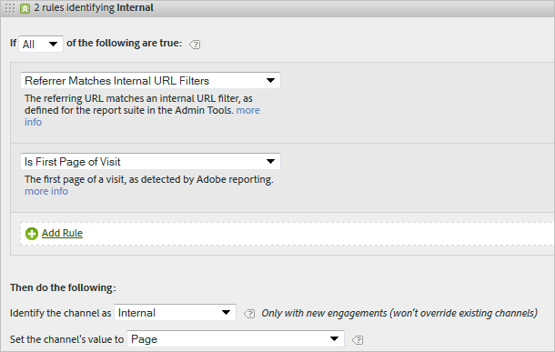

# Domande frequenti ed esempi

Leggi le best practice ed esempi di come comporre varie regole da configurare per i tuoi canali di marketing.

* [Domande frequenti](../../components/c-marketing-channels/c-faq.md#section_E490CEAF0E76422C91D34D8A80A0C573)
* [Nessun canale identificato](../../components/c-marketing-channels/c-faq.md#section_451E42994DA247A8A7B8559C715A5EE7)
* [Ricerca pagata](../../components/c-marketing-channels/c-faq.md#section_E934BFE182E4404A93FE07AFEAE64DC1)
* [Ricerca naturale](../../components/c-marketing-channels/c-faq.md#section_A4C6B8F0360449BE94F0128FF7C71386)
* [Filiali](../../components/c-marketing-channels/c-faq.md#section_8D142C7074CD4DEC87DF55B691107622)
* [Social Network](../../components/c-marketing-channels/c-faq.md#section_492B72A3B261479D9C84F631E90C03D8)
* [Visualizzazione](../../components/c-marketing-channels/c-faq.md#section_4FD846B89FCE4ECFB7781BD02874A1AB)
* [Interno](../../components/c-marketing-channels/c-faq.md#section_179A2BE5C8E24719A9E5C0DC09AF0947)
* [E-mail](../../components/c-marketing-channels/c-faq.md#section_4A927BE947B748E39595F4525B7280DE)
* [Diretto](../../components/c-marketing-channels/c-faq.md#section_D0A1DD9D5EEF4A05A1CC81F9EADC074A)

See [Create Marketing Channel Processing Rules](../../components/c-marketing-channels/t-rules.md#task_84EDE9F46F404CB9B7CA0537328CEE08) for definitions of fields displayed on the [!UICONTROL Marketing Channel Processing Rules] page.

## Domande frequenti {#section_E490CEAF0E76422C91D34D8A80A0C573}

Ogni implementazione delle regole di elaborazione dei canali di marketing può variare a seconda dei codici di tracciamento. La configurazione delle regole che forniscono risultati da ricercare può richiedere alcuni elementi creativi per risolvere i problemi.

**Domanda**: I miei codici di tracciamento non seguono un pattern e ne ho migliaia da specificare per il canale Affiliati.

* Utilizzate il processo di eliminazione. Se i canali E-mail e Affiliati usano lo stesso parametro di stringa query, ma disponete solo di alcuni codici di tracciamento e-mail, potete specificare i codici di tracciamento e-mail in un set di regole che definisce e-mail. Then, you classify all other tracking codes with *`affiliates.`*
* In your email system, add a query string parameter to all landing page URLs, such as *`&ch=eml`*. Create a rule set detecting whether the ch query parameter equals *`eml`*. If it does not contain *`eml`*, then it is an affiliate.

**Domanda**: I domini di riferimento contengono più dati di quanto si aspetteranno.

* I domini di riferimento potrebbero essere troppo elevati nell'elenco delle regole di elaborazione. Deve essere uno degli ultimi set di regole, perché l'ordine di elaborazione è importante.

**Domanda**: Ho creato una regola che corrisponde a un parametro della stringa query e non funziona.

* Verificate che il nome del parametro sia specificato nei campi dei parametri delle stringhe query (in genere un valore alfanumerico). Inoltre, accertatevi che il valore del parametro sia specificato dopo l'operatore, come mostrato nell'esempio seguente di una regola e-mail.

   

**Domanda**: Perché tutto il mio traffico ultimo tocco viene attribuito a un dominio interno?

* Hai una regola che corrisponde al traffico interno. Tieni presente che queste regole vengono elaborate per ogni hit eseguito da un visitatore sul sito, non solo la prima visita. If you have a rule like *`Page URL exists`* without other criteria, that channel is matched on each successive hit on your site, because a page URL always exists.

**Domanda**: Come si visualizza il traffico di traffico in nessun canale identificato nel report?

* Regole in ordine. Se non sono associati criteri specifici, gli hit rientrano in una delle tre categorie seguenti:

1. Nessun referente (visita diretta).

2. Referente interno, nella prima pagina di una visita.

3. Un problema di elaborazione sulla pagina.

Assicuratevi di disporre di un canale per queste tre possibilità. Ad esempio, create regole che dicono:

1. **[!UICONTROL Referrer]** e **[!UICONTROL Does Not Exist]****[!UICONTROL Is First Page of Visit]**. (See [Direct](../../components/c-marketing-channels/c-faq.md#section_D0A1DD9D5EEF4A05A1CC81F9EADC074A).)

2. **[!UICONTROL Referrer Matches Internal URL Filters]** e **[!UICONTROL Is First page of Visit]**. (See [Internal](../../components/c-marketing-channels/c-faq.md#section_179A2BE5C8E24719A9E5C0DC09AF0947).)

3. **[!UICONTROL Referrer]** e **[!UICONTROL Exists]****[!UICONTROL Referrer Does Not Match Internal URL Filters]**.

Lastly, create an *Other* channel that captures the remaining hits, as described in [No Channel Identified](../../components/c-marketing-channels/c-faq.md#section_451E42994DA247A8A7B8559C715A5EE7).

## No Channel Identified {#section_451E42994DA247A8A7B8559C715A5EE7}

When your rules do not capture data, or if rules are not configured correctly, the report displays the data in the [!UICONTROL No Channel Identified] row on the report. You can create a rule set called *Other*, for example, at the end of your processing order, that also identifies internal traffic.

This kind of rule serves as a catch-all to ensure that channel traffic always matches external traffic, and typically does not end up in **[!UICONTROL No Channel Identified]**. Attenzione a non creare una regola che identifichi anche il traffico interno. Setting the channel's value to **[!UICONTROL Referring Domain]** or to **[!UICONTROL Page URL]** are the most common, useful ways to create an effective Other rule.

>[!NOTE]
>
>Potrebbe esserci ancora un traffico di canali che può rientrare nella categoria No Channel Identificato. Ad esempio: Un visitatore accede al sito e segnalibri una pagina e, nella stessa visita, restituisce la pagina tramite il segnalibro. Poiché questa non è la prima pagina della visita, non passa né nel canale Diretto né nell'altro canale perché non esiste alcun dominio di riferimento.

## Ricerca pagata {#section_E934BFE182E4404A93FE07AFEAE64DC1}

Una ricerca a pagamento è una parola o una frase a cui si paga un motore di ricerca per la posizione nei risultati della ricerca. To match paid search detection rules, the marketing channel uses settings configured on the [!UICONTROL Paid Search Detection] page. ( **[!UICONTROL Admin]** &gt; **[!UICONTROL Report Suites]** &gt; **[!UICONTROL Edit Settings]** &gt; **[!UICONTROL General]** &gt; **[!UICONTROL Paid Search Detection]**). L'URL di destinazione corrisponde alla regola esistente di rilevamento della ricerca a pagamento per quel motore di ricerca.

For the marketing channel rule, the [!UICONTROL Paid Search] settings are as follows:

See [Paid Search Detection](https://marketing.adobe.com/resources/help/en_US/reference/index.html?f=paid_search_detection) in Admin for more information.

## Ricerca naturale {#section_A4C6B8F0360449BE94F0128FF7C71386}

Una ricerca naturale si verifica quando i visitatori trovano il sito Web tramite una ricerca Web, in cui il motore di ricerca ha classificato il sito senza dover pagare per l'elenco. Potete controllare l'URL di destinazione utilizzato dal motore di ricerca per collegarvi al sito. Questo URL consente ad Analytics di identificare se una ricerca è naturale.

In Analytics non è presente alcun rilevamento naturale delle ricerche. Dopo aver configurato il rilevamento delle ricerche pagate, il sistema sa che se un referente di ricerca non è un referente di ricerca a pagamento, deve essere un referente di ricerca naturale. Per una ricerca naturale, l'URL di destinazione non corrisponde alla regola esistente di rilevamento della ricerca a pagamento per quel motore di ricerca.

Per la regola canale di marketing, le impostazioni Ricerca naturale sono le seguenti:

See [Paid Search Detection](https://marketing.adobe.com/resources/help/en_US/reference/index.html?f=paid_search_detection) in the Admin for more information.

## Affiliates {#section_8D142C7074CD4DEC87DF55B691107622}

Una regola affiliata identifica i visitatori originati da un set specificato di domini di provenienza. Nella regola, elencate i domini delle filiali che desiderate tracciare, come segue:

## Social Network {#section_492B72A3B261479D9C84F631E90C03D8}

Questa regola identifica i visitatori provenienti da un social network, come Facebook *. Le impostazioni possono essere le seguenti:

## Visualizzazione {#section_4FD846B89FCE4ECFB7781BD02874A1AB}

Questa regola identifica i visitatori provenienti da banner pubblicitari. It is identified by a query string parameter in the destination URL, in this case *`Ad_01`*.

## Internal {#section_179A2BE5C8E24719A9E5C0DC09AF0947}

Questa regola identifica i visitatori che hanno origine con un referente che corrisponde ai filtri URL interni per la suite di rapporti.

## E-mail {#section_4A927BE947B748E39595F4525B7280DE}

Per configurare questa regola, fornite il parametro della stringa query per la campagna e-mail. In this example, the parameter is *`eml`*:

Se la regola contiene codici di tracciamento, immettete un valore per riga, come illustrato:

## Direct {#section_D0A1DD9D5EEF4A05A1CC81F9EADC074A}

Questa regola identifica i visitatori che non hanno dominio di riferimento. Questa regola include i visitatori che arrivano direttamente sul sito, ad esempio da un collegamento Preferiti o incollato nel browser.

