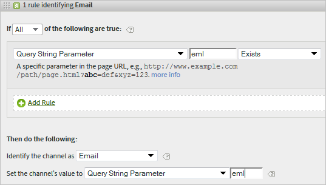

# Domande frequenti sui canali di marketing

>[!NOTE]
>
>Per massimizzare l’efficacia dei canali di marketing per Attribution IQ e Customer Journey Analytics, abbiamo pubblicato alcune [best practice](/help/components/c-marketing-channels/mchannel-best-practices.md).
>
>Gli amministratori di Analytics possono gestire i canali di marketing per le loro organizzazioni come descritto in [Gestire i canali di marketing](/help/admin/admin/c-manage-report-suites/c-edit-report-suites/marketing-channels/c-channels.md).

Domande frequenti per i canali di marketing.

## I miei codici di tracciamento non seguono uno schema e ho migliaia che devono essere specificati per il mio canale Affiliati.

* Utilizzare il processo di eliminazione. Se i canali E-mail e Affiliate utilizzano lo stesso parametro della stringa di query, ma disponi solo di alcuni codici di tracciamento e-mail, puoi specificare i codici di tracciamento e-mail in un set di regole che definiscono l’e-mail. Quindi, classifica tutti gli altri codici di tracciamento con *`affiliates.`*
* Nel sistema e-mail, aggiungi un parametro stringa query a tutti gli URL della pagina di destinazione, ad esempio *`&ch=eml`*. Creare un set di regole che rileva se il parametro di query ch è uguale a *`eml`*. Se non contiene *`eml`*, quindi è un affiliato.

## I domini di riferimento contengono più dati di quanto mi aspetto.

I domini di riferimento potrebbero essere troppo alti nell’elenco delle regole di elaborazione. Deve essere uno degli ultimi (o ultimi) set di regole, perché l’ordine di elaborazione è importante.

## Ho creato una regola che corrisponde a un parametro della stringa di query e non funziona.

Assicurati che il nome del parametro sia specificato nei campi del parametro della stringa di query (in genere un valore alfanumerico). Inoltre, assicurati che il valore del parametro sia specificato dopo l’operatore, come mostrato nel seguente esempio di una regola e-mail.

## Perché tutto il mio traffico di ultimo contatto viene attribuito a un dominio interno?

Hai una regola che corrisponde al traffico interno. Tieni presente che queste regole vengono elaborate per ogni hit effettuato da un visitatore sul tuo sito, non solo per la prima visita. Se disponi di una regola come *`Page URL exists`* senza altri criteri, quel canale viene trovato in corrispondenza di ogni hit successivo sul tuo sito, perché esiste sempre un URL di pagina.

## Come si esegue il debug del traffico visualizzato in Nessun canale identificato sul report?

Le regole vengono elaborate in ordine. Se non è stato trovato nessun criterio corrispondente, gli hit rientrano in una delle tre categorie seguenti:

1. Nessun referente (una visita diretta).

2. Referente interno, sulla prima pagina di una visita.

3. Un glitch di elaborazione sulla pagina.

Assicurati di disporre di un canale per queste tre possibilità. Ad esempio, crea regole che dicono:

1. **[!UICONTROL Referrer]** e **[!UICONTROL Does Not Exist]** e **[!UICONTROL Is First Page of Visit]**. (vedere [Diretto.](/help/components/c-marketing-channels/c-faq.md))

2. **[!UICONTROL Referrer Matches Internal URL Filters]** e **[!UICONTROL Is First page of Visit]**. (vedere [Interno](/help/components/c-marketing-channels/c-faq.md).)

3. **[!UICONTROL Referrer]** e **[!UICONTROL Exists]** e **[!UICONTROL Referrer Does Not Match Internal URL Filters]**.

Infine, crea un’ *Altro* canale che acquisisce gli hit rimanenti, come descritto in [Nessun canale identificato](/help/components/c-marketing-channels/c-faq.md#no-channel-identified).

## Relazione tra primo e ultimo contatto

Per comprendere l’interazione tra le dimensioni legacy di primo e ultimo contatto e confermare che le sostituzioni funzionino come previsto, puoi richiamare un rapporto del canale di primo contatto, correlato a un rapporto del canale di ultimo contatto, con la metrica di successo chiave aggiunta in (vedi l’esempio di seguito). L’esempio illustra l’interazione tra i canali di primo e ultimo contatto.

L’intersezione in cui primo è uguale all’ultimo contatto è la diagonale della tabella. Sia Direct che Session Refresh ricevono il merito dell’ultimo contatto solo se erano anche il canale di primo contatto, perché non possono ottenere credito da altri canali persistenti (righe evidenziate).

## Motivi per cui non è stato identificato alcun canale {#no-channel-identified}

Se le regole non acquisiscono dati o non sono configurate correttamente, i dati vengono visualizzati nel rapporto di [!UICONTROL No Channel Identified] riga sul report. Puoi creare un set di regole denominato *Altro*, ad esempio, alla fine dell’ordine di elaborazione, che identifica anche il traffico interno.

Questo tipo di regola funge da catch-all per garantire che il traffico del canale corrisponda sempre al traffico esterno e in genere non finisca in **[!UICONTROL No Channel Identified]**. Fai attenzione a non creare una regola che identifichi anche il traffico interno. Impostazione del valore del canale su **[!UICONTROL Referring Domain]** o a **[!UICONTROL Page URL]** sono i modi più comuni e utili per creare un&#39;altra regola efficace.

>[!NOTE]
>
>Potrebbe ancora esserci del traffico di canale che può rientrare nella categoria Nessun canale identificato. Ad esempio: un visitatore accede al sito, inserisce nei segnalibri una pagina e, nella stessa visita, ritorna alla pagina tramite il segnalibro. Poiché questa non è la prima pagina della visita, non andrà né nel canale Direct né nell’altro canale perché non esiste un dominio di riferimento.

## Motivi dell’interno (aggiornamento sessione) {#internal}

L’ultimo contatto Interno (aggiornamento sessione) può verificarsi solo se è stato anche il primo contatto. Consulta &quot;Relazione tra primo e ultimo contatto&quot; sopra. Gli scenari riportati di seguito spiegano come l’aggiornamento della sessione potrebbe essere un canale di primo contatto.

* **Timeout della sessione**: un visitatore accede al sito web e lascia la scheda aperta nel browser per utilizzarla in un secondo momento. Il periodo di coinvolgimento del visitatore scade (o il visitatore elimina volontariamente i cookie) e utilizza la scheda aperta per visitare nuovamente il sito web. Poiché l’URL di riferimento è un dominio interno, la visita verrà classificata come Aggiornamento sessione.

* **Non tutte le pagine del sito sono taggate**: un visitatore arriva alla pagina A a cui non sono stati assegnati tag, quindi si sposta alla pagina B a cui sono stati assegnati tag. La pagina A viene visualizzata come referente interno e la visita viene classificata come Aggiornamento sessione.

* **Reindirizzamenti**: se non è configurato un reindirizzamento per trasmettere i dati del referente alla nuova pagina di destinazione, i dati del referente della voce effettiva vengono persi e ora la pagina di reindirizzamento (probabilmente una pagina interna) viene visualizzata come dominio di riferimento. La visita verrà classificata come Aggiornamento sessione.

* **Traffico tra domini**: un visitatore si sposta da un dominio che attiva la Suite A a un secondo dominio che attiva la Suite B. Se nella Suite B i filtri URL interni includono il primo dominio, la visita nella Suite B verrà registrata come Interna, poiché i canali di marketing la vedono come una nuova visita nella seconda suite. La visita verrà classificata come Aggiornamento sessione.

* **Tempi di caricamento lunghi per le pagine di ingresso**: un visitatore arriva sulla pagina A, che è ricca di contenuti, e il codice Adobe Analytics si trova nella parte inferiore della pagina. Prima di caricare tutto il contenuto (inclusa la richiesta di immagine di Adobe Analytics), il visitatore fa clic sulla pagina B. La pagina B genera la richiesta di immagine di Adobe Analytics. Poiché la richiesta di immagine della pagina A non è mai stata caricata, la seconda pagina viene visualizzata come primo hit della visita in Adobe Analytics, con la pagina A come referente. La visita viene classificata come Aggiornamento sessione.

* **Cancellazione dei cookie nel sito intermedio**: un visitatore accede al sito e a metà sessione cancella i suoi cookie. Entrambi i canali Primo e Ultimo contatto venivano reimpostati e la visita veniva classificata come Aggiornamento sessione (perché il referente era interno).

Di seguito è riportato un esempio di canale Interno (aggiornamento sessione) impostato sia come canale di primo contatto che come canale di ultimo contatto:

* Giorno 1: l’utente accede al sito tramite display. I canali di primo e ultimo contatto verranno impostati su Display.
* Giorno 2: l’utente accede al sito tramite ricerca naturale. Il primo contatto rimane visualizzato e Ultimo contatto è impostato su Ricerca naturale.
* Giorno 35: l’utente non accede al sito da 33 giorni e ritorna utilizzando la scheda che aveva aperto nel browser. Supponendo un intervallo di coinvolgimento di 30 giorni, la finestra sarebbe stata chiusa e i cookie del canale di marketing sarebbero scaduti. Il canale di primo e ultimo contatto verrà reimpostato e sarà impostato su Aggiornamento sessione da quando l’utente proviene da un URL interno.

## Perché alcuni canali rimangono invariati dopo aver modificato le regole di elaborazione del canale di marketing?

A volte le regole di elaborazione del canale di marketing non vengono impostate correttamente, rendendo necessaria la modifica delle regole di elaborazione. Dopo aver applicato le modifiche, puoi vedere che alcune metriche attribuiscono ancora i dati a un canale errato. Ci sono diversi fattori da considerare:

* **I dati del canale di marketing vengono raccolti in tempo reale**: i dati del canale di marketing vengono elaborati al momento della raccolta dei dati e sono permanenti al 100%. La modifica delle regole di elaborazione non influisce retroattivamente sui dati.
* **La modifica delle regole di elaborazione non influisce immediatamente sui dati di primo contatto**: ad esempio:
   1. Un utente accede tramite il canale e-mail perché è stato configurato in modo errato e poi lascia il sito.
   2. Il giorno successivo, modifichi la regola di elaborazione e-mail per correggerla.
   3. L’utente torna dopo diversi giorni attraverso la ricerca naturale e fa un acquisto.
   4. Il canale e-mail riceve il credito di Primo contatto e la ricerca naturale riceve il credito di Ultimo contatto.

   Anche diversi giorni dopo aver modificato le regole di elaborazione, i dati possono ancora essere raccolti nel canale di primo contatto errato. I dati di primo contatto vengono raccolti continuamente nel canale errato fino alla scadenza del coinvolgimento di tutti gli utenti.

Il modo migliore per ovviare a tali discrepanze consiste nell’effettuare una o entrambe le seguenti operazioni:

* **Scadenza manuale di tutti i periodi di coinvolgimento dei visitatori**: questa impostazione scade immediatamente tutti i canali di primo e ultimo contatto in tutti i visitatori:
   1. Vai a Strumenti di amministrazione > Suite di rapporti.
   2. Passa il puntatore del mouse su Image Edit Settings > Marketing Channels > Visitor Engagement Expiration (Impostazioni di modifica immagine > Canali di marketing > Scadenza coinvolgimento visitatore)
   3. Fare clic su Scade tutto.
   4. Fare clic su OK per passare alla finestra popup di avviso, riconoscendo che si è in grado di capire l&#39;operazione che verrà eseguita.

* **Visualizzare le metriche Ultimo contatto solo dal momento in cui sono state corrette le regole**: le metriche Ultimo contatto seguono sempre il set di regole corrente. La visualizzazione dell&#39;ora dalla modifica successiva delle regole di elaborazione riflette correttamente le regole di elaborazione più recenti.
