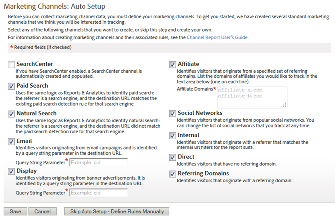

# Introduzione ai canali di marketing

I canali di marketing sono comunemente utilizzati per fornire informazioni dettagliate su come i visitatori arrivano sul sito. Potete personalizzare le regole di elaborazione del canale di marketing in base ai canali da monitorare e alla modalità di tracciamento.

I canali di marketing si basano sulle metriche First e Last Touch, componenti delle metriche di conversione standard.

## Flusso di lavoro Canali di marketing

 Definisci ogni canale in base alle tue esigenze aziendali.

Definire i canali utilizzati è uno dei componenti più importanti di Marketing Channels. La definizione dei canali può richiedere la collaborazione tra più individui all&#39;interno dell&#39;organizzazione. Di seguito sono riportate alcune domande da tenere in considerazione:

* State usando una ricerca a pagamento?
* Stai usando campagne e-mail? Utilizzate più campagne e-mail da monitorare separatamente?
* Hai filiali che dirigono il traffico verso il tuo sito? Esistono affiliati che desideri monitorare individualmente?
* Ci sono campagne esterne che potrebbero essere vantaggiose nel tracciamento separatamente?
* Volete aggregare tutti i siti di social networking, oppure volete tenerne traccia individualmente?
* Esistono altri canali che potrebbero influenzare la conversione da monitorare?

Un elenco dei canali consigliati si trova in Domande [frequenti ed esempi](/help/components/c-marketing-channels/c-faq.md). Create un elenco di canali da usare, in modo da facilitarne l’attivazione e la definizione al momento della creazione dei canali.

 Aggiungi canali di marketing sulla [!UICONTROL Marketing Channel Manager] pagina.

Dopo aver definito i canali da tracciare, li attivate in **[!UICONTROL Admin]** > **[!UICONTROL Report Suites]**.

Consulta [Canali e regole](/help/components/c-marketing-channels/c-channels.md) per informazioni importanti su prerequisiti e concetti.

Consulta [Aggiunta di canali](/help/components/c-marketing-channels/c-channels.md) di marketing per la procedura.

>[!NOTE]
>
>Se Marketing Channels (Canali di marketing) non è stato configurato in precedenza, viene visualizzata la configurazione  automatica. Questa configurazione fornisce diversi canali preconfigurati che potete personalizzare. Adobe consiglia di utilizzare queste regole come modello. Tuttavia, se disponete già di definizioni per i canali solidi, potete saltare la configurazione automatica.

 Configura o perfeziona le regole di ogni canale sulla [!UICONTROL Marketing Channel Processing Rules] pagina.

Dopo aver creato i canali sulla [!UICONTROL Marketing Channel Manager] pagina, puoi configurare le regole in modo che i canali possano recuperare e segnalare i dati.

Consultate Regole [di elaborazione del canale](/help/components/c-marketing-channels/c-rules.md)di marketing.

Se i canali sono stati creati nella configurazione automatica, le regole in tali canali sono definite. Potete modificarle in base alle vostre esigenze.

## Configurazione automatica per canali di marketing {#run-auto-setup}

Il rapporto Canale di marketing viene fornito con una pagina di configurazione una tantum per iniziare. Offre diversi canali di marketing da utilizzare per il tracciamento. Potete saltare questa configurazione se vi sentite a vostro agio nel creare canali e regole. Tuttavia, Adobe consiglia di consentire la creazione guidata dei canali. La configurazione automatica consente di vedere come vengono costruite le regole o di modificarle per i propri scopi. Potete disattivare o eliminare i canali predefiniti in qualsiasi momento.

Come eseguire la configurazione automatica di Marketing Channels.

1. Fai clic su **[!UICONTROL Analytics]** > **[!UICONTROL Admin]** > **[!UICONTROL Report Suites]**.
1. In [!UICONTROL Report Suite Manager], seleziona una suite di rapporti.
1. Fai clic su **[!UICONTROL Edit Settings]** > **[!UICONTROL Marketing Channels]** > **[!UICONTROL Marketing Channel Manager]**.

   

   >[!NOTE]
   >
   >La [!UICONTROL Marketing Channels: Auto Setup] pagina viene visualizzata automaticamente quando accedi alle applicazioni di configurazione del canale in Strumenti di amministrazione. (Vedete [Marketing Channel Manager](/help/components/c-marketing-channels/c-channels.md).) Questa pagina non viene visualizzata se la suite di rapporti contiene uno o più canali di marketing. Non puoi accedere di nuovo a questa pagina a meno che non selezioni un&#39;altra suite di rapporti che non contenga canali di marketing.

1. Accertatevi che i canali che desiderate creare siano selezionati.

   Quando è selezionata questa opzione, **[!UICONTROL Email]**, **[!UICONTROL Display]** e **[!UICONTROL Affiliate]** sono campi obbligatori.

1. Fai clic su **[!UICONTROL Save]**.

## Applicazione delle impostazioni suite di rapporti per più suite di rapporti

Come utilizzare una suite di rapporti principale come modello per testare la configurazione del canale di marketing. Per risparmiare tempo, potete applicare questo modello a una o più suite di rapporti di produzione in un aggiornamento di massa. Questa operazione viene eseguita separatamente per i canali e i set di regole.

>[!NOTE]
>
>Applicate i canali da un modello prima di applicare i set di regole. Durante l&#39;esecuzione di questa procedura, i canali devono essere identici in tutte le suite di rapporti.

1. Verifica che il rapporto Canale di marketing sia abilitato per le suite di rapporti selezionate. Questo passaggio viene eseguito dal tuo Account Manager.
1. Fai clic su **[!UICONTROL Analytics]** > **[!UICONTROL Admin]** > **[!UICONTROL Report Suites]**.
1. Sulla **[!UICONTROL Report Suite Manager]** pagina, seleziona la suite di rapporti modello, così come una o più suite di rapporti di destinazione.
1. Fai clic su **[!UICONTROL Edit Settings]** > **[!UICONTROL Marketing Channels]** > **[!UICONTROL Marketing Channel Manager]**.
1. Sulla **[!UICONTROL Select Master Report Suites]** pagina, seleziona una suite di rapporti di modello.
1. Fai clic su **[!UICONTROL Save All]**.
1. Applica regole da un modello a più suite di rapporti:
   1. Tornate alla [!UICONTROL Report Suite Manager] pagina.
   1. Seleziona la suite di rapporti modello, così come una o più suite di rapporti di destinazione.
   1. Fai clic su **[!UICONTROL Edit Settings]** > **[!UICONTROL Marketing Channels]** > **[!UICONTROL Marketing Channel Processing Rules]**.
   1. Fai clic su **[!UICONTROL Save]**. Se in questo passaggio il pulsante Salva è disattivato, attivarlo espandendo una delle regole.

