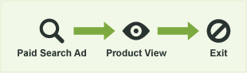
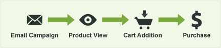
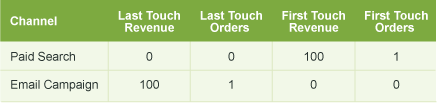
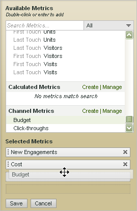

# Metriche utilizzate nei rapporti sul canale di marketing

Come utilizzare le metriche nei report Canale di marketing.

## Metrics used in Marketing Channel reports {#topic_F83F5D4C3E144967AD90D956F0E8A999}

Come utilizzare le metriche nei report Canale di marketing.

Aggiungi (o modifica) le metriche.

Aggiungete una colonna al rapporto.

## First and last-touch metrics {#concept_68D9A50204304BA58C1F8013451E7853}

Il primo tocco e l'ultimo tocco sono attributi canale che consentono di vedere il numero di nuovi coinvolgi (o dati di metrica come visualizzazioni del prodotto, ricavi e ordini) risultanti dall'attività di un visitatore nel canale.

When a success event occurs, Analytics looks at the entire visitor's activity and history (back to the [visitor's engagement expiration](../../components/c-marketing-channels/visitor-engagement.md#topic_32ADFDB12D3A4F35843A4545AC97C49F)). Prende nota del primo canale attraverso il quale è entrato l'utente e del canale più recente. Quindi dà credito all'evento success a ogni canale appropriato.

<!-- 

<note>
  A first-touch value has a rolling expiration based on the frequency of a visitor returning to the site. This first-touch expiration resets whenever a visitor returns to the site. This effects reporting by causing first-touch values to persist longer than you might expect. For example, this can occur if an instance of an first-touch channel was created a year ago. Remove the values on the eVar in the admin console to reset. 
</note>

 -->

**Esempio**

Supponiamo di configurare due canali di marketing: Search Search, e Campaign Campaign.

Paid Search è un annuncio per un prodotto. Rileva l'interesse di un visitatore e genera una visualizzazione di prodotto, ma non genera un evento di conversione.

Un mese dopo viene eseguita una campagna e-mail per lo stesso prodotto. Si ottiene un acquisto di $ 100 (o un altro evento di conversione desiderato).

Nel rapporto Canale di marketing, il risultato può essere visualizzato come segue:

Il canale di ricerca a pagamento viene accreditato per $ 100 come canale di primo tocco per le entrate, con un primo ordine di tocco del 1. Il canale della campagna e-mail viene accreditato per $ 100 come canale dell'ultimo ricavo (il canale che l'utente ha toccato prima dell'evento di conversione) e con l'ultimo 1 ordine di tocco. In altre parole, uno scopo principale del report è vedere come la suddivisione delle entrate tra i primi canali touch si differenzia dall'analisi delle entrate tra gli ultimi canali touch.

Ogni istanza evento di successo avrà esattamente un canale First Touch e esattamente un ultimo canale di tocco. Ciò significa che se aggiungete una particolare colonna di metrica per qualsiasi evento di successo, questo sarà sempre uguale al totale per lo stesso periodo di tempo. This total will also exactly equal the total number of events in the appropriate [!UICONTROL Site Metrics] &gt; [!UICONTROL Custom Events] report. Le metriche degli eventi non di successo, come visite e visitatori, non corrisponderanno a 1 a 1, poiché più canali possono attivarsi nella stessa visita.

>[!NOTE]
>
>Questo rapporto utilizza la versione first-touch o last-touch di ciascuna metrica. Thus, the data shown in a [!UICONTROL Marketing Channel] report might not match the data shown in other reports.

## Metric definitions {#section_364D003D34D748B79503DFA4DD208EDB}

| Metrica | Definizione |
|--- |--- |
| Canale first-touch | Il primo canale di marketing per coinvolgere un visitatore. Tecnicamente, il primo canale di tocco è una evar con allocazione originale. |
| Visitatore first-touch | Nel reporting dei canali, un visitatore first-touch è un visitatore giornaliero univoco originato da un canale. Il coinvolgimento del visitatore viene memorizzato per tutta la durata del periodo di partecipazione con il sito, che può quindi durare più visite. |
| Canale ultimo tocco | Il canale di conversione, ovvero l'ultimo canale di marketing per coinvolgere il visitatore e dare luogo a una conversione. Un solo canale è impostato come primo canale di tocco. L'ultimo canale di tocco può cambiare con ogni visita al sito. Ogni visita ha un canale first-touch e ultimo tocco, ma il valore del canale first-touch non cambia mai con le visite successive. |

## Click-through {#reference_55E2254F02EF4E7EB0AD2838C948347A}

Un click-through è un'istanza sull'ultimo canale di tocco. È una evar con l'allocazione più recente.

Ad esempio, supponiamo che un visitatore arrivi al tuo sito Web una volta al giorno, con ogni visita proveniente da un canale di marketing diverso:

* Giorno 1: Ricerca pagata
* Giorno 2: Visualizza
* Giorno 3: Ricerca naturale
* Giorno 4: Visualizza
* Giorno 5: Ricerca pagata
* Giorno 6: Visualizza
* Giorno 7: Ricerca naturale

Il report First-Touch Channel (Canale di primo contatto) mostrava il 1 nuovo coinvolgimento per la ricerca pagata. Ogni altro canale mostrerebbe 0 nuovi coinvolgimenti. Il report Last-Touch Channel (Canale ultimo contatto) mostrava 2 click-through per ricerche a pagamento; 3 per Visualizzazione; e 2 per Ricerca naturale.

## Add metrics to a Marketing Channel report {#task_D381139E00504666AB2402D553CFEA5B}

Aggiungi metriche al report Canale di marketing. Puoi aggiungere fino a quattro metriche a ogni colonna del rapporto e tutte le colonne desiderate.

1. Open the [!UICONTROL Marketing Channel Report].
1. Fate clic su Aggiungi metriche.

   

1. Under [!UICONTROL Available Metrics], drag-and-drop metrics from the [!UICONTROL Available Metrics] section to the [!UICONTROL Selected Metrics] section.

   

1. To create calculated metrics, scroll to [!UICONTROL Calculated Metrics], then click **[!UICONTROL Create]**.
1. Fai clic su **[!UICONTROL Save.]**
