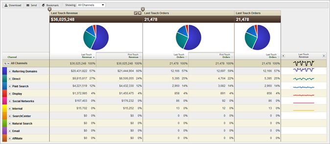

# Informazioni sui rapporti sul canale di marketing

La generazione di rapporti sul canale di marketing ti permette di sapere quante entrate generano i tuoi canali di marketing. Questi rapporti includono un rapporto panoramica della prima allocazione del canale e dell'ultimo contatto, con metriche standard come entrate, ordini e costi.

Configura le regole di definizione del canale in Strumenti di amministrazione. Le API specifiche per i rapporti sui canali sono disponibili. No external implementation changes are necessary to run the [!UICONTROL Marketing Channel] report.

* [Report esempio](../../components/c-marketing-channels/c-overview.md#section_64F7FB1326A64B318654BAFE66FA97EC)
* [Report disponibili](../../components/c-marketing-channels/c-overview.md#section_8A95A56AE24E4F34BBA069361D6354B9)

## Example Report {#section_64F7FB1326A64B318654BAFE66FA97EC}

I dati sui canali sono supportati nelle dashboard, nelle API, nei Generatore di report (per Excel), nell'analisi ad hoc, nei data warehouse e nell'estrazione dati.

Aggiungi (o modifica) le metriche.

Aggiungete una colonna al rapporto.

## Available Reports {#section_8A95A56AE24E4F34BBA069361D6354B9}

The following [!UICONTROL Marketing Channel] reports are available in the Experience Cloud.

| Report  | Descrizione |
|--- |--- |
| Panoramica canale | Il rapporto Panoramica è un rapporto di riepilogo che mostra grafici a torta e grafici che rappresentano tendenze nel periodo di tempo selezionato. Puoi aggiungere metriche prima e ultimo tocco oppure creare metriche calcolate per questo rapporto. Puoi anche analizzare il primo e l'ultimo canale di contatto e dettagli dalla tabella panoramica. Altri rapporti sul canale di marketing consentono di approfondire i dati riepilogati in questo rapporto. Quando espandi un canale nel rapporto, puoi vedere la generazione di rapporti dettagliati per i valori del canale. I valori dei canali sono valori non classificati nel dettaglio del canale. |
| Primo o Ultimo canale tocco | Visualizza metriche che mostrano dati su un canale first-touch o last-touch. In questi rapporti, puoi suddividere un canale e mostrare i dettagli di ogni canale. |
| Primo o ultimo dettaglio canale | Visualizza dettagli quali nomi di pagina e referenti, che sono ricavati dai valori dei canali impostati in Set the channel's value to option when configuring rules. I rapporti sui dettagli dei canali ti permettono di esaminare attentamente i valori dei dettagli del canale dal rapporto Panoramica. |