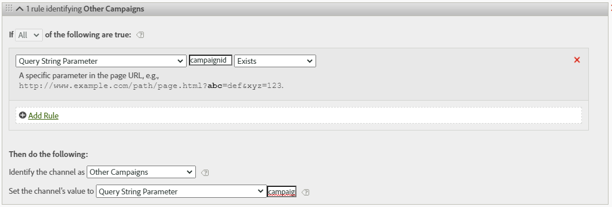
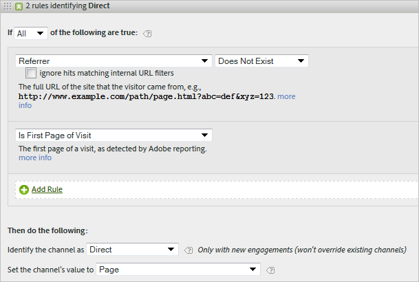

# Regole di elaborazione per i canali di marketing

>[!NOTE]
>
>Per massimizzare l&#39;efficacia dei canali di marketing per Attribution IQ e Customer Journey Analytics, abbiamo pubblicato alcune [best practice riviste](/help/components/c-marketing-channels/mchannel-best-practices.md).

Le regole di elaborazione del canale di marketing determinano se un hit visitatore soddisfa i criteri assegnati a un canale elaborando ogni hit che un visitatore effettua sul sito. Le regole vengono elaborate nell&#39;ordine specificato e quando viene soddisfatta una regola, il sistema smette di elaborare le regole rimanenti.

Note aggiuntive sull’elaborazione :

* I dati raccolti con queste regole sono permanenti al 100% e le regole modificate dopo la raccolta dei dati non sono retroattive. È consigliabile esaminare e considerare tutte le circostanze prima di salvare [!UICONTROL Marketing Channel Processing Rules] per attenuare la raccolta dei dati in canali non corretti.
* Il rapporto può elaborare fino a 25 canali alla volta.
* Le regole possono accedere alle variabili impostate da VISTA, ma non ai dati eliminati da VISTA.
* Due canali di marketing non ricevono mai crediti per lo stesso evento (come acquisti o clic). In questo modo, i canali di marketing sono diversi dagli eVar (dove due eVar potrebbero ricevere credito per lo stesso evento).
* Se esiste una copertura gap delle tue regole, potresti vedere [Nessun canale identificato.](/help/components/c-marketing-channels/c-faq.md)

## Prerequisiti

* Rivedi le informazioni concettuali in [Guida introduttiva ai canali di marketing](/help/components/c-marketing-channels/c-getting-started-mchannel.md).
* Crea uno o più canali in modo da poter assegnare loro le regole. Consulta [Aggiungere canali di marketing.](/help/components/c-marketing-channels/c-channels.md)
* Controlla le best practice per l’utilizzo di [!UICONTROL Marketing Channels] con [!UICONTROL Attribution IQ].

## Creare regole di elaborazione per il canale di marketing

Creare regole di elaborazione per il canale di marketing, che determinano se un hit visitatore soddisfa i criteri assegnati a un canale.

1. Fai clic su **[!UICONTROL Analytics]** > **[!UICONTROL Admin]** > **[!UICONTROL Report Suites]**.
2. Seleziona una suite di rapporti.

   Se nella suite di rapporti non sono definiti canali, viene visualizzata la pagina [!UICONTROL Marketing Channels: Auto Setup] .

   Vedere [Eseguire l&#39;impostazione automatica](/help/components/c-marketing-channels/c-getting-started-mchannel.md).

3. Fai clic su **[!UICONTROL Edit Settings]** > **[!UICONTROL Marketing Channels]** > **[!UICONTROL Marketing Channel Processing Rules]**. Se hai eseguito la configurazione automatica, un set di canali e regole sono stati automaticamente definiti per te.

   

4. Per aggiungere una nuova regola, seleziona dal menu **[!UICONTROL Add New Rule Set]** . Se selezioni un canale, ti viene dato un modello di regola e se selezioni Personalizzato, inizi da una tabula rasa. Entrambe le opzioni consentono di modificare il set di regole in base alle esigenze.

   

5. Per continuare a creare le regole, fai clic su **[!UICONTROL Add New Rule SetRule]**.
6. Per assegnare le priorità alle regole, trascinale nella posizione desiderata.
7. Fai clic su **[!UICONTROL Save.]**

Continua in basso in questa pagina per visualizzare i consigli per l’ordine delle regole del canale e ulteriori esempi di definizione.

### Imposta il valore del canale di marketing

**[!UICONTROL Set the channel's value]** definisce la dimensione di dettaglio del canale di marketing disponibile per quel canale. Questo consente di suddividere le dimensioni del canale di marketing e di visualizzare informazioni più dettagliate sul canale.

Si consiglia di impostare il valore del canale sugli stessi criteri utilizzati per definire il canale stesso. Ad esempio, se per definire il canale viene utilizzato il parametro della stringa di query, impostare anche il parametro della stringa di query come valore del canale.

### Criteri di regola

Questa tabella di riferimento definisce i campi, le opzioni e gli attributi hit che puoi utilizzare per definire le regole di elaborazione del canale di marketing.

>[!NOTE]
>
>Tutti i campi di testo definiti, ad esempio il parametro della stringa di query o gli elenchi di valori a cui confrontarsi, vengono valutati come valori **senza distinzione tra maiuscole e minuscole**. Ad esempio, se disponi di una regola in cui il parametro della stringa query cmp = abc123, tutte le versioni di &#39;cmp&#39; e &#39;abc123&#39; corrisponderanno alla regola. Non è necessario elencare più versioni maiuscole/minuscole di questi valori.

| Termine | Definizione |
|--- |--- |
| Tutto | Attiva questo canale solo quando tutte le regole della regola numerata sono vere. |
| Any | Attiva questo canale quando una delle regole del set di regole è vera. Questa opzione è disponibile solo se sono presenti più regole nella regola numerata. |
| ID AMO | Il codice di tracciamento principale utilizzato dalle integrazioni Advertising Cloud e Advertising Analytics. Quando una di queste integrazioni è abilitata, il prefisso del codice di tracciamento può essere utilizzato per identificare canali specifici di Advertising Cloud. L’utilizzo di &quot;AMO ID&quot; inizia con &quot;AL&quot; per la ricerca, &quot;AC&quot; per la visualizzazione o &quot;AO&quot; per Social. Quando l’AMO ID viene utilizzato nei canali di marketing, le metriche clic/costo/impression possono essere attribuite al canale corretto (se non sono configurate, queste metriche andranno a Direct o None). |
| ID ID AMO ED | Il codice di tracciamento secondario utilizzato da Advertising Cloud. Lo scopo principale di questo codice di tracciamento è quello di fungere da chiave per l’invio di dati ad Ad Cloud. Tuttavia, può essere utilizzato anche per identificare la visualizzazione ClickThroughs rispetto a ViewThroughs se desideri visualizzarli come due canali di marketing separati. Per farlo, imposta la logica del canale di marketing per &quot;AMO EF ID&quot; termina con &quot;:d&quot; per Display ClickThrough o &quot;AMO EF ID&quot; termina con &quot;:i&quot; per Display ViewThroughs. Se non desideri dividere la visualizzazione in due canali, utilizza invece la dimensione AMO ID. |
| Variabili di conversione | È costituito da eVar abilitate per questa suite di rapporti e si applica solo quando queste variabili sono impostate tramite il codice di Adobe sulla pagina.  Consulta la Guida all’implementazione . |
| Esiste | Sono disponibili diverse selezioni, tra cui:<ul><li>**Non esiste**: Specifica che l&#39;attributo hit non esiste nella richiesta. Ad esempio, in un dominio di riferimento, se l’utente digita un URL o fa clic su un segnalibro, l’attributo di dominio di riferimento non esiste.</li><li>**È Vuoto**: Specifica che esiste un attributo hit, in genere un parametro di stringa di eVar o di query, ma non è presente alcun valore associato all&#39;attributo hit.</li><li>**Non contiene**: Consente di specificare, ad esempio, che un dominio di riferimento non contiene un valore specifico (anziché utilizzare la selezione &quot;Contains&quot;).</li></ul> |
| Identifica il canale come | Associa la regola a un canale di marketing aggiunto alla pagina Marketing Channel Manager .  Consulta Aggiungere canali di marketing . |
| Corrisponde alle regole di rilevamento della ricerca a pagamento | Ricerca a pagamento rilevata dall&#39;Adobe. Le ricerche pagate sono quando le aziende pagano una tassa per il motore di ricerca per elencare il loro sito. Le ricerche pagate vengono generalmente visualizzate nella parte superiore o destra dei risultati della ricerca. |
| Corrisponde alle regole di rilevamento della ricerca naturale | Ricerca non a pagamento rilevata dal reporting di Adobe. |
| Il referente corrisponde ai filtri URL interni | Una visita il cui URL della pagina corrisponde a un filtro URL interno, come definito per la suite di rapporti in Strumenti di amministrazione. |
| Il referente non corrisponde ai filtri URL interni | L’URL di riferimento non corrisponde a un filtro URL interno, come definito per la suite di rapporti in Strumenti di amministrazione. Puoi utilizzare questa impostazione con URL pagina ed Esiste per impostare una regola catch-all in modo che nessuna visita arrivi nella sezione Nessun canale identificato del rapporto. |
| Ignora gli hit che corrispondono ai filtri URL interni | (Per i referrer) Tiene traccia solo degli hit provenienti da siti esterni a cui si fa riferimento. In genere, lascia attivata questa impostazione a meno che non si desideri includere il traffico interno. |
| È la prima pagina della visita | La prima pagina di una visita rilevata dal reporting di Adobe. |
| Pagina | Il nome della pagina di una pagina web del sito a cui vengono assegnati i tag utilizzando il beacon web di Adobe. Questo valore equivale a s.pageName . Gli esempi includono `Home Page` e `About Us`. |
| Dominio pagina | Dominio della pagina in cui il visitatore arriva, ad esempio `products.example.co.uk`. |
| Dominio pagina e percorso | Il dominio e il percorso, ad esempio `products.example.co.uk/mens/pants/overview.html` . |
| Dominio principale pagina (TLD+1) | Il dominio principale della pagina in cui il visitatore arriva, ad esempio example.co.uk . |
| URL della pagina | URL di una pagina web sul sito. |
| Dominio di riferimento | Il dominio di origine dei visitatori prima che visitino il sito, ad esempio, i referrer provenienti da `abcsite.com` rispetto a `xyzsite.com`. |
| Query String Parameter | Se l’URL di una pagina sul sito assomiglia a `https://example.com/?page=12345&cat=1`, allora &quot;page&quot; e &quot;cat&quot; sono entrambi parametri della stringa di query. (Consulta `https://en.wikipedia.org/wiki/Query_string`.)  È possibile specificare un solo parametro della stringa di query per set di regole. Per aggiungere ulteriori parametri della stringa di query, utilizza `ANY` come operatore , quindi aggiungi nuovi parametri della stringa di query alla regola. I parametri della stringa di query vengono valutati senza distinzione tra maiuscole e minuscole; ad esempio, &quot;cat&quot; e &quot;CAT&quot; saranno valutati allo stesso modo. |
| Referrer | La posizione della pagina web (URL completo) in cui si trovavano i visitatori prima di visitare il sito. Esiste un referente al di fuori del dominio definito. |
| Dominio e percorso di riferimento | Una concatenazione del dominio di riferimento e del percorso URL. Gli esempi includono:    `www.example.com/products/id/12345` o `ad.example.com/foo` |
| Parametro di riferimento | Parametro della stringa di query sull&#39;URL del referente. Ad esempio, se i visitatori provengono da `example.com/?page=12345&cat=1`, pagina e gatto sono i parametri di riferimento. |
| Dominio radice di riferimento | Dominio radice del referente. Esiste un referente al di fuori del dominio definito. |
| Motore di ricerca | Un motore di ricerca come Google o Yahoo! che ha portato i visitatori al tuo sito. |
| Parole chiave di ricerca | Una parola utilizzata per eseguire una ricerca utilizzando un motore di ricerca. |
| Motore di ricerca + Parole chiave | Una concatenazione della parola chiave di ricerca e del motore di ricerca per identificare in modo univoco il motore di ricerca. Ad esempio, se si cerca la parola computer, il motore di ricerca e la parola chiave vengono identificati come segue: `Search Tracking Code = "<search_type>:<search engine>:<search keyword>" where    search_type = "n" or "p", search_engine = "Google", and search_keyword = "computer"`**Nota:** n = naturale; p = pagamento |
| Imposta il valore del canale su | Oltre a sapere quale canale di marketing porta un visitatore al tuo sito, puoi sapere quale banner pubblicitario, parola chiave di ricerca o campagna e-mail all’interno del canale riceve credito per l’attività del sito di un visitatore. Questo ID è un valore di canale memorizzato insieme al canale. Spesso questo valore è un ID campagna incorporato nella pagina di destinazione o nell’URL di riferimento; in altri casi si tratta della combinazione di parole chiave e motore di ricerca o dell’URL di riferimento che identifica più correttamente il visitatore da un particolare canale. |

## Ordine e definizioni delle regole del canale di marketing {#channel-rules}

Le regole del canale vengono elaborate nell’ordine specificato. Un approccio consigliato all&#39;ordine dei canali è quello di porre i canali a pagamento o gestiti prima (ad esempio ricerca a pagamento, ricerca naturale, visualizzazione, e-mail) in modo che ricevano credito, seguito da canali organici (ad esempio, diretti, interni, domini di riferimento).

Di seguito è riportato l’ordine consigliato per le regole del canale e le definizioni di esempio:

### Ricerca a pagamento {#paid-search}

La ricerca a pagamento è una parola o una frase che si paga un motore di ricerca per il posizionamento nei risultati di ricerca. Questo canale viene generalmente definito in base al parametro della stringa query (vedi Esempio di canale di visualizzazione) o alle regole di rilevamento della ricerca a pagamento. La decisione dipende dai dettagli del canale di marketing che desideri registrare.

#### Rilevamento di ricerca a pagamento

Per rispettare le regole di rilevamento della ricerca a pagamento, il canale di marketing utilizza le impostazioni configurate nella pagina [!UICONTROL Paid Search Detection] . ( **[!UICONTROL Admin]** > **[!UICONTROL Report Suites]** > **[!UICONTROL Edit Settings]** > **[!UICONTROL General]** > **[!UICONTROL Paid Search Detection]**). L’URL di destinazione corrisponde alla regola di rilevamento della ricerca a pagamento esistente per quel motore di ricerca.

Per la regola del canale di marketing, le impostazioni [!UICONTROL Paid Search] sono le seguenti:

Per ulteriori informazioni, consulta [Rilevamento ricerca a pagamento](https://docs.adobe.com/content/help/en/analytics/admin/admin-tools/paid-search-detection/paid-search-detection.html) in Amministratore.

### Ricerca naturale {#natural-search}

Una ricerca naturale si verifica quando i visitatori trovano il tuo sito web tramite una ricerca web, dove il motore di ricerca ha classificato il tuo sito senza pagare per l&#39;elenco.

In Analytics non è disponibile il rilevamento di ricerche naturali. Dopo aver impostato il rilevamento di ricerca a pagamento, il sistema sa che se un referrer di ricerca non era un referrer di ricerca a pagamento, deve essere un referrer di ricerca naturale. Per ulteriori informazioni, consulta [Rilevamento ricerca a pagamento](https://docs.adobe.com/content/help/en/analytics/admin/admin-tools/paid-search-detection/paid-search-detection.html) nell’Admin .

Per la regola del canale di marketing, le impostazioni di Ricerca naturale sono le seguenti:

### Visualizzazione {#display}

Questa regola identifica i visitatori provenienti da banner pubblicitari. È identificato da un parametro della stringa di query nell&#39;URL di destinazione, in questo caso *`Ad_01`*. Il parametro della stringa di query e i valori che cerca vengono valutati come valori senza distinzione tra maiuscole e minuscole.

### E-mail {#email}

Questa regola identifica i visitatori provenienti da campagne e-mail. È identificato da un parametro della stringa di query nell&#39;URL di destinazione, in questo caso *`eml`*:

### Affiliati {#afilliates}

Questa regola identifica i visitatori che provengono da un set specifico di domini di riferimento. Nella regola, elenca i domini delle affiliate che desideri monitorare, come segue:

### Altre campagne {#other-campaigns}

Una best practice prevede l’inclusione di un canale &quot;Altre campagne&quot; seguendo tutte le regole del canale a pagamento. Questo canale agisce come un catch-all per il traffico a pagamento non categorizzato.

### Social Network {#social-networks}

Questa regola identifica i visitatori provenienti da un social network, ad esempio Facebook;. Il canale viene spesso rinominato Organic Social . Le impostazioni possono essere le seguenti:

### Canale interno (aggiornamento sessione){#internal}

Questo regola i visitatori in cui l’URL di riferimento corrisponde alla configurazione dei filtri URL interni nell’Admin Console, il che significa che il visitatore è venuto dall’interno del sito per iniziare la visita. Questo canale viene spesso rinominato in Aggiornamento sessione.

Per ulteriori informazioni sul motivo per cui si verifica questo canale, consulta [Motivi per l&#39;aggiornamento interno (aggiornamento sessione)](https://docs.adobe.com/content/help/en/analytics/components/marketing-channels/c-faq.html#internal) .

### Diretto {#direct}

Questa regola identifica i visitatori che non dispongono di un dominio di riferimento, che include i visitatori che arrivano direttamente al tuo sito, ad esempio da un collegamento Preferiti o incollando un collegamento nel loro browser. Questo canale viene spesso rinominato in Digitato/Segnalibro diretto.

### Canale dei domini di riferimento {#referring-domains}

Il canale Domini di riferimento identifica i visitatori con un dominio di riferimento. Insieme, i canali dei domini interni, diretti e di riferimento fungono da catch-all per tutti gli hit rimanenti che non sono ancora stati suddivisi in un canale.

