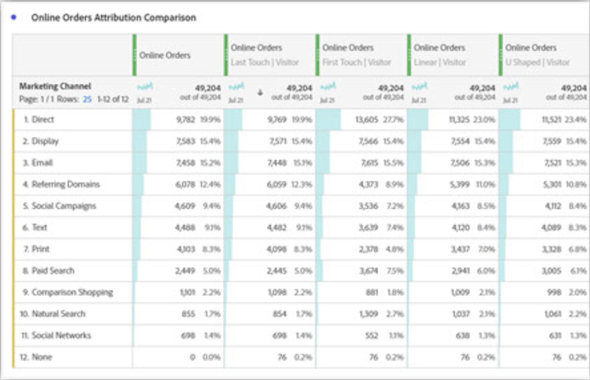

# Attribution IQ con i canali di marketing - Best practice

[I ](/help/components/c-marketing-channels/c-getting-started-mchannel.md) canali di marketing sono una funzione preziosa e potente di Adobe Analytics. Le linee guida attuali relative all&#39;implementazione del canale di marketing sono state formulate in un momento in cui non esistevano né [Attribution IQ](https://experienceleague.adobe.com/docs/analytics/analyze/analysis-workspace/attribution/overview.html?lang=en#analysis-workspace) né [Customer Journey Analytics](https://experienceleague.adobe.com/docs/analytics-platform/using/cja-usecases/marketing-channels.html?lang=en#cja-usecases).

Per garantire la scalabilità dell’implementazione di Marketing Channels e la coerenza dei rapporti con Attribution IQ e con il Customer Journey Analytics, stiamo emanando una serie di best practice aggiornate. Se utilizzi già Marketing Channels, puoi scegliere le opzioni migliori tra queste nuove linee guida. Se hai poca esperienza con Marketing Channels, ti consigliamo di aderire a tutte le nuove best practice.

Quando i canali di marketing sono stati introdotti per la prima volta, presentavano solo dimensioni di primo e ultimo contatto. La versione corrente dell’attribuzione non richiede più dimensioni esplicite di primo/ultimo contatto. L’Adobe fornisce dimensioni generiche &quot;Marketing Channel&quot; e &quot;Marketing Channel Detail&quot; per consentirti di utilizzarle con il modello di attribuzione desiderato. Queste dimensioni generiche si comportano in modo identico alle dimensioni Last-Touch Channel, ma sono etichettate in modo diverso per evitare confusione quando si utilizzano canali di marketing con un modello di attribuzione diverso.

Poiché le dimensioni del canale di marketing dipendono da una definizione di visita tradizionale (come definita dalle relative regole di elaborazione), non è possibile modificarne la definizione utilizzando le suite di rapporti virtuali. Queste pratiche riviste consentono intervalli di lookback chiari e controllati con Attribution IQ e con CJA.

## Best practice n. 1: Utilizzo delle Attribution IQ per analisi controllate

Per ottimizzare l’analisi dei canali di marketing, consigliamo di utilizzare [Attribution IQ](https://experienceleague.adobe.com/docs/analytics/analyze/analysis-workspace/attribution/overview.html?lang=en#analysis-workspace) invece dell’attribuzione dei canali di marketing esistenti. Segui le altre best practice per garantire coerenza e controlli affidabili sull’analisi con Attribution IQ.

* La configurazione delle dimensioni Marketing Channel e Marketing Channel Detail stabilisce i punti di contatto da valutare, corrispondenti a ciascuna istanza del canale di marketing.
* Per l’analisi delle metriche, l’organizzazione deve allinearsi a uno o più modelli di attribuzione. Salva le metriche personalizzate con questo modello per un facile riutilizzo.
* Per impostazione predefinita, i dati vengono allocati utilizzando Ultimo contatto e l’impostazione del periodo di coinvolgimento del visitatore. I modelli di metriche Attribution IQ offrono un maggiore controllo sugli intervalli di lookback e su più varietà, tra cui l’ [attribuzione algoritmica](https://experienceleague.adobe.com/docs/analytics/analyze/analysis-workspace/attribution/algorithmic.html?lang=en#analysis-workspace).

## Best practice n. 2: Nessuna definizione del canale Direct e Session Refresh

I canali di aggiornamento diretto e interno/sessione non sono consigliati per l’utilizzo con modelli di attribuzione personalizzati (Attribution IQ).

Cosa succede se nella tua organizzazione sono già configurati Direct e Session Refresh? In questo caso, ti consigliamo di creare una classificazione per i canali di marketing e di lasciare tali due canali non classificati. La dimensione classificata darà gli stessi risultati delle Attribution IQ come se tali canali non fossero mai stati configurati.

## Best practice n. 3: Abilita Override canale Last-Touch per tutti i canali

I modelli di attribuzione personalizzati utilizzati con la dimensione Canale di marketing in Workspace funzionano meglio quando questa impostazione è abilitata. Se abiliti questa impostazione, un&#39;istanza del canale di marketing viene conteggiata quando viene rilevato un nuovo canale/dettaglio. Abilita questo comando per tutti i canali eccetto Aggiornamento diretto o Interno/Sessione, che sconsigliamo di utilizzare con modelli di attribuzione personalizzati (Attribution IQ).

## Best practice n. 4: Ridurre al minimo il periodo di coinvolgimento del visitatore

L’impostazione del periodo di coinvolgimento del visitatore al minimo di &quot;1 giorno&quot; riduce la probabilità di persistenza dei valori. Poiché i modelli di attribuzione personalizzati (AIQ) consentono intervalli di lookback flessibili, è consigliabile impostare il valore minimo per ridurre al minimo l’impatto di questa impostazione.

## Best practice n. 5: Le regole di elaborazione dei canali di marketing devono esistere solo per i canali abilitati

Assicurati di rimuovere eventuali regole di elaborazione del canale di marketing per i canali disabilitati. Le regole devono esistere solo per i canali di marketing controllati come abilitati.
