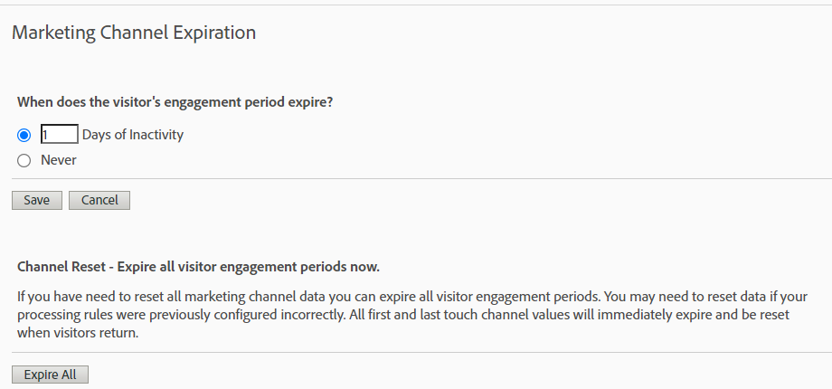

# Attribuzione con canali di marketing - Best practice

I [canali di marketing](/help/components/c-marketing-channels/c-getting-started-mchannel.md) sono una funzione potente e utile di Adobe Analytics. Le attuali linee guida relative all’implementazione dei canali di marketing sono state formulate prima dell’introduzione della funzione [Attribuzione](/help/analyze/analysis-workspace/attribution/overview.md) e di [Customer Journey Analytics](https://experienceleague.adobe.com/docs/analytics-platform/using/cja-usecases/marketing-channels.html?lang=it#cja-usecases).

Al fine di garantire l’implementazione corretta per il futuro dei canali di marketing e la coerenza dei rapporti con la funzione Attribuzione e con Customer Journey Analytics, stiamo pubblicando una serie di best practice aggiornate. Se utilizzi già i canali di marketing, puoi scegliere le opzioni migliori tra queste nuove linee guida. Se non hai familiarità con i canali di marketing, ti consigliamo di attenerti a tutte le nuove best practice.

Al momento della loro introduzione, i canali di marketing erano dotati solo delle dimensioni primo contatto e ultimo contatto. La versione corrente dell’attribuzione non richiede più dimensioni esplicite di primo/ultimo contatto. Adobe fornisce dimensioni generiche “Canale marketing” e “Dettagli canale marketing” per consentirti di utilizzarle con il modello di attribuzione desiderato. Queste dimensioni generiche si comportano esattamente come le dimensioni di canale di primo contatto, ma hanno etichette diverse per evitare confusione quando si usano i canali di marketing con un modello di attribuzione diverso.

Poiché le dimensioni del canale di marketing dipendono da una definizione di visita tradizionale (come definita dalle relative regole di elaborazione), la definizione della visita non può essere modificata utilizzando le suite di rapporti virtuali. Queste procedure riviste consentono intervalli di lookback chiari e controllati con Attribution e con Adobe Analytics.

## Best practice n. 1: sfruttare Attribuzione per l’analisi controllata

Per ottimizzare l’analisi del canale di marketing, è preferibile utilizzare la funzione [Attribuzione](/help/analyze/analysis-workspace/attribution/overview.md) invece dell’attribuzione Canale di marketing esistente. Segui le altre best practice per garantire coerenza e solidi controlli sull’analisi con la funzione Attribuzione.

* La configurazione delle dimensioni Canale di marketing e Dettagli canale di marketing stabilisce i punti di contatto da valutare, corrispondenti a ogni istanza del canale di marketing.
* Per l’analisi delle metriche, la tua organizzazione deve allinearsi a uno o più modelli di attribuzione. Salva le metriche personalizzate con questo modello per riutilizzarle facilmente.
* Per impostazione predefinita, i dati vengono assegnati utilizzando Ultimo contatto e l’impostazione Periodo di coinvolgimento del visitatore. I modelli di metriche di attribuzione offrono un maggiore controllo sulle finestre di lookback e una maggiore varietà, tra cui l’[attribuzione algoritmica](/help/analyze/analysis-workspace/attribution/algorithmic.md#analysis-workspace).

## Best practice n. 2: nessuna definizione dei canali Diretto e Aggiornamento sessione

Si consiglia di non utilizzare i canali Diretto e Interno/Aggiornamento sessione con modelli di attribuzione personalizzati.

Cosa succede se nella tua organizzazione sono già stati configurati i canali Diretto e Aggiornamento sessione? In questo caso, Adobe consiglia di [creare una classificazione](/help/admin/tools/manage-rs/edit-settings/marketing-channels/classifications-mchannel.md) per First Touch/Last Touch e lasciare i canali Direct e Session Refresh non classificati. La dimensione classificata produce risultati di attribuzione simili al caso in cui tali canali non sono mai stati configurati.

Se disattivi questi canali e rimuovi le relative regole di elaborazione del canale di marketing, i risultati sono leggermente diversi dall’approccio di classificazione. Il valore `None` rappresenta le visite che non corrispondono ad alcuna regola di elaborazione del canale di marketing. Possono apparire differenze quando una visita che corrisponde a nessun canale segue una visita che corrisponde a un canale.

Puoi comunque utilizzare modelli di attribuzione personalizzati per applicare intervalli di lookback e modelli di attribuzione in entrambi i casi.

## Best practice n. 3: abilitare l’esclusione del canale di ultimo contatto per tutti i canali

I modelli di attribuzione personalizzati utilizzati con la dimensione Canale di marketing in Workspace funzionano meglio quando questa impostazione è abilitata. Quando questa impostazione è abilitata, un’istanza del canale di marketing viene conteggiata quando viene rilevato un nuovo canale o dettaglio. Abilita questa opzione per tutti i canali, a eccezione dei canali Diretto e Interno/Aggiornamento sessione, che non dovrebbero più essere utilizzati con modelli di attribuzione personalizzati.

## Best practice n. 4: ridurre al minimo il periodo di coinvolgimento dei visitatori

Se si imposta il periodo di coinvolgimento dei visitatori sul valore minimo di “1 giorno”, la probabilità di valori persistenti si riduce al minimo. Poiché i modelli di attribuzione personalizzati (AIQ) consentono finestre di lookback flessibili, si consiglia di impostare il valore minimo per ridurre al minimo l’impatto di questa impostazione.

## Best practice n. 5: le regole di elaborazione dei canali di marketing devono esistere solo per i canali abilitati

Assicurati di rimuovere tutte le regole di elaborazione dei canali di marketing per i canali disabilitati. Le regole devono esistere solo per i canali di marketing contrassegnati come abilitati.
