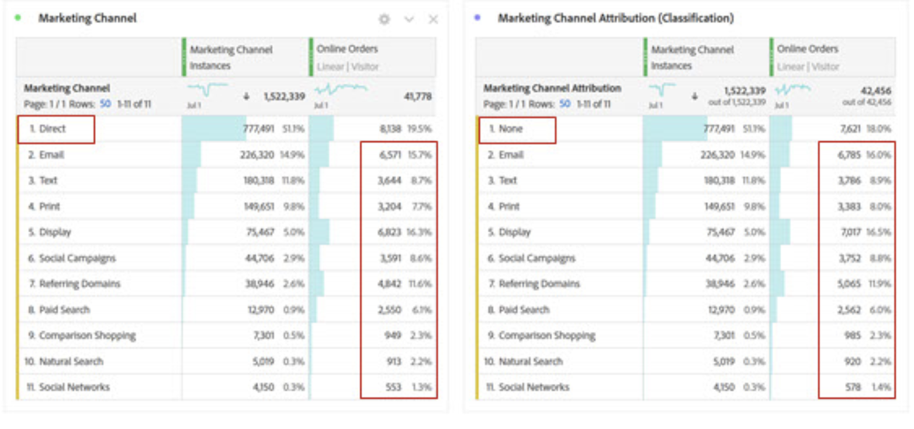

# Attribution IQ con canali di marketing: best practice

[Canali di marketing](/help/components/c-marketing-channels/c-getting-started-mchannel.md) sono una funzione potente e di valore di Adobe Analytics. Le attuali linee guida relative all’implementazione del canale di marketing sono state formulate in un’epoca in cui nessuno dei due [Attribution IQ](https://experienceleague.adobe.com/docs/analytics/analyze/analysis-workspace/attribution/overview.html#analysis-workspace)  né [Customer Journey Analytics](https://experienceleague.adobe.com/docs/analytics-platform/using/cja-usecases/marketing-channels.html?lang=it#cja-usecases) esisteva.

Per garantire l’implementazione corretta per il futuro dei canali di marketing e la coerenza dei rapporti con Attribution IQ e con Customer Journey Analytics, stiamo pubblicando una serie di best practice aggiornate. Se utilizzi già canali di marketing, puoi scegliere le opzioni migliori tra queste nuove linee guida. Se sei un nuovo utente di Marketing Channels, ti consigliamo di aderire a tutte le nuove best practice.

Quando i canali di marketing sono stati introdotti per la prima volta, presentavano solo dimensioni di primo e ultimo contatto. La versione corrente dell’attribuzione non richiede più dimensioni esplicite di primo/ultimo contatto. Adobe fornisce dimensioni generiche “Marketing Channel” e “Marketing Channel Detail” per consentirti di utilizzarle con il modello di attribuzione desiderato. Queste dimensioni generiche si comportano in modo identico alle dimensioni Last-Touch Channel, ma sono etichettate in modo diverso per evitare confusione quando si utilizzano canali di marketing con un modello di attribuzione diverso.

Poiché le dimensioni del canale di marketing dipendono da una definizione di visita tradizionale (come definita dalle relative regole di elaborazione), la definizione della visita non può essere modificata utilizzando le suite di rapporti virtuali. Queste procedure riviste consentono intervalli di lookback chiari e controllati con Attribution IQ e CJA.

## Best practice #1: sfrutta Attribution IQ per l’analisi controllata

È consigliabile utilizzare [Attribution IQ](https://experienceleague.adobe.com/docs/analytics/analyze/analysis-workspace/attribution/overview.html#analysis-workspace) invece dell’attribuzione del canale di marketing esistente, per ottimizzare l’analisi del canale di marketing. Segui le altre best practice per garantire coerenza e solidi controlli sull’analisi con Attribution IQ.

* La configurazione delle dimensioni Canale di marketing e Dettaglio canale di marketing stabilisce i punti di contatto da valutare, corrispondenti a ogni istanza del canale di marketing.
* Per l’analisi delle metriche, l’organizzazione deve allinearsi a uno o più modelli di attribuzione. Salva le metriche personalizzate con questo modello per un facile riutilizzo.
* Per impostazione predefinita, i dati vengono allocati utilizzando Last Touch (Ultimo contatto) e l’impostazione del Periodo di coinvolgimento del visitatore. I modelli di metriche Attribution IQ offrono un maggiore controllo sugli intervalli di lookback e una maggiore varietà, tra cui [attribuzione algoritmica](https://experienceleague.adobe.com/docs/analytics/analyze/analysis-workspace/attribution/algorithmic.html#analysis-workspace).

## Best practice #2: nessuna definizione di canale di aggiornamento diretto e di sessione

I canali di aggiornamento diretto e interno/sessione non sono consigliati per l’utilizzo con modelli di attribuzione personalizzati (Attribution IQ).

Cosa succede se nell&#39;organizzazione è già configurato l&#39;aggiornamento diretto e l&#39;aggiornamento della sessione? In questo caso, si consiglia di: [creare una classificazione](/help/admin/admin/c-manage-report-suites/c-edit-report-suites/marketing-channels/classifications-mchannel.md) per First Touch/Last Touch e lasciare i canali Direct e Session Refresh non classificati. La dimensione classificata produrrà gli stessi risultati di Attribution IQ come se quei canali non fossero mai stati configurati.

## Best practice #3: abilita l’esclusione del canale di ultimo contatto per tutti i canali

I modelli di attribuzione personalizzati utilizzati con la dimensione Canale di marketing in Workspace funzionano meglio quando questa impostazione è abilitata. L’abilitazione di questa impostazione fa in modo che un’istanza del canale di marketing conteggi quando viene rilevato un nuovo canale o dettaglio. Abilita questa opzione per tutti i canali, a eccezione dell’aggiornamento diretto o interno/sessione, che non consigliamo più di utilizzare con modelli di attribuzione personalizzati (Attribution IQ).

## Best practice #4: ridurre al minimo il periodo di coinvolgimento dei visitatori

Se si imposta il periodo di coinvolgimento dei visitatori sul valore minimo di &quot;1 giorno&quot;, la probabilità di valori persistenti si riduce al minimo. Poiché i modelli di attribuzione personalizzati (AIQ) consentono intervalli di lookback flessibili, si consiglia di impostare il valore minimo per ridurre al minimo l’impatto di questa impostazione.

## Best practice #5: le regole di elaborazione dei canali di marketing devono esistere solo per i canali abilitati

Assicurati di rimuovere tutte le regole di elaborazione dei canali di marketing per i canali disabilitati. Le regole devono esistere solo per i canali di marketing controllati come abilitati.
