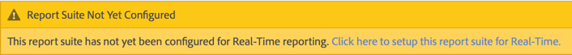

# Configurare rapporti in tempo reale

Passaggi amministrativi per l’impostazione di rapporti in tempo reale.

L’impostazione dei rapporti in tempo reale all’interno di [!UICONTROL Reports & Analytics] consiste nella selezione della suite di rapporti e nella configurazione di un massimo di 3 rapporti.

1. Seleziona la suite di rapporti per la quale desideri abilitare i rapporti in tempo reale.

   Passa a **[!UICONTROL Analytics]** > **[!UICONTROL Reports]** > **[!UICONTROL View All Reports > Site Metrics]** > **[!UICONTROL Real-Time]** e seleziona la suite di rapporti dall’elenco a discesa in alto:

   

   Se tenti di visualizzare rapporti in tempo reale per una suite di rapporti non configurata per la generazione di rapporti in tempo reale, viene visualizzato un messaggio che ti consente di impostare la suite di rapporti.

   

1. Fai clic su **[!UICONTROL Configure]** (icona a forma di ingranaggio) per eseguire il [!UICONTROL Report Suite Manager].

   (Disponibile anche in **[!UICONTROL Analytics]** > **[!UICONTROL Admin > Report Suites]** > **[!UICONTROL Edit Settings]** > **[!UICONTROL Real-Time]**.)

1. Attiva l&#39;impostazione **[!UICONTROL Enable Real-Time]**.
1. Imposta la raccolta dati in tempo reale per un massimo di tre rapporti, con una metrica e tre dimensioni o classificazioni per rapporto.

   

   Per informazioni sulle metriche e dimensioni in tempo reale supportate, consulta [Metriche e Dimension supportati](/help/components/c-real-time-reporting/realtime-metrics.md).

   Se hai creato delle classificazioni, vengono visualizzate con un rientro sotto la dimensione per la quale sono definite:

   

   >[!NOTE]
   >
   >Per un singolo rapporto in tempo reale, al momento non è supportata l’abilitazione di dimensioni duplicate, anche se per ciascuna dimensione è selezionata una classificazione diversa.

   Per ulteriori informazioni sulle classificazioni, consulta [Informazioni sulle classificazioni](/help/components/classifications/c-classifications.md).

   >[!NOTE]
   >
   >Alcune dimensioni, come &quot;Parola chiave di ricerca&quot; o &quot;Prodotto&quot;, non persistono in tempo reale come succede in altre aree di Adobe Analytics. Quando selezioni una metrica non persistente, viene visualizzato questo avviso:

   

1. Fai clic su **[!UICONTROL Save]** o **[!UICONTROL Save and View Report]**.

   Dopo questa configurazione iniziale del report, potrebbero essere necessari fino a 20 minuti perché i dati inizino lo streaming. Da quel momento in poi, i dati sono immediatamente disponibili. Per informazioni sulla visualizzazione dei rapporti in tempo reale, consulta [Eseguire un rapporto in tempo reale](https://experienceleague.adobe.com/docs/analytics/analyze/reports-analytics/t-running-report-types.html).

1. Per impostazione predefinita, tutti gli utenti hanno accesso ai rapporti in tempo reale.
