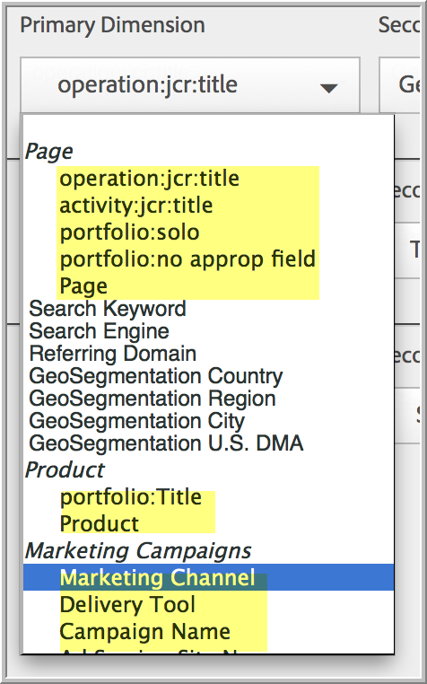

# Configurare rapporti in tempo reale

Le informazioni seguenti contengono passaggi amministrativi per la configurazione di rapporti in tempo reale.

Questa consiste nel selezionare la suite di rapporti e configurarne fino a 3 per essa.

1. Seleziona la suite di rapporti per la quale desideri abilitare i rapporti in tempo reale.

   1. In Analysis Workspace, seleziona la scheda [!UICONTROL **Workspace**], quindi seleziona [!UICONTROL **Rapporti**] > [!UICONTROL **Coinvolgimento**] > **[!UICONTROL Real-Time]**.

   1. Seleziona la suite di rapporti dal menu a discesa in alto:

      

      Se tenti di visualizzare rapporti in tempo reale per una suite di rapporti che non è stata impostata per il reporting in tempo reale, viene visualizzato un messaggio che ti consente di impostare la suite di rapporti.

      

1. Selezionare **[!UICONTROL Configure]** per eseguire [!UICONTROL Report Suite Manager].

   (Disponibile anche in **[!UICONTROL Analytics]** > **[!UICONTROL Admin > Report Suites]** > **[!UICONTROL Edit Settings]** > **[!UICONTROL Real-Time]**.)

1. Attiva l&#39;impostazione **[!UICONTROL Enable Real-Time]**.
1. Imposta la raccolta dati in tempo reale per un massimo di tre rapporti, con una metrica e tre dimensioni o classificazioni per rapporto.

   

   Per informazioni sulle metriche e dimensioni in tempo reale supportate, vedere [Metriche e dimensioni supportate](/help/admin/tools/manage-rs/edit-settings/realtime/realtime-metrics.md).

   Se hai creato delle classificazioni, queste vengono visualizzate rientrate sotto la dimensione per la quale sono definite:

   

   >[!NOTE]
   >
   >Per un singolo rapporto in tempo reale, al momento non è supportata l’abilitazione di dimensioni duplicate, anche se per ogni dimensione è selezionata una classificazione diversa.

   >[!NOTE]
   >
   >Alcune dimensioni, come &quot;Parola chiave di ricerca&quot; o &quot;Prodotto&quot;, non persistono in tempo reale come altrove in Adobe Analytics. Quando selezioni una metrica non persistente, viene visualizzato questo avviso:

   

1. Seleziona **[!UICONTROL Save]** (Mostra origine dati) o **[!UICONTROL Save and View Report]** (Blocca selezione).

   Dopo questa configurazione iniziale del rapporto, l’inizio dello streaming dei dati può richiedere fino a 20 minuti. Da quel momento in poi, i dati sono immediatamente disponibili.

1. Per impostazione predefinita, tutti gli utenti hanno accesso ai rapporti in tempo reale.
