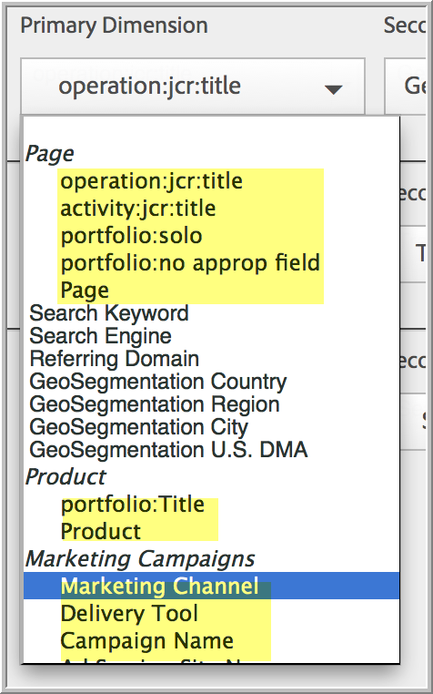

# Configurare i rapporti in tempo reale

Passaggi amministrativi per configurare i report in tempo reale.

Setting up real-time reports within [!UICONTROL Reports & Analytics] consists of selecting the report suite and configuring up to 3 reports for it.

1. Seleziona la suite di rapporti per la quale vuoi abilitare i rapporti in tempo reale.

   Navigate to **[!UICONTROL Analytics]** &gt; **[!UICONTROL Reports]** &gt; **[!UICONTROL View All Reports > Site Metrics]** &gt; **[!UICONTROL Real-Time]** and select the report suite from the drop-down at the top:

   

   Se provate a visualizzare rapporti in tempo reale per una suite di rapporti che non è stata configurata per il reporting in tempo reale, viene visualizzato un messaggio che consente di configurare la suite di rapporti.

   

1. Click **[!UICONTROL Configure]** (gear icon) to run the [!UICONTROL Report Suite Manager].

   (Also available under **[!UICONTROL Analytics]** &gt; **[!UICONTROL Admin > Report Suites]** &gt; **[!UICONTROL Edit Settings]** &gt; **[!UICONTROL Real-Time]**.)

1. Turn on the **[!UICONTROL Enable Real-Time]** setting.
1. Configurate raccolte dati in tempo reale per un massimo di tre report, con una metrica e tre dimensioni o classificazioni per report.

   

   For information on supported real-time metrics and dimensions, see [Supported Metrics and Dimensions](../../components/c-real-time-reporting/realtime-metrics.md#concept_B86D8DF89AD448839332AD84B1DF2AE7).

   Se avete già creato delle classificazioni, queste appaiono rientrate sotto la dimensione per la quale sono definite:

   

   >[!NOTE]
   >
   >Per un singolo rapporto in tempo reale, al momento non è supportato l'abilitazione di dimensioni duplicate, anche se per ciascuna dimensione è selezionata una classificazione diversa.

   For more information about classifications, see [About Classifications](../../components/c-classifications2/c-classifications.md#concept_4CEC7FF1A9E24204A7DA6B9AC70709DE).

   >[!NOTE]
   >
   >Alcune dimensioni, come «Cerca parola chiave» o «Prodotto», non rimangono in tempo reale come avviene in Adobe Analytics. Quando selezioni una metrica non persistente, viene visualizzato questo avviso:

   

1. Click **[!UICONTROL Save]** or **[!UICONTROL Save and View Report]**.

   Dopo questa configurazione iniziale del rapporto, potrebbero essere necessari fino a 20 minuti perché i dati inizino. Da quel momento, i dati sono immediatamente disponibili. For information on viewing Real-Time reports, see [Run a Real-Time Report](https://marketing.adobe.com/resources/help/en_US/sc/user/reports_realtime.html).

1. Per impostazione predefinita, tutti gli utenti hanno accesso ai rapporti in tempo reale.
