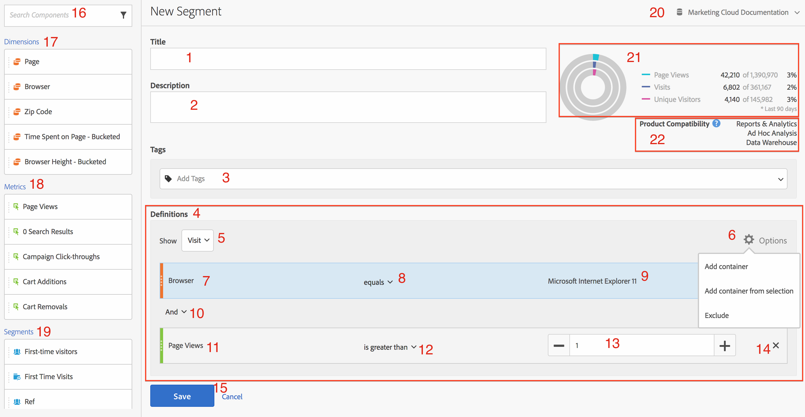
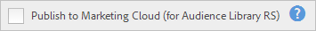
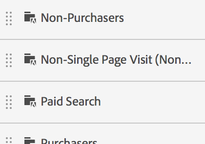

# Generatore di segmenti

Fornisce [!UICONTROL Segment Builder] un quadro per trascinare Metriche, Dimensioni, Segmenti ed Eventi per segmentare i visitatori in base alla logica, alle regole e agli operatori della gerarchia dei contenitori. Questo strumento di sviluppo integrato consente di creare e salvare segmenti semplici o complessi che identificano gli attributi e le azioni dei visitatori per visite ed hit di pagina.

>[!IMPORTANT]
>
>Abbiamo introdotto modelli di attribuzione delle dimensioni nella release di giugno 2019. Consultate la sezione 6 della sezione Funzioni dell&#39;interfaccia utente Web di seguito.

Esistono diversi modi per accedere al Generatore di segmenti:

* **Navigazione** superiore di Analytics: Fate clic su **[!UICONTROL Analytics]** > **[!UICONTROL Components]** > **[!UICONTROL Segments]**.
* **[!UICONTROL Analysis Workspace]**: Fate clic **[!UICONTROL Analytics]** > **[!UICONTROL Workspace]**, aprite un progetto e fate clic su **[!UICONTROL + New]** > **[!UICONTROL Create Segment]**.
* **[!UICONTROL Reports & Analytics]**: Fai clic **[!UICONTROL Analytics]** > **[!UICONTROL Reports]**, apri un rapporto esistente e fai clic sull&#39;icona Segmenti  nella barra di navigazione a sinistra, quindi fai clic su **[!UICONTROL Add]**.
* **[!UICONTROL Ad Hoc Analysis]**: [Creazione di segmenti in Analisi](/help/components/c-segmentation/c-segmentation-workflow/seg-build.md#build-segments)ad hoc.
* **[!UICONTROL Report Builder]**: [Aggiunta o modifica di segmenti in Generatore](https://docs.adobe.com/content/help/en/analytics/analyze/report-builder/data-requests/segmentation.html)di report.

## Interfaccia utente di Segment Builder {#concept_643F2DF74C544796B58F4656ABC5F726}

Consente di [!UICONTROL Segment Builder] creare segmenti semplici o complessi che identificano gli attributi e le azioni dei visitatori tra visite ed hit di pagina. Fornisce un quadro per trascinare e rilasciare dimensioni metriche, eventi o altri segmenti al fine di segmentare i visitatori in base alla logica gerarchica, alle regole e agli operatori.

## Funzionalità dell&#39;interfaccia Web {#section_F61C4268A5974C788629399ADE1E6E7C}

Consente di [!UICONTROL Segment Builder] creare e modificare segmenti nell’interfaccia utente Web (o in un’interfaccia [Java in Analisi](/help/components/c-segmentation/c-segmentation-workflow/seg-workflow.md)ad hoc). Puoi aggiungere definizioni di regole e contenitori per perfezionare i segmenti, impilare i segmenti e nidificarli per perfezionarli. Puoi inoltre convalidare il numero di visualizzazioni di pagina, visite e visitatori unici risultanti dalla definizione del segmento corrente. Quindi salva il segmento per esigenze future.

Accedi a Segment Builder tramite:

* Visualizzare un rapporto esistente e fare clic sull&#39;icona Segmenti  nella navigazione a sinistra. Nella barra dei segmenti visualizzata, fate clic su **[!UICONTROL Add]**.

* In Segment Manager (Gestore segmenti), fai clic su **[!UICONTROL + Add]**.
* Fai clic sul titolo di un segmento esistente in Segment Manager (Gestore segmenti) per modificare il segmento in Segment Builder (Generatore segmenti).

1. **[!UICONTROL Title]**: Consente di denominare o rinominare il segmento.
1. **[!UICONTROL Description]**: Fornire una descrizione per il segmento. È necessario fornire una descrizione se si desidera condividere il segmento.
1. **[!UICONTROL Tags]**: [Assegnate un tag al segmento](/help/components/c-segmentation/c-segmentation-workflow/seg-workflow.md) creato selezionando un elenco di tag esistenti o creando un nuovo tag.
1. **[!UICONTROL Definitions]**: In questa area è possibile [creare e configurare segmenti](/help/components/c-segmentation/c-segmentation-workflow/seg-workflow.md), aggiungere regole e nidificare contenitori e sequenze. Consente di fornire una descrizione per il nuovo segmento selezionando il contenitore e trascinando nella definizione dimensioni, segmenti o metriche.
1. **[!UICONTROL Show]**: (Selettore contenitore principale). Consente di selezionare il [contenitore](/help/components/c-segmentation/seg-overview.md) di livello superiore ( [!UICONTROL Visitor], [!UICONTROL Visit], [!UICONTROL Hit]). Il contenitore di primo livello predefinito è il contenitore Hit.
1. **[!UICONTROL Options]**: (ingranaggio), icona

   * **[!UICONTROL + Add container]**: Consente di aggiungere un nuovo contenitore (sotto il contenitore di primo livello) alla definizione del segmento.
   * **[!UICONTROL + Add container from selection]**: Consente di creare un nuovo contenitore dagli elementi selezionati (per più) nel campo Definizioni.
   * **[!UICONTROL Exclude]**: Consente di definire il segmento escludendo una o più dimensioni, segmenti o metriche.

1. **[!UICONTROL Attribution Models]**: Per segmentazione della dimensione. I modelli di dimensioni sono particolarmente utili nella segmentazione sequenziale, ad esempio in quelli che supportano le visualizzazioni Flusso:

   * **[!UICONTROL Repeating]** (predefinito): Include istanze e valori persistenti per la dimensione.
   * **[!UICONTROL Instance]**: Include le istanze per la dimensione.
   * **[!UICONTROL Non-repeating instance]**: Include istanze univoche (non ripetute) per la dimensione.
   

1. **[!UICONTROL Comparison]**: È possibile confrontare e vincolare i valori utilizzando gli operatori selezionati.
1. **[!UICONTROL Dimensions]**: Le dimensioni vengono trascinate e rilasciate dall&#39;elenco Dimensioni (barra laterale arancione).
1. **[!UICONTROL Value]**: Il valore immesso o selezionato per la dimensione o il segmento o la metrica.
1. **[!UICONTROL And/Or/Then]**: Assegna gli [!UICONTROL AND/OR/THEN] operatori tra contenitori o regole. L&#39;operatore THEN consente di [definire segmenti](/help/components/c-segmentation/c-segmentation-workflow/seg-sequential-build.md)sequenziali.
1. **[!UICONTROL Metric]**: (Barra laterale verde) Metrica trascinata e rilasciata dall’elenco Metriche.
1. **[!UICONTROL Comparison]** operatore: È possibile confrontare e vincolare i valori utilizzando gli operatori selezionati.
1. **[!UICONTROL Value]**: Il valore immesso o selezionato per la dimensione o il segmento o la metrica.
1. **[!UICONTROL X]**: (Elimina) Consente di eliminare questa parte della definizione del segmento.
1. **[!UICONTROL Save]** o **[!UICONTROL Cancel]**: Salva o annulla il segmento. Dopo aver fatto clic su **[!UICONTROL Save]**, si passa al gestore segmenti dove è possibile gestire il segmento.
1. **[!UICONTROL Search]**: Cerca l’elenco di dimensioni, segmenti o metriche.
1. **[!UICONTROL Dimensions]**: (Elenco) Fate clic sull’intestazione per espanderla.
1. **[!UICONTROL Metrics]**: Fate clic sull’intestazione da espandere.
1. **[!UICONTROL Segments]**: Fate clic sull’intestazione da espandere.
1. **[!UICONTROL Report suite selector]**: Consente di selezionare la suite di rapporti in cui verrà salvato il segmento. Puoi comunque utilizzare il segmento in tutte le suite di rapporti.
1. **[!UICONTROL Segment Preview]**: Consente di visualizzare in anteprima le metriche chiave per verificare se esiste un segmento valido e quanto ampio è il segmento. Rappresenta la suddivisione del set di dati che si prevede di vedere se si applica questo segmento. Mostra 3 cerchi concentrici e un elenco per mostrare il numero e la percentuale di corrispondenze per [!UICONTROL Hits], [!UICONTROL Visits]e [!UICONTROL Visitors] per un segmento eseguito rispetto a un set di dati. Questo grafico viene aggiornato immediatamente dopo che hai creato o modificato la definizione del segmento.
1. **[!UICONTROL Product Compatibility]**: Fornisce un elenco dei prodotti Adobe Analytics (Analysis Workspace, [!UICONTROL Reports & Analytics]Analisi ad hoc, Data Warehouse) con cui è compatibile il segmento creato. La maggior parte dei segmenti è compatibile con tutti i prodotti. Tuttavia, non tutti gli operatori e le dimensioni sono compatibili con tutti i prodotti Analytics, in particolare [Data Warehouse](/help/components/c-segmentation/seg-reference/seg-compatibility.md). Questo grafico viene aggiornato immediatamente dopo che sono state apportate modifiche alla definizione del segmento.

Segments with embedded date ranges continue to operate differently in Analysis Workspace versus [!UICONTROL Reports & Analytics]: In Workspace, a segment with an embedded date range overrides the panel date range. By contrast, [!UICONTROL Reports & Analytics] gives you the intersection of the report date range and the segment&#39;s embedded date range.

**[!UICONTROL Publish to Experience Cloud (for `<report suite name>`)]**: (Non visualizzato sullo schermo) Questa opzione viene visualizzata solo se la suite di rapporti in cui si sta salvando questo segmento è [abilitata per Experience Cloud](/help/components/c-segmentation/c-segmentation-workflow/seg-workflow.md). Pubblicando un segmento in Experience Cloud, puoi utilizzare il segmento per l&#39;attività di marketing in [!UICONTROL Audience Library], [!DNL Target], e [!DNL Audience Manager]. Titolo e descrizione del segmento richiesti.

>[!NOTE] In Analytics puoi modificare o eliminare un segmento pubblicato. Se il segmento è in uso, quando modifichi un segmento compare un messaggio di avviso. Non puoi eliminare un segmento modificato che risulta in uso in Adobe [!DNL Target].

>[!IMPORTANT]
>
>Devi limitare il numero di audience condivise da Analytics a 20 per evitare ulteriori ritardi nell&#39;elaborazione. Il pubblico condiviso con Experience Cloud da Analytics non può superare i 20 milioni di membri unici. Inoltre, a causa della memorizzazione nella cache, sono necessarie 12 ore prima che l’eliminazione delle suite di rapporti di Analytics possa essere visibile in Experience Cloud.

>[!IMPORTANT]
>
>Once a visitor qualifies for the audience shared from Analytics, there is a 24 - 48 hour delay before that information is actionable in [!DNL Target], [!DNL Advertising Cloud], and [!DNL Campaign].

## Generare segmenti {#build-segments}

1. È sufficiente trascinare un evento di dimensione, segmento o metrica dal riquadro a sinistra al [!UICONTROL Definitions] campo.

   

   Il contenitore di primo livello predefinito [!UICONTROL Hit] viene visualizzato dopo il trascinamento di un elemento in [!UICONTROL Definitions]. Puoi cambiare il tipo di contenitore in Visita o Visitatore dal menu a **[!UICONTROL Show]** discesa.

1. Impostare l&#39; [operatore](/help/components/c-segmentation/seg-reference/seg-operators.md) dal menu a discesa.
1. Immettere o selezionare un valore per l&#39;elemento selezionato.
1. Se necessario, aggiungere altri contenitori utilizzando **[!UICONTROL And]**, **[!UICONTROL Or]** o **[!UICONTROL Then]** regole.
1. Dopo aver posizionato i contenitori e impostato le regole, vedere i risultati del segmento nel grafico di convalida in alto a destra. Il validatore indica la percentuale e il numero assoluto di visualizzazioni di pagina, visite e visitatori univoci che corrispondono al segmento creato.
1. In **[!UICONTROL Tags]** questo campo, [assegnate](/help/components/c-segmentation/c-segmentation-workflow/seg-tag.md) un tag al contenitore selezionando un tag esistente o creandone uno nuovo.
1. Fate clic **[!UICONTROL Save]** per salvare il segmento.

Ora puoi passare a Gestione segmenti, dove puoi assegnare tag, condividere e gestire i segmenti in diversi modi.

## Creazione e nidificazione di contenitori {#section_1C38F15703B44474B0718CEF06639EFD}

È possibile [creare una struttura di contenitori](/help/components/c-segmentation/seg-overview.md) e quindi inserire regole logiche e operatori tra loro.

1. Fai clic su **[!UICONTROL Options > Add Container]**.

   

   Viene aperto un nuovo [!UICONTROL Hit] contenitore senza identificarne [!UICONTROL Hit] (Visualizzazione pagina).

   

1. Modificate il tipo di contenitore in base alle esigenze.
1. Trascina una dimensione, un segmento o un evento dal riquadro a sinistra al contenitore.
1. Continuate ad aggiungere nuovi contenitori dal pulsante di primo livello **[!UICONTROL Options]** > **[!UICONTROL Add container]** nella parte superiore della definizione, oppure aggiungete contenitori da un contenitore alla logica di nidificazione.

   **OR**

   Select one or more rules and then click **[!UICONTROL Options]** > **[!UICONTROL Add container from selection]**. In questo modo la selezione viene trasformata in un contenitore separato.

## Use date ranges in segments {#concept_252A83D43B6F4A4EBAB55F08AB2A1ACE}

Puoi creare segmenti che contengono intervalli di date dinamici per rispondere a domande su campagne o eventi in corso.

Ad esempio, puoi creare facilmente un segmento che include &quot;tutti coloro che hanno effettuato un acquisto negli ultimi 60 giorni&quot;.

Create un contenitore Visita e al suo interno, aggiungete l’intervallo di tempo e la metrica [!UICONTROL Last 60 days] con [!UICONTROL Orders is greater than or equal to 1], con un operatore AND:

## Stack di segmenti {#task_58140F17FFD64FF1BC30DC7B0A1B0E6D}

L&#39;impilamento dei segmenti funziona combinando i criteri in ciascun segmento utilizzando un operatore &#39;e&#39;, quindi applicando i criteri combinati.

Ad esempio, l&#39;impilamento di un segmento &quot;utenti di telefoni cellulari&quot; e di un segmento &quot;geografia USA&quot; restituirebbe i dati solo agli utenti di telefoni cellulari negli Stati Uniti.

Considera questi segmenti come elementi costitutivi o moduli che possono essere inclusi in una libreria di segmenti, affinché gli utenti possano utilizzarli nel modo desiderato. In questo modo, puoi ridurre notevolmente il numero di segmenti necessari. Ad esempio, supponiamo di avere 40 segmenti:

* 20 per gli utenti di telefoni cellulari in diversi paesi (US_mobile, Germany_mobile, France_mobile, Brasile_mobile, ecc.)
* 20 per gli utenti di tablet in diversi paesi (US_tablet, Germany_tablet, France_tablet, Brasile_tablet, ecc.)

Utilizzando la sovrapposizione dei segmenti, potete ridurre il numero dei segmenti a 22 e impilarli secondo necessità. È necessario creare i segmenti seguenti:

* un segmento per gli utenti di dispositivi mobili
* un segmento per gli utenti di tablet
* 20 segmenti per le diverse aree geografiche

>[!NOTE] Quando si sovrappongono due segmenti, per impostazione predefinita sono uniti da un&#39;istruzione AND. Questo non può essere modificato in un&#39;istruzione OR.

1. Vai a Segment Builder (Generatore di segmenti).
1. Fornire un titolo e una descrizione per il segmento.

   Passo Risultato 1. Fai clic **[!UICONTROL Show Segments]** per visualizzare l&#39;elenco dei segmenti nel menu di navigazione a sinistra.

   Passo Risultato 1. Trascina i segmenti da impilare nell’area di lavoro delle definizioni dei segmenti. Ecco un esempio di segmento che sovrappone i segmenti esistenti &quot;Visite da tablet&quot; e &quot;US Geo&quot;:

   

1. Salva il segmento.

   Risultato passaggio

## Utilizzare i modelli di segmento {#concept_5098446CC78D441E93B8E4D1D1EA6558}

I modelli rappresentano i vecchi segmenti preconfigurati e suite.

In Segment Manager (Gestore segmenti), fai clic su **[!UICONTROL Add]**, per passare al Segment Builder (Generatore segmenti). Ora fai clic sull’icona Segmenti  

per visualizzare la barra dei segmenti. I modelli di segmento vengono visualizzati nella parte inferiore dell&#39;elenco dei segmenti. Sono distinguibili dall’icona di una cartella a sinistra del nome del modello:

Potete trascinare questi modelli nell’area di lavoro Definizioni e usarli come sono stati definiti o modificarli.

<table id="table_98B87D807E9344C9BEBF072C65D87B1B"> 
 <thead> 
  <tr> 
   <th colname="col1" class="entry"> Nome modello </th> 
   <th colname="col2" class="entry"> Definizione </th> 
  </tr> 
 </thead>
 <tbody> 
  <tr> 
   <td colname="col1"> Abbandona carrello </td> 
   <td colname="col2">Visualizzare i dati per i visitatori che hanno aggiunto elementi ai loro carrelli ma non hanno ordinato nulla. Nella definizione del segmento, il contenitore è Visita. La regola per questo segmento sequenziale è 
 Le aggiunte al carrello non sono nulle 
 
Then 
 
Ordini è uguale a 0. 
 </td> 
  </tr> 
  <tr> 
   <td colname="col1"> Prima visita </td> 
   <td colname="col2">Visualizzare i dati per i visitatori che hanno visitato un massimo di una [1] volte. Nella definizione del segmento, il contenitore è Visita. La regola è 
Numero visita è uguale a 1. 
 </td> 
  </tr> 
  <tr> 
   <td colname="col1"> Non acquirenti </td> 
   <td colname="col2">Visualizzare i dati per i visitatori che non hanno partecipato a un evento ordine. Nella definizione del segmento, il contenitore è Visitatore. Questo segmento utilizza la logica Exclude. La regola è 
Ordini non nulli. 
 </td> 
  </tr> 
  <tr> 
   <td colname="col1"> Visita di una pagina non singola (senza bacheche) </td> 
   <td colname="col2">Visualizzare i dati per i visitatori che hanno visitato più di una volta. Nella definizione del segmento, il contenitore è Visitatore. Questo segmento utilizza la logica Exclude. La regola è 
Accesso singolo non è nullo. 
 </td> 
  </tr> 
  <tr> 
   <td colname="col1"> Ricerca pagata </td> 
   <td colname="col2">Visualizzare i dati dei visitatori provenienti da una ricerca a pagamento. Nella definizione del segmento, il contenitore è Visita. La regola è 
La ricerca a pagamento è uguale a 1. 
 </td> 
  </tr> 
  <tr> 
   <td colname="col1"> Acquirenti </td> 
   <td colname="col2">Visualizzare i dati per i visitatori che hanno partecipato a un evento ordine. Nella definizione del segmento, il contenitore è Visitatore. La regola è 
Ordini non nulli. 
 </td> 
  </tr> 
  <tr> 
   <td colname="col1"> Visite di ritorno </td> 
   <td colname="col2">Visualizzare i dati dei visitatori che hanno visitato almeno una volta. Nella definizione del segmento, il contenitore è Visita. La regola è 
Numero visita è maggiore di 1. 
 </td> 
  </tr> 
  <tr> 
   <td colname="col1"> Visite a pagina singola </td> 
   <td colname="col2"> Visualizzate i dati delle visite in cui viene visualizzato un valore per pagina singola, anche se durante tale visita potete inviare più visualizzazioni di pagina. Nel segmento sono incluse visite a pagina singola con eventi di collegamento di uscita. Nella definizione del segmento, il contenitore è Visita. La regola è 
Visite per pagina singola è uguale a 1. 
 </td> 
  </tr> 
  <tr> 
   <td colname="col1"> Prodotto visualizzato non aggiunto al carrello </td> 
   <td colname="col2">Visualizzate i dati per i visitatori che hanno visualizzato i prodotti ma non hanno aggiunto aggiunte al carrello. Nella definizione del segmento, il contenitore è Visita. La regola per questo segmento sequenziale è 
Visualizzazioni prodotto non nulle 
 
Then 
 
 Incrementi carrello è uguale a 0. 
 </td> 
  </tr> 
  <tr> 
   <td colname="col1"> Visite da Campaign </td> 
   <td colname="col2">Visualizzare i dati dei visitatori in base alle campagne. Nella definizione del segmento, il contenitore è Visita. La regola è 
Il codice di tracciamento non è null. 
 </td> 
  </tr> 
  <tr> 
   <td colname="col1"> Visite da dispositivi mobili </td> 
   <td colname="col2">Visualizzare i dati dei visitatori che utilizzano i dispositivi mobili. Nella definizione del segmento, il contenitore è Visita. La regola è 
Il dispositivo mobile non è nullo. 
 </td> 
  </tr> 
  <tr> 
   <td colname="col1"> Visite da Ricerca naturale </td> 
   <td colname="col2">Visualizzare i dati dei visitatori non provenienti da una ricerca a pagamento. Nella definizione del segmento, il contenitore è Visita. La regola è 
La ricerca a pagamento è uguale a 0. 
 </td> 
  </tr> 
  <tr> 
   <td colname="col1"> Visite da dispositivi non mobili </td> 
   <td colname="col2">Visualizzare i dati dei visitatori che non utilizzano i dispositivi mobili. Nella definizione del segmento, il contenitore è Visita. Questo segmento utilizza la logica Exclude. La regola è 
Tipo di dispositivo mobile uguale a Telefono cellulare 
 
Oppure 
 
Tipo dispositivo mobile equivale a Tablet. 
 </td> 
  </tr> 
  <tr> 
   <td colname="col1"> Visite da telefoni </td> 
   <td colname="col2">Visualizzare i dati dei visitatori che utilizzano i telefoni. Nella definizione del segmento, il contenitore è Visita. La regola è 
Tipo di dispositivo è uguale a Telefono cellulare. 
 </td> 
  </tr> 
  <tr> 
   <td colname="col1"> Visite dai motori di ricerca </td> 
   <td colname="col2">Visualizzare i dati dei visitatori a cui fanno riferimento i motori di ricerca. Nella definizione del segmento, il contenitore è Visita. La regola è 
Tipo referente è uguale a Motori di ricerca. 
 </td> 
  </tr> 
  <tr> 
   <td colname="col1"> Visite dai siti social </td> 
   <td colname="col2">Visualizzate i dati dei visitatori in base ai siti social. Nella definizione del segmento, il contenitore è Visita. La regola è 
Tipo referente è uguale a Social Network. 
 </td> 
  </tr> 
  <tr> 
   <td colname="col1"> Visite da Tablet </td> 
   <td colname="col2">Visualizzare i dati dei visitatori utilizzando i tablet. Nella definizione del segmento, il contenitore è Visita. La regola è 
Tipo di dispositivo è uguale a Tablet. 
 </td> 
  </tr> 
  <tr> 
   <td colname="col1"> Visite con il cookie ID visitatore </td> 
   <td colname="col2">Visualizzate i dati dei visitatori del sito, dove è richiesto un cookie permanente. Nella definizione del segmento, il contenitore è Visita. La regola è 
Cookie persistente uguale a 1. 
 </td> 
  </tr> 
 </tbody> 
</table>

## Esempio: Segmento visitatori campagna {#concept_61AC6115097B4EB3AEFE8CE98F38315D}

Mostra un esempio di questo segmento utilizzato di frequente.

Molti clienti desiderano vedere le metriche dai visitatori che hanno risposto a campagne specifiche. Creare un segmento di visitatori della campagna è un modo semplice per ottenere questi dati.

La creazione di questo segmento nel Segment Builder (Generatore di segmenti) implica che da un contenitore Visita di livello principale si trascina in una dimensione campagna, in questo caso Nome campagna:

(Facoltativo) Per filtrare facilmente tutti i segmenti relativi alla campagna, potete anche applicare un tag Campagne a questo segmento.
