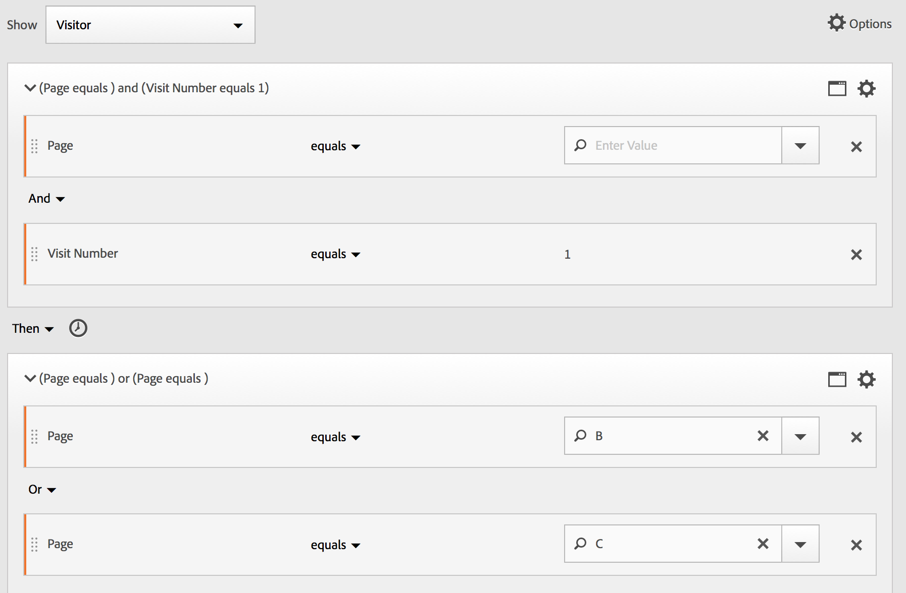
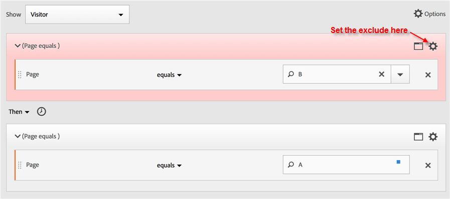
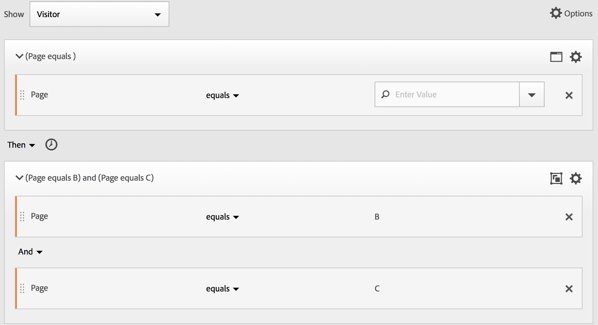
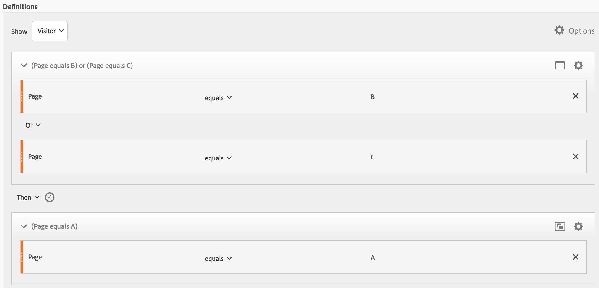
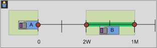

# Creare segmenti sequenziali

I segmenti sequenziali vengono creati utilizzando l&#39;operatore THEN, anziché AND o OR. THEN implica che si verifichi un criterio di segmento, seguito da un altro. Per impostazione predefinita, un segmento sequenziale identifica tutti i dati corrispondenti, mostrando il filtro &quot;Includi tutti&quot;. I segmenti sequenziali possono essere ulteriormente filtrati in un sottoinsieme di hit corrispondenti utilizzando le opzioni «Only Before Sequence» (Solo prima della sequenza) e «Only After Sequence» (Solo dopo la sequenza).

Additionally, you can constrain sequential segments to a specific duration of time, granularity, and counts between checkpoints using the [After and Within operators](../../../components/c-segmentation/c-segmentation-workflow/seg-sequential-build.md#concept_07708877D06742998C6237DD9FD194EA).

## Include Everyone {#section_75ADDD5D41F04800A09E592BB2940B35}

Quando si crea un segmento in cui «Includi tutti» è impostato, il segmento identifica i percorsi che corrispondono al pattern specificato. Si tratta di un esempio di segmento di sequenza di base che cerca un hit (Pagina A) seguito da un altro (Pagina B) come visitato dallo stesso visitatore. Il segmento è impostato su Includi tutti.

| Se risultato… | Sequenza |
|--- |--- |
| Corrisponde | A then B A then (in a different visit) B A then D then B |
| Non corrisponde | B then A |

## Only Before Sequence and Only After Sequence {#section_736E255C8CFF43C2A2CAAA6D312ED574}

The options **[!UICONTROL Only Before Sequence]** and **[!UICONTROL Only After Sequence]** filter the segment to a subset of data before or after the specified sequence.

* **Solo prima della sequenza**: Include tutti gli hit prima di una sequenza + il primo hit della sequenza stessa (vedere l&#39;esempio 1, 3). Se una sequenza viene visualizzata più volte in un percorso, «Solo prima sequenza» include il primo hit dell&#39;ultima occorrenza della sequenza e tutti gli hit precedenti (vedere Esempio 2).
* **Solo dopo la sequenza**: Include tutti gli hit dopo una sequenza + l&#39;ultimo hit della sequenza stessa (vedere l&#39;esempio 1, 3). Se una sequenza viene visualizzata più volte in un percorso, «Solo dopo» include l&#39;ultimo hit della prima occorrenza della sequenza e tutti gli hit successivi (vedere Esempio 2).

Ad esempio, considerate una sequenza di B -&gt; D. I tre filtri identificherebbero gli hit come segue:

**Esempio 1: B quindi viene visualizzata una volta**

| Esempio  | Una  | B | C | D | E | F |
|---|---|---|---|---|---|---|
| Includi tutti | Una  | B | C | D | E | F |
| Solo prima della sequenza | Una  | B |  |  |  |  |
| Solo dopo la sequenza |  |  |  | D | E | F |

**Esempio 2: B viene visualizzato più volte**

| Esempio  | Una  | B | C | D | B | C | D | E |
|---|---|---|---|---|---|---|---|---|
| Includi tutti | Una  | B | C | D | B | C | D | E |
| Solo prima della sequenza | Una  | B | C | D | B |  |  |  |
| Solo dopo la sequenza |  |  |  | D | B | C | D | E |

Atteniamo anche questo concetto con la dimensione Profondità hit.

**Esempio 3: Hit profondità 3 then 5**

## Dimension Constraints {#section_EAFD755F8E674F32BCE9B642F7F909DB}

In una clausola “within” (entro), tra istruzioni THEN, è possibile aggiungere, ad esempio, “within 1 search keyword instance”, “within 1 eVar 47 instance”. In questo modo si vincola il segmento entro un’istanza di una dimensione.

L&#39;impostazione di una clausola «Within Dimension» tra le regole consente a un segmento di limitare i dati alle sequenze in cui tale clausola viene soddisfatta. Vedere l&#39;esempio seguente, dove il vincolo è impostato su «Within 1 page»:

| Se risultato… | Sequenza |
|--- |--- |
| Corrisponde | A then B |
| Non corrisponde | A then C then B (because B was not within 1 page of A) **Note:**  If the dimension restriction is taken out, &quot;A then B&quot; and &quot;A then C then B&quot; would both match. |

## Sequenza semplice di visualizzazione pagina

Identificare i visitatori che hanno visualizzato una pagina e quindi visualizzarne un&#39;altra. I dati a livello di hit filtreranno questa sequenza indipendentemente dalle sessioni di visita precedenti, passate o provvisorie o dal numero o numero di visualizzazioni di pagina che si verificano tra.

**Esempio**: Il visitatore ha visualizzato la pagina A, quindi la pagina B nella stessa visita o un&#39;altra visita.

**Casi d&#39;uso**

Di seguito sono riportati alcuni esempi di utilizzo del segmento.

1. I visitatori di un sito sportivo visualizzano la pagina di destinazione calcio, quindi visualizzano la pagina di destinazione della palla in ordine sequenziale, ma non necessariamente nella stessa visita. Questo richiede una campagna per inviare il contenuto di pallacerchi ai visualizzatori football durante la stagione di calcio.
1. Il rivenditore di automobili identifica una relazione tra coloro che arrivano sulla pagina di fedeltà del cliente e quindi accedono alla pagina video in qualsiasi momento durante la visita o un&#39;altra visita.

**Crea questo segmento**

You nest two page rules within a top-level [!UICONTROL Visitor] container and sequence the page hits using the [!UICONTROL THEN] operator.

## Sequenza di visitatori tra visite

Identificare i visitatori che hanno abbandonato una campagna, ma poi ritornano alla sequenza di visualizzazioni di pagina in un&#39;altra sessione.

**Esempio**: Il visitatore ha visualizzato la pagina A in una visita, quindi la pagina B in un&#39;altra visita.

**Casi d&#39;uso**

Di seguito sono riportati alcuni esempi di utilizzo di questo tipo di segmento:

* I visitatori della pagina Sport di un sito di notizie rivedono la pagina Sport in un&#39;altra sessione.
* Un rivenditore di abbigliamento vede una relazione tra i visitatori che arrivano su una pagina di destinazione in una sessione, quindi passa direttamente alla pagina di cassa in un&#39;altra sessione.

**Crea questo segmento**

This example nests two **[!UICONTROL Visit]** containers within the top-level **[!UICONTROL Visitor]** container and sequences the segment using the [!UICONTROL THEN] operator.

## Sequenza a livello misto

Identificare i visitatori che visualizzano due pagine in un numero di visite non determinato, quindi visualizzare una terza pagina in una visita separata.

**Esempio**: I visitatori visitano la pagina A e quindi la pagina B in una o più visite, seguita da una visita alla pagina C in una visita separata.

**Casi d&#39;uso**

Di seguito sono riportati alcuni esempi di utilizzo di questo tipo di segmento:

* I visitatori visitano prima un sito di notizie e quindi visualizzano la pagina sportiva nella stessa visita. Su un&#39;altra visita il visitatore visita la pagina del calendario.
* Il rivenditore definisce i visitatori che entrano nella pagina Principale e quindi accedono alla pagina Account personale. In un&#39;altra visita, visita la pagina Visualizza carrello.

**Crea questo segmento**

1. Drop two Page dimensions from the left panes within a top-level [!UICONTROL Visitor] container.
1. Aggiungete l&#39;operatore THEN tra di essi.
1. Click **[!UICONTROL Options]** &gt; **[!UICONTROL Add container]** and add a [!UICONTROL Visit] container underneath the [!UICONTROL Visitor] level and sequenced using the [!UICONTROL THEN] operator.

## Contenitori aggregati

Adding multiple [!UICONTROL Hit] containers within a [!UICONTROL Visitor] container lets you employ the appropriate operators between the same type of containers, and to use rules and dimensions such as Page and Visit Number to define the page view and provide a sequence dimension within the [!UICONTROL Hit] container. Applying logic at the Hit-level lets you constrain and combine matches at a same-level of hits within the [!UICONTROL Visitor] container to build a variety of segment types.

**Esempio**: I visitatori visitano la pagina A dopo il primo hit nella sequenza di visualizzazioni di pagina (pagina D nell&#39;esempio), quindi hanno visitato la pagina B o la pagina C senza considerare il numero di visite.

**Casi d&#39;uso**

Di seguito sono riportati alcuni esempi di utilizzo di questo tipo di segmento:

* Identificare i visitatori che arrivano alla pagina di destinazione Principale in una visita, quindi visualizzare la pagina abbigliamento da Uomo in un&#39;altra visita, quindi visualizzare la pagina di destinazione della donna o figlio in una visita diversa.
* Un e-zine acquisisce i visitatori che arrivano alla pagina iniziale in una visita, la pagina Sport in un&#39;altra visita e la pagina Opinioni in un&#39;altra visita.

**Crea questo segmento**

1. Select the [!UICONTROL Visitor] container as the top-level container.
1. Add two [!UICONTROL Hit]-level containers—a dimension with an appropriate numerical dimension joined at the same [!UICONTROL Hit] level by the [!UICONTROL AND] and [!UICONTROL OR] operator.
1. Within the [!UICONTROL Visit] container, add another [!UICONTROL Hit] container and nest two additional [!UICONTROL Hit] containers joined with an [!UICONTROL OR] or [!UICONTROL AND] operator.

   Sequence these nested [!UICONTROL Hit] containers with the [!UICONTROL THEN] operator.

## «Nidificazione» nei segmenti sequenziali

By placing checkpoints at both the [!UICONTROL Visit] and [!UICONTROL Hit] level, you can constrain the segment to meet requirements within a specific visit as well as a specific hit.

**Esempio**: Visitatore visitato la pagina A quindi la pagina B nella stessa visita. In una nuova visita, il visitatore passava alla pagina C.

**Crea questo segmento**

1. Underneath a top-level [!UICONTROL Visit] container, drag in two page dimensions.
1. Multi-select both rules, click **[!UICONTROL Options]** &gt; **[!UICONTROL Add container from selection]** and change it to a [!UICONTROL Visit] container.
1. Join them with a [!UICONTROL THEN] operator.
1. Create a Hit container as a peer to the [!UICONTROL Visit] container and drag in a page dimension.
1. Join the nested sequence in the [!UICONTROL Visit] container with the [!UICONTROL Hit] container using another [!UICONTROL THEN] operator.

## Escludere gli hit

Segment rules include all data unless you specifically exclude [!UICONTROL Visitor], [!UICONTROL Visit], or [!UICONTROL Hit] data using the [!UICONTROL Exclude] rule. Consente di ignorare i dati comuni e di creare segmenti con maggiore attenzione. Oppure consente di creare segmenti esclusivi per gruppi individuati per identificare il set di dati rimanenti, ad esempio creando una regola che include i visitatori che hanno effettuato i primi ordini e quindi li escluda per identificare &quot;non acquirenti&quot;. However, in most cases it is better to create rules that exclude broad values rather than trying to use the [!UICONTROL Exclude] rule to target specific include values.

Ad esempio:

* **Escludete le pagine**. Use a segment rule to strip out a specific page (such as *`Home Page`*) from a report, create a Hit rule where the page equals &quot;Home Page,&quot; and then exclude it. Questa regola include automaticamente tutti i valori eccetto la Home Page.
* **Escludere domini di riferimento**. Utilizzate una regola che includa solo domini di riferimento da Google.com ed esclude tutti gli altri.
* **Identificare i non acquirenti**. Identify when orders are greater than zero and then exclude the [!UICONTROL Visitor].

The [!UICONTROL Exclude] operator can be employed to identify a sequence where specific visits or hits are not performed by the visitor. [!UICONTROL Exclude Checkpoints] possono essere incluse anche all&#39;interno di un [gruppo logico](../../../components/c-segmentation/c-segmentation-workflow/seg-sequential-build.md#concept_23CE0E6071E14E51B494CD21A9799112).

## Escludi tra i punti di controllo

Applicare logica per segmentare i visitatori in cui un punto di controllo non si è verificato in modo esplicito tra due altri checkpoint.

**Esempio**: Visitatori che hanno visitato la pagina A e quindi hanno visitato la pagina C, ma non hanno visitato la pagina B.

**Casi d&#39;uso**

Di seguito sono riportati alcuni esempi di utilizzo di questo tipo di segmento:

* Visitatori della pagina History (Stili) e quindi della sezione Teatro senza passare alla pagina Arts (Arti).
* Un rivenditore automatico vede una relazione tra coloro che visitano la pagina di destinazione principale, quindi passa direttamente alla campagna No Interest senza passare alla pagina Vehicle.

**Crea questo segmento**

Create a segment as you would for a simple, mixed-level, or nested sequential segment and then set the [!UICONTROL EXCLUDE] operator for the container element. The example below is an aggregate segment where the three [!UICONTROL Hit] containers are dragged to the canvas, the [!UICONTROL THEN] operator assigned to join the container logic, then exclude the middle page view container to include only visitors that went from page A to Page C in the sequence.

## Escludi all&#39;inizio della sequenza

Se l&#39;eccezione di controllo si trova all&#39;inizio di un segmento sequenziale, la visualizzazione di pagina esclusa non viene eseguita prima del primo hit non escluso.

**Esempio**: Visitatore visitato la pagina A e non la pagina B.

**Casi d&#39;uso**

Di seguito sono riportati alcuni esempi d&#39;uso di questo tipo di segmento:

* Visitatori che hanno visitato la pagina A e che non hanno visitato la pagina B.
* Un ristorante vuole visualizzare gli utenti che hanno evitato la pagina di destinazione principale e andare direttamente alla pagina Ordine di acquisto.

**Crea questo segmento**

Crea due contenitori Hit distinti all&#39;interno di un contenitore Visitatore di livello principale. Then set the [!UICONTROL EXCLUDE] operator for the first container.

## Escludi alla fine della sequenza

Se l&#39;eccezione di controllo si trova alla fine di una sequenza, il punto di controllo non si verifica tra l&#39;ultimo punto di controllo non escluso e la fine della sequenza dei visitatori.

**Esempio**: I visitatori visitano la pagina A e quindi non visitavano la pagina B nella visita corrente o successive.

**Casi d&#39;uso**

Di seguito sono riportati alcuni esempi di utilizzo di questo tipo di segmento:

* Visitatori che hanno visitato la pagina A e che non hanno visitato la pagina B.
* Un ristorante vuole visualizzare gli utenti che hanno evitato la pagina di destinazione principale e andare direttamente alla pagina Ordine di acquisto.

**Crea questo segmento**

Build a simple sequence segment by dragging two [!UICONTROL Hit] containers to the canvas and connecting them using the [!UICONTROL THEN] operator. Then assign the [!UICONTROL EXCLUDE] operator to the second [!UICONTROL Hit] container in the sequence.

## Contenitori Gruppo logica

Within a sequential segmentation, it is required that containers are ordered strictly within the [container hierarchy](../../../components/c-segmentation/seg-overview.md#concept_A38E7000056547399E346559D85E2551). [!UICONTROL Logic Group] Il contenitore è stato progettato per essere utilizzato quando i contenitori di livello più elevato sono obbligatori nei segmenti sequenziali per filtrare ulteriormente i visitatori e per presentare vincoli di livello visitatore complessi, nidificati e a livello di visitatore.

| Gerarchia contenitore standard |
|---|
|  |
| Within the [!UICONTROL Visitor] container, the [!UICONTROL Visit] and [!UICONTROL Hit] containers are nested in sequence to extract segments based on hits, the number of visits, and the visitor. |

>[!NOTE]
>
>A [!UICONTROL Logic Group] can only be defined in a sequential segment, meaning that the [!UICONTROL THEN] operator is used within the expression.

[!UICONTROL Logic Group] Un contenitore considera diversi punti di controllo come un gruppo senza ordinare. For example, you can&#39;t nest a [!UICONTROL Visitor] container within a [!UICONTROL Visitor] container. But instead, you can nest a [!UICONTROL Logic Group] container within a [!UICONTROL Visitor] container with specific [!UICONTROL Visit] and [!UICONTROL Hit]-level checkpoints.

| Gerarchia logica non standard - Gerarchia |
|---|
|  |
| The standard container hierarchy is also required outside of the [!UICONTROL Logic Group] container. But inside the [!UICONTROL Logic Group] container, the checkpoints do not require an established order or hierarchy—these checkpoints simply need to be met by the visitor in any order. |

## Build a Logic Group segment {#section_A5DDC96E72194668AA91BBD89E575D2E}

Like other containers, the [!UICONTROL Logic Group] containers can be built in multiple ways within the [!UICONTROL Segment Builder]. Here is a preferred way to nest [!UICONTROL Logic Group] containers:

1. Trascina dimensioni, eventi o segmenti dai riquadri sinistro.
1. Change the top container to a [!UICONTROL Visitor] container.
1. Change the [!UICONTROL AND] or [!UICONTROL OR] operator inserted by default to the THEN operator.
1. Select the [!UICONTROL Hit] containers (the Dimension, Event, or Item) and click **[!UICONTROL Options]** &gt; **[!UICONTROL Add container from selection]**.
1. Click the container icon and select **[!UICONTROL Logic Group]**.  
1. You can now set the [!UICONTROL Hit] within the [!UICONTROL Logic Group] container without regard to hierarchy.

## Punti di controllo Gruppo logica in qualsiasi ordine

Using the [!UICONTROL Logic Group] lets you meet conditions within that group that reside outside of the sequence. This allows you to build segments where a [!UICONTROL Visit] or [!UICONTROL Hit] container happens irrespective of the normal hierarchy.****

**Esempio**: Visitatori che hanno visitato la pagina A, quindi la pagina B e la pagina C in qualsiasi ordine.

**Crea questo segmento**

Page B and C are nested in a [!UICONTROL Logic Group] container within the outer [!UICONTROL Visitor] container. [!UICONTROL Hit] Il contenitore A è seguito dal [!UICONTROL Logic Group] contenitore con B e C identificato utilizzando l [!UICONTROL AND] &#39;operatore. Because it is in the [!UICONTROL Logic Group], the sequence is not defined and hitting either page B or C makes the argument true.

## Logica logica gruppo logica

Using the [!UICONTROL Logic Group] lets you meet conditions within that group that reside outside of the sequence. In this unordered first match segment, the [!UICONTROL Logic Group] rules are identified first to be either a page view of page B or page C, then the required view of page A.

**Esempio**: Visitatori che hanno visitato la pagina B o la pagina C, quindi la pagina A.

**Crea questo segmento**

Page B and page C dimensions are grouped within a [!UICONTROL Logic Group] container with the [!UICONTROL OR] operator selected, then the [!UICONTROL Hit]container identifying a page view of page A as the value.

## Logical Group esclude AND

Build segments using the [!UICONTROL Logic Group] where multiple page views are aggregated to define what pages were necessary to be hit while other pages were specifically missed. ****

**Esempio**: Il visitatore ha visitato la Pagina A, quindi non ha visitato la pagina B o C, ma ha fatto pagina D.

**Crea questo segmento**

Crea questo segmento trascinando Dimensioni, Eventi e Segmenti pregenerati dai riquadri sinistro. See [Building a Logic Group Segment](../../../components/c-segmentation/c-segmentation-workflow/seg-sequential-build.md#concept_23CE0E6071E14E51B494CD21A9799112).

After nesting the values within the [!UICONTROL Logic Group], click the **[!UICONTROL Exclude]** button within the [!UICONTROL Logic Group] container.

## Loggroup exclude OR

Build segments using the [!UICONTROL Logic Group] where multiple page views are aggregated to define what pages were necessary to be hit while other pages were specifically missed.

**Esempio**: Visitatori che hanno visitato la pagina A, ma non hanno visitato la Pagina B o la Pagina C prima della pagina A.

**Crea questo segmento**

The initial B and C pages are identified in a [!UICONTROL Logic Group] container that is excluded, and then followed by a hit to page A by the visitor.

Crea questo segmento trascinando Dimensioni, Eventi e Segmenti pregenerati dai riquadri sinistro.

After nesting the values within the [!UICONTROL Logic Group], click the **[!UICONTROL Exclude]** button within the [!UICONTROL Logic Group] container.

## Creare segmenti time-within e time-after

Use the [!UICONTROL Within] and [!UICONTROL After] operators built in to the header of each container to define the time, events, and count.

You can limit matching to a specified duration of time by using the [!UICONTROL Within] and [!UICONTROL After] containers and specifying a granularity and count. [!UICONTROL Within] L&#39;operatore viene utilizzato per specificare un limite massimo per il tempo tra due punti di controllo. [!UICONTROL After] L&#39;operatore viene utilizzato per specificare un limite minimo per il tempo tra due punti di controllo.

## After and Within Operators {#section_CCAF5E44719447CFA7DF8DA4192DA6F8}

La durata è specificata da una singola lettera maiuscola che rappresenta la granularità seguita da un numero che rappresenta il conteggio ripetibile della granularità.

**[!UICONTROL Within]** include l&#39;endpoint (minore o uguale a).

**[!UICONTROL After]** non include l&#39;endpoint (maggiore di).

| Operatori | Descrizione |
|--- |--- |
| AFTER | L&#39;operatore After viene utilizzato per specificare un limite minimo per il tempo tra due punti di controllo. Quando si impostano i valori di After, il limite di tempo inizia quando il segmento viene applicato. Ad esempio, se l&#39;operatore Dopo è impostato su un contenitore per identificare i visitatori che visitano la pagina A ma non torna per visitare la pagina B fino a un giorno, quel giorno avrà inizio quando il visitatore lascia la pagina A. Affinché il visitatore sia incluso nel segmento, almeno 1440 minuti (un giorno) devono essere dinamici dopo aver abbandonato la pagina A alla visualizzazione della pagina B. |
| WITHIN | L&#39;operatore Within viene utilizzato per specificare un limite massimo per il tempo compreso tra due punti di controllo. Ad esempio, se l&#39;operatore Within è impostato su un contenitore per identificare i visitatori che visitano la pagina A e quindi ritornano alla pagina B entro un giorno, quel giorno inizierà quando il visitatore lascia la pagina A. Per essere inclusi nel segmento, il visitatore avrà un tempo massimo di un giorno prima di aprire la pagina B. Affinché il visitatore sia incluso nel segmento, l&#39;accesso alla pagina B deve avvenire entro un massimo di 1440 minuti (un giorno) dopo aver abbandonato la pagina A alla visualizzazione della pagina B. |
| AFTER/INSIDE | Quando si utilizzano sia gli operatori After che Inside, è importante comprendere che entrambi gli operatori iniziano e termineranno in parallelo, non in sequenza. For example, if you build a segment with the container set to: `After = 1 Week(s) and Within = 2 Week(s)` Then the conditions to identify visitors in the segment are met only between 1 and 2 weeks. Entrambe le condizioni sono applicate dal momento dell&#39;hit della prima pagina. |

## Usare l&#39;operatore Dopo

* Ora dopo ti consente di effettuare una traccia per anno, mese, giorno, ora e minuti per far corrispondere le visite.
* Time After can only be applied to a [!UICONTROL Hit] container because it is the only level for which such fine granularity is defined.

**Esempio**: Visitatori che hanno visitato la pagina A quindi hanno visitato la pagina B solo dopo 2 settimane. ****

**Crea il segmento**: Questo segmento viene creato aggiungendo un [!UICONTROL Visitor] contenitore con due [!UICONTROL Hit] contenitori. You can then set the [!UICONTROL THEN] operator, and open the [!UICONTROL AFTER] operator drop down and set the number of weeks.

**Corrisponde**

Se viene indicato &quot;Dopo 2 settimane&quot;, se un hit alla pagina A viene eseguito il 1 giugno 2019, alle 00:01, un hit successivo alla pagina B corrisponderà a condizione che arrivi prima del 15 giugno 00:01 (14 giorni dopo).

| Hit A | Hit B | Corrispondenza |
|--- |--- |--- |
| **** Un hit: 1 giugno 2019 00:01 | **Hit B** : Jun 15, 2019 00:01 | **Corrisponde:** Questo limite di tempo corrisponde a quanto segue dal 1 giugno 2019 (due settimane). |
| **** Un hit: 1 giugno 2019 00:01 | **Hit B** : Hit 8 giugno 2019 00:01 B hit: 15 giugno 2019 00:01 | **Non corrisponde:** Il primo hit sulla pagina B non corrisponde perché in conflitto con il vincolo che lo richiede dopo due settimane. |

## Usare l&#39;operatore Inside

* [!UICONTROL Within] consente di effettuare una traccia per anno, mese, giorno, ora e minuti per far corrispondere le visite.
* [!UICONTROL Within] può essere applicato solo a [!UICONTROL Hit] un contenitore perché è l&#39;unico livello per il quale è definito tale granularità.

>[!IMPORTANT]
>
>In una clausola “within” (entro), tra istruzioni THEN, è possibile aggiungere, ad esempio, “within 1 search keyword instance”, “within 1 eVar 47 instance”. In questo modo si vincola il segmento entro un’istanza di una dimensione.

**Esempio**: Visitatori che hanno visitato la pagina A quindi hanno visitato la pagina B entro 5 minuti.

**Crea il segmento**: Questo segmento viene creato aggiungendo un [!UICONTROL Visitor] contenitore, quindi trascinandolo con due [!UICONTROL Hit] contenitori. You can then set the [!UICONTROL THEN] operator, and open the [!UICONTROL AFTER] operator drop down and set the interval: hits, page views, visits, minutes, hours, days, weeks, months, quarters, or years.

**Corrisponde**

Le corrispondenze devono avvenire entro il limite temporale. Per l&#39;espressione, se la pagina A del visitatore è impostata su 00:01, un hit seguente alla pagina B corrisponderà finché arriva o prima di 00:06 (cinque minuti dopo, compreso lo stesso minuto). Anche gli hit che rientrano nello stesso minuto corrispondono.

## Operatori Dentro e Dopo

Use [!UICONTROL Within] and [!UICONTROL After] to provide a maximum and minimum endpoint at both ends of a segment.

**Esempio**: Visitatori che hanno visitato la pagina A quindi hanno visitato la pagina B dopo 2 settimane ma entro 1 mesi.

**Crea il segmento**: Create il segmento sequenziando due [!UICONTROL Hit] contenitori all&#39;interno di un [!UICONTROL Visitor] contenitore. Then set the [!UICONTROL After] and [!UICONTROL Within] operators.

**Corrisponde**

Any visitors hitting page A on June 1, 2019 are returning after June 15, 2019 00:01, but *before* July 1, 2019 are included in the segment. Compare with [Time Between Exclusions](../../../components/c-segmentation/c-segmentation-workflow/seg-sequential-build.md#concept_C5CB0A391B7C4AC8A95B9724A14E28E8).

The [!UICONTROL After] and [!UICONTROL Within] operators can be used together to define a sequential segment.

Questo esempio illustra una seconda visita per accedere alla pagina B dopo due settimane, ma nel giro di un mese.
