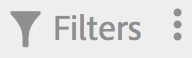

# Filtrare i segmenti

Filtrare per tag, proprietari e altri filtri (Mostra tutti, Personale, Condiviso con me, Preferiti e Approvato).

Il filtro semplifica la ricerca di segmenti nella barra laterale.

1. In the Segment Manager, click the **[!UICONTROL Filters]** icon:  

   

1. Sono disponibili i filtri seguenti:

   | Nome filtro | Descrizione |
   |---|---|
   | Tag | Lets you filter on segments with specific [tags](../../../components/c-segmentation/c-segmentation-workflow/seg-tag.md#concept_CD892CEB326C4986A1B67487052DBA50). La colonna Tag viene visualizzata per impostazione predefinita. |
   | Proprietari | Consente di filtrare i segmenti per proprietario. |
   | Altri filtri &gt; Mostra tutto | **(Solo amministratore)** Mostra tutti i segmenti, il relativo proprietario e l'ultima data in cui sono stati modificati. |
   | Altri filtri &gt; Personale | Mostra tutti i segmenti di cui sei titolare. |
   | Altri filtri &gt; Condiviso con me | Shows all segments that others [shared](../../../components/c-segmentation/c-segmentation-workflow/t-seg-share.md#task_7DC54643083E42C28F918E4F0845C5A5) with you. |
   | Altri filtri &gt; Preferiti | Shows all segments you marked as [Favorites](../../../components/c-segmentation/c-segmentation-workflow/t-seg-favorite.md#task_F45DFA3FBF0C4082B46A0D032CB20FC5). |
   | Altri filtri &gt; Approvato | Shows all officially [approved](../../../components/c-segmentation/c-segmentation-workflow/seg-approve.md#concept_DF477F151A9E483A92ED1DDAAF035953) segments. |
   | Cerca segmenti | Consente di cercare i segmenti in base al nome. |

