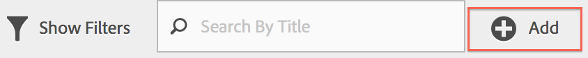

# Domande frequenti

Risposte frequenti alle domande sulla segmentazione, l'accesso, le autorizzazioni, le best practice e la gestione dei segmenti legacy.

## Funzioni {#section_BD58629D1A9346BF879E229FA6BEC7A2}

* Segmentazione in Analysis Workspace:

   * [Puoi confrontare segmenti](https://marketing.adobe.com/resources/help/en_US/analytics/analysis-workspace/segment-comparison.html).
   * Use [segments as dimensions](https://marketing.adobe.com/resources/help/en_US/analytics/analysis-workspace/segments_as_dimensions.html) in a comparison.
   * Use segments in [fallout analysis](https://marketing.adobe.com/resources/help/en_US/analytics/analysis-workspace/graphics/compare-segments-fallout.html).

* [Puoi applicare più segmenti a un report o a un progetto](../../components/c-segmentation/c-segmentation-workflow/seg-workflow.md#task_13E69C7D428A43EF9CCCA7F1104F1E8F).
* I segmenti sono universali a tutte le suite di rapporti.
* [Generatore di segmenti](../../components/c-segmentation/c-segmentation-workflow/seg-workflow.md#concept_643F2DF74C544796B58F4656ABC5F726) semplifica la creazione dei segmenti.
* The [Segment Manager](../../components/c-segmentation/c-segmentation-workflow/seg-workflow.md#concept_7A2E019317864065B7C641DC3315928F) lets you set up [workflows](../../components/c-segmentation/c-segmentation-workflow/seg-workflow.md#concept_6D2E1A72A3AD4EBBB9135094F2D9DEDF) with segment sharing, tagging, verification, and approval features.

* You can [tag segments](../../components/c-segmentation/c-segmentation-workflow/seg-workflow.md#concept_CD892CEB326C4986A1B67487052DBA50) to organize and search later instead of using folders. Previously, you used folders (in [!DNL Ad Hoc Analysis]) to organize your segments.

* You can create [Sequential Segments](/help/components/c-segmentation/c-segmentation-workflow/seg-sequential-build.md) outside of Ad Hoc Analysis.
* Il contenitore Visualizzazione pagina è stato rinominato nel contenitore Hit per indicare che il contenitore segmenta tutti i tipi di dati e non solo le visualizzazioni di pagina. Ad esempio, le chiamate di tracciamento dei collegamenti e le chiamate trackaction dagli SDK per dispositivi mobili sono tutte incluse o escluse dal contenitore hit. Tenete presente che non è stata apportata alcuna modifica al modo in cui questa funzione contenitore è stata semplicemente rinominata.

See the [Improving Segmentation in Adobe Analytics](https://blogs.adobe.com/digitalmarketing/analytics/improving-segmentation-adobe-analytics/) post on the Digital Marketing Blog for more details.

## Access the Segmentation Tools {#section_088AD0E4E21943DFA8CF7206AEC485DD}

**Come si accede al Generatore di segmenti?**

Puoi accedere al Generatore di segmenti:

* Displaying an existing report and clicking the Segments icon   in the left navigation. In the segment rail that displays, then click **[!UICONTROL Add]**, or

* At the top of the Segment Manager, clicking **[!UICONTROL + Add]**.  

    oppure 

* Fai clic su un titolo segmento esistente in Gestione segmenti per modificare il segmento in Segment Builder (Generatore segmenti).

**Come posso passare a Gestione segmenti?**

Accedi a Gestione segmenti da:

* Going to  **[!UICONTROL Analytics]** &gt; **[!UICONTROL Components]** in the top navigation. Then click **[!UICONTROL Segments]**, or

* Displaying an existing report and clicking the Segments icon   in the left navigation. Then click **[!UICONTROL Manage]**, or

* Premere la chiave «/» in qualsiasi punto dell'interfaccia e cercare il gestore segmenti.

**Dove go the legacy segment-down goes?**

The segment drop-down in Reports &amp; Analytics has been replaced by a much more feature rich [Segment Builder](../../components/c-segmentation/c-segmentation-workflow/seg-workflow.md#concept_643F2DF74C544796B58F4656ABC5F726) interface that lets you to create "universal" segments usable across report suites and across Adobe Analytics solutions. To view a list of existing segments, click the Segments icon  

nella navigazione a sinistra e la barra laterale del segmento.

**Dove go the legacy report suite drop-down?**

Il menu a discesa Suite di rapporti è stato spostato accanto al selettore della data nell'angolo in alto a destra di ogni report o dashboard.

## Permissions {#section_648DFA3A882146C485A84ED014EEC707}

**Quali diritti e privilegi sono necessari per utilizzare, creare e gestire i segmenti?**

Per impostazione predefinita, tutti gli utenti possono creare e modificare segmenti personali. However, Admins can decide who should have [permissions to create segments](https://marketing.adobe.com/resources/help/en_US/reference/groups.html) and can assign them to specific groups. Questi segmenti possono essere condivisi direttamente con qualsiasi altro utente Analytics.

Gli amministratori possono modificare qualsiasi segmento e condividere segmenti con gruppi e con chiunque nell'organizzazione. [Altro...](../../components/c-segmentation/seg-reference/seg-rights.md)

**Posso visualizzare tutti i segmenti nella mia azienda?**

Yes, Admins can see all segments within the [!DNL Analysis Workspace] and [!DNL Reports & Analytics] user interfaces.

Ad Hoc Analyics e Generatore di report consente di visualizzare i segmenti che possedete e i segmenti condivisi con voi.

**Posso gestire tutti i segmenti Analytics in Gestione segmenti?**

Sì, tutti i segmenti possono essere gestiti in Gestione segmenti in Analysis Workspace, Reporting e analisi e Analisi ad hoc. Gestione segmenti visualizza segmenti visibili al proprietario (utente che ha creato il segmento), utenti condivisi e utenti admin. Il selettore segmenti visualizza i segmenti di proprietà e condivisi con l'utente.

Admins can see all segments within the Analysis Workspace and [!DNL Reports & Analytics] user interfaces.

Analisi ad hoc e Generatore di report visualizzano solo i segmenti creati da voi o i segmenti che sono stati condivisi espressamente con voi.

**Perché non posso eliminare questo segmento?**

If the segment was [published to the Experience Cloud](../../components/c-segmentation/c-segmentation-workflow/seg-workflow.md#concept_1E9FC92437D748C392546542B6511D01), you cannot delete it or edit it. Tuttavia, potete copiarlo e modificarne la versione copiata.

## Best practice {#section_E2C3A1B4B4274D1B86CAA9C0359D049C}

**Cosa devo fare con segmenti duplicati che hanno lo stesso nome ma possono avere definizioni diverse?** Ora che i segmenti funzionano in più suite di rapporti, potresti notare che hai più segmenti con lo stesso nome. Consigliamo di:

* Rinominare i segmenti con lo stesso nome, ma diverse definizioni o
* Eliminare i segmenti non più necessari.

**Cosa consiglia Adobe all'eliminazione dei segmenti?**

* Assegna tag a tutti i segmenti con tag legacy.
* Controlla i segmenti che hai.
* Aggiungili alla libreria segmenti, ove applicabile.
* Approvare segmenti canonici.
* Tag segments according to [best practices](../../components/c-segmentation/c-segmentation-workflow/seg-workflow.md#concept_CD892CEB326C4986A1B67487052DBA50).

## Managing Legacy Segments {#section_76CF47142D1A4FB6A0718AD9073049FE}

**Cosa succede ai segmenti esistenti?**

I segmenti esistenti continueranno a funzionare come prima. Tutti i rapporti che presentano questi segmenti continueranno a funzionare correttamente. [Altro...](../../components/c-segmentation/seg-transition.md#section_83ACAB256F394DCD8B424D8920BDD853)

La maggior parte dei precedenti segmenti predefiniti e delle suite verranno migrati come modelli di segmento nel Generatore di segmenti. I modelli di segmento vengono utilizzati per creare rapidamente segmenti personalizzati con audience comuni. I modelli di segmento non possono essere applicati direttamente a un rapporto, ma possono essere salvati facilmente in un segmento personalizzato.

I modelli di segmento sono contrassegnati con un'icona speciale in Segment Builder (Generatore segmenti):

**Cosa succede alle cartelle dei segmenti esistenti?**

Invece di (Analisi ad hoc), il Gestore segmenti utilizza i tag. I nomi delle cartelle vengono automaticamente convertiti in tag e questi tag vengono applicati ai rispettivi segmenti.

**Cosa è accaduto ai rapporti pianificati in cui sono applicati segmenti?**

I rapporti pianificati continuano a essere eseguiti correttamente con i segmenti definiti.

Quando eliminate un segmento, i report pianificati e le dashboard in cui questo segmento è applicato continuano a funzionare normalmente, ovvero il segmento o il dashboard continua a utilizzare il segmento eliminato.

I rapporti pianificati non vengono aggiornati quando si modifica un segmento con lo stesso nome. Esempio: Supponiamo che tu abbia 2 segmenti con lo stesso nome in suite di rapporti diverse:

Hai un segnalibro che fa riferimento al segmento per la suite di rapporti principale. Quindi, eliminate il segmento perché si tratta di un duplicato. Il segnalibro continua a essere eseguito facendo riferimento alla definizione del segmento eliminato. Se modifichi la definizione del segmento affinché il segmento maindev includa l'isola di Catalina e Tijuana Mexico, il segmento applicato al segnalibro non cambia. Verrà utilizzata la vecchia definizione. Per risolvere questo problema, aggiornare il segnalibro per fare riferimento alla nuova definizione. Se non sei sicuro se un segnalibro, un dashboard o un rapporto pianificato utilizzi un segmento eliminato, potresti modificare il nome del segmento rimanente in modo da chiarire se il segnalibro utilizza il segmento rimanente.

**Cosa succede ai segmenti Data Warehouse?**

Tutti i segmenti Data Warehouse esistenti funzionano ancora in Data Warehouse. La maggior parte dei segmenti Data Warehouse funziona anche in altri componenti come Analysis Workspace, Analisi ad hoc e Reporting e analisi.

Puoi creare o modificare i nuovi segmenti Data Warehouse nel generatore di segmenti/manager. Il meccanismo di compatibilità prodotto in Generatore segmenti determina automaticamente se un segmento è compatibile con Data Warehouse.

**Cosa succede ai segmenti Preferiti (Analisi ad hoc)?**

Questi segmenti di analisi ad hoc vengono visualizzati come segmenti regolari in Adobe Analytics.

Non devono essere confusi con la funzione Preferiti in Gestione segmenti che consente di contrassegnare i segmenti come preferiti.

**Cosa succede ai segmenti pre-configurati?**

* **Visite a pagina singola**
* **Visite da dispositivi mobili**
* **Visite da ricerca naturale**
* **Visite da Paid Search**
* **Visite con cookie ID visitatore**

Questi segmenti verranno migrati come modelli di segmento nel Generatore di segmenti.

I rapporti esistenti che presentano questi segmenti continueranno a funzionare correttamente.

** Cosa succede ai segmenti Experience Cloud (Suite): **

* Acquirenti non acquirenti
* Acquirenti
* Visite prima visita
* Visite da social sites
* Visite di oltre 10 minuti *
* Visite con 5 + Visite precedenti *
* Visite da Facebook *

La maggior parte di questi segmenti (eccetto quelli contrassegnati con un asterisco *) verranno migrati come modelli di segmento nel generatore di segmenti. Sono stati aggiunti inoltre diversi modelli di segmento.

I rapporti esistenti che presentano questi segmenti continueranno a funzionare correttamente.

**Cosa succede ai segmenti Admin (noti anche come segmenti "Global")?**

**I segmenti di amministratore** verranno migrati nella nuova interfaccia del segmento e saranno visualizzati come segmenti condivisi con tutti.

Il proprietario di questi segmenti è impostato sull'amministratore con l'account più vecchio nell'elenco degli utenti admin della società di accesso, tuttavia, tutti gli amministratori possono eliminare, modificare e condividere questi segmenti.

L'interfaccia di gestione segmenti nell'Admin Console in cui gli amministratori creati e gestiti non sono più disponibili. Adesso, gli amministratori devono usare il nuovo generatore di segmenti per creare segmenti e condividerli con gruppi o singoli gruppi oppure con tutti.

<!-- 

seg_definition.xml

 -->

I segmenti esistenti che sono stati modificati come descritto in questo documento continuano a funzionare correttamente, ma devono essere aggiornati prima di poter essere salvati di nuovo. Ad esempio, se hai un segmento esistente in cui gli Stati Uniti contengono «New York», il problema continua a funzionare correttamente, ma alla successiva modifica del segmento dovrai aggiornarlo per usare il tipo enumerato con una condizione uguale a.

**Suggerimenti per la migrazione**

I suggerimenti seguenti faciliteranno la migrazione delle dimensioni comuni:

* Geo-city/region/country - Cerca e seleziona città specifiche, regioni o paesi, invece di utilizzare una corrispondenza parziale.
* Browser - Utilizzate la dimensione Tipi browser per ottenere tutti i browser di un tipo, ad esempio Google Chrome
* Sistemi operativi: utilizzate le dimensioni dei tipi di sistema operativo per ottenere tutti i sistemi operativi di un tipo, ad esempio Microsoft Windows.

* [Dimensioni nuove e rinominate](../../components/c-segmentation/seg-transition.md#section_73CF121B64A24DEF8E6499F3167BF742)
* [Modifiche a Contiene](../../components/c-segmentation/seg-transition.md#section_1A9EDEE5CBC44B5AA6262560052ABE77)
* [Modifiche a Minore di e Maggiore di](../../components/c-segmentation/seg-transition.md#section_84A8AAD0344148AD9F9211D3EB271903)

## New and Renamed Dimensions {#section_73CF121B64A24DEF8E6499F3167BF742}

La tabella seguente contiene un elenco di dimensioni rinominate in Segment Builder (Generatore segmenti).

<table id="table_1A8C1940FD0446FA8414C6A7DE66E44C"> 
 <thead> 
  <tr> 
   <th colname="col1" class="entry"> Nuovo nome dimensione </th> 
   <th colname="col2" class="entry"> Nome precedente </th> 
   <th colname="col3" class="entry"> Note </th> 
  </tr> 
 </thead>
 <tbody> 
  <tr> 
   <td colname="col1"> Tipi di sistemi operativi </td> 
   <td colname="col2"> Nuovo </td> 
   <td colname="col3"> Aggiunto in primavera 2015. </td> 
  </tr> 
  <tr> 
   <td colname="col1"> Larghezza browser - Bande </td> 
   <td colname="col2"> Larghezza browser </td> 
   <td colname="col3"> Questa dimensione è compatibile con tutte le interfacce ed è suddivisa in un elenco enumerato di intervalli invece che in valori interi specifici. Se devi segmentare valori specifici, usa la versione granulare di questa dimensione in un segmento data warehouse. </td> 
  </tr> 
  <tr> 
   <td colname="col1"> Altezza browser - Bande </td> 
   <td colname="col2"> Altezza browser </td> 
   <td colname="col3"> Questa dimensione è compatibile con tutte le interfacce ed è suddivisa in un elenco enumerato di intervalli invece che in valori interi specifici. Se devi segmentare valori specifici, usa la versione granulare di questa dimensione in un segmento data warehouse. </td> 
  </tr> 
  <tr> 
   <td colname="col1"> Larghezza browser - Granulare </td> 
   <td colname="col2"> Larghezza browser </td> 
   <td colname="col3"> 
Questo è stato rinominato ed è ora compatibile con solo data warehouse. Quando si definiscono segmenti compatibili con tutte le interfacce, utilizzare il tipo enumerato, Larghezza browser - Bande. 
 </td> 
  </tr> 
  <tr> 
   <td colname="col1"> Altezza browser - Granulare </td> 
   <td colname="col2"> Altezza browser </td> 
   <td colname="col3"> 
Questo è stato rinominato ed è ora compatibile con solo data warehouse. Quando si definiscono segmenti compatibili con tutte le interfacce, utilizzare il tipo enumerato, Altezza browser - Bande. 
 </td> 
  </tr> 
  <tr> 
   <td colname="col1"> Supporto cookie </td> 
   <td colname="col2"> Cookie </td> 
   <td colname="col3"> - </td> 
  </tr> 
  <tr> 
   <td colname="col1"> Profondità colore </td> 
   <td colname="col2"> Profondità colore monitor </td> 
   <td colname="col3"> - </td> 
  </tr> 
  <tr> 
   <td colname="col1"> - </td> 
   <td colname="col2"> "App - *" </td> 
   <td colname="col3"> i prefissi "App -" sono stati rimossi da una serie di tipi di dimensioni. Poiché i dati dell'app mobile sono in genere catturati in una suite di rapporti che non contiene dati Web, questi prefissi non sono necessari. </td> 
  </tr> 
  <tr> 
   <td colname="col1"> Pagina di immissione originale </td> 
   <td colname="col2"> Pagina di immissione originale </td> 
   <td colname="col3"> - </td> 
  </tr> 
  <tr> 
   <td colname="col1"> Java abilitato </td> 
   <td colname="col2"> Java </td> 
   <td colname="col3"> - </td> 
  </tr> 
  <tr> 
   <td colname="col1"> Lunghezza URL max browser mobile </td> 
   <td colname="col2"> Lunghezza URL del browser mobile </td> 
   <td colname="col3"> - </td> 
  </tr> 
  <tr> 
   <td colname="col1"> Decorazione di Mobile Mail </td> 
   <td colname="col2"> Mobile Decoration Mail Support </td> 
   <td colname="col3"> - </td> 
  </tr> 
  <tr> 
   <td colname="col1"> Dispositivo mobile </td> 
   <td colname="col2"> Nome dispositivo mobile </td> 
   <td colname="col3"> - </td> 
  </tr> 
  <tr> 
   <td colname="col1"> Lunghezza segnalibro max. mobile </td> 
   <td colname="col2"> Lunghezza URL segnalibro max Mobile </td> 
   <td colname="col3"> - </td> 
  </tr> 
  <tr> 
   <td colname="col1"> Lunghezza e-mail max-mobile </td> 
   <td colname="col2"> Lunghezza URL posta max. mobile </td> 
   <td colname="col3"> - </td> 
  </tr> 
  <tr> 
   <td colname="col1"> Sistema operativo mobile (obsoleto) </td> 
   <td colname="col2"> Sistema operativo mobile </td> 
   <td colname="col3"> Utilizza la dimensione Sistema operativo e applica invece le visite ai segmenti dei dispositivi mobili. </td> 
  </tr> 
  <tr> 
   <td colname="col1"> Push Push per parlare </td> 
   <td colname="col2"> PTT mobile </td> 
   <td colname="col3"> - </td> 
  </tr> 
  <tr> 
   <td colname="col1"> Visualizzazioni sondaggio </td> 
   <td colname="col2"> Totale visualizzazioni sondaggio </td> 
   <td colname="col3"> - </td> 
  </tr> 
  <tr> 
   <td colname="col1"> Risposte sondaggio </td> 
   <td colname="col2"> Risposte totali sondaggio </td> 
   <td colname="col3"> - </td> 
  </tr> 
  <tr> 
   <td colname="col1"> Profondità visita </td> 
   <td colname="col2"> Lunghezza percorso </td> 
   <td colname="col3"> - </td> 
  </tr> 
  <tr> 
   <td colname="col1"> Codice postale </td> 
   <td colname="col2"> CAP </td> 
   <td colname="col3"> - </td> 
  </tr> 
 </tbody> 
</table>

## Changes to String-Based Dimensions that have Known Values {#section_1A9EDEE5CBC44B5AA6262560052ABE77}

Le dimensioni basate su stringhe che presentano un set noto di valori sono state modificate in tipi enumerati. Quando si crea un segmento utilizzando queste dimensioni, l'elenco viene precompilato con tutti i valori noti e l'unico operatore supportato è uguale a. Questo consente di segmentare rapidamente i valori esatti desiderati senza selezionare valori non desiderati quando si usano corrispondenze meno restrittive.

Sono state modificate le seguenti dimensioni in elenchi enumerati:

| produttore mobile | lunghezza e-mail per dispositivi mobili | profondità colore |
|---|---|---|
| dimensioni schermo mobile | numero di dispositivi mobili | risoluzione monitor |
| altezza schermo mobile | push push per parlare | plugin |
| supporto dei cookie per dispositivi mobili | decorazione e-mail | sistema operativo |
| supporto per immagini mobili | servizi di informazioni mobili | tipo referrer |
| profondità colore per dispositivi mobili | tipo di dispositivo mobile | motore di ricerca |
| supporto audio per dispositivi mobili | tipo di browser | state |
| supporto video per dispositivi mobili | browser | geo country |
| mobile drm | tipo di connessione | area geografica |
| protocolli net, protocolli | operatore mobile | geo city |
| sistema operativo mobile | cookie | geo dma |
| mobile java vm | fidelizzazione dei clienti | cookie persistente |
| Lunghezza segnalibro per dispositivi mobili | java abilitato | paid search |
| lunghezza URL mobile | language |  |

## Changes to Integer-Based Dimensions that have Known Values {#section_84A8AAD0344148AD9F9211D3EB271903}

Dimensioni basate su integer (come la larghezza del browser) con un set noto di valori sono state suddivise in intervalli enumerati, per definire rapidamente i segmenti per un intervallo specifico. A questi elenchi enumerati viene aggiunto " - Bucketed" dopo il nome della dimensione. La schermata seguente illustra come queste dimensioni vengono segmentate utilizzando le interfacce di generatore di segmenti precedenti e nuove:

Gli operatori minore di, maggiore e simili sono ora compatibili solo con i segmenti Data Warehouse. I segmenti progettati per essere compatibili con tutte le interfacce di reporting devono utilizzare la versione "Bucketed" della metrica con l'operatore uguale a.
