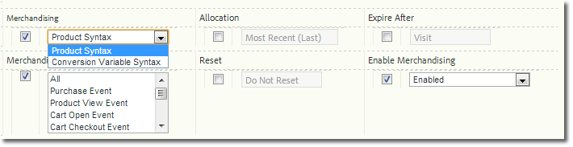

# Implementazione di una variabile di merchandising

Descrive come abilitare e implementare una variabile di merchandising.

## Enable a Merchandising Variable {#section_331B41FF5AED42F2AEFE043DD60238C7}

Merchandising can be enabled for any custom eVar on the **[!UICONTROL Admin Tools]** &gt; **[!UICONTROL Report Suites]** &gt; **[!UICONTROL Conversion Variables]** page (you no longer need to call Adobe):



| Impostazione | Descrizione |
|--- |--- |
| Scade dopo | Determina il tempo di permanenza dei valori di merchandising. |
| Merchandising | Sintassi prodotto: Il valore è impostato all'interno di s. products. Sintassi variabile conversione: Il valore viene impostato nel merchandising designato s. evar. |
| Evento di associazione merchandising (solo sintassi della variabile Conversione) | Indica quando un prodotto deve essere associato alla categoria di merchandising corrente. È possibile selezionare più eventi tenendo premuto Ctrl e facendo clic su più elementi nell'elenco. Nota: Quando selezionate "Sintassi prodotto", non potete scegliere un evento (disattivato, ma non disabilitato). È possibile selezionare un evento solo quando è selezionata la "sintassi variabile conversione". |

## Implementing Using Product Syntax {#section_2774578D09CE40A093CB0D0A294DBF7C}

Quando è abilitata la sintassi del prodotto, la categoria merchandising viene compilata direttamente all'interno della variabile "products", quindi la selezione e l'impostazione di un evento di binding non sono necessarie. This is the recommended method and should be used unless the value is not available to set in `s.products` when the success event takes place.

* **Sintassi**

```js
  s.products="category;product;quantity;price;event_incrementer; 
<codeph outputclass="syntax">
  eVarN=merch_category| 
 <codeph outputclass="syntax">
   eVarM=merch_category2" 
 </codeph outputclass="syntax"> 
</codeph outputclass="syntax">
```

* **Esempio**

```js
  s.events="prodView" 
  s.products=";Fernie Snow Goggles;;;; 
<codeph outputclass="syntax">
  eVar1=goggles" 
   In 
</codeph outputclass="syntax">
```

Il valore «goggles» per evar 1 è assegnato al prodotto «Fernie Snow Goggles». Tutti gli eventi di successo successivi (aggiunti prodotti, pagamenti, acquisti e così via) che coinvolgono il prodotto vengono accreditati su «goggles».

## Implementing Using Conversion Variable Syntax {#section_6AE10F69F4A14636AB050BEA89A34E4E}

Conversion Variable Syntax should be used when the eVar value is not available to set in `s.products`. In genere significa che la pagina non ha contesto del canale merchandising o di ricerca. In questi casi, è necessario impostare la variabile merchandising prima di accedere alla pagina del prodotto e il valore persiste fino a quando non si verifica l'evento di binding.

Quando si verifica l'evento di binding selezionato durante la configurazione, il valore persistente della evar è associato al prodotto. Ad esempio, se prodview è specificato come evento di binding, la categoria merchandising viene associata all'elenco di prodotti corrente solo al momento dell'evento. Solo gli eventi di associazione successivi possono aggiornare un evar di merchandising che è già stato assegnato a un prodotto.

* **Sintassi** sulla stessa pagina o pagina precedente prima dell'evento di binding:

   ```js
   s.eVar1="merchandising_category"
   ```

   Nella pagina in cui si verifica l'evento di binding:

   ```js
   s.events="prodView" 
   s.products="category;product"
   ```

* **Esempio** Pagina 1 della visita:

   ```js
   s.eVar1="Outdoors:Ski Goggles"
   ```

   Pagina 2 della visita:

   ```js
   s.events="prodView" 
   s.products=";Fernie Snow Goggles"
   ```

   Il valore «Outdoors: Sci Goggles "per evar 1 è assegnato al prodotto" Fernie Snow Goggles ". Tutti gli eventi di successo successivi (aggiunti prodotti, pagamenti, acquisti e così via) che coinvolgono il prodotto vengono accreditati su «goggles».

Inoltre, il valore corrente della variabile merchandising è associato a tutti i prodotti successivi finché non viene soddisfatta una delle seguenti condizioni:

* Scade evar (in base all'impostazione "Scadenza dopo")
* L'evar di merchandising viene sovrascritto con un nuovo valore.

For more information, see " [Advanced Conversion Syntax Merchandising](https://analyticsdemystified.com/adobe-analytics/advanced-conversion-syntax-merchandising/)" at [!DNL analyticsdemystified.com].
