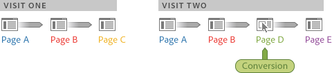

# Partecipazione visitatore - Analisi ad hoc

Partecipazione visitatore è una serie di metriche che consente di visualizzare la partecipazione tra le sessioni dei visitatori in canali di marketing, campagne, entrate e così via. Ad esempio, l'acquisto e il credito delle entrate possono essere attribuiti ad altri punti di contatto di marketing che si sono verificati prima della visita in cui ha avuto luogo l'ordine. Analisi ad hoc offre la partecipazione dei visitatori tra visite.

**Entrate (Partecipazione)**: Esegue il calcolo del credito di conversione su tutte le pagine in una singola visita che ha portato alla conversione, fino alla pagina di conversione.

**Entrate (Partecipazione visitatore)**: Effettua il calcolo del credito di conversione in tutte le pagine e nelle visite, in base a un intervallo di tempo specificato.

**Esempio - Partecipazione alle entrate incrociate**

Un visitatore ha due visite al sito. L'evento di conversione si verifica durante la seconda visita, sulla pagina D, a $ 60 delle entrate:

Nel rapporto, l'allocazione di conversione è la seguente:

* **Entrate**: Allocata alla pagina.
* **Entrate (Partecipazione)**: Allocata alla seconda visita.
* **Entrate (Partecipazione visitatore)**: Allocato in entrambe le visite.

<table id="table_91A7244E77854838A8392B49366FB445"> 
 <thead> 
  <tr> 
   <th colname="col1" class="entry"> Pagina </th> 
   <th colname="col2" class="entry"> Ricavi </th> 
   <th colname="col3" class="entry"> Entrate (Partecipazione) </th> 
   <th colname="col4" class="entry"> Revenue (Partecipazione visitatore) </th> 
  </tr> 
 </thead>
 <tbody> 
  <tr> 
   <td colname="col1"> 
Una  
 </td> 
   <td colname="col2"> 
0 
 </td> 
   <td colname="col3"> 
$60 
 </td> 
   <td colname="col4"> 
$60 
 </td> 
  </tr> 
  <tr> 
   <td colname="col1"> 
B 
 </td> 
   <td colname="col2"> 
0 
 </td> 
   <td colname="col3"> 
$60 
 </td> 
   <td colname="col4"> 
$60 
 </td> 
  </tr> 
  <tr> 
   <td colname="col1"> 
C 
 </td> 
   <td colname="col2"> 
0 
 </td> 
   <td colname="col3"> 
0 
 </td> 
   <td colname="col4"> 
$60 
 </td> 
  </tr> 
  <tr> 
   <td colname="col1"> 
D 
 </td> 
   <td colname="col2"> 
$60 
 </td> 
   <td colname="col3"> 
$60 
 </td> 
   <td colname="col4"> 
$60 
 </td> 
  </tr> 
 </tbody> 
</table>

