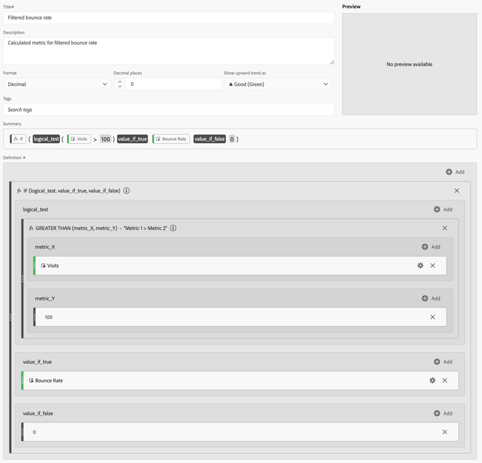
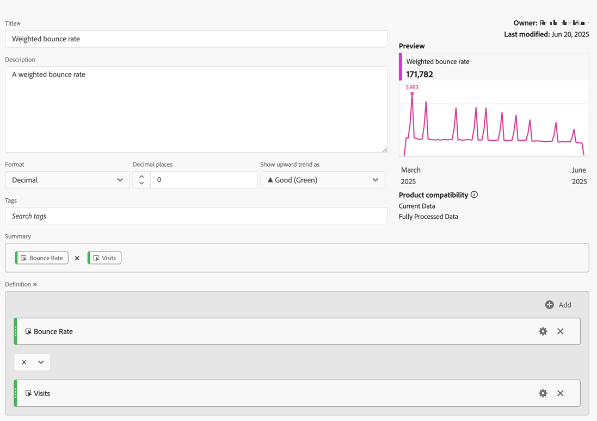

# Metriche filtrate e ponderate

Questo articolo mostra esempi di metriche filtrate e ponderate.

## Percentuale di mancato recapito filtrata

Questa semplice metrica filtrata mostra il tasso di mancato recapito solo per le pagine con più di 100 visite:

{zoomable="yes"}

Tieni presente che questa formula dipende da un intervallo di tempo coerente. Se esegui un rapporto per un singolo giorno, vale la pena esaminare qualsiasi pagina con più di 20 visite. Se lo esegui per un mese, potrebbe essere utile che il filtro includa più visite.

## Percentuale mancati recapiti filtrati con percentile

Questo filtro mostra la percentuale di mancati recapiti per il 30% delle pagine principali, quando ordinato in base alle visite.

{zoomable="yes"}

## Percentuale di mancato recapito ponderata

Supponiamo di voler ordinare in generale per frequenza di rimbalzo, ma le pagine con visite più alte dovrebbero essere più in alto nell’elenco. Puoi creare una percentuale di mancato recapito ponderata simile alla seguente:

