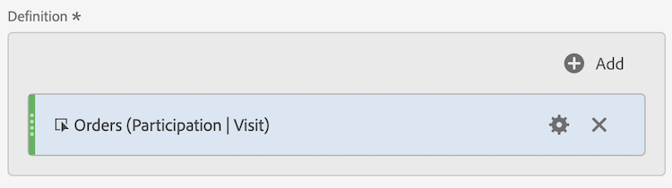

# Metriche di partecipazione.

Le metriche di partecipazione vengono utilizzate per quantificare il modo in cui i singoli valori di una dimensione (come Visualizzazioni di pagina) contribuiscono o partecipano alle visite che contengono una metrica specifica (come Ordini).

I passaggi seguenti mostrano come creare una metrica di partecipazione.

1. [Creare una metrica calcolata](../cm-workflow.md) e nel [Generatore di metriche calcolate](cm-build-metrics.md), denominare la metrica `Orders (Visit Participation)` o una metrica simile.
1. Trascinare una metrica contenente un evento di successo, ad esempio [!DNL Online Orders], nell&#39;area [!UICONTROL **[!UICONTROL Definition]**].
1. Selezionare  per la metrica.
1. Nel popup visualizzato, selezionare **[!UICONTROL Use a non-default attribution model]** per definire il [modello di attribuzione](m-metric-type-alloc.md#attribution-models) dell&#39;evento a **[!UICONTROL Participation]** e selezionare **[!UICONTROL Visits]** per [!UICONTROL Container]. Selezionare **[!UICONTROL Apply]** per confermare.

   

   **(Partizione|Visite|30 giorni)** è stato aggiunto al nome del componente metrica.

1. Seleziona [!UICONTROL **Salva**] per salvare la metrica.
1. Utilizza la metrica calcolata nel rapporto. Ad esempio, utilizza la metrica [!DNL Orders (Session Participation)] calcolata in un rapporto per mostrare quale livello cliente ha contribuito (o partecipato) alle sessioni che contenevano un ordine.

   

<!--

The following information explains how to create a metric that shows which pages contributed to (or participated in) visits that contained an order.

This type of information could be useful for any content owner.

>[!NOTE]
>
>You can enable participation metrics in the Admin Tools, but only for custom events 1 - 100.

1. Begin creating a calculated metric, as described in [Build metrics](/help/components/calculated-metrics/workflow/c-build-metrics/cm-build-metrics.md).

1. In the Calculated metrics builder, name the metric "Participation".

1. Drag the success event "Orders" into the Definition canvas.

1. Change the [attribution model](/help/components/calculated-metrics/workflow/c-build-metrics/m-metric-type-alloc.md) of that event to **[!UICONTROL Participation]** under the **[!UICONTROL Settings]** gear. Select **[!UICONTROL Visit]** lookback. The definition should look similar to this:

   

1. Select [!UICONTROL **Save**] to save the metric.

1. Use the calculated metric in a **[!UICONTROL Pages]** report.

    

1. (Optional) Share the metric with other users in your organization, as described in [Share calculated metrics](/help/components/calculated-metrics/workflow/cm-sharing.md).
-->