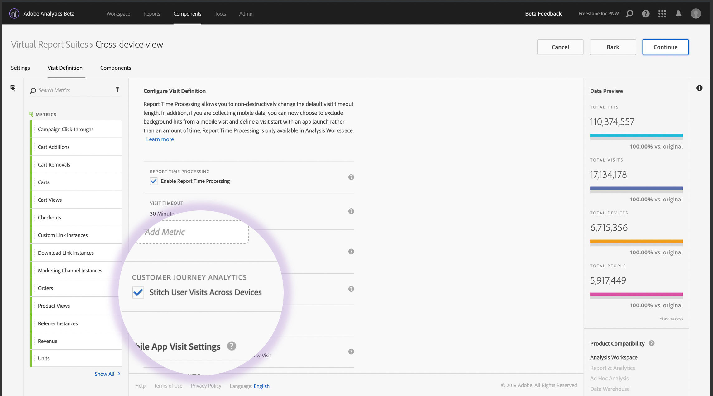

# Configurare Analytics tra dispositivi

Una volta soddisfatti tutti i prerequisiti, attenetevi alla seguente procedura per abilitare l&#39;analisi tra dispositivi. Per seguire questa procedura, devi appartenere a un gruppo Amministratore profilo di prodotto o avere privilegi di amministratore in  Adobe Analytics.

>[!IMPORTANT]
>
>Tutti i prerequisiti devono essere soddisfatti prima di seguire questi passaggi. Se tutti i prerequisiti non sono soddisfatti, la funzione non è disponibile o non funziona. Per i prerequisiti e le limitazioni, vedere la pagina [panoramica](overview.md) e il metodo di cucitura desiderato ([cucitura basata sui campi](field-based-stitching.md) o [Device Graph](device-graph.md), rispettivamente).

## Contatta il tuo Customer Success Manager per richiedere il provisioning di CDA nella suite di rapporti per dispositivi diversi

CDA viene fornito sulla suite di rapporti per dispositivi diversi  progettazione di Adobi. Contatta il tuo responsabile del successo cliente con le seguenti informazioni:

* ID organizzazione Adobe Experience Cloud (una stringa alfanumerica che termina con @AdobeOrg)
* ID suite di rapporti per la suite di rapporti multi-dispositivo che desideri abilitare con CDA
* Metodo di CDA da usare (cuciture basate sul campo, grafico privato  Adobe o grafico cooperativo  Adobe)
* Se intendete utilizzare la cucitura basata su campo, il prop o il eVar  che contiene l&#39;ID utente

Dopo aver fornito queste informazioni al CSM, questi utenti collaborano con  Adobe Engineering per attivare la suite di rapporti selezionata per l&#39;elaborazione CDA.

## Creare una suite di rapporti virtuali per dispositivi diversi per visualizzare la visualizzazione su più dispositivi

Gli amministratori con accesso per creare suite di rapporti virtuali possono creare suite di rapporti virtuali CDA come segue:

1. Andate a [experienceCloud.adobe.com](https://experiencecloud.adobe.com) ed effettuate l&#39;accesso utilizzando le credenziali AdobeID.
2. Fate clic sull&#39;icona a 9 griglie nella parte superiore, quindi fate clic su Analytics.
3. Passa il cursore del mouse sui componenti in alto, quindi fai clic su Suite di rapporti virtuale.
4. Fai clic su Aggiungi.
5. Immettete un nome per la suite di rapporti virtuali e accertatevi che sia selezionata la suite di rapporti abilitata per CDA.
6. (Facoltativo) Applicare un segmento alla suite di rapporti virtuali. Ad esempio, puoi applicare un segmento che limita la suite di rapporti virtuali alle date successive all&#39;attivazione di CDA e all&#39;inizio della cucitura. Questo segmento consente agli utenti di visualizzare solo gli intervalli di date cuciti all&#39;interno della VRS.
7. Fate clic sulla casella di controllo &quot;Abilita elaborazione tempo rapporto&quot; per abilitare diverse opzioni, tra cui Analisi multi-dispositivo.
8. Fate clic sulla casella di controllo &quot;Stitch User Visits Between Devices&quot; (Stitch Visite utente tra dispositivi).
9. Fate clic su Continue (Continua), completate la configurazione della suite di rapporti virtuali, quindi fate clic su Save (Salva).

## Aggiunte e modifiche alle suite di rapporti virtuali su più dispositivi

Quando Analytics cross-device è abilitato su una suite di rapporti virtuale, prendi nota delle seguenti modifiche:

* Accanto al nome della suite di rapporti virtuale viene visualizzata una nuova icona cross-device. Questa icona è esclusiva per le suite di rapporti virtuali su più dispositivi.
* È disponibile una nuova dimensione con etichetta [Stato identificato](../dimensions/identified-state.md). Questa dimensione determina se l&#39;ID Experience Cloud  sull&#39;hit è noto dal grafico del dispositivo in quel momento.
* Sono disponibili nuove metriche con etichetta [Persone](../metrics/people.md) e [Dispositivi univoci](../metrics/unique-devices.md).
* La metrica [Visitatori unici](../metrics/unique-visitors.md) non è disponibile, in quanto viene sostituita con &#39;Persone&#39; e &#39;Dispositivi univoci&#39;.
* Durante la creazione di segmenti, il contenitore del segmento &quot;Visitatore&quot; viene sostituito con un contenitore &quot;Persona&quot;.
