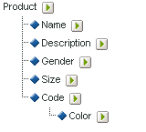

# Informazioni sulle classificazioni secondarie

 Adobe Analytics supporta modelli di classificazione a livello singolo e multiplo. Una gerarchia di classificazione consente di applicare una classificazione a una classificazione.

>[!NOTE]
>
>Per sottocategoria si intende la capacità di creare classificazioni di classificazioni. Tuttavia, non è lo stesso utilizzato [!UICONTROL Classification Hierarchy] per creare [!UICONTROL Hierarchy] rapporti. Per ulteriori informazioni sulle gerarchie di classificazione, vedere Gerarchie [di](classification-hierarchies.md)classificazione.

Ad esempio:

Ogni classificazione in questo modello è indipendente e corrisponde a una nuova sottorelazione per la variabile di reporting selezionata. Inoltre, ogni classificazione costituisce una colonna di dati nel file di dati, con il nome della classificazione come intestazione di colonna. Ad esempio:

| CHIAVE | PROPRIETÀ 1 | PROPRIETÀ 2 |
|---|---|---|
| 123 | ABC | A12B |
| 456 | DEF | C3D4 |

Per ulteriori informazioni sul file di dati, vedere File [di dati di](/help/components/classifications/c-classifications-importer/c-saint-data-files.md)classificazione.

Le classificazioni a più livelli sono composte da classificazioni padre e figlio. Ad esempio:

**Classificazioni padre:** Per classificazione padre si intende qualsiasi classificazione associata a una classificazione figlio. Una classificazione può essere sia una classificazione padre che una classificazione figlio. Le classificazioni principali corrispondono alle classificazioni a livello singolo (consultate Classificazioni [a livello](/help/components/classifications/c-sub-classifications.md)singolo).

**Classificazioni figlio:** Per classificazione figlio si intende qualsiasi classificazione con un&#39;altra classificazione come padre invece della variabile. Le classificazioni figlio forniscono informazioni aggiuntive sulla classificazione padre. Ad esempio, una [!UICONTROL Campaigns] classificazione potrebbe avere una classificazione figlio Proprietario campagna. [!UICONTROL Numeric] Le classificazioni funzionano anche come metriche nei report di classificazione.

Ogni classificazione, principale o secondario, costituisce una colonna di dati nel file di dati. Intestazione della colonna per una classificazione figlio utilizzando il seguente formato di denominazione:

`<parent_name>^<child_name>`

Per ulteriori informazioni sul formato del file di dati, vedere File [di dati di](/help/components/classifications/c-classifications-importer/c-saint-data-files.md)classificazione.

Ad esempio:

| CHIAVE | PROPRIETÀ 1 | Proprietà 1&amp;Cappello;Proprietà 1-1 | Proprietà 1&amp;Cappello;Proprietà 1-2 | Proprietà 2 |
|---|---|---|---|---|
| 123 | ABC | Verde | Piccolo | A12B |
| 456 | DEF | Rosso | Grande | C3D4 |

Anche se il modello di file per una classificazione a più livelli è più complesso, la potenza delle classificazioni a più livelli è che i livelli separati possono essere caricati come file separati. Questo approccio può essere utilizzato per ridurre al minimo la quantità di dati da caricare periodicamente (quotidianamente, settimanalmente e così via) raggruppando i dati in livelli di classificazione che si modificano nel tempo rispetto a quelli che non lo sono.

>[!NOTE]
>
>Se la [!UICONTROL Key] colonna in un file di dati è vuota,  Adobe genera automaticamente chiavi univoche per ogni riga di dati. Per evitare possibili danneggiamenti del file durante il caricamento di un file di dati con dati di classificazione di secondo livello o di livello superiore, compilare ciascuna riga della [!UICONTROL Key] colonna con un asterisco (*).

Consulta [Problemi](https://helpx.adobe.com/analytics/kb/common-saint-upload-issues.html) comuni relativi al caricamento delle classificazioni per la risoluzione dei problemi.

## Esempi

>[!NOTE]
I dati di classificazione dei prodotti sono limitati agli attributi di dati direttamente correlati al prodotto. I dati non si limitano alla classificazione o alla vendita dei prodotti sul sito Web. Gli elementi dati come categorie di vendita, nodi di ricerca del sito o elementi di vendita non sono dati di classificazione del prodotto. Tali elementi vengono invece acquisiti nelle variabili di conversione dei report.

Quando caricate i file di dati per questa classificazione di prodotto, potete caricare i dati di classificazione come un singolo file o più file (vedete di seguito). Separando il codice colore nel file 1 e il nome del colore nel file 2, i dati del nome del colore (che possono essere solo poche righe) devono essere aggiornati solo quando vengono creati nuovi codici colore. Questo elimina il campo del nome del colore (CODE&amp;Hat;COLOR) dal file 1 aggiornato con maggiore frequenza e riduce la dimensione e la complessità del file durante la generazione del file di dati.

### Classificazione prodotto - File singolo {#section_E8C5E031869C449F9B636F5EB3BFEC17}

| CHIAVE | NOME PRODOTTO | DETTAGLI DEL PRODOTTO | GENERE | DIMENSIONE | CODICE | CODE&amp;Cappello;COLORE |
|---|---|---|---|---|---|---|
| 410390013 | Polo-SS | Camicia Polo, manica corta (M,01) | M | M | 01 | Pietra |
| 410390014 | Polo-SS | Camicia Polo, manica corta (L,03) da uomo | M | L | 03 | Heather |
| 410390015 | Polo-LS | Camicia Polo femminile, manica lunga (S,23) | F | S | 23 | Aqua |

### Classificazione prodotto - Più file (file 1) {#section_A99F7D0F145540069BA4EEC0597FF13F}

| CHIAVE | NOME PRODOTTO | DETTAGLI DEL PRODOTTO | GENERE | DIMENSIONE | CODICE |
|---|---|---|---|---|---|
| 410390013 | Polo-SS | Camicia Polo, manica corta (M,01) | M | M | 01 |
| 410390014 | Polo-SS | Camicia Polo, manica corta (L,03) da uomo | M | L | 03 |
| 410390015 | Polo-LS | Camicia Polo femminile, manica lunga (S,23) | F | S | 23 |

### Classificazione prodotto - Più file (file 2) {#section_19ED95C33B174A9687E81714568D56A3}

| CHIAVE | CODICE | CODE&amp;Cappello;COLORE |
|---|---|---|
| * | 01 | Pietra |
| * | 03 | Heather |
| * | 23 | Aqua |
