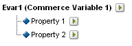

# Informazioni sulle sottoclassificazioni

Adobe Analytics supporta modelli di classificazione sia a livello singolo che a più livelli. Una gerarchia di classificazione consente di applicare una classificazione a una classificazione.

>[!NOTE]
>
>Con sottoclassificazione si intende la capacità di creare classificazioni di classificazioni. Le sottoclassificazioni sono diverse dalla [!UICONTROL Classification Hierarchy] (gerarchia di classificazione) utilizzata per creare rapporti [!UICONTROL Hierarchy]. Per ulteriori informazioni sulle gerarchie di classificazione, consulta [Gerarchie di classificazione](/help/admin/admin/conversion-var-admin/classification-hierarchies.md).

Ad esempio:

Ogni classificazione in questo modello è indipendente e corrisponde a un nuovo sottorapporto per la variabile di reporting selezionata. Inoltre, ogni classificazione costituisce una colonna di dati nel file di dati che ha come intestazione il nome della classificazione. Ad esempio:

| CHIAVE | PROPRIETÀ 1 | PROPRIETÀ 2 |
|---|---|---|
| 123 | ABC | A12B |
| 456 | DEF | C3D4 |

Per ulteriori informazioni sul file di dati, consulta [File di dati di classificazione](/help/components/classifications/importer/c-saint-data-files.md).

Le classificazioni a più livelli sono composte da classificazioni padre e figlio. Ad esempio:

**Classificazioni padre:** per classificazione padre si intende qualsiasi classificazione associata a una classificazione figlio. Una classificazione può essere sia una classificazione padre che una classificazione figlio. Le classificazioni padre principali corrispondono alle classificazioni a livello singolo.

**Classificazioni figlio:** per classificazione figlio si intende qualsiasi classificazione con un’altra classificazione come padre invece della variabile. Le classificazioni figlio forniscono informazioni aggiuntive sulla classificazione padre. Ad esempio, una classificazione [!UICONTROL Campaigns] potrebbe avere una classificazione figlio Campaign owner (Proprietario della campagna). Le classificazioni [!UICONTROL Numeric] svolgono anche la funzione di metriche nei rapporti di classificazione.

Ogni classificazione, padre o figlio, costituisce una colonna di dati nel file di dati. L’intestazione della colonna per una classificazione figlio utilizza il seguente formato di denominazione:

`<parent_name>^<child_name>`

Per ulteriori informazioni sul formato del file di dati, consulta [File di dati di classificazione](/help/components/classifications/importer/c-saint-data-files.md).

Ad esempio:

| CHIAVE | PROPRIETÀ 1 | Proprietà 1^Proprietà 1-1 | Proprietà 1^Proprietà 1-2 | Proprietà 2 |
|---|---|---|---|---|
| 123 | ABC | Verde | Piccolo | A12B |
| 456 | DEF | Rosso | Grande | C3D4 |

Anche se il modello di file per una classificazione a più livelli è più complesso, il vantaggio delle classificazioni a più livelli è che i livelli separati possono essere caricati come file separati. Questo approccio può essere utilizzato per ridurre al minimo la quantità di dati da caricare periodicamente (quotidianamente, settimanalmente e così via) raggruppando i dati in livelli di classificazione che cambiano e in livelli che non cambiano nel tempo.

>[!NOTE]
>
>Se la colonna [!UICONTROL Key] in un file di dati è vuota, Adobe genera automaticamente chiavi univoche per ogni riga di dati. Per evitare possibili danneggiamenti al file durante il caricamento di un file di dati con dati di classificazione di secondo livello o di livello superiore, compila ciascuna riga della colonna [!UICONTROL Key] con un asterisco (*).

## Esempi

>[!NOTE]
>
>I dati di classificazione dei prodotti sono limitati agli attributi di dati direttamente correlati al prodotto. I dati non sono limitati alla classificazione o alla vendita dei prodotti sul sito web. Gli elementi dati come le categorie di vendita, i nodi di ricerca del sito o gli elementi di vendita non sono dati di classificazione del prodotto. Tali elementi vengono invece acquisiti nelle variabili di conversione dei rapporti.

Quando carichi i file di dati per questa classificazione di prodotto, puoi caricare i dati di classificazione come un file singolo o come più file (vedi di seguito). Separando il codice del colore nel file 1 e il nome del colore nel file 2, i dati del nome del colore (che possono occupare solo poche righe) devono essere aggiornati solo quando vengono creati nuovi codici colore. In questo modo viene eliminato il campo del nome del colore (CODICE^COLORE) dal file 1 aggiornato con maggiore frequenza e vengono ridotte la dimensione e la complessità del file durante la generazione del file di dati.

### Classificazione del prodotto - File singolo {#section_E8C5E031869C449F9B636F5EB3BFEC17}

| CHIAVE | NOME PRODOTTO | DETTAGLI PRODOTTO | GENERE | TAGLIA | CODICE | CODICE^COLORE |
|---|---|---|---|---|---|---|
| 410390013 | Polo-SS | Maglietta polo da uomo a manica corta (M,01) | M | M | 01 | Grigio pietra |
| 410390014 | Polo-SS | Maglietta polo da uomo a manica corta (L,03) | M | L | 03 | Violaceo |
| 410390015 | Polo-LS | Maglietta polo da donna a manica lunga (S,23) | F | S | 23 | Acquamarina |

### Classificazione del prodotto - Più file (file 1) {#section_A99F7D0F145540069BA4EEC0597FF13F}

| CHIAVE | NOME PRODOTTO | DETTAGLI PRODOTTO | GENERE | TAGLIA | CODICE |
|---|---|---|---|---|---|
| 410390013 | Polo-SS | Maglietta polo da uomo a manica corta (M,01) | M | M | 01 |
| 410390014 | Polo-SS | Maglietta polo da uomo a manica corta (L,03) | M | L | 03 |
| 410390015 | Polo-LS | Maglietta polo da donna a manica lunga (S,23) | F | S | 23 |

### Classificazione del prodotto - Più file (file 2) {#section_19ED95C33B174A9687E81714568D56A3}

| CHIAVE | CODICE | CODICE^COLORE |
|---|---|---|
| * | 01 | Grigio pietra |
| * | 03 | Violaceo |
| * | 23 | Acquamarina |
