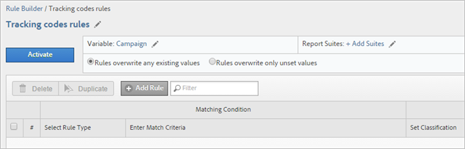

# Regole di classificazione

Le regole di classificazione cercano regolarmente termini non classificati. Se viene trovata una corrispondenza alla regola, le regole aggiungono automaticamente i termini alle tabelle di dati di classificazione. Puoi inoltre utilizzare le regole di classificazione per sovrascrivere le chiavi esistenti.

**[!UICONTROL Analytics]** > **[!UICONTROL Admin]** > **[!UICONTROL Classification Rule Builder]**

Il Generatore di regole consente di creare un *`classification rule set`* (set di regole di classificazione), che è un elenco di *`classification rules`*. Se una regola corrisponde ai criteri specificati, esegue un’azione.

Le regole di classificazione sono utili per:

* **Annunci e-mail** e **display**: crea regole di classificazione per raggruppare le singole campagne pubblicitarie per confrontare le prestazioni delle campagne display ed e-mail.

* **Codici di tracciamento**: crea regole di classificazione per classificare i valori chiave derivati dalle stringhe nei codici di tracciamento e farli corrispondere a criteri specifici definiti dall’utente.
* **Termini di ricerca**: utilizza [espressioni regolari](/help/components/classifications/crb/classification-quickstart-rules.md) e caratteri jolly per semplificare la classificazione dei termini di ricerca. Ad esempio, se un termine di ricerca contiene *`baseball`*, puoi impostare una classificazione *`Sports League`* su *`MLB`*.

Ad esempio, supponiamo che un codice di tracciamento per un ID di campagna e-mail sia:

`em:Summer:2013:Sale`.

È possibile impostare tre regole in un set di regole che identificano le parti della stringa e classificano i valori:

| Seleziona tipo di regola | Inserisci criteri di corrispondenza | Imposta classificazione | Su |
|---|---|---|---|
| Inizia con | em: | Canale | E-mail |
| Termina con | Vendita | Tipo | Vendita |
| Contiene | 2013 | Anno | 2013 |

## Elaborazione delle regole {#how-rules-are-processed}

Informazioni importanti sull’elaborazione delle regole di classificazione.

<!-- 

about_classification_rules.xml

 -->

* [Informazioni importanti sulle regole](/help/components/classifications/crb/classification-rule-builder.md)
* [In quali casi le regole non classificano le chiavi?](/help/components/classifications/crb/classification-rule-builder.md)
* [Informazioni sulla priorità delle regole](/help/components/classifications/crb/classification-quickstart-rules.md)

>[!NOTE]
>
>Il [!UICONTROL Rule Builder] non supporta le classificazioni numeriche 2.

## Informazioni importanti sulle regole

* Specifica le [autorizzazioni del gruppo](https://docs.adobe.com/content/help/it-IT/analytics/admin/user-product-management/user-groups/groups.html) per le classificazioni in [!UICONTROL Admin Tools].

* **Espressioni regolari**: la guida è disponibile in [Espressioni regolari nelle regole di classificazione](/help/components/classifications/crb/classification-quickstart-rules.md).

* **Suite di rapporti**: non puoi scegliere una classificazione finché non viene selezionata almeno una suite di rapporti. Non puoi applicare la suite di rapporti finché non hai creato il set di regole e assegnato una variabile.

   Quando verifichi il set di regole, utilizza le chiavi (la variabile da classificare) del rapporto per vedere in che modo verranno influenzate dal set di regole. La [chiave](/help/components/classifications/importer/c-saint-data-files.md) è la variabile da classificare, o la prima colonna nella tabella di caricamento della classificazione.

* **Priorità delle regole**: se una chiave corrisponde a più regole che impostano la stessa classificazione (nella colonna [!UICONTROL Set Classification]), l’ultima regola che corrisponde alla classificazione ha la priorità. Consulta [Informazioni sulla priorità delle regole](/help/components/classifications/crb/classification-quickstart-rules.md).

* **Limiti al numero di regole**: non vi sono limiti al numero di regole che puoi creare. Tuttavia, un numero elevato di regole può influire sulle prestazioni del browser.
* **Elaborazione**: le regole vengono elaborate a intervalli frequenti, a seconda del volume di traffico correlato alla classificazione.

   Le regole attive vengono elaborate ogni quattro ore ed esaminano i dati di classificazione che risalgono in genere a un mese. Le regole verificano automaticamente la presenza di nuovi valori e caricano le classificazioni utilizzando l’importazione.

* **Sovrascrittura delle classificazioni esistenti**: consulta [In quali casi le regole non classificano le chiavi?](/help/components/classifications/crb/classification-quickstart-rules.md) Se necessario, puoi eliminare o rimuovere le classificazioni esistenti utilizzando l’importazione.

## In quali casi le regole non classificano le chiavi?

Quando attivi le regole, puoi sovrascrivere le classificazioni esistenti. Nelle situazioni seguenti, una regola di classificazione non classifica una [chiave](/help/components/classifications/importer/c-saint-data-files.md)(variabile) se:

* La chiave è già classificata e non hai selezionato [Sovrascrivi classificazioni](/help/components/classifications/crb/classification-rule-definitions.md).

   Puoi sovrascrivere le classificazioni quando [aggiungi e attivi](/help/components/classifications/crb/classification-quickstart-rules.md) una regola e quando attivi l’integrazione dei connettori dati. Per i connettori dati, le regole vengono create dai partner nel centro sviluppatori e visualizzate nel [!UICONTROL Classification Rule Builder].

* Una chiave classificata non è stata visualizzata nei dati dopo un intervallo di tempo specificato durante la sovrascrittura di una chiave, anche dopo l’attivazione di [Sovrascrivi classificazioni](/help/components/classifications/crb/classification-rule-definitions.md).
* La chiave non è classificata e non viene mai passata in [!DNL Adobe Analytics] dopo l’intervallo di tempo iniziato circa un mese fa.

   >[!NOTE]
   >
   >Nei rapporti, le classificazioni si applicano a qualsiasi intervallo di tempo specificato, ogni volta che esiste una chiave. L’intervallo di date di un rapporto non influisce sul reporting.


## Espressioni regolari nelle regole di classificazione {#regex-in-classification-rules}

Utilizza espressioni regolari per far corrispondere valori stringa formattati in modo uniforme con una classificazione. Ad esempio, puoi creare una classificazione da caratteri specifici in un codice di tracciamento. È possibile far corrispondere caratteri, parole o pattern di caratteri specifici.

<!-- 

regex_classification_rules.xml

 -->

* [Espressione regolare - Esempio di codice di tracciamento](/help/components/classifications/crb/classification-quickstart-rules.md#section_2EF7951398EB4C2F8E52CEFAB4032669)
* [Espressione regolare - Classificazione di un carattere specifico](/help/components/classifications/crb/classification-quickstart-rules.md#section_5D300C03FA484BADACBFCA983E738ACF)
* [Espressioni regolari - Corrispondenza di codici di tracciamento di lunghezza variabile](/help/components/classifications/crb/classification-quickstart-rules.md#section_E86F5BF5C2F44ABC8FFCE3EA67EE3BB2)
* [Espressioni regolari - Esempio di “non contiene”](/help/components/classifications/crb/classification-quickstart-rules.md#section_FCA88A612A4E4B099458E3EF7B60B59C)
* [Espressioni regolari - Tabella riferimenti](/help/components/classifications/crb/classification-quickstart-rules.md#section_0211DCB1760042099CCD3ED7A665D716)

>[!NOTE]
>
>Secondo le best practice, le espressioni regolari sono particolarmente indicate per i codici di tracciamento che utilizzano delimitatori.

## Espressione regolare - Esempio di codice di tracciamento {#section_2EF7951398EB4C2F8E52CEFAB4032669}

>[!NOTE]
>
>Se il codice di tracciamento è codificato in URL, **non** verrà classificato dal Generatore di regole.

In questo esempio, supponiamo tu voglia classificare il seguente ID campagna:

[!UICONTROL Sample Key]: `em:JuneSale:20130601`

Le parti del codice di tracciamento che desideri classificare sono:

* `em` = e-mail
* `JuneSale` = nome della campagna
* `20130601` = data

[!UICONTROL Regular Expression]: `^(.+)\:(.+)\:(.+)$`

Correlazione tra l’espressione regolare e l’ID campagna:


[!UICONTROL Match Groups]: mostra in che modo l’espressione regolare corrisponde ai caratteri dell’ID campagna, in modo da poter classificare una posizione nell’ID campagna.


In questo esempio comunica alla regola che la data della campagna `20140601` si trova nel terzo gruppo `(.+)`, identificato da `$3`.

**[!UICONTROL Rule Builder]**

Nel [!UICONTROL Rule Builder], configura la regola come segue:

| Seleziona tipo di regola | Inserisci criteri di corrispondenza | Imposta classificazione | Su |
|---|---|---|---|
| Espressione regolare | &amp;Hat;(.+)\:(.+)\:(.+)$ | Data della campagna | $ 3 |

**Sintassi**

| Espressione regolare | Stringa o risultato della corrispondenza | Relativi gruppi di corrispondenza |
|--- |--- |--- |
| `^(.+)\:(.+)\:(.+)$` | em:JuneSale:20130601 | `$0`: em:JuneSale:20130601  `$1`: em  `$2`: JuneSale  `$3`: 20130601 |
| Creazione della sintassi | `^` = avvia la riga  () = raggruppa i caratteri e consente di estrarre i caratteri corrispondenti tra parentesi.  `(.+)` = acquisisce un carattere ( . ) e ( + ) qualsiasi altro carattere \ = inizio di una stringa.  `$` = indica che il carattere precedente (o il gruppo di caratteri) è l’ultimo della riga. |

Per informazioni sul significato dei caratteri in un’espressione regolare, consulta [Espressioni regolari - Tabella riferimenti](/help/components/classifications/crb/classification-quickstart-rules.md#section_0211DCB1760042099CCD3ED7A665D716).

## Espressione regolare - Classificazione di un carattere specifico {#section_5D300C03FA484BADACBFCA983E738ACF}

Un modo per utilizzare un’espressione regolare è classificare un carattere specifico in una stringa di caratteri. Ad esempio, supponiamo che il seguente codice di tracciamento contenga due caratteri importanti:

[!UICONTROL Sample Key]: `4s3234`

* `4` = nome del marchio
* `s` = identifica un motore di ricerca, ad esempio Google


**[!UICONTROL Rule Builder]**

Nel [!UICONTROL Rule Builder], configura la regola come segue:

| Seleziona tipo di regola | Inserisci criteri di corrispondenza | Imposta classificazione | Su |
|--- |--- |--- |--- |
| Espressione regolare | `^.(s).*$` | Marchio e motore di ricerca | `$0` (acquisisce i primi due caratteri per il nome del marchio e il motore di ricerca). |
| Espressione regolare | `^.(s).*$` | Motore di ricerca | `$1` (acquisisce il secondo carattere per Google). |

## Espressioni regolari - Corrispondenza di codici di tracciamento di lunghezza variabile {#section_E86F5BF5C2F44ABC8FFCE3EA67EE3BB2}

Questo esempio mostra come identificare caratteri specifici tra i due punti di delimitazione quando sono presenti codici di tracciamento di lunghezze diverse. Adobe consiglia di utilizzare un’espressione regolare per ciascun codice di tracciamento.

Chiavi di esempio:

* `a:b`
* `a:b:c`
* `a:b:c:d`

**Sintassi**


**[!UICONTROL Rule Builder]**

Nel [!UICONTROL Rule Builder], configura la regola come segue:

| Seleziona tipo di regola | Inserisci criteri di corrispondenza | Imposta classificazione | Su |
|--- |--- |--- |--- |
| Espressione regolare: per la stringa di corrispondenza a:b | `^([^\:]+)\:([^\:]+)$` | a | `$1` |
| Espressione regolare: per la stringa di corrispondenza a:b | `^([^\:]+)\:([^\:]+)$` | b | `$2` |
| Espressione regolare: per la stringa di corrispondenza a:b:c | `^([^\:]+)\:([^\:]+)\:([^\:]+)$` | a | `$1` |
| Espressione regolare: per la stringa di corrispondenza a:b:c | `^([^\:]+)\:([^\:]+)\:([^\:]+)$` | b | `$2` |
| Espressione regolare: per la stringa di corrispondenza a:b:c | `^([^\:]+)\:([^\:]+)\:([^\:]+)$` | c | `$3` |
| Espressione regolare: per la stringa di corrispondenza a:b:c:d | `^([^\:]+)\:([^\:]+)\:([^\:]+)\:([^\:])$` | d | `$4` |

## Espressioni regolari - Esempio di “non contiene” {#section_FCA88A612A4E4B099458E3EF7B60B59C}

Questo esempio fornisce un’espressione regolare che corrisponde a qualsiasi stringa che non contiene caratteri specifici, in questo caso `13`.

Espressione regolare:

`^(?!.*13.*).*$`

Stringhe di prova:

```
a:b:
a:b:1313
c:d:xoxo
c:d:yoyo
```

Risultati della corrispondenza:

```
a:b:
c:d:xoxo
c:d:yoyo
```

In questo risultato, `a:b:1313` non indica una corrispondenza.

## Espressioni regolari - Tabella riferimenti {#section_0211DCB1760042099CCD3ED7A665D716}

| Espressione | Descrizione |
|---|---|
| `(?ms)` | Fa corrispondere l’intera espressione regolare a un input multi-riga, consentendo al carattere jolly . di corrispondere a qualsiasi carattere di nuova riga |
| (`?i`) | Fa in modo che l’intera espressione regolare non faccia distinzione tra maiuscole e minuscole |
| [`abc`] | Un carattere singolo tra: a, b o c |
| [`^abc`] | Qualsiasi carattere singolo tranne: a, b o c |
| [`a-z`] | Qualsiasi carattere singolo nell’intervallo a-z |
| [`a-zA-Z`] | Qualsiasi carattere singolo nell’intervallo a-z o A-Z |
| `^` | Inizio riga (corrisponde all’inizio della riga) |
| `$` | Corrispondenza con la fine della riga (o prima di una nuova riga alla fine) |
| `\A` | Inizio della stringa |
| `\z` | Fine della stringa |
| `.` | Corrispondenza con qualsiasi carattere (tranne una nuova riga) |
| `\s` | Qualsiasi carattere spazio vuoto |
| `\S` | Qualsiasi carattere tranne gli spazi vuoti |
| `\d` | Qualsiasi cifra |
| `\D` | Qualsiasi carattere tranne le cifre |
| `\w` | Qualsiasi carattere alfanumerico (lettera, numero, carattere di sottolineatura) |
| `\W` | Qualsiasi carattere non alfanumerico |
| `\b` | Qualsiasi confine di parola |
| `(...)` | Acquisire tutti i caratteri racchiusi tra parentesi |
| `(a|b)` | a o b |
| `a?` | Zero o uno di a |
| `a*` | Zero o più di uno di a |
| `a+` | Uno o più di a |
| `a{3}` | Esattamente 3 di a |
| `a{3,}` | 3 o più di a |
| `a{3,6}` | Tra 3 e 6 di a |

Una buona risorsa per testare la validità delle espressioni regolari è https://rubular.com/.

## Informazioni sulla priorità delle regole

Se una chiave viene associata a più regole e imposta la stessa colonna di classificazione mostrata nella colonna [!UICONTROL Set Classification], l’ultima regola ha la priorità. Di conseguenza, potrebbe essere utile classificare come ultima la regola più importante del set di regole.

<!-- 

rule_priority.xml

 -->

Se crei più regole che non condividono la stessa classificazione, l’ordine di elaborazione non ha importanza.

Di seguito è illustrato un esempio di regola del termine di ricerca che classifica i tipi di ricerca per un atleta:

| Numero regola | Tipo di regola | Corrispondenza | Imposta classificazione | Su |
|---|---|---|---|---|
| 1 | Contiene | Cowboys | Tipo di ricerca | Squadra |
| 2 | Contiene | Fantasy | Tipo di ricerca | Fantasy |
| 3 | Contiene | Romo | Tipo di ricerca | Giocatore |

Se un utente cerca *`Cowboys fantasy Tony Romo`*, il termine *`Player`* viene classificato, perché corrisponde all’ultima classificazione data che compare nella colonna Imposta classificazione.

Allo stesso modo, supponiamo che tu abbia impostato due regole in un set per i seguenti termini di ricerca:

| Numero regola | Tipo di regola | Corrispondenza | Imposta classificazione | Su |
|---|---|---|---|---|
| 1 | Contiene | Cowboys | Città | Dallas |
| 2 | Contiene | Broncos | Città | Denver |

Un utente cerca *`Cowboys vs. Broncos`*. Se il Generatore di regole individua un conflitto nella corrispondenza delle regole, la classificazione per la seconda regola (Denver) viene applicata a questa ricerca.

## Aggiungere una regola di classificazione a un set di regole {#add-classification-to-rule-set}

<!-- 

t_classification_rule.xml

 -->

Passaggi che descrivono come aggiungere o modificare una regola di classificazione.

Per aggiungere nuove regole, fai corrispondere una condizione a una classificazione e specifica l’azione.

>[!NOTE]
>
>In questa procedura, devi applicare le regole a una o più suite di rapporti. Il numero di regole consigliato per set di regole è compreso tra 500 e 1000, anche se non esistono limiti. Se disponi di più di 100 regole, prova a semplificare il set di regole utilizzando le [sottoclassificazioni](/help/components/classifications/c-sub-classifications.md).

1. [Crea un set di regole di classificazione](/help/components/classifications/crb/classification-rule-set.md) .
1. Nella pagina del set di regole, fai clic su **[!UICONTROL Add Rule]**.

   

1. Accanto a **[!UICONTROL Report Suites]**, fai clic su **[!UICONTROL Add Suites]** per specificare una o più suite di rapporti da assegnare al set di regole.

   Viene visualizzata la pagina **[!UICONTROL Select Report Suites]**.

   >[!NOTE]
   Le suite di rapporti vengono visualizzate in questa pagina *`only`* quando sono soddisfatte le seguenti condizioni:        >

   * Le suite di rapporti hanno almeno una classificazione definita per la variabile in [!UICONTROL Admin Tools].
   Per una spiegazione di questo prerequisito, consulta *`Variable`* in [Set di regole di classificazione](/help/components/classifications/crb/classification-rule-set.md).

   * Hai selezionato la suite di rapporti nella pagina **[!UICONTROL Available Report Suites]**, che viene visualizzata dopo aver fatto clic su [Aggiungi set di regole](/help/components/classifications/crb/classification-rule-set.md) per creare il set di regole.


1. Specifica se i valori esistenti devono essere sovrascritti:

   | **Le regole sovrascrivono eventuali valori esistenti** | (Impostazione predefinita) Sovrascrivi sempre le chiavi di classificazione esistenti, comprese le classificazioni caricate tramite l’importazione (SAINT). |
   |---|---|
   | **Le regole sovrascrivono solo i valori non impostati** | Compila solo celle vuote (non impostate). Le classificazioni esistenti non saranno modificate. |

1. [Definisci la regola o le regole](/help/components/classifications/crb/classification-rule-definitions.md#section_4A5BF384EEEE4994B6DC888339833529).

   

   Per esempi sulla creazione delle regole, consulta [Generatore di regole di classificazione](/help/components/classifications/crb/classification-rule-builder.md) ed [Espressioni regolari nelle regole di classificazione](/help/components/classifications/crb/classification-quickstart-rules.md).

   >[!NOTE]
   >
   >Se una chiave corrisponde a più regole che impostano la stessa classificazione (nella colonna Imposta classificazione), viene utilizzata l’ultima regola che corrisponde alla classificazione. Per ulteriori informazioni sull’ordinamento delle regole, consulta **Informazioni sulla priorità delle regole** menzionato sopra.

1. [Verifica il set di regole](/help/components/classifications/crb/classification-quickstart-rules.md).
1. Dopodiché, fai clic su **[!UICONTROL Active]** per convalidare e attivare la regola.

   L’attivazione di una regola crea e carica il file automaticamente.

   Definizioni dei campi: consulta [Generatore di regole di classificazione](/help/components/classifications/crb/classification-rule-definitions.md) per le definizioni complete delle opzioni di interfaccia in questa pagina.

## Verificare un set di regole di classificazione

<!-- 

t_classifications_test_rule.xml

 -->

Passaggi che descrivono come verificare una regola di classificazione o un set di regole. L’esecuzione di un test verifica tutte le regole in un set.

1. [Crea un set di regole di classificazione](/help/components/classifications/crb/classification-rule-set.md) .
1. Fai clic sul nome del set di regole nel [!UICONTROL Classification Rule Builder].
1. Verifica che il set di regole sia associato a una suite di rapporti.
1. Nell’editor delle regole, fai clic su **[!UICONTROL Test Rule Set]**.

   

1. Digita o incolla le chiavi di prova nel campo [!UICONTROL Sample Keys].

   Le chiavi di esempio includono:

   * Codici di tracciamento
   * Parole chiave o frasi di ricerca

   Per informazioni sulla verifica delle espressioni regolari, consulta [Espressioni regolari nelle regole di classificazione](/help/components/classifications/crb/classification-quickstart-rules.md).
1. Fai clic su **[!UICONTROL Run Test]**.

   Le regole corrispondenti vengono visualizzate nella tabella [!UICONTROL Results].
1. (Facoltativo) Fai clic su **[!UICONTROL Activate]** per attivare la regola e per sovrascrivere le classificazioni esistenti.

   Consulta per ulteriori informazioni sull’uso delle regole per sovrascrivere le classificazioni esistenti.

## Convalidare e attivare le regole di classificazione

<!-- 

t_validate_rules.xml

 -->

Passaggi che descrivono come convalidare e attivare le regole di classificazione.

1. [Crea un set di regole di classificazione](/help/components/classifications/crb/classification-rule-set.md), quindi [aggiungi le regole di classificazione](/help/components/classifications/crb/classification-quickstart-rules.md) al set.
1. Nell’editor delle regole, fai clic su **[!UICONTROL Activate]**.

   

1. Per sovrascrivere le classificazioni, abilita **[!UICONTROL Overwrite classifications for]** *`<selection>`* (facoltativo).

   Questa opzione consente di sovrascrivere le classificazioni esistenti per le chiavi interessate.

   Consulta la [Pagina regole](/help/components/classifications/crb/classification-rule-definitions.md#section_4A5BF384EEEE4994B6DC888339833529) per una definizione di questa opzione.
