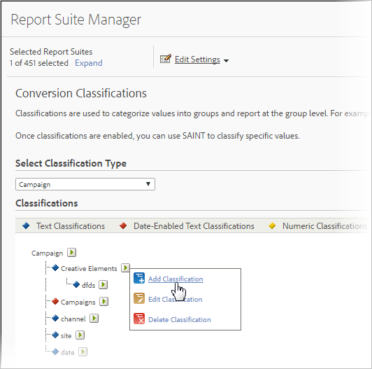

# Sottoclassificazioni e Generatore di regole

È possibile combinare Generatore regole di classificazione con sottoclassificazioni se si garantisce che ogni sottoclassificazione abbia un valore padre.

Combinando il Generatore di regole di classificazione con sottoclassificazioni è possibile semplificare la gestione delle classificazioni e ridurre il numero di regole richieste. Potrebbe essere utile eseguire questa operazione se il codice di tracciamento è composto da codici da classificare separatamente.

Per informazioni concettuali sulle sottocategorie, consultate [Sottoclassificazioni](/help/components/classifications/c-sub-classifications.md) .

## Esempio

Presupponiamo il seguente codice di tracciamento:

`channel:broad_campaign:creative`

Una gerarchia di classificazione consente di applicare una classificazione a una classificazione (chiamata *`sub-classification`*). Ciò significa che è possibile utilizzare l&#39;utilità di importazione come un database relazionale, con più tabelle. Una tabella mappa i codici di tracciamento completi alle chiavi, mentre un&#39;altra li mappa ad altre tabelle.

Dopo aver installato questa struttura, è possibile utilizzare il Generatore [regole di](/help/components/classifications/crb/classification-rule-builder.md) classificazione per caricare file di piccole dimensioni che aggiornano solo le tabelle di ricerca (le tabelle verdi e rosse nell&#39;immagine precedente). Quindi, potete utilizzare il generatore di regole per mantenere aggiornata la tabella di classificazione principale.

L&#39;attività seguente descrive come eseguire questa operazione.

## Impostazione di sottoclassificazioni mediante il Generatore di regole{#task_2D9016D8B4E84DBDAF88555E5369546F}

Esempi di passaggi che descrivono come caricare le sottocategorie utilizzando il Generatore di regole.

>[!NOTE]
>
>Questi passaggi descrivono come eseguire il caso d’uso descritto in [Sottoclassificazioni e nel Generatore](/help/components/classifications/crb/sub-classification-rule-builder.md)di regole.

1. Creare classificazioni e sottoclassificazioni in Gestione [classificazione](https://docs.adobe.com/content/help/en/analytics/components/classifications/c-classifications.html).

   Esempio:

   

1. Nel Generatore [regole di](/help/components/classifications/crb/classification-rule-builder.md)classificazione, classificate la chiave di classificazione secondaria dal codice di tracciamento originale.

   A tale scopo, è necessario utilizzare un&#39;espressione regolare. In questo esempio, la regola da compilare *`Broad Campaign code`* utilizzerebbe questa espressione regolare:

   | `#` | Tipo di regola | Corrispondenza | Imposta classificazione | A |
   |---|---|---|---|---|
   |  | Regular Expression (Espressione regolare) | `[^\:]:([^\:]):([^\:]`) | Ampio codice campagna | `$1` |
   |  | Regular Expression (Espressione regolare) | `[^\:]:([^\:]):([^\:]`) | Codice creativo | `$2` |

   >[!NOTE]
   >
   >A questo punto, non vengono compilate le sottoclassificazioni *`Campaign Type`* e *`Campaign Director`*.

1. Caricate un file di classificazione che include solo le sottoclassificazioni specificate.

   Consultate Classificazioni [a](/help/components/classifications/c-sub-classifications.md)più livelli.

   Esempio:

   | Chiave | Channel | Ampio codice campagna | Ampio codice campagna;Hat;Tipo campagna | Ampio codice campagna;Hat;Campaign Director | ... |
   |---|---|---|---|---|---|
   | * |  | 111 | Brand (Marchio) | Suzanne |  |
   | * |  | 222 | Brand (Marchio) | Frank |  |

1. Per mantenere le tabelle di ricerca, caricate un file piccolo (come mostrato sopra).

   Caricate questo file, ad esempio, quando *`Broad Campaign code`* viene introdotto un nuovo file. Questo file viene applicato ai valori classificati in precedenza. Analogamente, se create una nuova classificazione secondaria ( *`Creative Theme`* ad esempio una classificazione secondaria di *`Creative code`*), caricate solo il file di classificazione secondaria, anziché l’intero file di classificazione.

   Per riportare queste sottocategorie, funziona esattamente come per le classificazioni di livello principale. Ciò riduce l&#39;onere di gestione necessario per utilizzarli.-->
