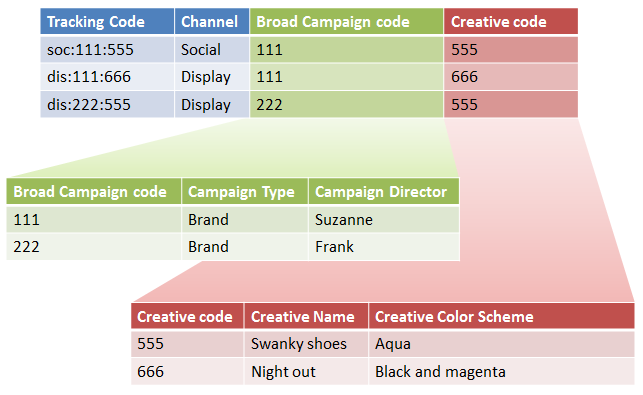

# Sottoclassificazioni e generatore di regole (legacy)

{{classification-rulebuilder-deprecation}}

Puoi combinare il Generatore regole di classificazione con le sottoclassificazioni se garantisci che ogni sottoclassificazione abbia un valore padre.

Combinare il Generatore di regole di classificazione con le sottoclassificazioni consente di semplificare la gestione delle classificazioni e ridurre il numero di regole richieste. Potrebbe essere utile eseguire questa operazione se il tuo codice di tracciamento è composto da codici che desideri classificare separatamente.

Per informazioni concettuali sulle sottoclassificazioni, consulta [Sottoclassificazioni](/help/components/classifications/importer/subclassifications.md).

## Esempio

Consideriamo il codice di tracciamento seguente:

`channel:broad_campaign:creative`

Una gerarchia di classificazione consente di applicare una classificazione a una classificazione (chiamata *`sub-classification`*, sottoclassificazione). Ciò significa che è possibile utilizzare l’importazione come un database relazionale con più tabelle. Una tabella mappa i codici di tracciamento completi alle chiavi, mentre un’altra mappa le chiavi ad altre tabelle.

Dopo aver impostato questa struttura, puoi utilizzare il [Generatore di regole di classificazione](/help/components/classifications/crb/classification-rule-builder.md) per caricare file di piccole dimensioni che aggiornano solo le tabelle di ricerca (le tabelle verdi e rosse nell’immagine precedente). Puoi quindi utilizzare il Generatore di regole per mantenere aggiornata la tabella di classificazione principale.

L’attività seguente descrive come eseguire questa operazione.

## Impostare le sottoclassificazioni utilizzando il Generatore di regole

Esempi di passaggi che descrivono come caricare le sottoclassificazioni utilizzando il Generatore di regole.

1. Crea classificazioni e sottoclassificazioni nel Gestore di classificazioni.

   Esempio:

   

1. Nel [Generatore regole di classificazione](/help/components/classifications/crb/classification-rule-builder.md), classifica la chiave di sottoclassificazione dal codice di tracciamento originale.

   Per farlo è necessario utilizzare un’espressione regolare. In questo esempio, la regola per compilare *`Broad Campaign code`* utilizzerebbe questa espressione regolare:

   | `#` | Tipo di regola | Corrispondenza | Imposta classificazione | Su |
   |---|---|---|---|---|
   |   | Espressione regolare | `[^\:]:([^\:]):([^\:])` | Broad Campaign code | `$1` |
   |   | Espressione regolare | `[^\:]:([^\:]):([^\:])` | Codice creativo | `$2` |

   >[!NOTE]
   >
   >A questo punto, non vengono compilate le sottoclassificazioni *`Campaign Type`* e *`Campaign Director`*.

1. Carica un file di classificazione che include solo le sottoclassificazioni specificate.

   Consulta [Classificazioni a più livelli](/help/components/classifications/importer/subclassifications.md).

   Esempio:

   | Chiave | Canale | Broad Campaign code | Broad Campaign code&amp;Hat;Campaign type | Broad Campaign code&amp;Hat;Campaign Director | ... |
   |---|---|---|---|---|---|
   | &#42; |  | 111 | Brand | Suzanne |  |
   | &#42; |  | 222 | Brand | Frank |  |

1. Per mantenere le tabelle di ricerca, carica un file di piccole dimensioni (come mostrato sopra).

   Ad esempio, puoi caricare questo file quando viene introdotto un nuovo *`Broad Campaign code`*. Il file viene applicato ai valori classificati in precedenza. Allo stesso modo, se crei una nuova sottoclassificazione (ad esempio *`Creative Theme`* come sottoclassificazione di *`Creative code`*), carica solo il file di sottoclassificazione e non l’intero file di classificazione.

   A scopo di reporting, queste sottoclassificazioni funzionano esattamente come le classificazioni di livello principale. Ciò riduce l’onere di gestione necessario per utilizzarli.
