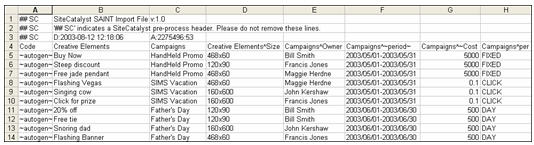

# File di dati di classificazione (legacy)

L’importazione consente di caricare in massa i dati delle classificazioni nei rapporti di Analytics in un file. L’importazione richiede un formato di file specifico per il caricamento dei dati.

Per facilitare la creazione di file di dati validi, puoi scaricare un file modello che ti fornisce una struttura in cui incollare i dati delle classificazioni. Per ulteriori informazioni, consulta [Scaricare il modello delle classificazioni](/help/components/classifications/importer/c-download-saint-data.md).

Per ulteriori informazioni sui limiti dei caratteri nelle classificazioni, consulta [Struttura generale dei file](/help/components/classifications/importer/c-saint-data-files.md).

## Struttura generale dei file

L’illustrazione seguente è un esempio di file di dati:



Un file di dati deve rispettare le seguenti regole di struttura:

* Le classificazioni non possono avere un valore pari a 0 (zero).
* Adobe consiglia di limitare a 30 il numero di colonne di importazione ed esportazione.
* I file caricati devono utilizzare la codifica dei caratteri UTF-8 senza BOM.
* È possibile incorporare caratteri speciali come tab, caratteri di nuova riga e virgolette all’interno di una cella a condizione che sia specificato il formato di file v2.1 e che la cella sia correttamente [preceduta da caratteri di escape](/help/components/classifications/importer/importer-faq.md). I caratteri speciali includono:

  ```text
  \t     tab character 
  \r     form feed character 
  \n    newline character 
  "       double quote
  ```

  La virgola non è un carattere speciale.

* I nomi di classificazione non possono contenere un accento circonflesso (^) poiché questo carattere viene utilizzato per indicare una sottoclassificazione.
* Presta attenzione quando utilizzi i trattini. Ad esempio, se utilizzi un trattino (-) in un termine Social, Social riconosce il trattino come operatore [!DNL Not] (il segno meno). Ad esempio, se specifichi *`fragrance-free`* come termine con l’importazione, Social riconosce il termine come fragrance *`minus`* free e raccoglie i post che menzionano *`fragrance`* ma non *`free`*.
* I limiti di caratteri vengono applicati per classificare i dati dei rapporti. Ad esempio, se carichi un file di testo delle classificazioni per i prodotti (*`s.products`*) con nomi di prodotto che superano i 100 caratteri (byte), i prodotti non verranno visualizzati nei rapporti. I codici di tracciamento e tutte le variabili di conversione personalizzate (eVar) consentono 255 byte. Questo criterio si estende anche ai valori delle colonne di classificazione e sottoclassificazione, soggetti allo stesso limite di 255 byte.
* File di dati delimitati da tabulazioni (crea il file modello utilizzando un’applicazione per fogli di calcolo o un editor di testo).
* Un’estensione file `.tab` o `.txt`.
* Il cancelletto (#) identifica la riga come un commento degli utenti. Adobe ignora le righe che iniziano con #.
* Un doppio cancelletto seguito da SC (`## SC`) identifica la riga come un commento intestazione pre-elaborazione utilizzato dal reporting. Non eliminare queste righe.
* Le esportazioni delle classificazioni possono avere chiavi duplicate a causa di caratteri di nuova riga nella chiave. In un’esportazione FTP o browser, questo può essere risolto attivando le virgolette per l’account FTP. In questo modo ciascuna chiave con caratteri di nuova riga verrà inserita tra virgolette.
* La cella C1 nella prima riga del file di importazione contiene un identificatore di versione che determina il modo in cui le classificazioni gestiscono l’uso delle virgolette per la parte restante del file.

   * v2.0 ignora le virgolette e presuppone che siano parte delle chiavi e dei valori specificati. Ad esempio, considera questo valore: “Questo è “un valore””. v2.0 lo interpreterebbe letteralmente: “Questo è “un valore””.
   * v2.1 indica alle classificazioni di presumere che le virgolette siano parte della formattazione del file utilizzata nei file Excel. Quindi v2.1 formatta l’esempio precedente in questo modo: Questo è “un valore”.
   * Possono sorgere problemi quando v2.1 è specificato nel file, ma si desidera v2.0, ovvero quando le virgolette sono utilizzate in modi che non sono concessi nella formattazione Excel. Ad esempio, se disponi di un valore: “VP NO REPS” S/l Dress w/ Overlay. Con v2.1 questa viene considerata una formattazione errata (il valore deve essere racchiuso tra virgolette di apertura e chiusura e le virgolette che fanno parte del valore effettivo devono essere precedute da virgolette) e le classificazioni non funzioneranno oltre questo punto.
   * Effettua una delle seguenti operazioni: modifica il formato del file in v2.0 cambiando l’intestazione (cella C1) nei file caricati, OPPURE implementa correttamente le virgolette Excel in tutti i file.

* La prima riga (senza commenti) del file di dati contiene le intestazioni di colonna utilizzate per identificare i dati di classificazione nella colonna. L’importazione richiede un formato specifico per le intestazioni di colonna. Per ulteriori informazioni, consulta [Formato delle intestazioni di colonna](/help/components/classifications/importer/c-saint-data-files.md).
* Dopo la riga di intestazione in un file di dati sono riportate le righe di dati. Ognuna di esse deve contenere un campo dati per ogni intestazione di colonna.
* Il file di dati supporta i seguenti codici di controllo utilizzati da Adobe per conferire struttura al file e importare correttamente i dati di classificazione:

<table id="table_0548F2E58B6644208147434EB9B3C21B"> 
 <thead> 
  <tr> 
   <th colname="col1" class="entry"> CODICE DI CONTROLLO </th> 
   <th colname="col2" class="entry"> DESCRIZIONE </th> 
  </tr> 
 </thead>
 <tbody> 
  <tr> 
   <td colname="col1"> <p>&lt;Nuova riga&gt; </p> </td> 
   <td colname="col2"> <p>Il carattere di nuova riga è l’unico delimitatore tra righe/record di dati supportato nel file di dati. In genere, è necessario inserire questi caratteri solo quando si scrive un programma per generare automaticamente i file di dati. </p> </td> 
  </tr> 
  <tr> 
   <td colname="col1"> <p>~autogen~ </p> </td> 
   <td colname="col2"> <p>Richiede che Adobe generi automaticamente un ID univoco per questo elemento. </p> <p>Nel contesto delle campagne, questo valore di controllo indica ad Adobe di assegnare un identificatore a ogni elemento creativo. Consulta <a href="/help/components/classifications/importer/c-saint-data-files.md"  >Chiave</a>. </p> </td> 
  </tr> 
  <tr> 
   <td colname="col1"> <p>~periodo~ </p> </td> 
   <td colname="col2"> <p>Indica che la colonna di dati rappresenta l’intervallo di date associato all’elemento. Consulta <a href="/help/components/classifications/importer/c-saint-data-files.md"  >Data</a>. </p> </td> 
  </tr> 
  <tr> 
   <td colname="col1"> <p>Campo vuoto </p> </td> 
   <td colname="col2"> <p>Rappresenta un valore NULL per il campo corrente. Utilizzalo se una particolare colonna di dati non si applica al record corrente. </p> </td> 
  </tr> 
  <tr> 
   <td colname="col1"> <p>Modificatori PER </p> </td> 
   <td colname="col2"> <p>Indica che la colonna di dati rappresenta un campo <span class="wintitle">modificatore PER</span>. Consulta <a href="/help/components/classifications/importer/c-saint-data-files.md"  >Intestazioni dei modificatori PER</a>. </p> </td> 
  </tr> 
 </tbody> 
</table>

## Formato dell’intestazione di colonna

>[!NOTE]
>
>Adobe consiglia di limitare a 30 il numero di colonne di importazione ed esportazione.

I file di classificazione supportano le seguenti intestazioni di colonna:

### Chiave

Ogni valore deve essere univoco in tutto il sistema. Il valore in questo campo corrisponde a un valore assegnato alla variabile [!DNL Analytics] nel beacon [!DNL JavaScript] del sito web. I dati in questa colonna possono includere un codice di tracciamento ~autogen~ o qualsiasi altro codice di tracciamento univoco.

### Intestazione della colonna di classificazione

>[!NOTE]
>
>I valori nell’intestazione della colonna [!UICONTROL Classifications] devono corrispondere esattamente alla convenzione di denominazione della classificazione, altrimenti l’importazione non riesce. Ad esempio, se l’amministratore modifica [!UICONTROL Campaigns] in [!UICONTROL Internal Campaign Names] nel [!UICONTROL Campaign Set-up Manager], l’intestazione della colonna del file dev’essere modificata di conseguenza. “Chiave” è un valore di classificazione riservato (intestazione). Le nuove classificazioni denominate “Chiave” non sono supportate.

Inoltre, il file di dati supporta le seguenti convenzioni di intestazione aggiuntive per identificare sottoclassificazioni e altre colonne di dati specializzate:

### Intestazione sottoclassificazione

Ad esempio, `Campaigns^Owner` è un’intestazione di colonna per la colonna contenente i valori `Campaign Owner`. Analogamente, `Creative Elements^Size` è un&#39;intestazione di colonna per la colonna contenente la sottoclassificazione `Size` della classificazione `Creative Elements`.

## Risoluzione di problemi relativi alle classificazioni

* [Problemi comuni relativi al caricamento](https://helpx.adobe.com/it/analytics/kb/common-saint-upload-issues.html): articolo della knowledge base che descrive i problemi derivanti da formati e contenuti di file non corretti.
