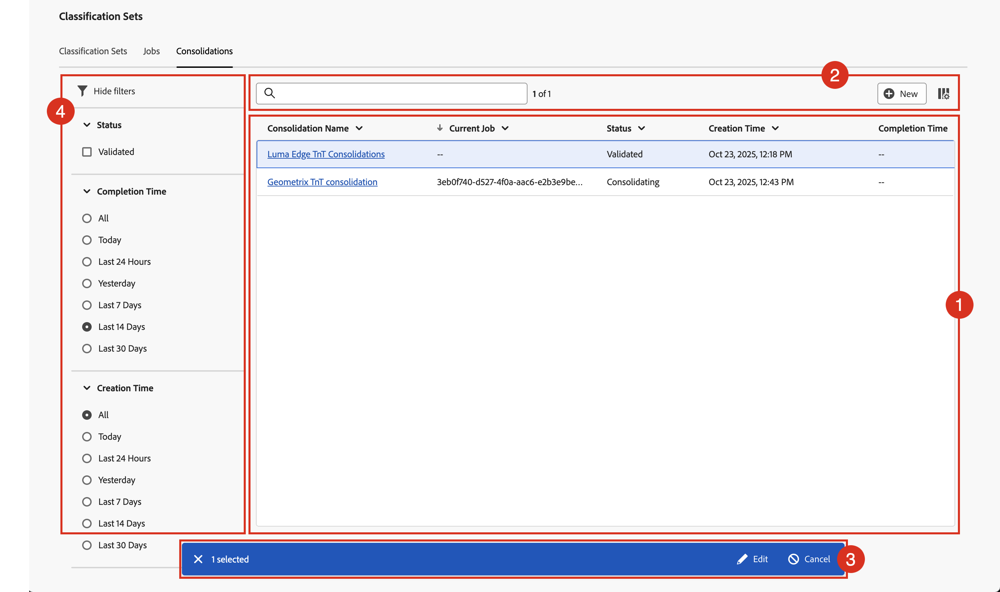

# Gestire i consolidamenti delle classificazioni

Se disponi di più set di classificazione che contengono dati di classificazione simili, puoi consolidarli in un unico set di classificazione. Quando consolidi due o più set di classificazione, Adobe genera un nuovo set di classificazione che contiene tutti i dati di classificazione di ogni singolo set di classificazione. I consolidamenti sono utili quando hai caricato dati in molte suite di rapporti. Oppure quando disponi di dimensioni che contengono gli stessi dati di classificazione e desideri unirle in un singolo flusso di lavoro.

Per visualizzare Gestione consolidamento set di classificazione, è necessario disporre dell’accesso come amministratore del prodotto per Adobe Analytics.

Per gestire i consolidamenti delle classificazioni:

1. Seleziona **[!UICONTROL Components]** dalla barra dei menu superiore di Adobe Analytics, quindi seleziona **[!UICONTROL Classification sets]**.
1. In **[!UICONTROL Classification Sets]**, selezionare la scheda **[!UICONTROL Consolidations]**.

## Gestione dei consolidamenti di classificazione

Il gestore **[!UICONTROL Classification Sets - Consolidations]** dispone dei seguenti elementi dell&#39;interfaccia:

### Elenco consolidamenti delle classificazioni

L&#39;elenco ➊ visualizza i consolidamenti di classificazione creati e convalidati e che potrebbero essere consolidati. L’elenco dispone delle seguenti colonne:

| Colonna | Descrizione |
|---|---|
| **[!UICONTROL Consolidation Name]** | Nome del consolidamento dei set di classificazione. |
| **[!UICONTROL Current Job]** | Processo associato al consolidamento dei set di classificazione. |
| **[!UICONTROL Status]** | Stato del consolidamento dei set di classificazione. I valori possibili sono: **[!UICONTROL Created]**, **[!UICONTROL Canceled]**, **[!UICONTROL Canceling]**, **[!UICONTROL Validating]**, **[!UICONTROL Failed Validation]**, **[!UICONTROL Validated]**, **[!UICONTROL Comparing]**, **[!UICONTROL Comparison Failed]**, **[!UICONTROL Consolidation]**, **[!UICONTROL Submitted]**, **[!UICONTROL Consolidating]**, **[!UICONTROL Consolidation Failed]**, **[!UICONTROL Consolidation Succeeded]**, **[!UICONTROL Waiting for Approval]**, **[!UICONTROL Finalizing]**, **[!UICONTROL Failed]** o **[!UICONTROL Completed]**. |
| **[!UICONTROL Creation time]** | Ora di creazione del consolidamento dei set di classificazione. |
| **[!UICONTROL Completion Time]** | Il tempo di completamento dei consolidamenti delle classificazioni. |

Per ridimensionare una colonna nell’elenco di consolidamento delle classificazioni, puoi:

* Passa il puntatore del mouse sul separatore di colonne e trascina il separatore di colonne fino alla larghezza desiderata.
* Selezionare  e selezionare **[!UICONTROL Resize column]**. Una linea verticale con il pulsante di ridimensionamento consente di ridimensionare la colonna nel modo desiderato con.

Per ordinare una colonna nell’elenco di consolidamento delle classificazioni

* Selezionare  e selezionare **[!UICONTROL Sort Ascending]** o **[!UICONTROL Sort Descending]**. Una freccia (↑↓) indica quale colonna e come è ordinata.

### Pulsanti di ricerca e

Nell&#39;area ➋ oltre all&#39;elenco dei consolidamenti delle classificazioni, è possibile:

* Cerca in  i consolidamenti delle classificazioni. I risultati vengono visualizzati nell’elenco dei consolidamenti delle classificazioni. Selezionare  per cancellare la ricerca.
* Rimuovere i filtri applicati all&#39;elenco di consolidamento dei set di classificazione. Selezionare  per rimuovere un filtro.
* Crea un nuovo consolidamento dei set di classificazione. Selezionare  **[!UICONTROL New]** per aprire la finestra di dialogo di consolidamento dei set di classificazione e definire un nuovo consolidamento dei set di classificazione.
* Definisci le colonne dell’elenco dei consolidamenti delle classificazioni. Seleziona  e nella finestra di dialogo **[!UICONTROL Customize table]** seleziona le colonne da visualizzare sotto **[!UICONTROL Select columns to show]**. Selezionare **[!UICONTROL Apply]** per applicare le impostazioni della colonna.

### Barra delle azioni

Quando selezioni uno o più set di classificazione nell&#39;elenco dei set di classificazione, viene visualizzata una barra blu delle azioni ➌. Nella barra delle azioni sono disponibili le azioni seguenti:

| Icona | Azione | Descrizione |
|---|---|---|
|  | **[!UICONTROL Edit]** | [Modifica consolidamento set di classificazione](process.md#edit-a-consolidation) |
|  | **[!UICONTROL View]** | Visualizzare i dettagli del consolidamento del set di classificazione. A seconda dello stato, puoi [approvare](process.md#approve) o [annullare](process.md#cancel) il consolidamento. |

### Pannello dei filtri

Selezionare  per visualizzare il pannello dei filtri ➍ che consente di filtrare l&#39;elenco dei consolidamenti delle classificazioni. Puoi filtrare in base a:

* **[!UICONTROL Status]**. Seleziona uno dei possibili valori per filtrare l’elenco dei consolidamenti di classificazione in base allo stato. |
* **[!UICONTROL Completion Time]**. Seleziona uno dei valori possibili per filtrare l’elenco dei consolidamenti delle classificazioni al momento del completamento.
* **[!UICONTROL Creation Time]**. Seleziona uno dei valori possibili per filtrare l’elenco dei consolidamenti delle classificazioni al momento del completamento.

Seleziona  **[!UICONTROL Hide filters]** per nascondere il pannello dei filtri.

I filtri visualizzati nel pannello filtri riflettono le opzioni per i consolidamenti di classificazione precaricati.

<!--

**[!UICONTROL Components]** > **[!UICONTROL Classification sets]** > **[!UICONTROL Consolidations]**

Once a consolidation is run, the original classification sets are removed, with the consolidated classification set taking their place. Click **[!UICONTROL Add]** to [Create a consolidation](process.md).

## Filter classification sets

The left side of the Classification set consolidation manager provides filter settings to locate the desired consolidation. Clicking the filter icon toggles the filter settings visibility. You can filter consolidations by **[!UICONTROL Status]**, **[!UICONTROL Completion time]**, or **[!UICONTROL Creation time]**.

Additional filter options are available above the Classification set consolidation manager columns:

* **[!UICONTROL Search by title]**: Search for consolidations by name.
* **Show/Hide columns**: Toggle visibility for any column besides [!UICONTROL Name].

## Classification set consolidation manager columns

The following columns are available in the Classification set consolidation manager:

* **[!UICONTROL Name]**: The name of the consolidation.
* **[!UICONTROL Current job]**: The current job. 
* **[!UICONTROL Status]**: The status of the consolidation. 
* **[!UICONTROL Creation date]**: The date and time that the consolidation was created.
* **[!UICONTROL Completion date]**: The date and time that the consolidation completed (or failed).

-->
