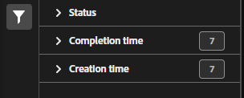

# Gestione consolidamenti set di classificazione

Se disponi di più set di classificazione che contengono dati simili, puoi consolidarli in un unico set di classificazione. Quando consolidi due o più set di classificazione, Adobe genera un nuovo set di classificazione che contiene tutti i dati di classificazione di ogni singolo set di classificazione. I consolidamenti sono utili quando hai caricato dati in molte suite di rapporti o dimensioni che contengono gli stessi dati di classificazione e desideri unirli in un unico flusso di lavoro.

**[!UICONTROL Components]** > **[!UICONTROL Classification sets]** > **[!UICONTROL Consolidations]**

Una volta eseguito il consolidamento, i set di classificazione originali vengono rimossi e il set di classificazione consolidato viene sostituito. Clic **[!UICONTROL Add]** a [Creare un consolidamento](process.md).

## Filtrare i set di classificazione

Il lato sinistro di Gestione consolidamento set di classificazione fornisce le impostazioni del filtro per individuare il consolidamento desiderato. Facendo clic sull’icona del filtro si attiva la visibilità delle impostazioni del filtro. È possibile filtrare i consolidamenti in base a **[!UICONTROL Status]**, **[!UICONTROL Completion time]**, o **[!UICONTROL Creation time]**.

Ulteriori opzioni di filtro sono disponibili sopra le colonne di Gestione consolidamento set di classificazione:

* **[!UICONTROL Search by title]**: cerca i consolidamenti per nome.
* **Mostra/Nascondi colonne**: attiva/disattiva la visibilità delle colonne oltre [!UICONTROL Name].

## Colonne di Gestione consolidamento set di classificazione

In Gestione consolidamento set di classificazione sono disponibili le colonne riportate di seguito.

* **[!UICONTROL Name]**: nome del consolidamento.
* **[!UICONTROL Current job]**: il processo corrente. <!-- todo: better description -->
* **[!UICONTROL Status]**: stato del consolidamento. <!-- todo: get list of possible statuses -->
* **[!UICONTROL Creation date]**: data e ora di creazione del consolidamento.
* **[!UICONTROL Completion date]**: data e ora in cui il consolidamento è stato completato (o non è riuscito).
