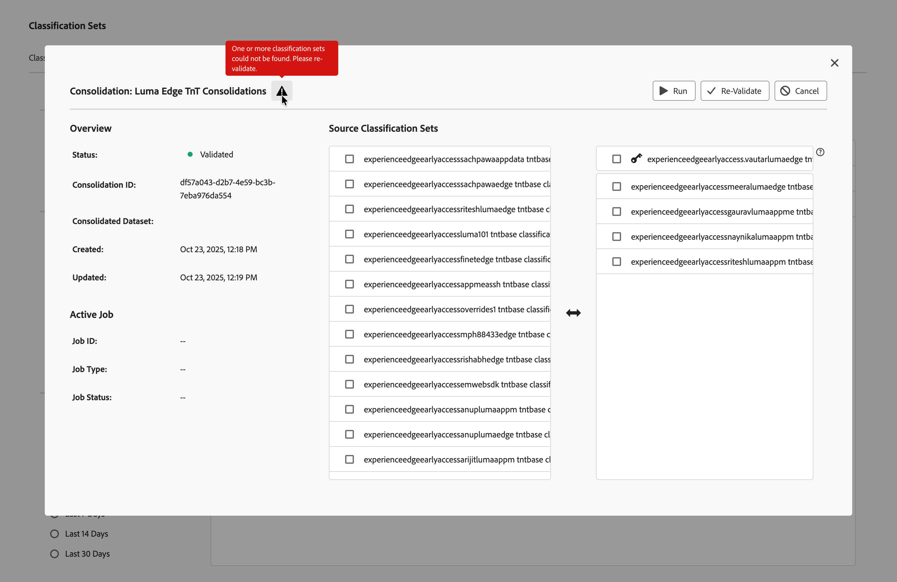

# Creare e modificare i consolidamenti delle classificazioni

I consolidamenti dei set di classificazione consentono di prendere classificazioni da più set di dati e combinarle in un unico set. Utilizzare questa interfaccia per creare un consolidamento del set di classificazione dall&#39;inizio alla fine. Questa interfaccia è particolarmente utile per le organizzazioni che passano dalle classificazioni legacy a un set di classificazione. È probabile che la maggior parte delle organizzazioni che utilizzano già i set di classificazione non debbano utilizzare questo flusso di lavoro di consolidamento.

## Creare un consolidamento

Per creare un consolidamento delle classificazioni, nell’interfaccia principale di Adobe Analytics:

1. Seleziona **[!UICONTROL Classification sets]** dal menu **[!UICONTROL Components]**.
1. Nel gestore **[!UICONTROL Classification Sets]**, selezionare la scheda **[!UICONTROL Consolidations]**.
1. Nel gestore **[!UICONTROL Classification Sets - Consolidations]**, selezionare  **[!UICONTROL New]**.
1. Nella finestra di dialogo **[!UICONTROL New Consolidation]**

   
   1. Immetti **[!UICONTROL Name]**. Ad esempio: `Consolidation Example`.
   1. Immetti **[!UICONTROL Description (optional)]**. Ad esempio: `Example classification set`.
   1. Immettere uno o più indirizzi di posta elettronica (separati da virgola) in **[!UICONTROL Notify of issues]**. Gli utenti ricevono notifiche e-mail in caso di problemi.
   1. Selezionare un set di classificazione dal menu a discesa **[!UICONTROL Classification Set To Match]**.

      L&#39;elenco a sinistra **[!UICONTROL Source Classification Set]** contiene set di classificazione simili a quello selezionato e disponibili per il consolidamento.

   1. Seleziona i set di classificazione da consolidare dall&#39;elenco a sinistra e rilascia i set selezionati nell&#39;elenco a destra sotto la  **[!UICONTROL _set di classificazione_]** selezionata.

      Puoi spostare nell’elenco i set di classificazione singoli e selezionati. È inoltre possibile sostituire  **[!UICONTROL _set di classificazione_]** con un set di classificazione selezionato tramite trascinamento della selezione.

   1. Selezionare **[!UICONTROL Save]** per salvare il consolidamento della classificazione. Seleziona **[!UICONTROL Cancel]** per annullare.

Una volta salvato, il consolidamento delle classificazioni viene convalidato automaticamente per il consolidamento. Questa convalida garantisce che ogni singolo set di classificazione sia valido per questo consolidamento. Dopo l&#39;operazione, la voce nell&#39;elenco di consolidamento delle classificazioni mostra lo stato **[!UICONTROL Validated]**.

Dopo aver creato un consolidamento, i passaggi successivi sono i seguenti:

* [Riconvalida](#re-validate) il consolidamento della classificazione dopo aver apportato modifiche alla configurazione iniziale.
* [Esegui](#run) il consolidamento delle classificazioni.
* [Approva](#approve) il consolidamento delle classificazioni.

<!--
         
  

**[!UICONTROL Components]** > **[!UICONTROL Classification sets]** > **[!UICONTROL Consolidations]** > **[!UICONTROL Add]**

The following fields are available when creating a consolidation:

* **[!UICONTROL Name]**: The name of the consolidation.
* **[!UICONTROL Notify of issues]**: A comma-delimited list of email addresses that are notified of issues with this consolidation.
* **[!UICONTROL Dataset to match]**: A drop-down list of all classification sets.

Once you select a classification set, a table with two columns appears:

* The right column contains all classification sets that you want to consolidate. It starts with the classification set selected using the above drop-down list.
* The left column contains all classification sets eligible to be merged with the originally selected dataset. **Schemas must exactly match to be eligible for consolidation**. If schemas do not match the selected classification set, they do not appear in this left column.

Drag the desired classification sets from the available column on the left to the consolidation column on the right. Once the consolidation is given a name and two or more classification sets are in the right column, click **[!UICONTROL Save & Continue]**.

-->

## Modificare un consolidamento

Per modificare il consolidamento di una classificazione, nell’interfaccia principale di Adobe Analytics:

1. Seleziona **[!UICONTROL Classification sets]** dal menu **[!UICONTROL Components]**.
1. Nel gestore **[!UICONTROL Classification Sets]**, selezionare la scheda **[!UICONTROL Consolidations]**.
1. Nel gestore **[!UICONTROL Classification Sets Consolidations]**:
   1. Seleziona il titolo del consolidamento della classificazione. Viene visualizzata la finestra di dialogo Consolidamento: consolidamento classificazione. L&#39;aspetto e le azioni disponibili dipendono dallo stato corrente del consolidamento e dalla possibilità di modificare il consolidamento della classificazione.

      | Azioni disponibili | Descrizione |
      |---|---|
      |  **[!UICONTROL Cancel]** | [Annulla il consolidamento](#cancel). |
      |  **[!UICONTROL Re-Validate]** | [Riconvalida il consolidamento](#re-validate). |
      |  **[!UICONTROL Run]** | [Esegui il consolidamento](#run). |
      |  **[!UICONTROL Approve]** | [Approva il consolidamento](#approve). |

### Riconvalida

È possibile convalidare nuovamente un consolidamento della classificazione nella finestra di dialogo Consolidamento: consolidamento della classificazione. Un  potrebbe fornire informazioni aggiuntive sui problemi relativi al consolidamento che richiedono la riconfigurazione del consolidamento.

Per convalidare nuovamente il consolidamento della classificazione:

1. Riconfigurare il consolidamento utilizzando la stessa interfaccia di trascinamento utilizzata per creare il consolidamento.
1. Seleziona  **[!UICONTROL Re-Validate]**. La convalida garantisce che ogni singolo set di classificazione sia valido per questo consolidamento. In caso di esito positivo, viene visualizzato un messaggio popup:  **[!UICONTROL Successfully submitted consolidation for validation!]**
1. Selezionare  per chiudere la finestra di dialogo. Oppure seleziona  Esegui per eseguire il consolidamento oppure  Annulla per annullare la classificazione.

<!--
Once you have created a consolidation, a list of source datasets appears on the right. The **[!UICONTROL Validate]** button makes sure that each individual classification set is valid for this consolidation. You can reorder the classification steps here to determine priority in cases of mismatched classification values. **The highest classification set in the list overwrites any mismatched values in other classification sets.**

-->

### Eseguire

Una volta convalidato correttamente un consolidamento di classificazione, puoi eseguirlo.

Per eseguire un consolidamento delle classificazioni:

1. Seleziona  **[!UICONTROL Run]**. Un messaggio di avviso popup visualizza  **[!UICONTROL Successfully submitted consolidation for processing!]**
1. Selezionare  per chiudere la finestra di dialogo.

### Approvazione

Una volta eseguito correttamente un consolidamento della classificazione, lo stato del consolidamento è **[!UICONTROL Waiting for Approval]**. L&#39;approvazione di un consolidamento delle classificazioni sostituisce i singoli set di classificazione con il set di classificazione consolidato e i singoli set di classificazione vengono rimossi.

Per approvare un consolidamento del set di classificazione:

1. Utilizzare **[!UICONTROL Similarity Reports]** per rivedere il consolidamento. Questo rapporto mostra una tabella con le seguenti colonne:

   * **[!UICONTROL Classification Set Name]**: nome del set di classificazione.
   * **[!UICONTROL Mismatch]**: percentuale di righe in cui i valori chiave non corrispondono al set di classificazione di origine. Se la percentuale di mancata corrispondenza è elevata, la mancata corrispondenza può indicare che i dati di classificazione sono troppo diversi. Controlla e assicurati che i set di classificazione selezionati abbiano dati di classificazione simili.
   * **[!UICONTROL Absent]**: percentuale di righe in cui i valori chiave si trovano nel set di classificazione  ma non nel set di classificazione di origine. Tutte le righe assenti vengono aggiunte al set di classificazione consolidato.

1. Se il consolidamento delle classificazioni è pronto per l&#39;approvazione, selezionare  **[!UICONTROL Approve]**. Una finestra di dialogo **[!UICONTROL Approve Consolidation?]** richiede conferma. Selezionare **[!UICONTROL Approve]** per approvare il consolidamento. Seleziona **[!UICONTROL Cancel]** per annullare.

Una volta approvato, viene creato il set di classificazione consolidato. Stato impostato su **[!UICONTROL Complete]**.

### Annulla

Puoi annullare un consolidamento delle classificazioni prima dell’approvazione.

Per annullare un consolidamento delle classificazioni:

1. Seleziona **[!UICONTROL Cancel]**.

   Una volta annullato il consolidamento, non è possibile riprendere il consolidamento.
1. Selezionare **[!UICONTROL Cancel Consolidation]** per annullare il consolidamento. Selezionare **[!UICONTROL Go Back]** per ripristinare l&#39;annullamento.
