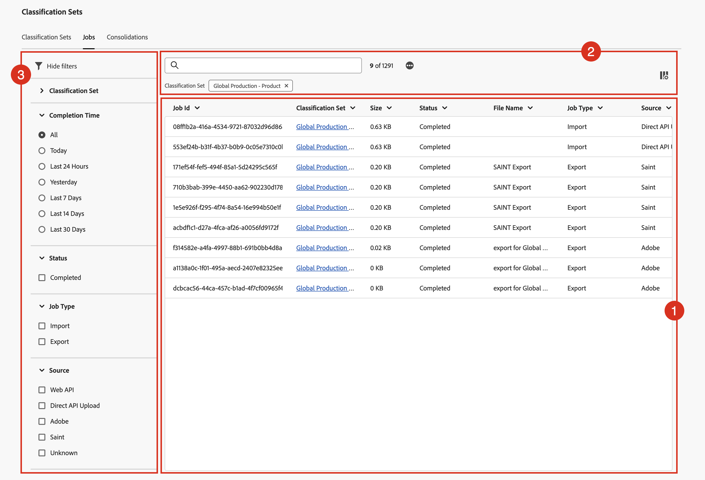

# Visualizza e intervieni sui processi di classificazione

Gestione processi di classificazione mostra i processi di classificazione correnti e completati generati per i set di classificazione. Puoi anche utilizzare il gestore per scaricare i dati o i modelli di classificazione per un particolare processo.

Per visualizzare i processi di classificazione e agire di conseguenza:

1. Seleziona **[!UICONTROL Components]** dalla barra dei menu superiore di Adobe Analytics, quindi seleziona **[!UICONTROL Classification sets]**.
1. In **[!UICONTROL Classification Sets]**, selezionare la scheda **[!UICONTROL Jobs]**.

## Gestione processi di classificazione

Il gestore **[!UICONTROL Classification Sets - Jobs]** dispone dei seguenti elementi dell&#39;interfaccia:

### Elenco processi di classificazione

L&#39;elenco **[!UICONTROL Classification Jobs]** ➊ visualizza i processi di classificazione. L’elenco dispone delle seguenti colonne:

| Colonna | Descrizione |
|---|---|
| **[!UICONTROL Job Id]** | Identificatore del processo di classificazione. |
| **[!UICONTROL Classification Set]** | Set di classificazione associato al processo di classificazione. |
| **[!UICONTROL Size]** | Dimensione del file esportato o importato come parte del processo di classificazione. |
| **[!UICONTROL Status]** | Stato del processo di classificazione. I valori possibili sono: **[!UICONTROL Created]**, **[!UICONTROL Queued]**, **[!UICONTROL Validated]**, **[!UICONTROL Failed validation]**, **[!UICONTROL Processing]**, **[!UICONTROL Done processing]**, **[!UICONTROL Failed processing]** , **[!UICONTROL Completed]** o **[!UICONTROL Progress]**. Se visualizzato, passa il cursore del mouse sull&#39;avviso  per visualizzare ulteriori informazioni. |
| **[!UICONTROL File Name]** | Identifica il nome o la funzionalità utilizzati per importare o esportare il file come parte del processo di classificazione. I valori possibili sono: <ul><li>*nessun valore*</li><li>Nome del file elaborato come parte del processo di classificazione.</li><li>**[!UICONTROL SAINT Export]**: il processo è un&#39;esportazione dall&#39;[interfaccia classificazioni legacy](/help/components/classifications/importer/c-working-with-saint.md).</li><li>**[!UICONTROL export for _set di classificazione _in_timestamp_]**: il processo è un download dall&#39;interfaccia [schema](manage/schema.md#download).</li></ul> |
| **[!UICONTROL Job Type]** | Tipo di processo di classificazione. I valori possibili sono: **[!UICONTROL Import]** o **[!UICONTROL Export]**. |
| **[!UICONTROL Source]** | Origine del processo di classificazione. I valori possibili sono: **[!UICONTROL Web API]**, **[!UICONTROL Direct API Upload]**, **[!UICONTROL Adobe]**, **[!UICONTROL SAINT]** o **[!UICONTROL Unknown]**. |
| **[!UICONTROL Modified Lines]** | Il numero di righe modificate dal processo di classificazione. |
| **[!UICONTROL Total Lines]** | Numero di righe totali elaborate dal processo di classificazione. |
| **[!UICONTROL Completion Time]** | L’ora di completamento del processo di classificazione. |
| **[!UICONTROL File Download]** | Utilizza  per scaricare il file (modello o dati) associato al processo di classificazione. |

Per ridimensionare una colonna nell’elenco dei processi di classificazione, puoi:

* Passa il puntatore del mouse sul separatore di colonne e trascina il separatore di colonne fino alla larghezza desiderata.
* Selezionare  e selezionare **[!UICONTROL Resize column]**. Una linea verticale con il pulsante di ridimensionamento consente di ridimensionare la colonna nel modo desiderato con.

Per ordinare una colonna nell’elenco dei processi di classificazione

* Selezionare  e selezionare **[!UICONTROL Sort Ascending]** o **[!UICONTROL Sort Descending]**. Una freccia (↑↓) indica quale colonna e come è ordinata.

### Pulsanti di ricerca e

Nell&#39;area ➋ sopra l&#39;elenco dei processi di classificazione è possibile:

* Cerca in  i processi di classificazione. I risultati vengono visualizzati nell’elenco dei processi di classificazione. Selezionare  per cancellare la ricerca.
* Rimuovi eventuali filtri applicati all’elenco dei processi di classificazione. Selezionare  per rimuovere un filtro.
* Seleziona  per caricare altri 1000 processi di classificazione. Inizialmente, nell’elenco delle serie di classificazioni vengono visualizzati fino a 1000 processi di classificazione.
* Definisci le colonne dell’elenco dei processi dei set di classificazione. Seleziona  e nella finestra di dialogo **[!UICONTROL Customize table]** seleziona le colonne da visualizzare sotto **[!UICONTROL Select columns to show]**. Selezionare **[!UICONTROL Apply]** per applicare le impostazioni della colonna.

### Pannello dei filtri

Seleziona  per visualizzare il pannello dei filtri ➌ che ti consente di filtrare l&#39;elenco dei processi di classificazione. Puoi filtrare in base a:

* **[!UICONTROL Classification Set]**. Seleziona uno o più set di classificazione per filtrare l’elenco dei processi di classificazione.
* **[!UICONTROL Completion Time]**. Seleziona uno dei valori possibili per filtrare l’elenco dei processi di classificazione al momento del completamento.
* **[!UICONTROL Status]**. Seleziona uno dei valori possibili per filtrare l’elenco dei processi di classificazione in base allo stato.
* **[!UICONTROL Job Type]**. Seleziona uno dei valori possibili per filtrare l’elenco dei processi di classificazione in base al tipo di processo.
* **[!UICONTROL Source]**. Seleziona uno dei valori possibili per filtrare l’elenco dei processi di classificazione sull’origine.

Seleziona  **[!UICONTROL Hide filters]** per nascondere il pannello dei filtri.

I filtri visualizzati nel pannello filtri riflettono le opzioni per i processi di classificazione precaricati.
