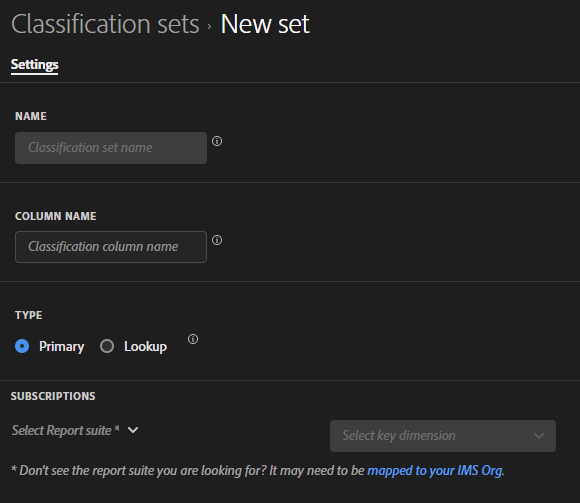

# Creare e modificare i set di classificazione

Hai [creato](#create-a-classification-set) e [modificato](#edit-a-classification-set) i set di classificazione dal gestore dei set di classificazione.

## Creare un set di classificazione

Per creare un set di classificazione:

1. Seleziona **[!UICONTROL Components]** dalla barra dei menu superiore di Adobe Analytics, quindi seleziona **[!UICONTROL Classification sets]**.
1. In **[!UICONTROL Classification Sets]**, selezionare la scheda **[!UICONTROL Classification Sets]**.
1. Selezionare  **[!UICONTROL New]**.
1. Nella finestra di dialogo **[!UICONTROL Add New Classification Set]** (Crea elemento dati):

   

   1. Immetti **[!UICONTROL Name]**. Ad esempio: `Classification Set Example`.
   1. Immetti **[!UICONTROL Description (optional)]**. Ad esempio: `Example classification set`.
   1. Immettere uno o più indirizzi di posta elettronica (separati da virgola) in **[!UICONTROL Notify of issues]**. Gli utenti ricevono notifiche e-mail in caso di problemi.
   1. Seleziona **[!UICONTROL Type]** del set di classificazione. I tipi possibili sono:
      * **[!UICONTROL Primary]**. Un set di classificazione principale si applica alle dimensioni raccolte in Adobe Analytics. Le classificazioni primarie consentono di raggruppare (classificare) i valori delle dimensioni granulari in livelli di dati più significativi. Ad esempio, potrebbe essere utile raggruppare le parole chiave di ricerca interna in categorie di ricerca interna per comprendere i temi nei dati di ricerca. Oppure classifica le SKU dei prodotti per colore o categoria.
         * Immettere uno o più **[!UICONTROL Subscriptions]**.  È possibile definire più combinazioni di **[!UICONTROL Report Suite]** e **[!UICONTROL Dimension]** in un set di classificazione.

         * Selezionare  per eliminare una combinazione di **[!UICONTROL Report Suite]** e **[!UICONTROL Key Dimension]**.

        Se aggiungi una combinazione di **[!UICONTROL Report Suite]** e **[!UICONTROL Key Dimension]** già esistente in un altro set di classificazione, sotto la combinazione viene visualizzato un messaggio di colore rosso.
Puoi:
         * Selezionare **[!UICONTROL Add to existing]** per aprire l&#39;altro set di classificazione e [aggiungere classificazioni allo schema](schema.md) per l&#39;altro set di classificazione.
         * Cambia **[!UICONTROL Report Suite]** e **[!UICONTROL Key Dimension]** in una combinazione che non è già abbonata a un altro set di classificazione.
      * **[!UICONTROL Lookup]**. Una tabella di ricerca è una classificazione di una classificazione primaria, comunemente definita come figlio o sottoclassificazioni. Una ricerca è costituita da metadati relativi a un valore di classificazione, anziché alla dimensione originale. Ad esempio, una dimensione *Prodotto* potrebbe avere una classificazione primaria *Codice colore*. Una tabella di ricerca di *Nome colore* può quindi essere allegata al *Codice colore* per spiegare ogni codice colore.
1. Selezionare **[!UICONTROL Save]** per salvare il set di classificazione. Selezionare **[!UICONTROL Cancel]** per annullare la definizione.
1. Per definire lo schema per il set di classificazione, seleziona il set di classificazione appena creato dal gestore **[!UICONTROL Classification Sets]** per [modificare il set di classificazione](#edit-a-classification-set).

## Modificare un set di classificazione

Per modificare un set di classificazione:

1. Seleziona **[!UICONTROL Components]** dalla barra dei menu superiore di Adobe Analytics, quindi seleziona **[!UICONTROL Classification sets]**.
1. In **[!UICONTROL Classification Sets]**, selezionare la scheda **[!UICONTROL Classification Sets]**.
1. Seleziona il nome del set di classificazione.
1. Nella finestra di dialogo **[!UICONTROL Classification Set: _nome set di classificazione_]**, puoi definire le [impostazioni](settings.md) e lo [schema](schema.md) per il set di classificazione.
1. Al termine, seleziona **[!UICONTROL Save]** per salvare le modifiche. Seleziona **[!UICONTROL Cancel]** per annullare.

<!--

### Schema

In the Schema tab 

You can use the Classification set manager to create a classification set.

**[!UICONTROL Components]** > **[!UICONTROL Classification sets]** > **[!UICONTROL Sets]** > **[!UICONTROL Add]**

When creating a classification set, the following fields are available.

* **[!UICONTROL Name]**: A text field used to identify the classification set. This field cannot be edited upon creation, but can be renamed later.
* **[!UICONTROL Column Name]**: The name of the first classification dimension that you want to create. This field is the dimension name used in Analysis Workspace, and the column name when exporting classification data. You can add more column names after the classification set is created.
* **[!UICONTROL Type]**: Radio buttons that indicate the type of classification.
  * **[!UICONTROL Primary]**: Apply to dimensions collected in Analytics. They are a way to group (classify) granular dimension values into more meaningful levels of data. For example, you might want to group internal search keywords into internal search categories, to better understand themes in your search data.
  * **[!UICONTROL Lookup]**: Commonly referred to as child or subclassifications, a lookup table is a classification of a primary classification. It is metadata about a classification value, rather than the original dimension. For example, the Product variable might have a primary classification of 'Color code'. A lookup table of 'Color name' could then be attached to 'Color code' to further explain what each code means.
* **[!UICONTROL Subscriptions]** The report suites and dimensions that this classification set applies to. You can add multiple report suite and dimension combinations to a classification set.

If a classification set exists for a given report suite + variable, the classification is added to the schema instead. A given report suite + variable combination cannot belong to multiple classification sets.

-->