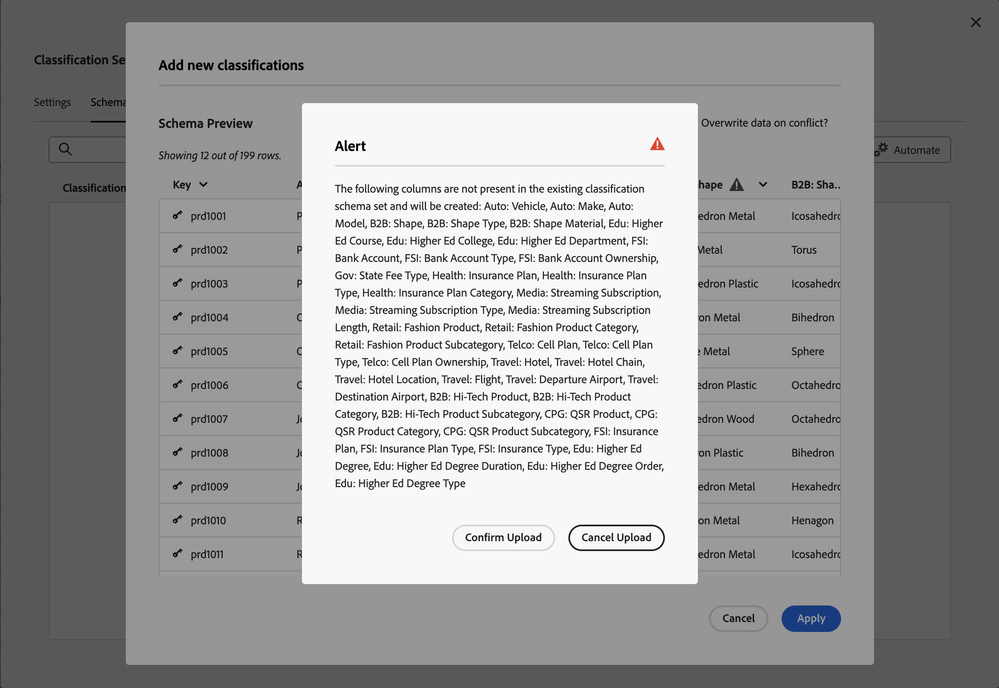
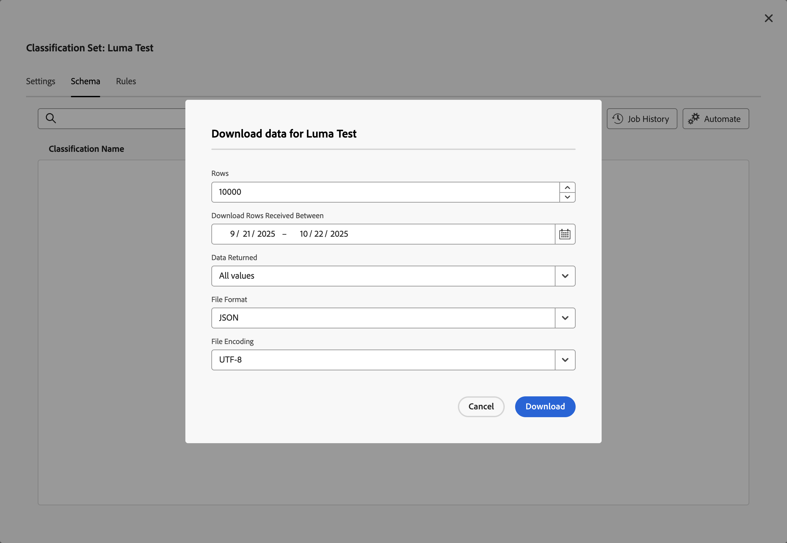
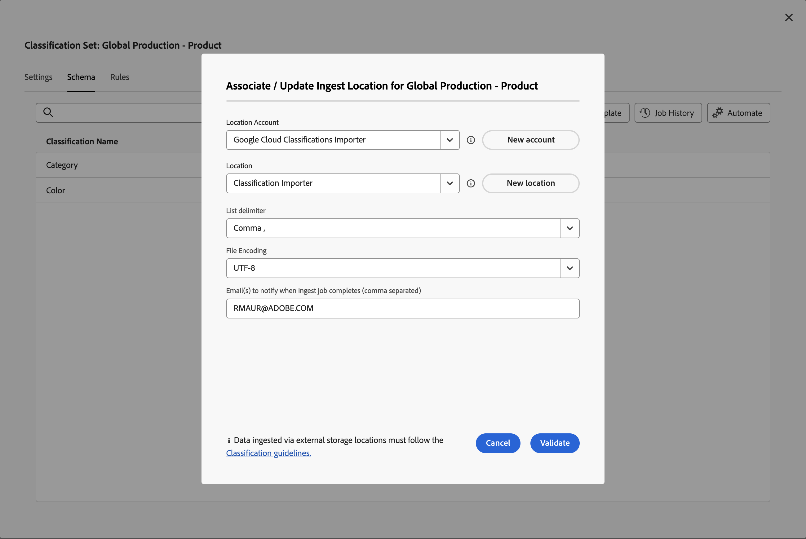
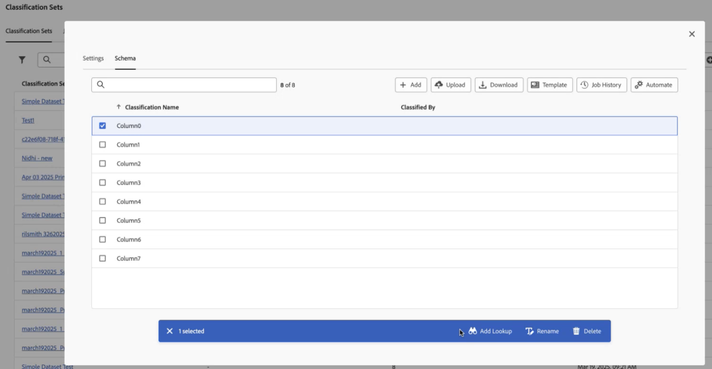
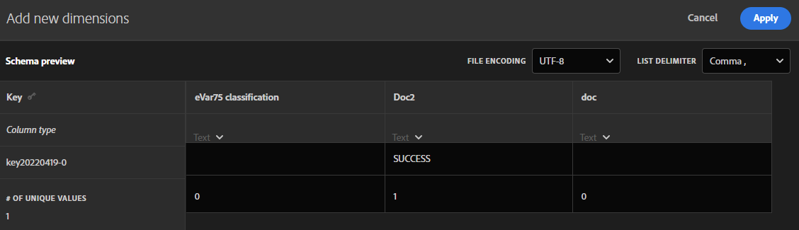

# Schema del set di classificazione

Lo schema è l’elenco delle classificazioni che desideri applicare alle dimensioni chiave definite per il set di classificazione. Ad esempio, se hai definito prodotto come dimensione chiave e questo campo contiene uno SKU di prodotto, utilizza lo schema per aggiungere classificazioni come nome del prodotto, colore del prodotto, dimensione del prodotto e altro ancora.

Per modificare lo schema per un set di classificazione:

1. Nel gestore **[!UICONTROL Classifications Sets]**, selezionare il set di classificazione per il quale si desidera modificare lo schema.
1. Nella finestra di dialogo **[!UICONTROL Classification Set: _set di classificazione_]**, seleziona la scheda **[!UICONTROL Schema]**. Tale scheda è costituita dai seguenti elementi dell’interfaccia:

   

   * [Elenco di classificazione](#classification-list)
   * [Ricerca](#search)
   * [Azioni](#actions)
   * [Barra delle azioni](#action-bar)

## Elenco di classificazione

L’elenco delle classificazioni presenta le seguenti colonne:

| Colonna | Descrizione |
|---|---|
| **[!UICONTROL Classification Name]** | Il nome fornito per la classificazione. |
| **[!UICONTROL Identity Name]** | Il nome derivato dal sistema per la classificazione. |
| **[!UICONTROL Classified By]** | Se utilizzato, un collegamento al set di classificazione di ricerca utilizzato per classificare questa classificazione. |

## Ricerca

Puoi cercare rapidamente  per una o più classificazioni. Utilizza  per cancellare la ricerca.

## Azioni

Le azioni seguenti sono disponibili come pulsanti nella parte superiore dell’elenco delle classificazioni:

| Icona | Azione | Descrizione |
|---|---|---|
|  | **[!UICONTROL Add]** | [Aggiungi una classificazione](#add) all&#39;elenco. |
|  | **[!UICONTROL Upload]** | [Carica un file JSON, CSV, TSV o TAB](#upload). |
|  | **[!UICONTROL Download]** | [Scarica i dati di classificazione](#download). |
|  | **[!UICONTROL Template]** | [Scarica un modello](#template) per i dati di classificazione. |
|  | **[!UICONTROL Job History]** | Mostra la [gestione processo set di classificazione](/help/components/classifications/sets/job-manager.md), filtrata per il set di classificazione selezionato. |
|  | **[!UICONTROL Automate]** | [Automatizza l&#39;acquisizione dei dati di classificazione](#automate) tramite una posizione cloud. |

### Add

Per aggiungere una nuova classificazione, selezionare  **[!UICONTROL Add]**.

Nella finestra di dialogo **[!UICONTROL Add a new classification for _set di classificazione_]**, immetti **[!UICONTROL Classification Name]** e seleziona **[!UICONTROL Add]**. La classificazione viene aggiunta all’elenco.

### Carica

Per importare i dati di classificazione nello schema per una classificazione, seleziona  **[!UICONTROL Upload]**.

1. Nella finestra di dialogo **[!UICONTROL Add new classifications]** (Crea elemento dati):

   * Trascinare un file contenente dati di classificazione e rilasciare il file su **[!UICONTROL Drag and drop here]**.
   * Selezionare **[!UICONTROL Browse]** e scegliere un file dal computer o dalla rete.

   Viene visualizzato un **[!UICONTROL Schema Preview]** del contenuto del file. L’anteprima mostra le colonne di dati del file. Per ridimensionare una colonna, selezionare  e selezionare **[!UICONTROL Resize column]**. Viene visualizzato un handle che consente di ridimensionare la colonna.

   Quando nel set di classificazione per una colonna non è definita alcuna classificazione, viene visualizzato un avviso . L’avviso spiega che una classificazione non è presente nel set di schemi di classificazione esistente e verrà creata al momento dell’importazione.

1. Selezionare **[!UICONTROL Overwrite data on conflict?]** se si desidera sovrascrivere i dati di classificazione correnti con i nuovi dati importati. Ad esempio:

   | | Chiave | Colore prodotto corrente | Importa file | Colore nuovo prodotto |
   |---|---|---|---|---|
   |  **[!UICONTROL Overwrite data on conflict?]** | 1234 | verde | blu | blu |
   |  **[!UICONTROL Overwrite data on conflict?]** | 1234 | verde | blu | verde |

1. Seleziona **[!UICONTROL Apply]**. Se le colonne non sono presenti come classificazioni nel set di schemi esistente, viene visualizzato un avviso. Tali colonne vengono aggiunte come nuove classificazioni quando confermi il caricamento.

   

   Selezionare **[!UICONTROL Confirm Upload]** per confermare il caricamento. Selezionare **[!UICONTROL Cancel Upload]** per annullare il caricamento.

### Scaricare

Per scaricare i dati di classificazione, seleziona  **[!UICONTROL Download]**.

Nella finestra di dialogo **[!UICONTROL Download data for _set di classificazione_]**:

1. Immettere il numero di **[!UICONTROL Rows]** che si desidera scaricare. Ad esempio: `10000`.
1. Per selezionare il periodo per il quale si desidera scaricare righe di dati di classificazione, immettere i dati di inizio e fine per **[!UICONTROL Download Rows Received Between]**. In alternativa, utilizzare  per utilizzare un popup del calendario per selezionare il periodo.
1. Per selezionare i dati da restituire, selezionare un&#39;opzione da **[!UICONTROL Data Returned]**.

   * **[!UICONTROL All values]** restituisce tutti i valori per i dati di classificazione correnti.
   * **[!UICONTROL Any columns empty]** restituisce una colonna con valori chiave per i dati di classificazione esistenti. Colonne AND senza valore per i dati di classificazione per i quali non esiste alcun valore.
   * **[!UICONTROL All columns empty]** restituisce una colonna chiave con i valori per i dati di classificazione esistenti. Colonne AND senza valore per i dati di classificazione.
1. Per selezionare il [formato file](/help/components/classifications/sets/data-files.md#general-file-requirements) dei dati di classificazione scaricati, selezionare un&#39;opzione dal menu a discesa **[!UICONTROL File Format]**. Le opzioni sono:

   * **[!UICONTROL JSON]**.
   * **[!UICONTROL Comma separated values]** (CSV).
   * **[!UICONTROL Excel tab separated values]** (TSV o TAB).

1. Per selezionare la [codifica del file](/help/components/classifications/sets/data-files.md#general-file-requirements) in cui scaricare il file, selezionare un&#39;opzione dal menu a discesa Codifica file. Le opzioni sono:

   * **[!UICONTROL UTF-8]**.
   * **[!UICONTROL Latin-1]**.

1. Seleziona **[!UICONTROL Download]** per scaricare i dati di classificazione. Il file scaricato si trova nella directory di download predefinita del browser e si chiama <code><i>Set di classificazione</i>.<i>json</i>|<i>csv</i>|<i>tsv</i></code>. Se il file esiste già, un numero di sequenza <code>(<i>x</i>)</code> viene aggiunto al nome del file. Se sono state specificate opzioni che non restituiscono dati, verrà visualizzata una finestra di dialogo **[!UICONTROL Notice]** in cui è necessario modificare le opzioni per l&#39;intervallo di date e i dati restituiti.

### Modello

Per scaricare un modello per i dati di classificazione, seleziona  **[!UICONTROL Template]**.

Nella finestra di dialogo **[!UICONTROL Download template for _set di classificazione_]**:

1. Per selezionare il [formato file](/help/components/classifications/sets/data-files.md#general-file-requirements) dei dati di classificazione scaricati, selezionare un&#39;opzione dal menu a discesa **[!UICONTROL File Format]**. Le opzioni sono:

   * **[!UICONTROL Comma separated values]**.
   * **[!UICONTROL Excel tab separated values]**.

1. Per selezionare la [codifica del file](/help/components/classifications/sets/data-files.md#general-file-requirements) in cui scaricare il file, selezionare un&#39;opzione dal menu a discesa Codifica file. Le opzioni sono:

   * **[!UICONTROL UTF-8]**.
   * **[!UICONTROL Latin-1]**.

1. Seleziona **[!UICONTROL Download]** per scaricare il modello di dati di classificazione. Puoi trovare il file scaricato nella directory di download predefinita del browser e si chiama <code><i>Set di classificazione</i>.<i>csv</i>|<i>tsv</i></code>. Se il file esiste già, un numero di sequenza <code>(<i>x</i>)</code> viene aggiunto al nome del file.

### Automatizza

Per automatizzare l&#39;acquisizione della classificazione, selezionare  **[!UICONTROL Automate]**.

Nella finestra di dialogo **[!UICONTROL Associate / Update Ingest Location for _set di classificazione_]**:

1. Per selezionare una posizione cloud, selezionare un&#39;opzione da **[!UICONTROL Location Account]**. Vengono visualizzati solo [account località di tipi di account supportati che consentono l&#39;importazione di dati di classificazione](https://experienceleague.adobe.com/it/docs/analytics/components/locations/configure-import-accounts). Per creare un nuovo account, selezionare **[!UICONTROL New account]**.
1. Per selezionare un percorso, selezionare un&#39;opzione da **[!UICONTROL Location]**. Vengono visualizzate solo le posizioni dei tipi di conto selezionati per l’importazione dei dati di classificazione. Per creare un nuovo percorso, selezionare **[!UICONTROL New location]**.
1. Per selezionare un delimitatore, selezionare un&#39;opzione da **[!UICONTROL List delimiter]**. Le opzioni sono:
   * **[!UICONTROL Comma ,]**
   * **[!UICONTROL Semicolon ;]**
   * **[!UICONTROL Colon :]**
   * **[!UICONTROL Vertical bar |]**
   * **[!UICONTROL Space]**
   * **[!UICONTROL Tab]**
1. Per selezionare la [codifica file](/help/components/classifications/sets/data-files.md#general-file-requirements) al momento del download del file, selezionare un&#39;opzione dal menu a discesa **[!UICONTROL File Encoding]**. Le opzioni sono:

   * **[!UICONTROL UTF-8]**.
   * **[!UICONTROL Latin-1]**.

1. Per avvisare gli utenti del completamento dei processi di acquisizione, inserisci gli indirizzi e-mail, separati da virgola, per **[!UICONTROL Email(s) to notify when ingest jobs completes (comma separated)]**.
1. Seleziona **[!UICONTROL Validate]**. Convalida della connessione alla posizione cloud.
1. Se la convalida ha esito positivo, verrà visualizzato un messaggio popup che mostra  **[!UICONTROL Location validation successful. Connection to cloud storage verified.]** Selezionare **[!UICONTROL Save]**&#x200B;se è stata creata la connessione al cloud. In caso contrario, selezionare **[!UICONTROL Update]**. In alternativa, selezionare **[!UICONTROL Cancel]**&#x200B;per annullare la configurazione del percorso cloud.

## Barra delle azioni

La barra delle azioni mostra le azioni disponibili per il set di classificazione selezionato. Le opzioni disponibili sono:

| Icona | Azione | Descrizione |
|---|---|---|
|  | **[!UICONTROL Add Lookup]** | Aggiungi un set di classificazione come ricerca (sottoclassificazione). Nella tabella **[!UICONTROL Attach lookup]**: <ol><li>Selezionare una classificazione di ricerca dal menu a discesa **[!UICONTROL Classification Name]**.</li><li>Seleziona **[!UICONTROL Add]**.</li></ol>La classificazione di ricerca viene aggiunta alla classificazione ed elencata nella colonna **[!UICONTROL Classified by]** utilizzando l&#39;ID interno. |
|  | **[!UICONTROL Remove Lookup]** | Rimuovi un set di classificazione come ricerca. Per eliminare definitivamente la ricerca dalla classificazione, nella **[!UICONTROL Remove _finestra di dialogo di conferma _del_set di classificazione_]** selezionare **[!UICONTROL Delete]**. |
|  | **[!UICONTROL Rename]** | Rinominare una classificazione. Nella finestra di dialogo **[!UICONTROL Rename: _classificazione_]**, immetti un nuovo nome e seleziona **[!UICONTROL Rename]**. |
|  | **[!UICONTROL Delete]** | Elimina un set di classificazione. Viene visualizzata la finestra di dialogo **[!UICONTROL Delete _classificazione_]**. Selezionare **[!UICONTROL Delete]** per eliminare il set di classificazione. |

<!--

View currently configured classification dimensions for this classification set.

**[!UICONTROL Components]** > **[!UICONTROL Classification sets]** > **[!UICONTROL Sets]** > Click the desired classification set name > **[!UICONTROL Schema]**

The following buttons are available:

* **[!UICONTROL Upload]**: Manually upload classification data for a classification dimensions. `JSON`, `CSV`, `TSV`, and `TAB` files are supported. Uploading a valid file shows a table preview of data to classify.
  * **[!UICONTROL File encoding]**: Select the correct file encoding using this drop-down. Valid options include [!UICONTROL UTF-8] and [!UICONTROL Latin1].
  * **[!UICONTROL List delimiter]**: Select the correct list delimiter. If using a downloaded file or template file, make sure that the [!UICONTROL List delimiter] here matches the [!UICONTROL List delimiter] when the file was downloaded.
  * **[!UICONTROL Apply]**: Save the uploaded classification data to the classification set.

  

* **[!UICONTROL Download]**: Download key values and their classification columns.
  * **[!UICONTROL Rows]**: The maximum number of rows to include in the download file.
  * **[!UICONTROL Download rows received between]**: A calendar date picker that allows you to filter key values by when they appear in reporting. If a key value was not collected in this date range, it does not appear in the downloaded file.
  * **[!UICONTROL Data returned]**: A drop-down list that lets you filter key values included in the downloaded file based on their associated classification data.
    * **[!UICONTROL All classified values]**: Includes rows where classification data is included in at least one column.
    * **[!UICONTROL All unclassified values]**: Includes rows where classification data is missing in at least one column.
  * **[!UICONTROL File format]**: A drop-down list that determines the file format that the download file is in. Options include [!UICONTROL JSON], [!UICONTROL Comma separated values], and [!UICONTROL Excel tab separated values].
  * **[!UICONTROL File encoding]**: A drop-down list that determines the file encoding. Options include [!UICONTROL UTF-8] and [!UICONTROL Latin1]. UTF-8 is recommended.

  

* **[!UICONTROL Template]**: Download a template file. This file is similar to the [!UICONTROL Download] button, except it does not contain any classification data or key values.
  * **[!UICONTROL File format]**: A drop-down list that determines the file format that the template file is in. Options include [!UICONTROL Comma separated values], and [!UICONTROL Excel tab separated values].
  * **[!UICONTROL File encoding]**: A drop-down list that determines the file encoding. Options include [!UICONTROL UTF-8] and [!UICONTROL Latin1]. UTF-8 is recommended.
  * **[!UICONTROL List delimiters]**: A drop-down list that determines the list delimiter separating classification columns on each row.

  

* **[!UICONTROL Job history]**: A shortcut link that takes you to the [Job manager](../job-manager.md), showing jobs only for this classification set.
* **[!UICONTROL Automate]**: Automatically ingest data from external storage locations.
  * **[!UICONTROL Location account]**: A drop-down list showing existing location accounts that your organization has configured. If your organization hasn't already configured a location account, you can configure one by selecting [!UICONTROL **Create a new account**].
    
    For information about configuring the location account, see [Configure cloud import and export accounts](/help/components/locations/configure-import-accounts.md).

  * **[!UICONTROL Location]**: A drop-down list showing existing locations that your organization has configured. If your organization hasn't already configured a location, you can configure one by selecting [!UICONTROL **Create a new location**]. 

    For information about configuring a location, see [Configure cloud import and export locations](/help/components/locations/configure-import-locations.md). 

  * **[!UICONTROL Delimiter]**: The column delimiter for uploaded files. Options include [!UICONTROL Comma], [!UICONTROL Semicolon], [!UICONTROL Colon], [!UICONTROL Vertical bar], [!UICONTROL Space], [!UICONTROL Forward slash], [!UICONTROL Backward slash], [!UICONTROL Dash], or [!UICONTROL Underscore].

  * **[!UICONTROL Encoding]**: A drop-down list that determines the file encoding. Options include [!UICONTROL UTF-8] and [!UICONTROL Latin1]. UTF-8 is recommended.

The following actions are available only after selecting a classification.

* **Add lookup**: A lookup table is a classification of a classification. It is metadata about a classification value, rather than the variable itself. For example, the Product variable might have a classification of "color code". A lookup table of "color name" might be attached to "color code" to explain what the colors are.

  

* **Rename**: Lets you rename the classification.

* **Delete**: Lets you delete the classification.
-->